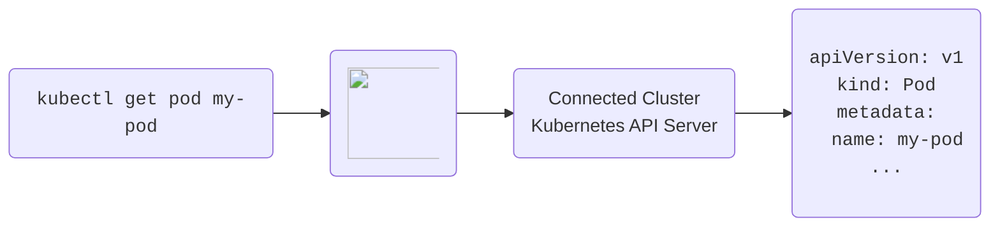

This section is intended to give you a high level overview of some core components of vCluster.Pro, this
section is not an exhaustive list, but just a simple overview of the most important features. Check out the rest of the
documentation to explore more vCluster.Pro features, or install vCluster.Pro yourself by
following the [installation guide](../getting-started/install.mdx).

# Managed Embedded Etcd

The [Managed Embedded Etcd](../features/embedded_etcd.mdx) feature in vCluster.Pro allows you to enable an embedded managed etcd server instead of using the default SQLite backend or a custom managed external backend. This has the advantage of better performance as well as opens up the possibility to enable HA mode for k3s based vClusters.

# K3s High-Availability

The [K3s High-Availability](../features/high_availability.mdx) feature in vCluster.Pro allows you to run vCluster with the k3s distro in high-availability mode without an external datastore. High-Availability has the advantage, that if a replica should for what ever reason fail, another replica will jump in and take over without any downtime.

# Integrated CoreDNS

The [Integrated CoreDNS](../features/integrated_coredns.mdx) feature in vCluster.Pro combines the CoreDNS component within the vCluster syncer, allowing for a streamlined single-pod deployment containing all essential vCluster components instead of the usual two-pod setup.
This simplifies deployment and can be enabled with custom configuration options.

# Cross-vCluster DNS
The [Cross vCluster DNS](../features/cross_vcluster_coredns_plugin.mdx) feature allows you to add custom DNS rules to the vCluster to allow communication across services in separate vClusters as well as services deployed in the host cluster.

# Sync Patches

The [Sync Patches](../features/generic_resource_patches.mdx) feature in vCluster.Pro enables users to modify Kubernetes resources during synchronization just before they are applied to the Kubernetes API server, using a specified hook syntax.

# Isolated Control Plane

The [Isolated Control Plane](../features/isolated_control_planes.mdx) feature in vCluster.Pro facilitates deploying the vCluster control plane in one Kubernetes cluster while running the actual workloads in a separate cluster, ensuring distinct separation of control and workload functions.

# Hardened Security

To achieve [Hardened Security](../features/hardened_security.mdx), vCluster.Pro uses more secure, frequently updated base images and recieves priority patches and communication about zero-day exploits before they are made public.

# Projects

Projects are the highest organizational unit that vCluster.Pro uses. They help logically group resources by team or
division, and as a container to apply role based access controls (RBAC). Projects will be a
central part of your vCluster.Pro experience, so make sure to read more about them
[here](../projects/what-are-projects.mdx).

# Virtual Clusters

Virtual Clusters are just that, _virtual_ Kubernetes clusters. These virtual clusters run inside
a namespace within the "parent" or "host" physical cluster, thereby allowing administrators to
effectively create many Kubernetes instance in a single instance -- ideal for development,
testing, and even production workloads. If you want to learn more, please take a look at the doc section [here](../virtual-clusters/what-are-virtual-clusters.mdx), the vcluster
project [repository](https://github.com/loft-sh/vcluster) and
[documentation](https://www.vcluster.com/docs/what-are-virtual-clusters).

# Clusters

vCluster.Pro is installed into, and can connect to, as many physical Kubernetes clusters as you need to
manage. vCluster.Pro can then be used to manage workloads in each of the physical clusters, deploying
spaces, virtual clusters, and apps as needed. vCluster.Pro provides granular role based access control
(RBAC) allowing for vCluster.Pro administrators to limit which users and teams have access to which
clusters, as well as much more granular control at the project, space, and virtual cluster levels.

Read more about vCluster.Pro integration with physical clusters [here](../clusters/what-are-clusters.mdx).

# Apps

Apps allow users to define applications that users can then be empowered to deploy in clusters,
spaces, and virtual clusters they have appropriate access to. The idea here is nothing new,
however, vCluster.Pro's Apps interface allows for easily packaging applications, and critically,
exposing parameters that users can then select or input at deployment time. Apps can be specified via Kubernetes Manifests,
bash scripts, helm charts, etc.
Check out more about
Apps [here](../apps/what-are-apps.mdx), and be sure to learn about [versioning](../apps/versioning.mdx)
and [parameters](../apps/parameters.mdx) while you're at it!

# Cost Reduction Tools

vCluster.Pro provides two powerful features to reduce Kubernetes cost:

- [Sleep Mode](#sleep-mode) which puts namespaces to sleep when nobody is using them, i.e.
  purging all pods while keeping all resources inside the namespaces during periods of inactivity
- [Auto-Delete](#auto-delete) which deletes namespaces that have been idle for a while

Both of these feature typically rely on vCluster.Pro's [inactivity detection](#inactivity-detection).

### Sleep Mode

With sleep mode, you can put Kubernetes namespaces to sleep which means that vCluster.Pro will set
`replicas: 0` for all replica-controlled resources such as `Deployments` and `StatefulSets`.
This means that Kubernetes will delete all pods but the entire configuration of resources within
the namespace is still there.

Sleep mode can be:

- Invoked manually
- Triggered by an inactivity timeout (no one has ran a `kubectl` command in this namespace for X
  minutes)
- Scheduled using a CRON syntax

### Auto-Delete

vCluster.Pro lets you configure an auto-delete for virtual clusters that have not been used for a certain
period of time (inactivity). Learn more about this in the Virtual Clusters Sleep Mode
[documentation](../virtual-clusters/sleep-mode.mdx).

### Inactivity Detection

All requests that are made through vCluster.Pro count as activity in the namespace.

If your kube-context points to vCluster.Pro's API server as a proxy before the actual connected
cluster's API server, every `kubectl` request will be an activity and reset the inactivity timeout.
