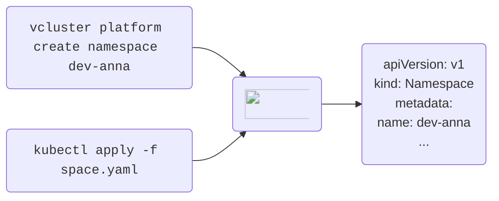

<!-- vale off -->

```mermaid
flowchart LR;
  CLI("<code>vcluster platform create namespace dev-anna</code>") --> Platform
  kubectl("<code>kubectl apply -f space.yaml</code>") --> Platform

  Platform("<img src='/docs/media/rebranding/VCluster_vCluster_Horizontal_2colors_reversed_1.svg' width='120' height='37' />")

  Platform --> Namespace("apiVersion: v1<br/>kind: Namespace<br/>metadata:<br/>  name: dev-anna<br/>...")

  class CLI,kubectl code
  class Namespace yaml
  class Platform loft
```
<!-- vale on -->
