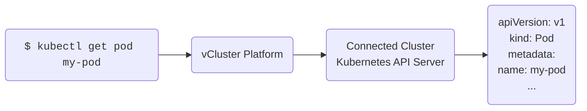

### Last Activity Update Interval

The platform periodically checks for activity to determine when an environment should enter or remain in sleep mode.
This check interval—called the **Sleep Mode Last Activity Update Interval**—defines how often the platform updates the “last active” timestamp for each environment.

By default, the interval is **5 minutes**, meaning that the inactivity timeout will only be reset if it occurs more than 5 minutes after the previous update.

You can customize this interval by setting the platform environment variable SLEEP_MODE_LAST_ACTIVITY_UPDATE_INTERVAL via the `vcluster-platform` chart Helm values:

```yaml
env:
  SLEEP_MODE_LAST_ACTIVITY_UPDATE_INTERVAL: "1m"
```

### Virtual Cluster Kubernetes API Requests

All virtual cluster Kubernetes API requests that are made through the platform count as activity in the {props.name}.




If your kube-context points to the platform's API server as a proxy before the actual connected cluster's API server, every `kubectl` request will be an activity and reset the inactivity timeout.

### Ingress Requests

For ingress-nginx based ingresses, activity detection also works automatically. Other ingress controllers are currently not supported. For nginx based ingresses, the platform will add a special annotation to each ingress that will track activity and reset the timer when a request is made to that ingress.

<br></br>

:::info Ingress Wakeup

vCluster Platform supports waking up a {props.name} through an ingress independent of the underlying ingress controller. Just navigate to the ingress host and you should see a wakeup page for the {props.name}.

:::
