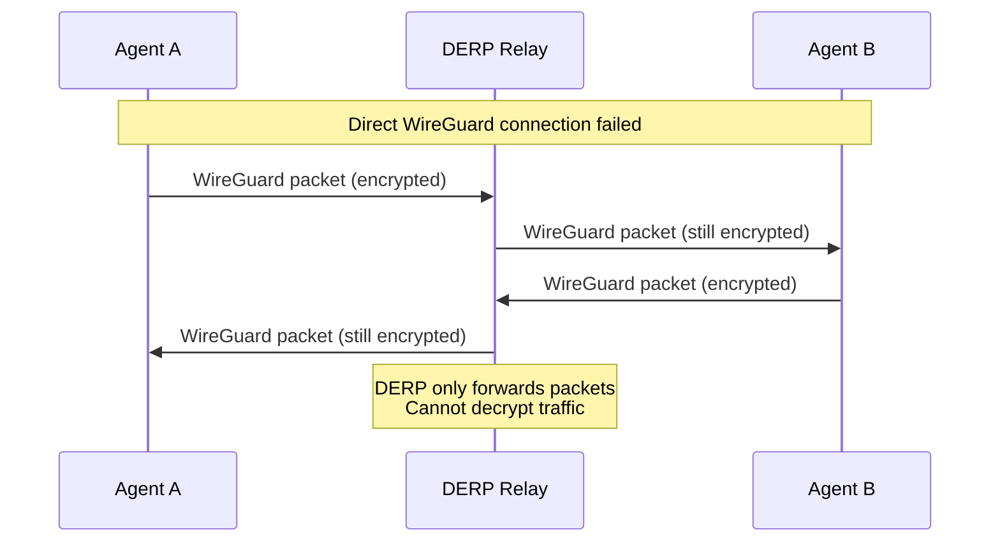

<!-- vale off -->

## What is DERP?

DERP (Designated Encrypted Relay for Packets) is a relay protocol used by Tailscale when direct WireGuard peer-to-peer connections cannot be established. This happens when firewall rules, NAT, or restrictive network policies block direct communication between agents.

<!-- vale on -->

By default, vCluster Platform hosts a central DERP server that all agents use as a fallback relay. When agents cannot connect directly, traffic routes through this central relay. The DERP server only forwards encrypted WireGuard packets and cannot decrypt the traffic.



## Why configure additional DERP relays?

A single central DERP relay creates two problems for geographically distributed deployments:

1. **Latency**: All relayed traffic routes through one location. An agent in Tokyo communicating with an agent in Sydney must relay through a platform in Frankfurt, adding significant round-trip time.

2. **Single point of failure**: If the central DERP becomes unavailable, agents that cannot establish direct connections lose communication entirely.

Configuring connected cluster agents as additional DERP relays solves both problems. Tailscale automatically selects the optimal relay based on latency, and multiple relays provide redundancy if one becomes unavailable.

**Use cases:**

- **Multi-region deployments**: Clusters spread across continents benefit from regional relays that minimize cross-region traffic.
- **High availability requirements**: Critical workloads need relay redundancy to maintain agent communication during outages.
- **Latency-sensitive operations**: `kubectl` commands, log streaming, and exec sessions perform better with nearby relays.

## Configure a cluster as a DERP relay

To enable a connected cluster's agent as an additional DERP relay, add annotations to the Cluster resource. The agent must be publicly accessible for other agents to use it as a relay.

### Cluster annotations

| Annotation | Required | Description |
|------------|----------|-------------|
| `loft.sh/derp-endpoint` | Yes | Publicly accessible endpoint of the DERP relay (domain name or IP address reachable by all agents). |
| `loft.sh/derp-endpoint-insecure` | No | Set to `true` for self-signed certificates. Default: `false`. |

### Example: Basic DERP relay configuration

Add the DERP endpoint annotation to enable a cluster as a relay:

```yaml title="Cluster resource with DERP relay"
apiVersion: management.loft.sh/v1
kind: Cluster
metadata:
  name: eu-west-cluster
  annotations:
    loft.sh/derp-endpoint: eu-west-cluster.example.com
spec:
  config: {}
```

After applying this configuration, other agents can use this cluster as a DERP relay. Tailscale automatically selects the optimal relay based on latency.

### Example: DERP relay with self-signed certificate

For development or internal environments using self-signed certificates:

```yaml title="Cluster resource with insecure DERP relay"
apiVersion: management.loft.sh/v1
kind: Cluster
metadata:
  name: dev-cluster
  annotations:
    loft.sh/derp-endpoint: dev-cluster.internal.example.com
    loft.sh/derp-endpoint-insecure: 'true'
spec:
  config: {}
```

:::warning
Self-signed certificates reduce security. Use valid TLS certificates in production environments.
:::

## Expose the agent for DERP relay

Before adding the DERP annotations, expose the vCluster Platform agent through an Ingress or LoadBalancer. The endpoint must be reachable by all agents in the platform.

Create an Ingress for the agent:

```yaml title="ingress.yaml"
apiVersion: networking.k8s.io/v1
kind: Ingress
metadata:
  name: loft-agent-derp
  annotations:
    nginx.ingress.kubernetes.io/proxy-read-timeout: "43200"
    nginx.ingress.kubernetes.io/proxy-send-timeout: "43200"
    cert-manager.io/cluster-issuer: my-cluster-issuer
spec:
  rules:
    - host: eu-west-cluster.example.com
      http:
        paths:
          - path: /
            pathType: ImplementationSpecific
            backend:
              service:
                name: loft-agent
                port:
                  number: 80
  tls:
    - hosts:
        - eu-west-cluster.example.com
      secretName: derp-relay-tls
```

Apply the Ingress:

```bash
kubectl apply -n vcluster-platform -f ingress.yaml
```

Verify the endpoint is accessible:

```bash
curl -I https://eu-west-cluster.example.com/healthz
```

After confirming connectivity, add the `loft.sh/derp-endpoint` annotation to the Cluster resource.

<!-- vale off -->

## Verify DERP relay configuration

<!-- vale on -->

Enable DERP debug logging on the platform to verify relay activity:

```yaml title="Platform environment variables"
env:
  LOFT_LOG_DERP: "true"
  LOFT_LOG_DERP_MESH: "true"
```

Check the platform logs:

```bash
kubectl logs -n vcluster-platform -l app=loft | grep -i derp
```

## Related

- [Multi-region mode](./multi-region-mode.mdx): Configure direct cluster endpoints for reduced API latency
- [Networking](./networking.mdx): Required ports for platform communication
- [Cluster troubleshooting](./cluster-troubleshooting.mdx): Debug connectivity issues
