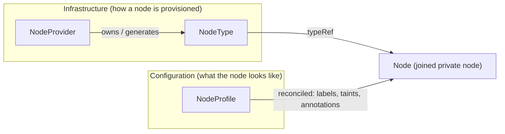

A NodeProfile is a reusable, cluster-scoped collection of node runtime settings (labels, taints, and annotations) that the platform continuously applies to every private node assigned to it. Reference a profile from a manual join, a static/dynamic auto-node pool, and the platform reconciles the same configuration onto every node, regardless of how it joined.

Without a shared profile, there is no way to mark a set of nodes as, for example, "this is a GPU training node" across every provisioning path. Manual joins have no provider, auto-node pools live in the vCluster config, and the resulting Kubernetes Node objects carry no shared identity. 
A named NodeProfile fixes this. Every node that references it reflect the same set of labels, no matter how it was provisioned.

Profiles are also continuously reconciled, not just applied once at join. Editing a profile converges the change onto every node that already references it, without requiring the node to be re-provisioned.

## Example

```yaml
apiVersion: management.loft.sh/v1
kind: NodeProfile
metadata:
  name: gpu-training
spec:
  displayName: GPU Training
  description: |
    GPU worker defaults for training workloads.
  nodeLabels:
    workload.vcluster.com/class: gpu
  nodeAnnotations:
    ops.vcluster.com/owner: ml-platform
  taints:
    - key: nvidia.com/gpu
      value: "true"
      effect: NoSchedule
  startupTaints:
    - key: node.vcluster.com/bootstrap
      value: "true"
      effect: NoSchedule
```

Reference this profile from a manual join, or from an auto-node pool in `vcluster.yaml`:

```yaml
# Inside your vcluster.yaml
privateNodes:
  enabled: true
  autoNodes:
    - provider: my-node-provider
      static:
        - name: gpu-burst
          quantity: 2
          profile: gpu-training
```

Every node the `gpu-burst` pool provisions joins with the `gpu-training` profile's labels and taints already applied, and stays in sync with the profile from then on.

## Spec fields

All fields in `spec` are optional. An empty profile is valid but has no effect.

| Field | Description | When applied |
|-------|-------------|---------------|
| `displayName` | Human-readable name shown in the platform UI. | N/A |
| `description` | Free-form text shown alongside the profile in selectors. | N/A |
| `nodeLabels` | Labels reconciled onto the Node object. | Continuously |
| `nodeAnnotations` | Annotations reconciled onto the Node object. | Continuously |
| `taints` | Steady-state taints reconciled onto the Node object. | Continuously |
| `startupTaints` | Taints applied when the node joins and removed once the node reaches `Ready`. Used to hold a node from receiving traffic until join-time setup finishes. | Once, at join |

## Continuous reconciliation

Each tenant cluster runs a reconciler that watches its assigned private worker nodes and keeps them aligned with the NodeProfile they reference. The reconciler only manages the keys it owns:

- Adding a label, annotation, or taint to a profile applies it to every node referencing that profile.
- Removing a key from a profile removes it from those nodes.
- Labels, annotations, and taints that a profile never set are left untouched, even if they were added by other means.

`startupTaints` are the exception. They're applied once, at join, and removed once the node becomes Ready. They aren't part of the steady-state reconciliation loop, so editing startupTaints on a profile has no effect on nodes that already joined.

Convergence happens on the reconciler's resync interval, not instantly. Expect a short delay between editing a profile and seeing the change reflected on affected nodes.

## Assignment and precedence

A node resolves to exactly one profile. A profile is reusable across many nodes, but a single node is never assigned more than one. The platform resolves the profile for a node in this order, using the first match:

1. An explicit `profileRef` set on the manual join request, or a `profile` set on the auto-node pool that provisioned the node.
2. The tenant cluster's `privateNodes.defaultProfile`.
3. The project's default node profile, configured through [spec.defaultNodeProfile](../projects/allowed/node-profiles.mdx).

If none of these resolve, the node joins without a profile, which is a valid state.

All three sources are validated against the project's [allowed node profiles](../projects/allowed/node-profiles.mdx). A profile that isn't allowed in the project is rejected, even if explicitly requested.

### Tamper-proof assignment

The profile a node joins with is baked into the join command as the `vcluster.com/node-profile` label. Because this label is set through the normal node join process, the reconciler treats it as untrusted until it validates the value against the project's allowlist. Once validated, the reconciler promotes the assignment to `node-restriction.kubernetes.io/node-profile`, a [NodeRestriction](https://kubernetes.io/docs/reference/access-authn-authz/admission-controllers/#noderestriction)-protected label that a node cannot set or remove on itself. This prevents a compromised or misconfigured node from granting itself a different profile's labels and taints.

## How NodeProfile relates to other node objects

[Node providers](../node-providers/overview.mdx) and [Node types](../node-providers/overview.mdx#node-types) describe how a node is provisioned, which infrastructure it comes from and what hardware it has. NodeProfile is orthogonal to that. It describes what the node looks like once it's part of the tenant cluster, independent of where it came from.



A manually joined node has no `NodeProvider` or `NodeType` at all, but can still reference a NodeProfile. A node from an auto-node pool has both.

## Scope

NodeProfile applies to private nodes only. It cannot be used by tenant clusters whose control plane runs on a shared or standalone control plane cluster, or by cloud-hosted tenant clusters.
