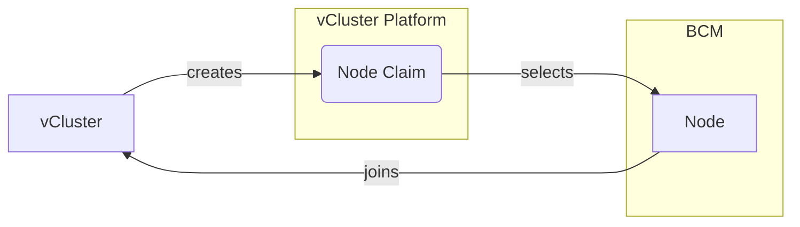

In order for this provider to work you need the following prerequisites:
* Access to Nvidia Base Command Manager
* vCluster Platform needs to be able to reach BCM control server
* `admin.key` and `admin.pem` (or similar certificates with access) which can be found at `~/.cm/admin.key` and `~/.cm/admin.pem` on the BCM head node

If the above prerequisites are fulfilled, vCluster platform will be able to schedule nodes you specify within the provider as worker nodes for vCluster. BCM nodes can be either referenced directly via their hostname or via a node group.
vCluster platform will restart (and wipe their contents) as soon as the node is deprovisioned to allow safe reuse of nodes between vCluster.

<br />


## Create secret with BCM credentials

Create a secret in the following form to allow vCluster platform to connect to bcm:
```yaml
apiVersion: v1
kind: Secret
metadata:
  name: bcm-credentials
  namespace: vcluster-platform
data:
  # Base64 encoded value of ~/.cm/admin.pem
  tls.crt: LS0t...
  # Base64 encoded value of ~/.cm/admin.key
  tls.key: LS0t...
```

## Use BCM nodes and node groups

Apply the following node provider to use the bcm node group `my-node-group`:

```yaml
apiVersion: management.loft.sh/v1
kind: NodeProvider
metadata:
  name: bcm-provider
spec:
  bcm:
    # Endpoint where the BCM api is reachable
    endpoint: "https://x.x.x.x:8081"
    # Credentials secret we created a step above
    secretRef:
      name: "bcm-credentials"
      namespace: "vcluster-platform"
    nodeTypes:
    - name: cpu-nodes
      nodeGroups: ["cpu-node-group"]
      # Optional cost value that helps scheduling
      # cost: 100
      resources:
        cpu: 16
        memory: 32Gi
    - name: gpu-nodes
      nodes: ["gpu-node-1", "gpu-node-2", "gpu-node-3"]
      resources:
        cpu: 64
        memory: 64Gi
        nvidia.com/gpu: "1"
```

The platform will then auto-discover the amount of nodes in each node group. The node types can then be referenced in the `vcluster.yaml`:
```yaml
privateNodes:
  enabled: true
  autoNodes:
    static:
      - name: cpu-pool
        provider: bcm-provider
        quantity: 1
        requirements:
        - property: vcluster.com/node-type
          value: cpu-nodes
    dynamic:
      - name: gpu-pool
        provider: bcm-provider
        requirements:
        - property: vcluster.com/node-type
          value: gpu-nodes
```

## Network configuration properties

BCM node types support additional properties for network configuration:

### `bcm.vcluster.com/network-name`

**Type:** `string`

**Required properties:**
- [`bcm.vcluster.com/network-interface`](#bcmvclustercomnetwork-interface): Interface to configure

Use this BCM network name to reconfigure the node in BCM with:
- Node's management network
- Node's boot interface network
- Get the BCM network subnet and gateway information
- Allocate IP from this network and assign to specified BCM network interface
- Configure the host interface accordingly

These settings are reverted to their original values when the NodeClaim is destroyed.
The host network resets automatically when the node is recycled on power reset and thus boots.

### `bcm.vcluster.com/network-interface`

**Type:** `string`
**Required with:** `bcm.vcluster.com/network-name` or `netris.vcluster.com/server-cluster`

The name of the node's boot network interface, e.g. `eth0`, `bond0`.

### `bcm.vcluster.com/network-ip-range`

**Type:** `string` (comma-separated IP ranges)

Specifies IP ranges to use for allocation instead of using CIDR-based allocation. Format: `IP1-IP2,IP3-IP4`

Example: `10.0.0.20-10.0.0.30`

## Netris integration

The BCM node provider can use the [Netris integration](/vcluster/next/configure/vcluster-yaml/integrations/netris) for automated network configuration and IP management.
The following properties require the integration to be enabled and [configured](/vcluster/next/configure/vcluster-yaml/integrations/netris#configure-netris-integration).

### `netris.vcluster.com/server-cluster`

**Type:** `string`

**Required properties:**
- `bcm.vcluster.com/network-interface`: Interface to configure

Specifies the [Netris server cluster](https://docs.netris.io/concepts/server-cluster) to use for this node. When set, vCluster Platform will:
1. Get the server cluster's V-net's subnet and gateway information
2. Allocate IP in this network and configure the host interface accordingly
3. Move the node to the specified Netris server cluster (and back to its original one on destroy)

### Example with Netris

```yaml
apiVersion: management.loft.sh/v1
kind: NodeProvider
metadata:
  name: bcm-netris-provider
spec:
  bcm:
    endpoint: "https://x.x.x.x:8081"
    secretRef:
      name: "bcm-credentials"
      namespace: "vcluster-platform"
    nodeTypes:
    - name: compute-nodes
      nodeGroups: ["compute-node-group"]
      properties:
        bcm.vcluster.com/network-interface: bond0
      resources:
        cpu: 32
        memory: 128Gi
```

Use in vCluster:

```yaml
privateNodes:
  enabled: true
  autoNodes:
    - provider: bcm-provider
      static:
        - name: inference
          quantity: 2
          nodeTypeSelector:
            - property: vcluster.com/node-type
              value: gpu-nodes
      properties:
        bcm.vcluster.com/network-name: dgxnet-vcluster-1
        netris.vcluster.com/server-cluster: vcluster-1
```

For more information on Netris integration, see the [Netris integration documentation](/vcluster/next/configure/vcluster-yaml/integrations/netris).
