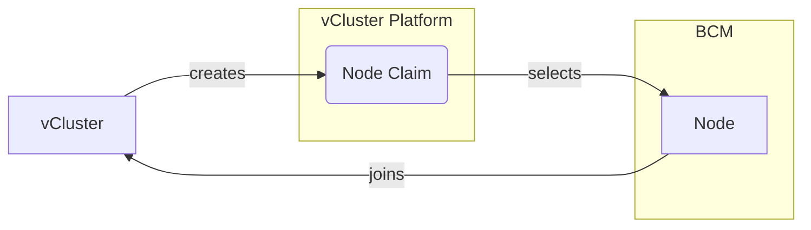

In order for this provider to work you need the following prerequisites:
* Access to Nvidia Base Command Manager
* vCluster Platform needs to be able to reach BCM control server
* `admin.key` and `admin.pem` (or similar certificates with access) which can be found at `~/.cm/admin.key` and `~/.cm/admin.pem` on the BCM head node

If the above prerequisites are fulfilled, vCluster platform will be able to schedule nodes you specify within the provider as worker nodes for vCluster. BCM nodes can be either referenced directly via their hostname or via a node group. 
vCluster platform will restart (and wipe their contents) as soon as the node is deprovisioned to allow safe reuse of nodes between vCluster.

<br />


## Create secret with BCM credentials

Create a secret in the following form to allow vCluster platform to connect to bcm:
```yaml
apiVersion: v1
kind: Secret
metadata:
  name: bcm-credentials
  namespace: vcluster-platform
data:
  # Base64 encoded value of ~/.cm/admin.pem
  tls.crt: LS0t...
  # Base64 encoded value of ~/.cm/admin.key
  tls.key: LS0t...
```

## Use BCM nodes and node groups

Apply the following node provider to use the bcm node group `my-node-group`:

```yaml
apiVersion: management.loft.sh/v1
kind: NodeProvider
metadata:
  name: bcm-provider
spec:
  bcm:
    # Endpoint where the BCM api is reachable
    endpoint: "https://x.x.x.x:8081"
    # Credentials secret we created a step above
    secretRef:
      name: "bcm-credentials"
      namespace: "vcluster-platform"
    nodeTypes:
    - name: cpu-nodes
      nodeGroups: ["cpu-node-group"]
      # Optional cost value that helps scheduling
      # cost: 100
      resources:
        cpu: 16
        memory: 32Gi
    - name: gpu-nodes
      nodes: ["gpu-node-1", "gpu-node-2", "gpu-node-3"]
      resources:
        cpu: 64
        memory: 64Gi
        nvidia.com/gpu: "1"
```

The platform will then auto-discover the amount of nodes in each node group. The node types can then be referenced in the `vcluster.yaml`:
```yaml
privateNodes:
  enabled: true
  autoNodes:
    static:
      - name: cpu-pool
        provider: bcm-provider
        quantity: 1
        requirements:
        - property: vcluster.com/node-type
          value: cpu-nodes
    dynamic:
      - name: gpu-pool
        provider: bcm-provider
        requirements:
        - property: vcluster.com/node-type
          value: gpu-nodes
```