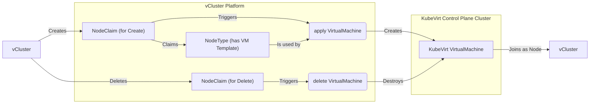

import Flow, {Step} from "@site/src/components/Flow";
import FeatureTable from '@site/src/components/FeatureTable';

<FeatureTable names="auto-nodes-kubevirt" />


The KubeVirt provider allows you to use [KubeVirt](https://kubevirt.io/) to automatically provision virtual machines as nodes for your clusters.
When a vCluster requests a new node, the platform creates a KubeVirt `VirtualMachine` based on the template defined in the `NodeProvider` and the
specific `NodeType` requested.

To inspect and operate KubeVirt VMs directly from vCluster Platform, see [Virtual Machines](../virtual-machines/overview.mdx).
For administrator guidance on VM disk imports and Multus networks, see [Data Volumes](../virtual-machines/data-volumes.mdx) and [Network Attachment Definitions](../virtual-machines/network-attachment-definitions.mdx).

This enables you to offer different "flavors" of virtual machines, for example small, medium, and large compute shapes, as nodes for your vCluster,
all managed from a central configuration.


```mermaid
flowchart LR
    subgraph platform["vCluster Platform"]
        direction LR
        NodeClaimCreate["NodeClaim (for Create)"]
        NodeClaimDelete["NodeClaim (for Delete)"]
        NodeType["NodeType (has VM Template)"]
        Provision("apply VirtualMachine")
        Destroy("delete VirtualMachine")
    end

    subgraph host_cluster["KubeVirt Control Plane Cluster"]
        direction TB
        KubeVirtVM["KubeVirt VirtualMachine"]
    end

    vCluster -- "Creates" --> NodeClaimCreate
    NodeClaimCreate -- "Claims" --> NodeType
    NodeClaimCreate -- "Triggers" --> Provision

    NodeType -- "Is used by" --> Provision
    Provision -- "Creates" --> KubeVirtVM
    KubeVirtVM -- "Joins as Node" --> Node["vCluster"]

    vCluster -- "Deletes" --> NodeClaimDelete
    NodeClaimDelete -- "Triggers" --> Destroy
    Destroy -- "Destroys" --> KubeVirtVM
```

## Overview

The KubeVirt provider works by defining a base `virtualMachineTemplate` and a collection of `nodeTypes`. Each `nodeType` represents a specific kind of
virtual machine you want to offer. When a NodeClaim is created for a vCluster, it references one of these `nodeTypes`. The platform then generates
a VirtualMachine manifest by combining the base template with any customizations defined in the chosen `nodeType` and applies it to the target
KubeVirt control plane cluster.

This approach allows for customizations like:

* **Resource Overrides**: Easily create node types with different amounts of CPU or memory.
* **Template Merging**: Modify specific parts of the base template, like adding taints or labels.
* **Template Replacement**: Define completely distinct virtual machine templates for specialized use cases.

## How it works: Cloud-init Node registration

For a virtual machine to automatically join a vCluster as a node, it needs to be configured with the correct vCluster address and join token.
The KubeVirt provider automates this process using `cloud-init`.

Here's the workflow:

1. When a NodeClaim is processed, the platform generates a `cloud-init` configuration containing the necessary registration scripts.
2. This configuration is stored in a Kubernetes Secret in the KubeVirt control plane cluster.
3. The provider injects this Secret into the VirtualMachine definition as a `cloudInitNoCloud` disk.
4. When the VM boots, `cloud-init` executes the script from the disk, configuring the machine and registering it as a node with the tenant cluster.

:::danger Image Requirement
This entire process depends on the guest OS image having **cloud-init installed and enabled**. Furthermore, the image must be compatible with KubeVirt's `cloudInitNoCloud` data source. Standard cloud images for distributions like Ubuntu are generally compatible. If you use custom images, you must ensure they meet this requirement.
:::

## Infrastructure deployment

The KubeVirt provider can deploy the KubeVirt and CDI operators onto the control plane cluster, or use an installation that you manage yourself. By default the provider expects KubeVirt to already be installed on the target cluster. To have the provider install it, enable the deployment under `spec.kubeVirt.deploy.kubevirt`:

```yaml
apiVersion: management.loft.sh/v1
kind: NodeProvider
metadata:
  name: kubevirt-provider
spec:
  kubeVirt:
    clusterRef:
      cluster: my-cluster
      namespace: vcluster-platform
    deploy:
      kubevirt:
        enabled: true
        helmValues: |
          kubevirt:
            operator:
              kubevirtVersion: v1.8.2
```

**Deployment fields (NodeProvider `kubeVirt.deploy.kubevirt`):**

| Field | Description | Default |
|---|---|---|
| `enabled` | Deploy the KubeVirt and CDI operators. Immutable after creation. | `false` |
| `chartRepo` | Override the Helm chart repository. | `oci://ghcr.io/loft-sh/charts` |
| `chart` | Override the Helm chart name. | `kubevirt` |
| `version` | Override the Helm chart version. | Bundled version |
| `helmValues` | Raw YAML applied to both the operators and the KubeVirt and CDI resources (see below). | — |

**Configure the operators:**

| Value | Description | Default |
|---|---|---|
| `kubevirt.operator.image.registry` / `.org` / `.name` / `.tag` | KubeVirt operator image. | `quay.io` / `kubevirt` / `virt-operator` / `v1.8.2` |
| `kubevirt.operator.kubevirtVersion` | KubeVirt version the operator installs. | `v1.8.2` |
| `cdi.operator.image.registry` / `.org` / `.name` / `.tag` | CDI operator image. | `quay.io` / `kubevirt` / `cdi-operator` / `v1.65.0` |
| `cdi.operator.cdiVersion` | CDI version the operator installs. | `v1.65.0` |
| `cdi.operator.serviceMonitorNamespace` | Namespace for the CDI `ServiceMonitor`. Empty disables its creation. | `""` |
| `imagePullSecrets` | Pull secrets for the operator images. | `[]` |

**Configure the KubeVirt and CDI resources:**

The same `helmValues` also populate the `KubeVirt` and `CDI` resources that the provider applies. The platform renders `kubevirt.spec` verbatim into the `KubeVirt` resource `.spec`, and `cdi.spec` into the `CDI` resource `.spec`, so KubeVirt and CDI configuration such as feature gates is controllable from here.

| Value | Description | Default |
|---|---|---|
| `kubevirt.spec` | Rendered into the `KubeVirt` resource `.spec`. | Minimal configuration, no feature gates. |
| `cdi.spec` | Rendered into the `CDI` resource `.spec`. | Feature gates `HonorWaitForFirstConsumer` and `WebhookPvcRendering`, Linux node selectors. |

For example, to enable a KubeVirt feature gate and add a CDI feature gate:

```yaml
deploy:
  kubevirt:
    enabled: true
    helmValues: |
      kubevirt:
        spec:
          configuration:
            developerConfiguration:
              featureGates:
                - LiveMigration
      cdi:
        spec:
          config:
            featureGates:
              - HonorWaitForFirstConsumer
              - WebhookPvcRendering
              - ExpandDisks
```

:::note Guarded against existing installations
Before deploying, the platform checks the target cluster for the KubeVirt CRD (`kubevirts.kubevirt.io`). When KubeVirt is already present, the provider does not redeploy it. The provider removes KubeVirt on provider deletion only when it deployed it (`enabled: true`).

`deploy.kubevirt.enabled`, `clusterRef.cluster` and `clusterRef.namespace` are immutable after creating the provider. To change them, create a new provider.
:::

## Configuration

A KubeVirt `NodeProvider` configuration consists of a reference to the control plane cluster, a base VM template, and a list of node types.

### Minimal example

Here is a minimal configuration for a KubeVirt provider. It defines a single node type that uses the base template without any modifications.

```yaml
apiVersion: management.loft.sh/v1
kind: NodeProvider
metadata:
  name: kubevirt-provider-minimal
spec:
  displayName: "KubeVirt Minimal Provider"
  properties:
    kubevirt.vcluster.com/image-url: docker://quay.io/containerdisks/ubuntu:22.04
    kubevirt.vcluster.com/root-disk-size: 20Gi
  kubeVirt:
    # clusterRef allows configuration of where KubeVirt is running and where VirtualMachines will be created.
    clusterRef:
      cluster: test-kubevirt-1 # name of the control plane cluster already connected to the platform
      namespace: vcluster-platform # namespace in this control plane cluster where VirtualMachines will be created
    # Base template for all Virtual Machines created by this provider
    virtualMachineTemplate:
      spec:
        template:
          spec:
            domain:
              resources:
                requests:
                  cpu: "1"
                  memory: "2Gi"
    # Define the types of nodes users can request
    nodeTypes:
    - name: "small-ubuntu-vm"
      displayName: "Small Ubuntu VM (KubeVirt)"
      maxCapacity: 10
```

## Define NodeTypes

The real power of the KubeVirt provider comes from its flexible `nodeTypes`. You can define multiple types, each with specific overrides or entire template replacements.

### Override resources

You can create a `NodeType` that inherits the base `virtualMachineTemplate` but specifies different CPU and memory resources. This is useful for offering different machine sizes.

```yaml
nodeTypes:
- name: "small-ubuntu-vm-2"
  displayName: "Small Ubuntu VM (KubeVirt)"
  maxCapacity: 10
  # This NodeType uses the base template's resources (1 CPU, 2Gi Memory)

- name: "mid-ubuntu-vm-2"
  displayName: "Mid Ubuntu VM (KubeVirt)"
  maxCapacity: 5
  resources:
    cpu: 4
    memory: 5Gi
  # This NodeType overrides the base template to provide 4 CPUs and 5Gi of memory
```

### Merge template modifications

The `mergeVirtualMachineTemplate` field allows you to provide a partial `VirtualMachine` template that will be strategically merged with the base template.
This is ideal for changing specific attributes, like adding Kubernetes taints or labels, without redefining the entire VM.

:::info Merge Behavior
The merge logic follows standard Kubernetes strategic merge patching. Arrays are typically replaced, while maps (objects) are merged.
:::

In this example, the `high-memory-node` type adds a taint and a label to the base template.

```yaml
# ... (omitting provider spec for brevity)
nodeTypes:
- name: "high-memory-node"
  maxCapacity: 2
  displayName: "High Memory Node (KubeVirt)"
  mergeVirtualMachineTemplate:
    metadata:
      labels:
        # This label will be added to the base labels
        workload: memory-intensive
    spec:
      template:
        spec:
          # Add a taint to ensure only specific pods schedule here
          taints:
          - key: "workload"
            value: "high-memory"
            effect: "NoSchedule"
```

### Replace the entire template

For cases where a `NodeType` requires a fundamentally different configuration, you can use the `virtualMachineTemplate` field *inside* the `NodeType` definition. This completely ignores the base template and uses the specified one instead.

```yaml
# ... (omitting provider spec for brevity)
nodeTypes:
- name: "different-vm-with-different-template-2"
  maxCapacity: 1
  displayName: "Different VM with Different Template (KubeVirt)"
  # This template completely replaces the provider-level base template
  virtualMachineTemplate:
    metadata:
      labels:
        foo: baz # Note: the base label 'foo: bar' is not present
    spec:
      # ... (full, self-contained VirtualMachine spec)
```

## Example: vCluster with static KubeVirt node

This example demonstrates a realistic multi-cluster scenario. We will configure a `NodeProvider` on the management cluster that provisions specialized VMs onto a separate, KubeVirt-enabled target cluster.

<Flow>
<Step>
Verify prerequisites.

Before you begin, ensure you have a KubeVirt-enabled Kubernetes cluster connected to your vCluster Platform management plane. You can verify this by listing the connected clusters.

```bash
kubectl get clusters
```

You should see your target cluster in the list. For this example, we'll assume it's named `test-kubevirt-1`.

```text
NAME                  CREATED AT
loft-cluster           2025-08-21T10:43:14Z
test-kubevirt-1        2025-08-21T11:51:36Z
test-no-kubevirt-2     2025-08-21T12:34:25Z
```
</Step>

<Step>
Create the NodeProvider

Apply the `NodeProvider` configuration to your management cluster. This configuration references the target cluster, `test-kubevirt-1`, and specifies that new VMs should be created in the `vcluster-platform` namespace on that cluster.

```yaml
apiVersion: management.loft.sh/v1
kind: NodeProvider
metadata:
  name: kubevirt-provider-advanced
spec:
  displayName: "KubeVirt Advanced Provider"
  properties:
    kubevirt.vcluster.com/image-url: docker://quay.io/containerdisks/ubuntu:22.04
    kubevirt.vcluster.com/root-disk-size: 20Gi
  kubeVirt:
    clusterRef:
      cluster: test-kubevirt-1
      namespace: vcluster-platform
    virtualMachineTemplate:
      metadata:
        labels:
          provider: kubevirt
      spec:
        template:
          spec:
            domain:
              devices:
                interfaces:
                - name: default
                  masquerade: {}
              resources:
                requests:
                  cpu: "2"
                  memory: "4Gi"
            networks:
            - name: default
              pod: {}
    nodeTypes:
    - name: "standard-node"
      displayName: "Standard Ubuntu VM (KubeVirt)"
      maxCapacity: 10
    - name: "high-memory-node"
      maxCapacity: 5
      displayName: "High Memory Node (KubeVirt)"
      resources:
        cpu: 4
        memory: 16Gi
      mergeVirtualMachineTemplate:
        metadata:
          labels:
            workload: memory-intensive
        spec:
          template:
            spec:
              taints:
              - key: "workload"
                value: "high-memory"
                effect: "NoSchedule"
```

</Step>

<Step>
Verify NodeTypes are Available

After applying the `NodeProvider`, the platform processes it and creates corresponding `NodeType` resources. You can list these to confirm they are ready to be claimed.

```bash
kubectl get nodetype
```

The command will show that both the `standard-node` and the `high-memory-node` are in the `Available` phase.

```text
NAME               AVAILABLE   TOTAL   PROVIDER                     COST   PHASE       CREATED AT
high-memory-node   5           5       kubevirt-provider-advanced   72     Available   2025-08-25T13:17:30Z
standard-node      10          10      kubevirt-provider-advanced   28     Available   2025-08-25T13:17:30Z
```
</Step>
<Step>
Create a vCluster with Auto-Provisioning

Now, create a vCluster instance that is configured to automatically request a node upon creation. We'll do this by providing a values file that enables the `autoNodes` feature.

First, create a file named `test-kubevirt-vc.yaml` with the following content. This tells the vCluster to automatically claim one node matching the `standard-node` type.

```yaml
privateNodes:
  enabled: true
  autoNodes:
    - provider: my-provider
      static:
        - name: static-standard-nodes
          quantity: 1
          nodeTypeSelector:
            - property: vcluster.com/node-type
              value: standard-node
```

Next, create the vCluster using this file.

```bash
vcluster create --driver platform --connect=false -f test-kubevirt-vc.yaml --cluster loft-cluster test-kubevirt-node-1
```
</Step>

<Step>
Verify NodeClaim.

Once the vCluster is created, its `autoNodes` configuration will automatically generate a `NodeClaim`. You can verify this on the management cluster.

```bash
kubectl get nodeclaim -A
```

You will see a `NodeClaim` for the `standard-node` type, which eventually will reach `Available` state, indicating that the request has been fulfilled.

```text
NAMESPACE   NAME                       STATUS      VCLUSTER               NODETYPE        CREATED AT
p-default   test-kubevirt-node-1-x49gd   Available   test-kubevirt-node-1   standard-node   2025-08-25T13:41:07Z
```
</Step>

<Step>
Verify the VirtualMachine on the Target Cluster.

The `NodeClaim` triggers the `NodeProvider` to create a `VirtualMachine`. Switch your `kubectl` context to the target KubeVirt cluster (`test-kubevirt-1`) and inspect the VM object.

```bash
# Switch context to the KubeVirt control plane cluster
kubectx test-kubevirt-1

# Check for the running Virtual Machine
kubectl -n vcluster-platform get vm
```

The output confirms that the `VirtualMachine` corresponding to the `NodeClaim` is running.

```text
NAME                       AGE    STATUS    READY
test-kubevirt-node-1-x49gd   3m1s   Running   True
```
</Step>

<Step>
Verify the Node in the vCluster.

Finally, connect to your vCluster and verify that the new node has successfully joined the cluster.

```bash
vcluster --driver platform connect test-kubevirt-node-1
```

After connecting, check the nodes within the vCluster.

```bash
kubectl get nodes
```

The output will show the new node in the `Ready` state, confirming the node is up and ready for workloads.

```text
NAME                       STATUS   ROLES    AGE   VERSION
test-kubevirt-node-1-9xm54   Ready    &lt;none&gt;   27s   v1.33.4
```

</Step>
</Flow>

## Configuration properties

Properties are key-value pairs on the NodeProvider, NodeType, or NodeClaim that control provisioning behavior. NodeClaim properties take precedence over NodeType. NodeType properties take precedence over NodeProvider.

### Inline template

#### `kubevirt.vcluster.com/vm-template`

**Type:** `string` (inline YAML of a `VirtualMachine` resource)

Allows a NodeClaim to fully specify its `VirtualMachine` template inline, bypassing the NodeProvider's `virtualMachineTemplate` and any NodeType. When this property is set on a NodeClaim, the provider skips the default NodeType-based scheduling and uses the supplied template directly. The claim does not need a `typeRef` in this case.

This is useful when a tenant wants to create a one-off VM whose shape does not match any predefined NodeType.

:::note Standalone Machines only
This property is currently only compatible with standalone Machines. It cannot be used with NodeClaims created by a tenant cluster's node pool. This is not enforced. Setting it on a node-pool claim will produce undefined behavior.
:::

### Image configuration

The image configuration properties synthesize a root-disk `DataVolumeTemplate`, volume, and disk and prepend them to the VM template. The synthesized disk is prepended to the VM's disk list, so it takes boot precedence over any other OS disks defined in the template.
For administrator workflows, ownership, and import troubleshooting, see [Data Volumes](../virtual-machines/data-volumes.mdx).

#### `vcluster.com/os-image`

**Type:** `string`

<!-- vale Vale.Terms = NO -->
References an [OSImage](../../use-platform/machines/os-images.mdx) resource by name. The OSImage's properties merge into the NodeClaim's properties. If the OSImage sets `kubevirt.vcluster.com/image-url` or `kubevirt.vcluster.com/image-datasource`, the NodeClaim's source-related fields (`image-url`, `image-checksum`, `image-datasource`) are discarded before the overlay to avoid mismatched sources.
<!-- vale Vale.Terms = YES -->

#### `kubevirt.vcluster.com/image-url`

**Type:** `string` (HTTP(S) URL or `docker://` reference)

<!-- vale Vale.Terms = NO -->
URL of the OS image. HTTP and HTTPS URLs produce an `http` DataVolume source; `docker://` URLs produce a `registry` source. Mutually exclusive with `kubevirt.vcluster.com/image-datasource`.
<!-- vale Vale.Terms = YES -->

#### `kubevirt.vcluster.com/image-checksum`

**Type:** `string`

Checksum of the OS image, used only when `image-url` is an HTTP(S) URL.

#### `kubevirt.vcluster.com/image-datasource`

**Type:** `string` (`<name>` or `<namespace>/<name>`)

References a CDI `DataSource`. The provider sets the DataVolume's `sourceRef` to this DataSource. If you only supply `<name>`, the provider looks up the DataSource in the same namespace as the VM. Mutually exclusive with `kubevirt.vcluster.com/image-url`.

#### `kubevirt.vcluster.com/root-disk-size`

**Type:** `string` (Kubernetes quantity, for example `40Gi`)
**Required:** Yes, whenever image configuration is used.

Storage request for the synthesized root-disk DataVolume. Provisioning fails if image configuration is set without a root-disk size.

#### `kubevirt.vcluster.com/image-datavolume-template`

**Type:** `string` (inline YAML)

A partial `DataVolumeTemplate` that is deep-merged onto the defaults before the platform applies the image source and disk size. Use this to override fields like `storage.accessModes` or `storage.storageClassName`. The platform always sets the DataVolume's `source` and `sourceRef` based on the image properties. You cannot override them here.

#### `kubevirt.vcluster.com/root-disk-template`

**Type:** `string` (inline YAML)

A partial disk entry that is deep-merged onto the default root disk (`bus: virtio`) before being prepended to the VM's `domain.devices.disks` list. Use this to set the bus, boot order, or other disk fields.

### Network configuration

KubeVirt provisioning supports additional properties for network configuration with cloud-init:

#### `kubevirt.vcluster.com/network-cidr`

**Type:** `string` (CIDR notation)

Specifies a CIDR range for allocating IP addresses to the VM. Example: `10.100.0.0/24`

**Required properties:**
- `kubevirt.vcluster.com/network-nameservers`: DNS nameservers

**Optional properties:**
- `kubevirt.vcluster.com/network-interface`: Interface name in the VM (defaults to `enp1s0`)

#### `kubevirt.vcluster.com/network-interface`

**Type:** `string`

The name of the network interface in the VM to configure, for example `eth0`, `eth1`, or `enp1s0`. It should normally match the default name from the operating system's device enumeration. Optional for CIDR-based configuration. Defaults to `enp1s0` when unset.

#### `kubevirt.vcluster.com/network-ip-range`

**Type:** `string` (comma-separated IP ranges)

Specifies IP ranges to use for allocation instead of using CIDR-based allocation. Format: `IP1-IP2,IP3-IP4`

Example: `10.0.0.20-10.0.0.30,10.0.0.40-10.0.0.50`

#### `kubevirt.vcluster.com/network-nameservers`

**Type:** `string` (comma-separated)

DNS nameservers to configure in the VM. Example: `8.8.8.8,8.8.4.4`

#### `kubevirt.vcluster.com/network-data`

**Type:** `string` (base64-encoded cloud-init network-config)

Allows providing a complete custom network configuration for cloud-init.
When set, this overrides automatic network configuration.

<!-- vale off -->
#### `kubevirt.vcluster.com/network-attachment-definition` {#kubevirt-vcluster-com-network-attachment-definition}
<!-- vale on -->

**Type:** `string` (format: `[<namespace>/]<name>`)

References a Multus `NetworkAttachmentDefinition` that already exists in the target namespace on the control plane cluster. The provider injects a `multus` network and a corresponding interface into the VM template using this NAD. If a network or interface with the same name already exists in the template, it is overwritten.

This property is the supported way to attach a VM to an additional network such as a bridge. Set it on the NodeType for VMs that should share a network, or on the NodeClaim for a one-off attachment.
For UI workflows, examples, ownership, and NAD troubleshooting, see [Network Attachment Definitions](../virtual-machines/network-attachment-definitions.mdx).

The following properties tune the injected interface. They only take effect when `kubevirt.vcluster.com/network-attachment-definition` is set.

#### `kubevirt.vcluster.com/interface-binding`

**Type:** `string`

Sets the binding method for the injected interface. One of `bridge`, `masquerade`, `sriov`, `passt`, or `slirp`. Defaults to `bridge`.

#### `kubevirt.vcluster.com/interface-template`

**Type:** `string` (YAML)

A partial KubeVirt interface definition merged over the default injected interface (`{name: multus, bridge: {}}`). Use it for binding-specific options that `kubevirt.vcluster.com/interface-binding` does not cover. The interface name is always forced to `multus`, because KubeVirt requires the interface name to match the network name.

#### `kubevirt.vcluster.com/multus-default`

**Type:** `string` (`"true"` or `"false"`)

When `"true"`, the Multus network becomes the VM's default network, and the pod network and its interface are removed, since KubeVirt rejects a VM that has both. Defaults to `"false"`.

### Node environment selection

#### `vcluster.com/network-environment`

**Type:** `string`

Names the [NodeEnvironment](./overview.mdx#node-environments) whose properties merge into the NodeClaim's effective property set. The platform resolves this from the merged properties of NodeProvider, NodeType, and NodeClaim. When set, this property takes precedence over the typed `NodeClaim.spec.environmentRef` field.

Use this to declare environment-level defaults at the provider or type level, or to keep network configuration separate from provider and type definitions.

### SSH and user data

The `vcluster.com/ssh-keys` and `vcluster.com/user-data` properties behave identically across providers. See the [metal3 reference](./metal3.mdx#ssh-and-user-data) for details.

To render cloud-init from a reusable template, reference a [MachineConfigTemplate](../../use-platform/machines/machine-config-templates.mdx) with the `vcluster.com/user-data-template-config` property. See [Machine Config Templates](../../use-platform/machines/machine-config-templates.mdx) for the template syntax and available variables.

## Netris integration

You can integrate KubeVirt VMs with [Netris](https://www.netris.io/) for automated network configuration and IP management.

### `netris.vcluster.com/server-cluster`

**Type:** `string`

Specifies the Netris server cluster to use for this VM. When set, vCluster Platform:
1. Queries the Netris server cluster to collect subnet, gateway and vxlan id information.
2. Allocates an IP address from the subnet.
3. Creates Multus NetworkAttachment definition `netris-<node provider name>-<server cluster name>` using the bridge plugin with the `nbr-<vnet vxlan id>` bridge.
4. Injects cloud-init network configuration with the allocated IP.
5. Injects a network and interface into the VM template through the [`kubevirt.vcluster.com/network-attachment-definition`](#kubevirt-vcluster-com-network-attachment-definition) property.

The interface injection itself is a generic mechanism. Netris is one way to drive it, but any NodeType or NodeClaim can set `kubevirt.vcluster.com/network-attachment-definition` directly to attach a VM to an existing NAD without involving Netris.

**Required properties:**
- `kubevirt.vcluster.com/network-interface`: Interface to configure
- `kubevirt.vcluster.com/network-nameservers`: DNS servers

**Prerequisites:**
- [Netris integration](/vcluster/next/configure/vcluster-yaml/integrations/netris) must be enabled and configured in the vCluster configuration.
- vCluster Platform license must include the Netris feature.
- Bridge with the `nbr-<vnet vxlan id>` must exist on the control plane cluster nodes.

**Optional properties:**
- `kubevirt.vcluster.com/network-attachment-definition`

   If specified, the integration does not create another Multus NetworkAttachmentDefinition, but instead uses this one.

### Example with Netris and Multus

```yaml
apiVersion: management.loft.sh/v1
kind: NodeProvider
metadata:
  name: kubevirt-netris-provider
spec:
  properties:
    kubevirt.vcluster.com/image-url: docker://quay.io/containerdisks/ubuntu:22.04
    kubevirt.vcluster.com/root-disk-size: 20Gi
  kubeVirt:
    clusterRef:
      cluster: kubevirt-host
      namespace: vcluster-platform
    virtualMachineTemplate:
      spec:
        template:
          spec:
            domain:
              devices:
                interfaces:
                - name: multus
                  bridge: {}
              resources:
                requests:
                  cpu: "2"
                  memory: "4Gi"
            networks:
            - name: multus
              multus:
                networkName: netris-bridge
    nodeTypes:
    - name: netris-vms
      maxCapacity: 2
      properties:
        # Netris server cluster for network configuration
        netris.vcluster.com/server-cluster: vcluster-1
        # Interface to configure in the VM
        kubevirt.vcluster.com/network-interface: enp1s0
        # DNS servers
        kubevirt.vcluster.com/network-nameservers: "8.8.8.8,8.8.4.4"
      resources:
        cpu: 2
        memory: 4Gi
```

Create a NetworkAttachmentDefinition in the KubeVirt control plane cluster:

```yaml
apiVersion: k8s.cni.cncf.io/v1
kind: NetworkAttachmentDefinition
metadata:
  name: netris-bridge
  namespace: vcluster-platform
spec:
  config: |
    {
      "cniVersion": "0.3.1",
      "type": "bridge",
      "bridge": "br-netris"
    }
```

Use in vCluster:

```yaml
privateNodes:
  enabled: true
  autoNodes:
    - provider: kubevirt-netris-provider
      static:
        - name: netris-vms
          quantity: 2
          nodeTypeSelector:
            - property: vcluster.com/node-type
              value: netris-vms

# Enable Netris integration
integrations:
  netris:
    enabled: true
    connector: netris-credentials
```

For more information on Netris integration, see the [Netris integration documentation](/vcluster/next/configure/vcluster-yaml/integrations/netris).
