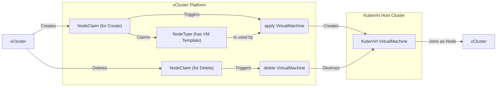

import Flow, {Step} from "@site/src/components/Flow";

The KubeVirt provider allows you to use [KubeVirt](https://kubevirt.io/) to automatically provision virtual machines as nodes for your clusters.
When a vCluster requests a new node, the platform creates a KubeVirt `VirtualMachine` based on the template defined in the `NodeProvider` and the
specific `NodeType` requested.

This enables you to offer different "flavors" of virtual machines (e.g., small, medium, large, different operating systems) as nodes for your vCluster,
all managed from a central configuration.



## Overview

The KubeVirt provider works by defining a base `virtualMachineTemplate` and a collection of `nodeTypes`. Each `nodeType` represents a specific kind of
virtual machine you want to offer. When a NodeClaim is created for a vCluster, it references one of these `nodeTypes`. The platform then generates
a VirtualMachine manifest by combining the base template with any customizations defined in the chosen `nodeType` and applies it to the target
KubeVirt host cluster.

This approach allows for customizations like:

* **Resource Overrides**: Easily create node types with different amounts of CPU or memory.
* **Template Merging**: Modify specific parts of the base template, like adding taints or changing the disk image.
* **Template Replacement**: Define completely distinct virtual machine templates for specialized use cases.

## How it works: Cloud-init Node registration

For a virtual machine to automatically join a vCluster as a node, it needs to be configured with the correct vCluster address and join token.
The KubeVirt provider automates this process using `cloud-init`.

Here's the workflow:

1. When a NodeClaim is processed, the platform generates a `cloud-init` configuration containing the necessary registration scripts.
2. This configuration is stored in a Kubernetes Secret in the KubeVirt host cluster.
3. The provider injects this Secret into the VirtualMachine definition as a `cloudInitNoCloud` disk.
4. When the VM boots, `cloud-init` executes the script from the disk, configuring the machine and registering it as a node with the virtual cluster.

:::danger Image Requirement
This entire process depends on the guest OS image having **cloud-init installed and enabled**. Furthermore, the image must be compatible with KubeVirt's `cloudInitNoCloud` data source. Standard cloud images for distributions like Ubuntu are generally compatible. If you use custom images, you must ensure they meet this requirement.
:::

## Configuration

A KubeVirt `NodeProvider` configuration consists of a reference to the host cluster, a base VM template, and a list of node types.

### Minimal example

Here is a minimal configuration for a KubeVirt provider. It defines a single node type that uses the base template without any modifications.

```yaml
apiVersion: management.loft.sh/v1
kind: NodeProvider
metadata:
  name: kubevirt-provider-minimal
spec:
  displayName: "KubeVirt Minimal Provider"
  kubeVirt:
    # clusterRef allows configuration of where KubeVirt is running and where VirtualMachines will be created.
    clusterRef:
      cluster: test-kubevirt-1 # is a name of Host Cluster already connected to Platform
      namespace: vcluster-platform # is a namespace in this host cluster where VirtualMachines will be created
    # Base template for all Virtual Machines created by this provider
    virtualMachineTemplate:
      spec:
        dataVolumeTemplates:
        - metadata:
            name: containerdisk
          spec:
            source:
              registry:
                url: docker://quay.io/containerdisks/ubuntu:22.04
            pvc:
              accessModes:
              - ReadWriteOnce
              resources:
                requests:
                  storage: '20Gi'
        template:
          spec:
            domain:
              devices:
                disks:
                - name: containerdisk
                  disk:
                    bus: virtio
              resources:
                requests:
                  cpu: "1"
                  memory: "2Gi"
            volumes:
            - name: containerdisk
              dataVolume:
                name: containerdisk
    # Define the types of nodes users can request
    nodeTypes:
    - name: "small-ubuntu-vm"
      displayName: "Small Ubuntu VM (KubeVirt)"
      maxCapacity: 10
```

## Define NodeTypes

The real power of the KubeVirt provider comes from its flexible `nodeTypes`. You can define multiple types, each with specific overrides or entire template replacements.

### Override resources

You can create a `NodeType` that inherits the base `virtualMachineTemplate` but specifies different CPU and memory resources. This is useful for offering different machine sizes.

```yaml
nodeTypes:
- name: "small-ubuntu-vm-2"
  displayName: "Small Ubuntu VM (KubeVirt)"
  maxCapacity: 10
  # This NodeType uses the base template's resources (1 CPU, 2Gi Memory)

- name: "mid-ubuntu-vm-2"
  displayName: "Mid Ubuntu VM (KubeVirt)"
  maxCapacity: 5
  resources:
    cpu: 4
    memory: 5Gi
  # This NodeType overrides the base template to provide 4 CPUs and 5Gi of memory
```

### Merge template modifications

The `mergeVirtualMachineTemplate` field allows you to provide a partial `VirtualMachine` template that will be strategically merged with the base template.
This is ideal for changing specific attributes, like adding Kubernetes taints or labels, without redefining the entire VM.

:::info Merge Behavior
The merge logic follows standard Kubernetes strategic merge patching. Arrays are typically replaced, while maps (objects) are merged.
:::

In this example, the `high-memory-node` type adds a taint and a label to the base template.

```yaml
# ... (omitting provider spec for brevity)
nodeTypes:
- name: "high-memory-node"
  maxCapacity: 2
  displayName: "High Memory Node (KubeVirt)"
  mergeVirtualMachineTemplate:
    metadata:
      labels:
        # This label will be added to the base labels
        workload: memory-intensive
    spec:
      template:
        spec:
          # Add a taint to ensure only specific pods schedule here
          taints:
          - key: "workload"
            value: "high-memory"
            effect: "NoSchedule"
```

### Replace the entire template

For cases where a `NodeType` requires a fundamentally different configuration, you can use the `virtualMachineTemplate` field *inside* the `NodeType` definition. This completely ignores the base template and uses the specified one instead.

```yaml
# ... (omitting provider spec for brevity)
nodeTypes:
- name: "different-vm-with-different-template-2"
  maxCapacity: 1
  displayName: "Different VM with Different Template (KubeVirt)"
  # This template completely replaces the provider-level base template
  virtualMachineTemplate:
    metadata:
      labels:
        foo: baz # Note: the base label 'foo: bar' is not present
    spec:
      # ... (full, self-contained VirtualMachine spec)
```

## Example: vCluster with static KubeVirt node

This example demonstrates a realistic multi-cluster scenario. We will configure a `NodeProvider` on the management cluster that provisions specialized VMs onto a separate, KubeVirt-enabled target cluster.

<Flow>
<Step>
Verify prerequisites.

Before you begin, ensure you have a KubeVirt-enabled Kubernetes cluster connected to your vCluster Platform management plane. You can verify this by listing the connected clusters.

```bash
kubectl get clusters
```

You should see your target cluster in the list. For this example, we'll assume it's named `test-kubevirt-1`.

```text
NAME                  CREATED AT
loft-cluster           2025-08-21T10:43:14Z
test-kubevirt-1        2025-08-21T11:51:36Z
test-no-kubevirt-2     2025-08-21T12:34:25Z
```
</Step>

<Step>
Create the NodeProvider

Apply the `NodeProvider` configuration to your management cluster. This configuration references the target cluster, `test-kubevirt-1`, and specifies that new VMs should be created in the `vcluster-platform` namespace on that cluster.

```yaml
apiVersion: management.loft.sh/v1
kind: NodeProvider
metadata:
  name: kubevirt-provider-advanced
spec:
  displayName: "KubeVirt Advanced Provider"
  kubeVirt:
    clusterRef:
      cluster: test-kubevirt-1
      namespace: vcluster-platform
    virtualMachineTemplate:
      metadata:
        labels:
          provider: kubevirt
      spec:
        dataVolumeTemplates:
        - metadata:
            name: containerdisk
          spec:
            source:
              registry:
                url: docker://quay.io/containerdisks/ubuntu:22.04
            pvc:
              accessModes:
              - ReadWriteOnce
              resources:
                requests:
                  storage: '20Gi'
        template:
          spec:
            domain:
              devices:
                disks:
                - name: containerdisk
                  disk:
                    bus: virtio
                interfaces:
                - name: default
                  masquerade: {}
              resources:
                requests:
                  cpu: "2"
                  memory: "4Gi"
            networks:
            - name: default
              pod: {}
            volumes:
            - name: containerdisk
              dataVolume:
                name: containerdisk
    nodeTypes:
    - name: "standard-node"
      displayName: "Standard Ubuntu VM (KubeVirt)"
      maxCapacity: 10
    - name: "high-memory-node"
      maxCapacity: 5
      displayName: "High Memory Node (KubeVirt)"
      resources:
        cpu: 4
        memory: 16Gi
      mergeVirtualMachineTemplate:
        metadata:
          labels:
            workload: memory-intensive
        spec:
          template:
            spec:
              taints:
              - key: "workload"
                value: "high-memory"
                effect: "NoSchedule"
```

</Step>

<Step>
Verify NodeTypes are Available

After applying the `NodeProvider`, the platform processes it and creates corresponding `NodeType` resources. You can list these to confirm they are ready to be claimed.

```bash
kubectl get nodetype
```

The command will show that both the `standard-node` and the `high-memory-node` are in the `Available` phase.

```text
NAME               AVAILABLE   TOTAL   PROVIDER                     COST   PHASE       CREATED AT
high-memory-node   5           5       kubevirt-provider-advanced   72     Available   2025-08-25T13:17:30Z
standard-node      10          10      kubevirt-provider-advanced   28     Available   2025-08-25T13:17:30Z
```
</Step>
<Step>
Create a vCluster with Auto-Provisioning

Now, create a vCluster instance that is configured to automatically request a node upon creation. We'll do this by providing a values file that enables the `autoNodes` feature.

First, create a file named `test-kubevirt-vc.yaml` with the following content. This tells the vCluster to automatically claim one node matching the `standard-node` type.

```yaml
privateNodes:
  enabled: true
  autoNodes:
    - provider: my-provider
      static:
        - name: static-standard-nodes
          quantity: 1
          nodeTypeSelector:
            - property: vcluster.com/node-type
              value: standard-node
```

Next, create the vCluster using this file.

```bash
vcluster create --driver platform --connect=false -f test-kubevirt-vc.yaml --cluster loft-cluster test-kubevirt-node-1
```
</Step>

<Step>
Verify NodeClaim.

Once the vCluster is created, its `autoNodes` configuration will automatically generate a `NodeClaim`. You can verify this on the management cluster.

```bash
kubectl get nodeclaim -A
```

You will see a `NodeClaim` for the `standard-node` type, which eventually will reach `Available` state, indicating that the request has been fulfilled.

```text
NAMESPACE   NAME                       STATUS      VCLUSTER               NODETYPE        CREATED AT
p-default   test-kubevirt-node-1-x49gd   Available   test-kubevirt-node-1   standard-node   2025-08-25T13:41:07Z
```
</Step>

<Step>
Verify the VirtualMachine on the Target Cluster.

The `NodeClaim` triggers the `NodeProvider` to create a `VirtualMachine`. Switch your `kubectl` context to the target KubeVirt cluster (`test-kubevirt-1`) and inspect the VM object.

```bash
# Switch context to the KubeVirt host cluster
kubectx test-kubevirt-1

# Check for the running Virtual Machine
kubectl -n vcluster-platform get vm
```

The output confirms that the `VirtualMachine` corresponding to the `NodeClaim` is running.

```text
NAME                       AGE    STATUS    READY
test-kubevirt-node-1-x49gd   3m1s   Running   True
```
</Step>

<Step>
Verify the Node in the vCluster.

Finally, connect to your vCluster and verify that the new node has successfully joined the cluster.

```bash
vcluster --driver platform connect test-kubevirt-node-1
```

After connecting, check the nodes within the vCluster.

```bash
kubectl get nodes
```

The output will show the new node in the `Ready` state, confirming the node is up and ready for workloads.

```text
NAME                       STATUS   ROLES    AGE   VERSION
test-kubevirt-node-1-9xm54   Ready    &lt;none&gt;   27s   v1.33.4
```

</Step>
</Flow>

## Network configuration properties

KubeVirt node types support additional properties for network configuration with cloud-init:

### `kubevirt.vcluster.com/network-cidr`

**Type:** `string` (CIDR notation)

Specifies a CIDR range for allocating IP addresses to the VM. Example: `10.100.0.0/24`

**Required properties:**
- `kubevirt.vcluster.com/network-interface`: Interface name in the VM
- `kubevirt.vcluster.com/network-nameservers`: DNS nameservers

### `kubevirt.vcluster.com/network-interface`

**Type:** `string`
**Required with:** network configuration

The name of the network interface in the VM to configure, e.g. `eth0`, `eth1`, `enp1s0`.

### `kubevirt.vcluster.com/network-ip-range`

**Type:** `string` (comma-separated IP ranges)

Specifies IP ranges to use for allocation instead of using CIDR-based allocation. Format: `IP1-IP2,IP3-IP4`

Example: `10.0.0.20-10.0.0.30,10.0.0.40-10.0.0.50`

### `kubevirt.vcluster.com/network-nameservers`

**Type:** `string` (comma-separated)

DNS nameservers to configure in the VM. Example: `8.8.8.8,8.8.4.4`

### `kubevirt.vcluster.com/network-data`

**Type:** `string` (base64-encoded cloud-init network-config)

Allows providing a complete custom network configuration for cloud-init.
When set, this overrides automatic network configuration.

## Netris integration

KubeVirt VMs can be integrated with [Netris](https://www.netris.io/) for automated network configuration and IP management.

### `netris.vcluster.com/server-cluster`

**Type:** `string`

Specifies the Netris server cluster to use for this VM. When set, vCluster Platform will:
1. Query the Netris server cluster to collect subnet and gateway information
2. Allocate an IP address from the subnet
3. Inject cloud-init network configuration with the allocated IP

**Required properties:**
- `kubevirt.vcluster.com/network-interface`: Interface to configure
- `kubevirt.vcluster.com/network-nameservers`: DNS servers

**Prerequisites:**
- [Netris integration](/vcluster/next/configure/vcluster-yaml/integrations/netris) must be enabled and configured in the vCluster configuration
- vCluster Platform license must include the Netris feature
- To connect to other hosts on the Netris network (e.g. bare metal), the VM template must configure the necessary network interface (e.g. with [Multus](https://github.com/k8snetworkplumbingwg/multus-cni))

### Example with Netris and Multus

```yaml
apiVersion: management.loft.sh/v1
kind: NodeProvider
metadata:
  name: kubevirt-netris-provider
spec:
  kubeVirt:
    clusterRef:
      cluster: kubevirt-host
      namespace: vcluster-platform
    virtualMachineTemplate:
      spec:
        dataVolumeTemplates:
        - metadata:
            name: containerdisk
          spec:
            source:
              registry:
                url: docker://quay.io/containerdisks/ubuntu:22.04
            pvc:
              accessModes:
              - ReadWriteOnce
              resources:
                requests:
                  storage: '20Gi'
        template:
          spec:
            domain:
              devices:
                disks:
                - name: containerdisk
                  disk:
                    bus: virtio
                interfaces:
                - name: multus
                  bridge: {}
              resources:
                requests:
                  cpu: "2"
                  memory: "4Gi"
            networks:
            - name: multus
              multus:
                networkName: netris-bridge
            volumes:
            - name: containerdisk
              dataVolume:
                name: containerdisk
    nodeTypes:
    - name: netris-vms
      maxCapacity: 2
      properties:
        # Netris server cluster for network configuration
        netris.vcluster.com/server-cluster: vcluster-1
        # Interface to configure in the VM
        kubevirt.vcluster.com/network-interface: enp1s0
        # DNS servers
        kubevirt.vcluster.com/network-nameservers: "8.8.8.8,8.8.4.4"
      resources:
        cpu: 2
        memory: 4Gi
```

Create a NetworkAttachmentDefinition in the KubeVirt host cluster:

```yaml
apiVersion: k8s.cni.cncf.io/v1
kind: NetworkAttachmentDefinition
metadata:
  name: netris-bridge
  namespace: vcluster-platform
spec:
  config: |
    {
      "cniVersion": "0.3.1",
      "type": "bridge",
      "bridge": "br-netris"
    }
```

Use in vCluster:

```yaml
privateNodes:
  enabled: true
  autoNodes:
    - provider: kubevirt-netris-provider
      static:
        - name: netris-vms
          quantity: 2
          nodeTypeSelector:
            - property: vcluster.com/node-type
              value: netris-vms

# Enable Netris integration
integrations:
  netris:
    enabled: true
    connector: netris-credentials
```

For more information on Netris integration, see the [Netris integration documentation](/vcluster/next/configure/vcluster-yaml/integrations/netris).
