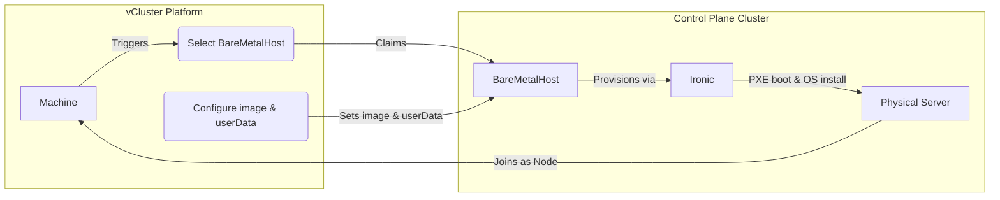

import Tabs from '@theme/Tabs';
import TabItem from '@theme/TabItem';
import FeatureTable from '@site/src/components/FeatureTable';
import Flow, {Step} from "@site/src/components/Flow";

<FeatureTable names="auto-nodes-metal3" />

The Metal3 provider allows you to provision bare metal servers as Machines using [Metal3](https://metal3.io/) and [Ironic](https://ironicbaremetal.org/).
When a Machine is requested, the platform claims an available `BareMetalHost` resource, configures it with the requested OS image and user data, and Ironic handles the PXE boot and OS installation on the physical server.

This enables you to offer different configurations of bare metal servers, all managed through BareMetalHost resources on a control plane cluster. Machines can be used as private nodes for tenant clusters or provisioned independently.



## Overview

The Metal3 provider works by selecting available BareMetalHost resources on a control plane cluster and provisioning them with an OS image and user data configuration.
Node types let you organize bare metal servers based on type, location, or other criteria. When a Machine is created, the platform:

1. Selects an available BareMetalHost matching the node type's label selector and resource requirements
2. Configures the BareMetalHost with the OS image, user data, and optional network configuration
3. Ironic provisions the server through a series of steps (power management, PXE boot, in-memory installer)
4. The server boots into the provisioned OS and is initialized

When the Machine is deleted, the platform powers the server off, removes the provisioned image and user data, restores the original network annotations, and returns the BareMetalHost to its original state, making it available for reuse.

## How it works: Provisioning

When a Machine is created, the platform provisions the bare metal server through the following steps:

1. The platform generates a user data configuration and stores it in a Kubernetes Secret on the control plane cluster.
2. The provider sets the BareMetalHost's `userData` reference to this Secret and the image information from the configured [OSImage](../../use-platform/machines/os-images.mdx) or direct image properties.
3. Ironic provisions the server through a series of steps: power management, PXE boot, and an in-memory installer that writes the OS to disk.
4. The server boots into the provisioned OS and is initialized with the user data configuration.

When a Machine is used as a private node for a tenant cluster, the user data includes registration scripts that automatically join the server to the tenant cluster.

## Infrastructure deployment

The Metal3 provider can deploy the required infrastructure components on the control plane cluster. Each component can be individually enabled and customized with Helm values. Metal3 and Ironic may also be managed yourself. Disable the respective component and the provider uses whatever is already deployed.

<Tabs>
<TabItem value="metal3" label="Metal3 & Ironic">

Bare metal provisioning and lifecycle management. Deploys the Bare Metal Operator, Ironic, an IPA image server, and MariaDB as separate workloads behind a cert-manager mTLS mesh.

:::note Requires cert-manager
The Bare Metal Operator uses admission webhooks and the components authenticate over mutual TLS, both of which require [cert-manager](https://cert-manager.io/) on the control plane cluster. Install cert-manager before enabling this component. The platform pre-checks for it and warns when it is missing.
:::

:::note How the components run
Ironic runs active/active: conductors shard host ownership over a consistent hash ring and coordinate through JSON-RPC between replicas. MariaDB is a single-replica StatefulSet. For highly available MariaDB, run your own and set `mariadb.mode: external`.
:::

**Helm values:**

| Value | Description | Default |
|---|---|---|
| `ironic.replicas` | Number of Ironic conductors. Values greater than `1` run them active/active. | `2` |
| `ironic.ipaAdvertiseIP` | Ironic LoadBalancer VIP advertised to the in-memory agent (IPA). Set it to enable real provisioning against physical hosts; empty keeps the Ironic API in-cluster only (for scale-out testing without a real host cycle). | `""` |
| `ironic.service` | Applied as the Ironic Service spec, so any field can be set (for example `type: LoadBalancer`, `loadBalancerClass`, and a nested `metadata` map for annotations and labels). `name`, `namespace`, `selector`, and `ports` are managed by the chart. Empty leaves a default ClusterIP Service. | `{}` |
| `ironic.image.repository` | Ironic container image | `quay.io/metal3-io/ironic` |
| `ironic.image.tag` | Ironic image tag | `release-35.0` |
| `ipaImages.replicas` | Replicas of the IPA image server that serves the IPA kernel and initramfs. | `2` |
| `mariadb.mode` | Database backend for Ironic: `statefulset` (single-replica managed MariaDB StatefulSet with its own PVC and cert-manager TLS) or `external` (connect to your own MariaDB). | `statefulset` |
| `mariadb.externalHost` | Host Ironic connects to in `external` mode. Ignored otherwise. | `""` |
| `mariadb.database` | Database name. | `ironic` |
| `mariadb.username` / `mariadb.password` | Credentials Ironic uses. In `statefulset` mode an unset password is generated on first install and preserved across upgrades. | `""` |
| `mariadb.caCertSecretName` / `mariadb.caCertSecretKey` | `external` mode only. Secret and key holding the CA certificate used to verify the external MariaDB over TLS. When set, Ironic connects over TLS. | `""` / `ca.crt` |
| `mariadb.persistence.size` | PVC size for the managed MariaDB in `statefulset` mode. | `10Gi` |
| `bareMetalOperator.image.repository` | Bare Metal Operator image | `quay.io/metal3-io/baremetal-operator` |
| `bareMetalOperator.image.tag` | Bare Metal Operator tag | `v0.13.1` |
| `ipaDownloader.image.repository` | IPA image downloader init container | `ghcr.io/loft-sh/vcluster-platform-ipa-images` |
| `ipaDownloader.image.tag` | IPA image downloader tag | `v0.2.2` |

Set `ironic.ipaAdvertiseIP` to the VIP of the Ironic LoadBalancer Service so bare metal hosts can reach the Ironic agent endpoint during provisioning:

```yaml
deploy:
  metal3:
    enabled: true
    helmValues: |
      ironic:
        replicas: 2
        ipaAdvertiseIP: 192.168.100.10
        service:
          type: LoadBalancer
```

For highly available MariaDB, run your own database and point Ironic at it:

```yaml
deploy:
  metal3:
    enabled: true
    helmValues: |
      mariadb:
        mode: external
        externalHost: mariadb.example.internal
        database: ironic
        username: ironic
        password: <MARIADB-PASSWORD>
```

</TabItem>
<TabItem value="dhcp" label="DHCP Server">

Handles PXE and HTTP Boot by acting as a proxy between bare metal servers and Ironic, which may reside in a different network. When the provider also deploys Metal3, the Ironic endpoint URLs configure automatically.

**Deployment fields (NodeProvider `metal3.deploy.dhcp`):**

| Field | Description | Default |
|---|---|---|
| `enabled` | Deploy the DHCP server. | `false` |
| `chartRepo` | Override the Helm chart repository. | `oci://ghcr.io/loft-sh/charts` |
| `chart` | Override the Helm chart name. | `vcluster-platform-dhcp-server` |
| `version` | Override the Helm chart version. | Bundled version |
| `helmValues` | Raw YAML passed as values to the chart. | — |

**Helm values:**

| Value | Description | Default |
|---|---|---|
| `image.registry` | Container image registry. | `ghcr.io` |
| `image.repository` | Container image repository. | `loft-sh/vcluster-platform-dhcp-server` |
| `image.tag` | Container image tag. | Chart app version |
| `image.pullPolicy` | Image pull policy. | `Always` |
| `imagePullSecrets` | Pull secrets for the image. | `[]` |
| `replicas` | Number of DHCP server replicas. Only supported with a DHCP relay in front of the server, since without one every replica answers the same broadcast. Replies are stateless (addresses come from the BareMetalHost, not a lease database), so any replica can serve any client. Incompatible with `networkAttachmentDefinition.enabled`; run under `hostNetwork` or plain pod networking. | `1` |
| `hostNetwork` | Run the pod on the host network. When `true`, the pod also runs as root and the Multus NetworkAttachmentDefinition is not attached. | `false` |
| `podAnnotations` / `podLabels` | Extra pod metadata. | `{}` |
| `resources` | Container resource requests and limits. | `{}` |
| `nodeSelector` / `tolerations` / `affinity` | Pod scheduling constraints. | `{}` / `[]` / `{}` |
| `securityContext` | Container security context. Overridden to `runAsUser: 0` when `hostNetwork` is `true`. | `NET_BIND_SERVICE` capability, `runAsNonRoot: true`, `runAsUser: 1000` |
| `extraArgs` | Extra arguments appended to the server binary. Use to set the IPA inspector and installer kernel parameters. | `[]` |
| `extraEnv` | Extra environment variables on the server container. | `[]` |
| `networkAttachmentDefinition.enabled` | Attach a Multus secondary interface so the pod sits on the provisioning L2 and can answer broadcast DHCP. Ignored under `hostNetwork`. Set to `false` for ordinary pod networking with no Multus dependency; this only works behind a DHCP relay, and you must set `dhcp.serverIP` and `http.advertiseUrl` to an address clients can reach (typically the `provisioningService` load balancer). | `true` |
| `networkAttachmentDefinition.vip` | Virtual IP with prefix for the DHCP server. Injected into the NetworkAttachmentDefinition under `ipam.static`. Ignored when `hostNetwork: true`. | `192.168.100.3/24` |
| `networkAttachmentDefinition.resourceName` | Device-plugin resource the NetworkAttachmentDefinition binds to, stamped as the `k8s.v1.cni.cncf.io/resourceName` annotation so Multus passes the allocated device ID to the CNI plugin (for SR-IOV or other device-plugin interfaces). Empty leaves the annotation off. | `""` |
| `networkAttachmentDefinition.config` | CNI configuration JSON for the NetworkAttachmentDefinition. Use `bridge` if control plane cluster nodes have a bridge attached to the provisioning network. Use `macvlan` if the bare metal servers are on the same network as the control plane cluster nodes. | bridge `br0` |
| `dhcp.serverIP` | IP the DHCP server advertises as itself. | `$(SERVER_IP)` (pod env) |
| `dhcp.port` | DHCP listen port. | `67` |
| `dhcp.listenAddr` | DHCP listen address. Set to `$(SERVER_IP):{{ .Values.dhcp.port }}` under `hostNetwork` to avoid answering on shared bridges. Rendered with `tpl`. | `0.0.0.0:67` |
| `tftp.port` | TFTP listen port. | `69` |
| `tftp.listenAddr` | TFTP listen address. Set to `""` to disable TFTP entirely (HTTP Boot still works). Rendered with `tpl`. | `$(SERVER_IP):69` |
| `http.port` / `http.listenAddr` / `http.advertiseUrl` | HTTP boot file server config. `advertiseUrl` is also the default for `proxy.apiAdvertiseUrl`. Rendered with `tpl`. | `8080` |
| `provisioningService.type` | Service type exposing the DHCP, TFTP, and HTTP ports so a DHCP relay can unicast to one address instead of relying on broadcast. Usually `LoadBalancer`. Empty leaves the Service out entirely. Needed for `replicas > 1`. | `""` |
| `provisioningService` (spec) | Interpreted as the Service spec, so any field can be set (`loadBalancerClass`, `externalTrafficPolicy`, and so on). A nested `metadata` map is lifted out and applied to the object's metadata. `ports` defaults to the DHCP, TFTP, and HTTP ports and may be overridden, but an override replaces the defaults wholesale, so it must repeat every port; `name`, `namespace`, and `selector` are always the chart's. | `{}` |
| `proxy.callbackPort` / `proxy.callbackListenAddr` / `proxy.callbackAdvertiseUrl` | IPA callback proxy config. Rendered with `tpl`. | `8081` |
| `proxy.apiAdvertiseUrl` | Ironic API base URL written into the IPA kernel parameters. Empty defaults to `http.advertiseUrl`, which routes IPA through this proxy. Set it to a reachable Ironic API root (a literal `IP:port`, not a cluster DNS name) to have IPA reach Ironic directly, which makes `proxy.ironicApiUrl` unnecessary. Rendered with `tpl`. | `""` |
| `proxy.ironicHttpUrl` | Ironic HTTP endpoint the proxy forwards image and boot-file requests to. Always required. | Auto-configured when Metal3 is enabled |
| `proxy.ironicApiUrl` | Ironic API endpoint the proxy forwards to. Optional when `proxy.apiAdvertiseUrl` is set. | Auto-configured when Metal3 is enabled |

**Server flags (via `extraArgs`):**

| Flag | Description |
|---|---|
| `--inspector-collectors` | Comma-separated list overriding the `ipa-inspection-collectors` kernel parameter in the inspector iPXE script. |
| `--inspector-extra-kernel-param` | Extra kernel parameter appended to the inspector iPXE script. May be specified multiple times. |
| `--installer-extra-kernel-param` | Extra kernel parameter appended to the installer iPXE script. May be specified multiple times. |
| `--callback-insecure-skip-verify` | Skip TLS verification when the callback proxy forwards to IPA. |
| `--api-advertise-url` | Ironic API base URL written into the IPA kernel parameters. Corresponds to `proxy.apiAdvertiseUrl`; defaults to the HTTP advertise URL. |
| `--leader-election-id` | Name of the Lease electing which replica manages the proxy certificate Secret. Required when `replicas > 1`, otherwise replicas race to create the Secret. The DHCP, TFTP, HTTP, and callback servers keep serving in every replica. |
| `--tftp-single-port` | EXPERIMENTAL. Serve every TFTP transfer from the listen port instead of a per-transfer ephemeral port, so replies survive Service NAT. Required when TFTP traffic is reached through a Service. Some client firmware may reject replies from port 69, so it is off by default. |

**Per-BareMetalHost DHCP annotations:**

The DHCP server reads these annotations from the matched `BareMetalHost` to build the DHCP reply.

| Annotation | Description |
|---|---|
| `metal3.vcluster.com/ip-address` | IPv4 address with prefix (CIDR) to lease. Required. |
| `metal3.vcluster.com/gateway` | Default gateway. If unset, the first host address in the `ip-address` CIDR is used. |
| `metal3.vcluster.com/dns-servers` | Comma-separated DNS servers. |
| `metal3.vcluster.com/ntp-servers` | Comma-separated NTP servers. |

Example with a bridge:

```yaml
deploy:
  dhcp:
    enabled: true
    helmValues: |
      networkAttachmentDefinition:
        vip: 192.168.100.2/24
        config: |
          {
            "cniVersion": "0.3.1",
            "type": "bridge",
            "bridge": "br0",
            "isDefaultGateway": false
          }
```

Example with macvlan (bare metal servers on the same network as the control plane cluster nodes):

```yaml
deploy:
  dhcp:
    enabled: true
    helmValues: |
      networkAttachmentDefinition:
        vip: 10.0.0.2/24
        config: |
          {
            "cniVersion": "0.3.1",
            "type": "macvlan",
            "master": "eth0",
            "mode": "bridge"
          }
```

Example with `hostNetwork` and custom IPA kernel parameters:

```yaml
deploy:
  dhcp:
    enabled: true
    helmValues: |
      hostNetwork: true
      dhcp:
        listenAddr: "$(SERVER_IP):67"
      extraArgs:
        - --inspector-extra-kernel-param=console=ttyS0,115200n8
        - --installer-extra-kernel-param=console=ttyS0,115200n8
```

#### High availability and DHCP relay

By default the DHCP server runs a single replica attached to the provisioning L2 through Multus, where it answers broadcast DHCP directly. This mode does not scale past one active answerer.

To run more than one replica, place a DHCP relay in front of the server and expose it through a Service:

- Set `replicas` greater than `1`.
- Set `provisioningService.type: LoadBalancer` so the relay has a single unicast target that also serves boot files.
- Point the relay at the `provisioningService` address, and set `dhcp.serverIP` and `http.advertiseUrl` to that same address so clients boot through the Service instead of from whichever replica answered.
- Set `--leader-election-id` (required for more than one replica) and add the experimental `--tftp-single-port` so TFTP replies survive the Service NAT.
- Disable Multus with `networkAttachmentDefinition.enabled: false`, since its static IPAM would hand the same VIP to every pod.

```yaml
deploy:
  dhcp:
    enabled: true
    helmValues: |
      replicas: 2
      networkAttachmentDefinition:
        enabled: false
      dhcp:
        serverIP: 192.168.100.20
      http:
        advertiseUrl: http://192.168.100.20:8080
      provisioningService:
        type: LoadBalancer
        metadata:
          annotations:
            metallb.universe.tf/loadBalancerIPs: 192.168.100.20
      extraArgs:
        - --leader-election-id=vcluster-platform-dhcp-server
        - --tftp-single-port
```

</TabItem>
<TabItem value="multus" label="Multus">

CNI plugin that enables attaching the DHCP server to a separate provisioning network.

**Helm values:**

| Value | Description | Default |
|---|---|---|
| `namespace` | Namespace to deploy Multus into | Provider namespace |
| `image.registry` | Container image registry | `ghcr.io` |
| `image.repository` | Container image repository | `k8snetworkplumbingwg/multus-cni` |
| `image.tag` | Container image tag | `snapshot-thick` |

```yaml
deploy:
  multus:
    enabled: true
    helmValues: |
      namespace: kube-system
```

</TabItem>
</Tabs>

The DHCP server is automatically configured based on BareMetalHost resources and platform IPAM when using network properties.

## Configuration

A Metal3 `NodeProvider` configuration consists of a cluster reference, optional infrastructure deployment settings, and a list of node types.

### Cluster reference

The `clusterRef` specifies the control plane cluster where the platform installs Metal3 components and where the BareMetalHost resources live. This cluster must be connected to vCluster Platform.

| Field | Description | Required |
|---|---|---|
| `clusterRef.cluster` | Name of the connected control plane cluster | Yes |
| `clusterRef.namespace` | Namespace on the control plane cluster for Metal3 components and BareMetalHost resources | Yes |

:::info Ironic network access
Ironic must have network access to the BMC addresses of the bare metal servers. Ensure the control plane cluster where Ironic is deployed can reach the BMC network (Redfish/IPMI endpoints).
:::

### Example

This configuration deploys Metal3, Ironic, the DHCP server, and Multus, and defines a single node type that selects BareMetalHosts with the label `role: compute`.

```yaml
apiVersion: management.loft.sh/v1
kind: NodeProvider
metadata:
  name: metal3-provider
spec:
  displayName: "Metal3 Bare Metal Provider"
  metal3:
    clusterRef:
      cluster: bare-metal-cluster
      namespace: metal3-system
    deploy:
      metal3:
        enabled: true
      dhcp:
        enabled: true
        helmValues: |
          networkAttachmentDefinition:
            vip: 192.168.100.2/24
      multus:
        enabled: true
        helmValues: |
          namespace: kube-system
    nodeTypes:
    - name: "compute-node"
      displayName: "Compute Node"
      resources:
        cpu: "32"
        memory: 128Gi
      bareMetalHosts:
        selector:
          matchLabels:
            role: compute
      properties:
        vcluster.com/os-image: ubuntu-noble
```

## Get started

This walkthrough covers the essential steps to go from a connected control plane cluster to a provisioned bare metal server.

<Flow>
<Step>
Apply the NodeProvider.

Create a NodeProvider that references your control plane cluster and defines at least one node type. The node type's label selector determines which BareMetalHosts it can claim.

```yaml
apiVersion: management.loft.sh/v1
kind: NodeProvider
metadata:
  name: metal3-provider
spec:
  displayName: "Metal3 Bare Metal Provider"
  metal3:
    clusterRef:
      cluster: bare-metal-cluster
      namespace: metal3-system
    deploy:
      metal3:
        enabled: true
      dhcp:
        enabled: true
    nodeTypes:
    - name: "compute-node"
      displayName: "Compute Node"
      resources:
        cpu: "32"
        memory: 128Gi
      bareMetalHosts:
        selector:
          matchLabels:
            role: compute
      properties:
        vcluster.com/os-image: ubuntu-noble
```

```bash
kubectl apply -f metal3-provider.yaml
```

Wait for Metal3 and Ironic to be running on the control plane cluster before creating BareMetalHost resources. The Metal3 webhook must be ready to validate them.
</Step>

<Step>
Create BMC credentials.

Create a Secret with the BMC username and password for your server. This Secret is referenced by the BareMetalHost resource.

```yaml
apiVersion: v1
kind: Secret
metadata:
  name: server-01-bmc
  namespace: metal3-system
type: Opaque
stringData:
  username: admin
  password: <BMC-PASSWORD>
```

```bash
kubectl apply -f server-01-bmc-secret.yaml
```
</Step>

<Step>
Create a BareMetalHost.

Register the physical server by creating a BareMetalHost resource. The `bmc.address` scheme determines which driver Metal3 uses (Redfish, IPMI, etc.). The `bootMACAddress` identifies the NIC used for PXE boot.

```yaml
apiVersion: metal3.io/v1alpha1
kind: BareMetalHost
metadata:
  name: server-01
  namespace: metal3-system
  labels:
    role: compute
spec:
  bmc:
    address: redfish://192.168.1.100
    credentialsName: server-01-bmc
    disableCertificateVerification: true
  bootMACAddress: "aa:bb:cc:dd:ee:01"
```

```bash
kubectl apply -f server-01-bmh.yaml
```

The server moves through `registering` and `inspecting` states as Metal3 verifies BMC access and collects hardware inventory.
</Step>

<Step>
Verify the server reaches available state.

Once the BareMetalHost passes inspection, it transitions to `available`. This means the server is registered, its hardware inventory is collected, and it is ready for provisioning.

```bash
kubectl get baremetalhost -n metal3-system
```

```text
NAME        STATE       CONSUMER   ONLINE   ERROR
server-01   available              true
```
</Step>

<Step>
Create a vCluster that claims the server.

Create a vCluster with private nodes configured to use the Metal3 provider. The platform provisions a Machine, which claims the BareMetalHost and installs the OS through Ironic.

```yaml
privateNodes:
  enabled: true
  autoNodes:
    - provider: metal3-provider
      static:
        - name: compute-nodes
          quantity: 1
          nodeTypeSelector:
            - property: vcluster.com/node-type
              value: compute-node
```

After provisioning completes, the server boots into the configured OS and joins the tenant cluster as a worker node.
</Step>
</Flow>

## Define node types

Each node type specifies which BareMetalHosts it can claim and what properties to apply during provisioning.

### Select BareMetalHosts by label

Use `bareMetalHosts.selector` to match BareMetalHosts by labels. Only hosts matching the selector and having sufficient resources are eligible.

```yaml
nodeTypes:
- name: "gpu-server"
  displayName: "GPU Server"
  resources:
    cpu: "64"
    memory: 256Gi
    nvidia.com/gpu: "4"
  bareMetalHosts:
    selector:
      matchLabels:
        role: gpu
        datacenter: us-east

- name: "general-compute"
  displayName: "General Compute"
  resources:
    cpu: "32"
    memory: 128Gi
  bareMetalHosts:
    selector:
      matchLabels:
        role: compute
```

## Configuration properties

Properties are key-value pairs on node types or Machines that control provisioning behavior.

### Image configuration

#### `vcluster.com/os-image`

**Type:** `string`

References an [OSImage](../../use-platform/machines/os-images.mdx) resource by name. The OSImage's properties are used to configure the image URL, checksum, and checksum type. This is the recommended way to configure OS images.

#### `metal3.vcluster.com/image-url`

**Type:** `string`
**Required:** Yes (if not using `vcluster.com/os-image`)

Direct URL to the OS image. Example: `https://cloud-images.ubuntu.com/noble/current/noble-server-cloudimg-amd64.img`

#### `metal3.vcluster.com/image-checksum`

**Type:** `string`
**Required:** Yes (if not using `vcluster.com/os-image`)

Checksum of the OS image for verification.

#### `metal3.vcluster.com/image-checksum-type`

**Type:** `string`

Checksum algorithm. Supported values: `md5`, `sha256`, `sha512`. If omitted, the type is auto-detected.

### Network configuration

#### `metal3.vcluster.com/network-cidr`

**Type:** `string` (standard CIDR notation)

Specifies the gateway IP and subnet for IP allocation. Use standard CIDR notation where the host portion is the gateway address. The platform allocates IPs from the resulting subnet using its built-in IPAM.

Example: `10.0.0.1/24`

#### `metal3.vcluster.com/network-ip-range`

**Type:** `string` (comma-separated IP ranges)

Specifies explicit IP ranges for allocation instead of CIDR-based allocation. Format: `IP1-IP2,IP3-IP4`

Example: `10.0.0.20-10.0.0.30,10.0.0.40-10.0.0.50`

#### `metal3.vcluster.com/dns-servers`

**Type:** `string` (comma-separated)

DNS servers to configure on the provisioned server. Example: `8.8.8.8,8.8.4.4`

#### `metal3.vcluster.com/network-data`

**Type:** `string`

Complete custom network-data configuration. When set, this overrides automatic network configuration from CIDR or IP range properties.

#### `vcluster.com/network-data-template-config`

**Type:** `string`

References a [MachineConfigTemplate](../../use-platform/machines/machine-config-templates.mdx) by name. The provider renders the template's `networkDataTemplate` into a cloud-init `network-config` document when `metal3.vcluster.com/network-data` is not set. See [Machine Config Templates](../../use-platform/machines/machine-config-templates.mdx) for the template syntax and available variables.

### Network environment

#### `vcluster.com/network-environment`

**Type:** `string`

Names the network environment, a [NodeEnvironment](./overview.mdx#node-environments) resource whose properties are merged into the NodeClaim's effective property set. The platform resolves this from the merged properties of NodeProvider, NodeType, and NodeClaim. When set, this property takes precedence over the typed `NodeClaim.spec.environmentRef` field.

### Server pinning

#### `metal3.vcluster.com/server-name`

**Type:** `string`

Pins a Machine to a specific BareMetalHost by name. This is useful when creating a Machine directly and you want to target a particular server. Set this property on the Machine, not on the node type.

### SSH and user data

#### `vcluster.com/ssh-keys`

**Type:** `string` (comma-separated)

References [SSHKey](../../use-platform/machines/ssh-keys.mdx) resources by name. The public keys are included in the user data during provisioning.

#### `vcluster.com/user-data`

**Type:** `string`

Custom cloud-init configuration merged with the generated user data. Accepts any valid cloud-config directives (`packages`, `write_files`, `runcmd`, etc.). The platform's provisioning commands are appended after any user-supplied `runcmd` entries.

Takes precedence over `vcluster.com/user-data-template-config`.

#### `vcluster.com/user-data-template-config`

**Type:** `string`

References a [MachineConfigTemplate](../../use-platform/machines/machine-config-templates.mdx) by name. The provider renders the template's `cloudInitTemplate` into a cloud-config document when `vcluster.com/user-data` is not set. See [Machine Config Templates](../../use-platform/machines/machine-config-templates.mdx) for the template syntax and available variables.

In all cases, the platform appends the vCluster join command and the resolved SSH keys to the cloud-config.

## Try it yourself

The [vCluster Bare Metal with KubeVirt](https://github.com/loft-sh/vcluster-bare-metal-with-kubevirt) guide lets you run the full Metal3 bare metal provisioning flow locally using KubeVirt VMs as fake bare metal servers. It sets up a [vind](/vcluster/deploy/control-plane/docker-container/basics) (vCluster in Docker) cluster with KubeVirt, a Metal3 NodeProvider, and simulated BareMetalHosts with Redfish BMC endpoints. No physical hardware is required.
