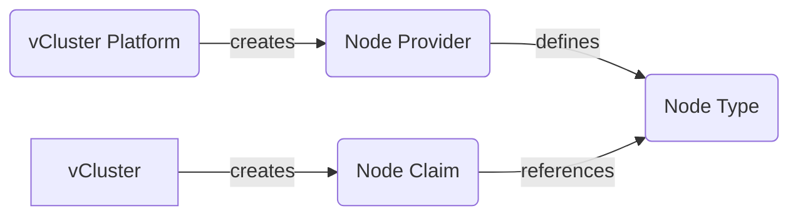
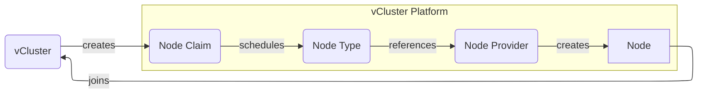
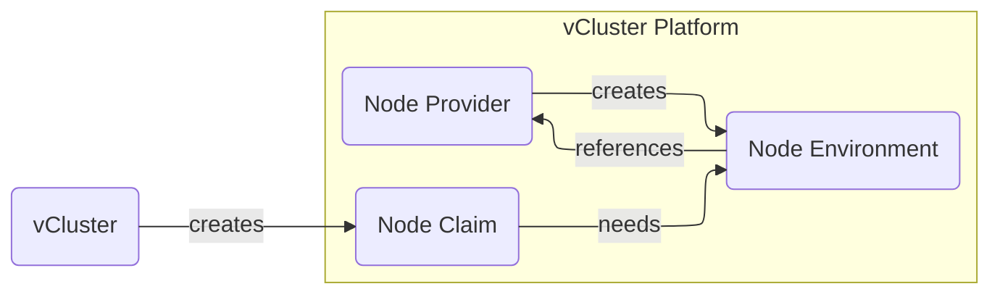

Nodes providers allow you to configure sources for private nodes for virtual clusters in an automatic fashion. The following supported node providers currently exist:
* [Terraform](./terraform.mdx) (powered by [OpenTofu](https://opentofu.org) under the hood)
* [KubeVirt](./kubevirt.mdx)
* [Nvidia Base Command Manager](./bcm.mdx)

Each node provider defines provider specific configuration and its node types, which then are used by the virtual clusters to choose from.
When a vCluster requests a new node it will create a new node claim, telling the platform to create a new node with the given requirements. The platform will then match these requirements to the cheapest available node type and consequentially create a new node from that type.

<br />


An example node provider with two distinct node types could look like this:
```yaml
apiVersion: management.loft.sh/v1
kind: NodeProvider
metadata:
  name: terraform-example
spec:
  terraform:
    nodeTemplate:
      git:
        repository: https://github.com/my-org/my-repo.git
    nodeTypes:
    - name: medium
      resources:
        cpu: "2"
        memory: 4Gi
      properties:
        instance-type: medium
    - name: large
      resources:
        cpu: "4"
        memory: 8Gi
      properties:
        instance-type: large
```

This would create a new node provider with a terraform node template. For each node claim the platform would execute the terraform script. The vCluster could then use this node provider via:
```yaml
# Use this in your vcluster.yaml
privateNodes:
  enabled: true
  autoNodes:
    dynamic:
    # This node pool automatically chooses the node type
    # to right size the amount of pods.
    - name: my-node-pool
      provider: terraform-example
```

:::info Single Node Provider many vCluster
You should not create a node provider per vCluster instead create a single node provider and use it among different vCluster.
:::

## Node types 

Node types are machine types that are chosen by vCluster based on its properties, resources and cost. 
Usually you would create a node type for each instance type you want to allow vCluster to choose from, for example this could be different VM sizes or different cloud instance types. 

vCluster will then choose automatically the best fitting node type based on its requirements. 
If there are no requirements or multiple node types match, the cheapest available node type will be selected.

### Properties

Properties on a node type are similar to labels and let users specify specific traits that can be later used to include or exclude certain node types when vCluster are created. Users can define their own custom properties while there are also in-built properties always available to use. 

#### Use properties

Within vCluster you can use properties via the `requirements` field under `autoNodes` node pools. These allow you to select properties and how node types should be included or excluded:
```yaml
# Inside your vcluster.yaml
privateNodes:
  enabled: true
  autoNodes:
    static:
      - name: my-static-pool
        provider: my-provider
        requirements:
        # Exact match
        - property: my-property
          value: my-value
        # One of
        - property: my-property
          operator: In
          values: ["value-1", "value-2", "value-3"]
        # Not in
        - property: my-property
          operator: NotIn
          values: ["value-1", "value-2", "value-3"]
        # Exists
        - property: my-property
          operator: Exists
        # NotExists
        - property: my-property
          operator: NotExists
```

The following operators are available (and similar to [Kubernetes set-based requirements](https://kubernetes.io/docs/concepts/overview/working-with-objects/labels/#set-based-requirement)):
* `In` (default): Matches one or multiple values on the node type
* `NotIn`: Matches if the given values aren't part of the properties
* `Exists`: Matches if the property is defined on the node type
* `NotExists`: Matches if the property is not defined on the node type

#### Custom properties

Custom properties can be defined via the `properties` field and map a certain key to one or multiple values. For example:
```yaml
...
kind: NodeProvider
...
spec:
  terraform:
    nodeTypes:
    - name: medium
      [...]
      properties:
        # Single value
        my-property: my-value
        # Multiple values
        my-property-multi: my-value-1,my-value-2
        # All values
        my-property-all: "*"
```

Keep in mind that property values need to adhere to the [syntax and character set of Kubernetes labels](https://kubernetes.io/docs/concepts/overview/working-with-objects/labels/#syntax-and-character-set) as they will be set as a label on the created nodes later on.

#### In-built properties

These properties will automatically be added by the platform and can be used as well:
* `vcluster.com/node-type`: The name of the node type to use. Makes it possible to map vCluster node pools to only use a specific node type. Since node type names are globally unique, they also always map to a single node provider.
* `node.kubernetes.io/instance-type`: Same as `vcluster.com/node-type`, but just the official Kubernetes label.
* `kubernetes.io/os`: Currently is always fixed to `linux`.
* `topology.kubernetes.io/zone`: Maps to the `spec.zone` field of the node type. If unspecified, will be `global`.
* `karpenter.sh/capacity-type`: Currently always `on-demand` as we don't distinguish between capacity types for now.

### Resources

Resources are a required field of node types and specify what computing resources a node of this type would have. Certain node providers (such as bcm or kubevirt) are able to auto discover resources, while others require you to specify at least `cpu` and `memory` for each node type.
Resources are specified according to the [Kubernetes resource units](https://kubernetes.io/docs/concepts/configuration/manage-resources-containers/#resource-units-in-kubernetes).

In addition you can also specify your own resources, such as `nvidia.com/gpu`, which then will be used for scheduling inside the vCluster as well. The platform will not schedule a node claim to a node type with custom resources, if these custom resources are not explicitly requested. In other words, if a vCluster doesn't request a GPU, no GPU node type will ever be provisioned for this vCluster, even if they are the only ones left.

### Cost

Each node type has an associated cost to it, either manually specified by the user via the `spec.cost` field or calculated based on the `resources`. The cost unit is on purpose unspecified, so it is not measured in a currency and instead just a value which will be used by vCluster and the platform to decide if a node type is cheaper than another node type if both could be selected.

By default, each resource has the following cost associated if not specified manually:
* Each `cpu` costs `10`
* Each GB of `memory` costs `2`
* Each other resource costs `10000` to avoid scheduling on these "expensive" resources. 

Karpenter will always try to find the cheapest node possible and automatically provision or deprovision nodes if costs change.

### Capacity

Capacity is the amount of available nodes for a given node type. Specifying this depends on the scenario, so for example for bare-metal it makes sense to have a limit of VMs or machines that are usable. 

Depending on the provider, this can be either set manually or is automatically discovered:
* *Terraform*: can be set via the `maxCapacity` field or otherwise unlimited
* *KubeVirt*: can be set via the `maxCapacity` field or otherwise unlimited
* *BCM*: is automatically discovered

If specified, the platform will keep track of how many nodes were already created of this type and eventually mark the node type as unavailable. vCluster will then not try to use this node type anymore until nodes are deprovisioned again.

## Node claims

When vCluster requests a new node for its cluster, either dynamically decided by [Karpenter](https://karpenter.sh/) or statically configured, vCluster will create a new node claim object in the platform with requirements. The platform will then decide based on these requirements which node type will fulfill the request. If multiple node types match the requirements, the cheapest available node type will be chosen.

<br />


## Node Environments

Node environments are created on a per vCluster basis based on the node provider and are optional. Certain node providers need to configure certain prerequisites once per vCluster before being able to create actual nodes for them.
For example, when thinking of a vCluster created in AWS via the terraform provider, you would want to create a VPC, routing tables, subnets etc. once before deploying the actual nodes.

Node environments are created in a lazy fashion, which means they are only created when actually needed. This usually means as soon as a node is selected for a specific provider the node environment is created before the first node once. As soon as the environment is available, the node creation process follows.

<br />

