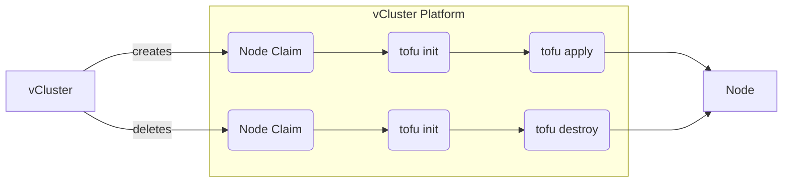
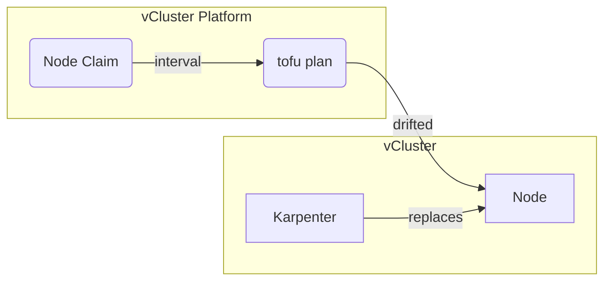

The terraform provider allows you to use Terraform scripts to automatically create [nodes](./overview.mdx) and [node environments](./overview.mdx). 
When a vCluster requests a new node, the platform will execute the specified Terraform script to create and join a node automatically into the vCluster. 
If the node or vCluster is later deleted, the platform will destroy the node via Terraform.

<br />


:::info OpenTofu
We use OpenTofu to execute the terraform scripts. We are currently working on a way to inject your own binary of regular terraform into the platform to use services like [Terraform Cloud](https://developer.hashicorp.com/terraform/cloud-docs)
:::

## Node Templates

Node templates are terraform scripts either defined inside the node provider object directly or referenced via git. 

:::tip Git
We recommend to use git for storing your Terraform node and node environment templates. This way you have a complete audit trail of who has changed what and you can even create multiple node providers based off different branches, tags or commits.
:::

### Use Git

When specified via git, the platform will fetch the repository and cache it locally until it is not needed anymore. It will check for changes based on the specified interval (default is 10 minutes).

The following example specifies how to use a repository at `https://github.com/my-org/my-user.git` to create a node:
```yaml
apiVersion: management.loft.sh/v1
kind: NodeProvider
metadata:
  name: terraform-example
spec:
  terraform:
    nodeTemplate:
      git:
        repository: https://github.com/my-org/my-repo.git
```

Besides `repository` you can use the following options for git:
* `branch`: branch to checkout
* `commit`: commit sha256 to checkout
* `subPath`: the path within the repository
* `username.secretName`, `username.secretNamespace` and `username.key` to specify the username for a private git repository
* `password.secretName`, `password.secretNamespace` and `password.key` to specify the password (or token) for a private git repository
* `fetchInterval`: specifies the interval to fetch the repository. Refetching only checks for remote changes but does not do a complete repull

### Use inline

As an alternative to git you can also specify the template inline in the node provider object.

The following example specifies a very simple inline template to create an AWS ec2 instance for a vCluster node:
```yaml
apiVersion: management.loft.sh/v1
kind: NodeProvider
metadata:
  name: terraform-example
spec:
  terraform:
    nodeTemplate:
      inline: |-
        terraform {
          required_version = ">= 1.5"
          required_providers {
            aws = {
              source  = "hashicorp/aws"
              version = ">= 5.0"
            }
          }
        }

        provider "aws" {
          region = var.vcluster.requirements["region"]
        }

        resource "aws_instance" "node" {
          ami                         = "my-ami"
          instance_type               = "my-instance-type"
          subnet_id                   = "my-subnet-id"
            vpc_security_group_ids    = ["my-security-group-id"]
            user_data                 = var.vcluster.userData
        }
```

### Available terraform vCluster variables

Besides the user-defined credentials specified below, the platform passes a `var.vcluster` object to each node script. The following values are available:
* `var.vcluster.name`: Name of the vCluster instance
* `var.vcluster.namespace`: Project namespace of the vCluster instance
* `var.vcluster.userData`: The [cloud-init script](https://cloud-init.io/) generated that should be passed to the instance to join the node into the vCluster
* `var.vcluster.requirements`: A key-value map of the specified and resolved requirements of the node claim
* `var.vcluster.instance`: Full virtual cluster instance object
* `var.vcluster.nodeClaim`: Full node claim object
* `var.vcluster.nodeType`: Full node type object
* `var.vcluster.nodeEnvironment.outputs`: If a node environment was specified for this provider, the defined outputs of the node environment

## Node types

[Node types](./overview.mdx) are used by vCluster and the platform to decide what exact machine type should get provisioned. 
Each node type can define their own node template or reuse the central node type under `spec.nodeType`. 
Properties of node types will be passed via the `var.vcluster.requirements` field to the Terraform script.

:::tip Properties
Use properties of node types to define custom terraform variables which can be used for info like instance type or region.
:::

An example could look like this:
```yaml
apiVersion: management.loft.sh/v1
kind: NodeProvider
metadata:
  name: terraform-example
spec:
  terraform:
    nodeTemplate:
      git:
        repository: https://github.com/my-org/my-repo.git
        subPath: generic
    nodeTypes:
    - name: medium
      resources:
        cpu: "2"
        memory: "4Gi"
      properties:
        instance-type: medium # can be accessed via 'var.vcluster.requirements["instance-type"]' inside terraform
    - name: large
      resources:
        cpu: "4"
        memory: "8Gi"
      properties:
        region: "*"               # allow all values for region
        cpu-generation: "old,new" # allow old or new as cpu-generation
      nodeTemplate:               # override the spec.terraform.nodeTemplate
        git:
          repository: https://github.com/my-org/my-repo.git
          subPath: large
```

### Max capacity

The node type field `maxCapacity` allows you to specify an upper limit of how many nodes should be created for the node type.

## Node environment template

[Node environments](./overview.mdx) can be configured similar to node templates either inline or via git. Each node environment will be created once per vCluster before the first node claim is provisioned. Only if a vCluster is using a node the provider a new node environment is provisioned.

The following example specifies a very simple inline template to create an AWS VPC instance for a vCluster:
```yaml
apiVersion: management.loft.sh/v1
kind: NodeProvider
metadata:
  name: terraform-example
spec:
  terraform:
    nodeEnvironmentTemplate:
      inline: |-
        terraform {
          required_version = ">= 1.5"
          required_providers {
            aws = {
              source  = "hashicorp/aws"
              version = ">= 5.0"
            }
          }
        }

        provider "aws" {
          region = var.vcluster.requirements["region"]
        }

        resource "aws_vpc" "vcluster" {
          cidr_block           = "10.0.0.0/16"
          enable_dns_support   = true
          enable_dns_hostnames = true
          tags = {
            Name = "${var.vcluster.name}-vpc"
          }
        }

        output "vpc_id" {
          value = aws_vpc.vcluster.id
        }
    nodeTemplate:
      inline: |-
        ...
```

The defined output `vpc_id` within the node environment can be accessed in the node template via `var.vcluster.nodeEnvironment.outputs["vpc_id"]`.

### Available terraform vCluster variables

Besides the user-defined credentials specified below, the platform passes a `var.vcluster` object to each node environment script. The following values are available:
* `var.vcluster.name`: Name of the vCluster
* `var.vcluster.namespace`: Project namespace of the vCluster
* `var.vcluster.requirements`: A key-value map of the specified and resolved requirements of the first node claim used to create this node environment
* `var.vcluster.instance`: Full virtual cluster instance object
* `var.vcluster.nodeEnvironment`: Full node environment object

## Credentials

Credentials to the Terraform scripts can be defined via Kubernetes secrets. The key and values of these secrets can then be passed as either environment variables or regular variables to the Terraform commands.

Within the vCluster you can select the credentials to use via the `terraform.vcluster.com/credentials` property. This allows you to specify different credentials for different teams or users and select the dynmically.

:::tip Dynamic Credentials
If possible we recommend to use [dynamic credentials](https://developer.hashicorp.com/terraform/tutorials/cloud/dynamic-credentials) for providers instead of long-living hardcoded credentials via Kubernetes secrets. Almost all Terraform providers support this and marks the additional configuration via Kubernetes secrets obsolete.
:::

### Environment variables secret

You can create a secret in the following form:
```yaml
apiVersion: v1
kind: Secret
metadata:
  name: aws-credentials
  namespace: any-namespace
  labels:
    terraform.vcluster.com/provider: my-node-provider
data:
  # Base64 encoded value
  AWS_ACCESS_KEY_ID: ...
  # Base64 
  AWS_SECRET_ACCESS_KEY: ...
```

This will lead to the platform passing the environment variables `AWS_ACCESS_KEY_ID` and `AWS_SECRET_ACCESS_KEY` to the `tofu init` and `tofu apply` commands.
 
### Terraform variables secret

You can create a secret in the following form:
```yaml
apiVersion: v1
kind: Secret
metadata:
  name: aws-credentials
  namespace: any-namespace
  annotations:
    terraform.vcluster.com/type: vars
  labels:
    terraform.vcluster.com/provider: my-node-provider
data:
  # Base64 encoded value
  aws_access_key_id: ...
  # Base64 
  aws_secret_access_key: ...
```

This will lead to the platform passing the Terraform variables `aws_access_key_id` and `aws_secret_access_key` to the `tofu init` and `tofu apply` commands via `-var aws_access_key_id=VALUE`.

## Terraform backend

By default, the platform will use the [Kubernetes backend](https://developer.hashicorp.com/terraform/language/backend/kubernetes) to store the state of the nodes and node environments in Kubernetes secrets in the `vcluster-platform` namespace. 
The platform will create a separate workspace per node and node environment in the following form:
* *Node*: `NODE_CLAIM_NAME.PROJECT_NAME.node`
* *Node Environment*: `NODE_ENVIRONMENT_NAME.PROJECT_NAME.env`

### Use a custom backend

The platform will parse the Terraform script files before initializing Terraform and search for `backend` blocks. If none is found, it will use the above described default backend. 
If it finds a user-defined `backend` it will not use the default backend and instead try to use the specified backend.

## Drift detection

Drift detection can be used to detect changes either in your Terraform scripts or on the cloud side (for example if someone deletes or changes a node directly).
The platform will run `tofu plan` on an interval for each configured node and node environment and detect changes. The default interval is 10 minutes.

<br />


If `tofu plan` reports a change, the platform will then mark the node or node environment as drifted:
* A drifted node will be replaced by Karpenter automatically by draining and then removing the node. It will then spin up a replacement automatically with the new values.
* A drifted node environment will be applied instead of replaced which then as a result may mark nodes as drifted if output variables have changed, e.g. a VPC is replaced, which then in turn leads to recreation of the nodes.

An example configuration could look like this:
```yaml
apiVersion: management.loft.sh/v1
kind: NodeProvider
metadata:
  name: terraform-example
spec:
  terraform:
    nodeTemplate:
      # Run tofu plan for every node every hour to detect changes
      driftDetection:
        enabled: true
        interval: 1h
      git:
        repository: https://github.com/my-org/my-repo.git
```

:::tip Small interval
Since for each node and node environment `tofu plan` is executed, make sure to not use a too small interval as this might cause overhead on the platform and backend.
:::

:::tip Temporary drift detection
You can also enable drift detection only temporarily or only for selected node types if you just made changes to a Terraform script to avoid additional overhead.
:::