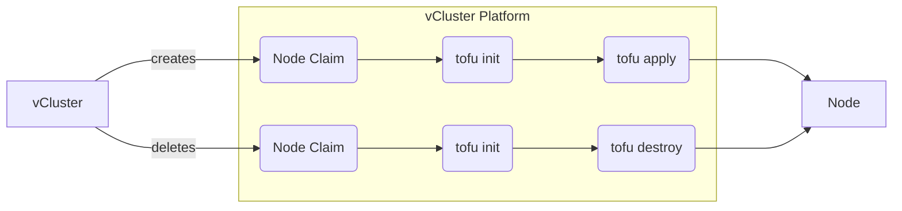

import FeatureTable from '@site/src/components/FeatureTable';

<FeatureTable names="auto-nodes-terraform" />


The terraform provider allows you to use Terraform scripts to automatically create [nodes](./overview.mdx) and the infrastructure behind [network environments](../../vmetal/concepts/network-environments.mdx). 
When a vCluster requests a new node, the platform will execute the specified Terraform script to create and join a node automatically into the vCluster. 
If the node or vCluster is later deleted, the platform will destroy the node using Terraform.

<br />

```mermaid
flowchart LR;
  vCluster

  subgraph two["vCluster Platform"]
  NodeClaimOne
  NodeClaimTwo
  InitOne
  InitTwo
  Apply
  Destroy
  end

  Node

  vCluster --->|creates| NodeClaimOne
  vCluster --->|deletes| NodeClaimTwo
  NodeClaimOne ---> InitOne
  InitOne ---> Apply
  NodeClaimTwo ---> InitTwo
  InitTwo ---> Destroy
  Apply ---> Node
  Destroy ---> Node

  InitOne("tofu init")
  InitTwo("tofu init")
  Apply("tofu apply")
  Destroy("tofu destroy")
  NodeClaimOne("Node Claim")
  NodeClaimTwo("Node Claim")
```

:::info OpenTofu
We use OpenTofu to execute the terraform scripts. We are currently working on a way to inject your own binary of regular terraform into the platform to use services like [Terraform Cloud](https://developer.hashicorp.com/terraform/cloud-docs)
:::

## Node Templates

Node templates are terraform scripts either defined inside the node provider object directly or referenced via git. 

:::tip Git
We recommend to use git for storing your Terraform node and network environment templates. This way you have a complete audit trail of who has changed what and you can even create multiple node providers based off different branches, tags or commits.
:::

### Use Git

When specified via git, the platform will fetch the repository and cache it locally until it is not needed anymore. It will check for changes based on the specified interval (default is 10 minutes).

The following example specifies how to use a repository at `https://github.com/my-org/my-user.git` to create a node:
```yaml
apiVersion: management.loft.sh/v1
kind: NodeProvider
metadata:
  name: terraform-example
spec:
  terraform:
    nodeTemplate:
      git:
        repository: https://github.com/my-org/my-repo.git
```

Besides `repository` you can use the following options for git:
* `branch`: branch to checkout
* `commit`: commit sha256 to checkout
* `subPath`: the path within the repository
* `username.secretName`, `username.secretNamespace` and `username.key` to specify the username for a private git repository
* `password.secretName`, `password.secretNamespace` and `password.key` to specify the password (or token) for a private git repository
* `fetchInterval`: specifies the interval to fetch the repository. Refetching only checks for remote changes but does not do a complete repull

### Use inline

As an alternative to git you can also specify the template inline in the node provider object.

The following example specifies a very simple inline template to create an AWS ec2 instance for a vCluster node:
```yaml
apiVersion: management.loft.sh/v1
kind: NodeProvider
metadata:
  name: terraform-example
spec:
  terraform:
    nodeTemplate:
      inline: |-
        terraform {
          required_version = ">= 1.5"
          required_providers {
            aws = {
              source  = "hashicorp/aws"
              version = ">= 5.0"
            }
          }
        }

        provider "aws" {
          region = var.vcluster.requirements["region"]
        }

        resource "aws_instance" "node" {
          ami                         = "my-ami"
          instance_type               = "my-instance-type"
          subnet_id                   = "my-subnet-id"
            vpc_security_group_ids    = ["my-security-group-id"]
            user_data                 = var.vcluster.userData
        }
```

### Use quick start templates

Terraform quick-start templates are available to automatically provision the required cloud infrastructure and deploy Kubernetes components such as the [Cloud Controller Manager (CCM)](https://kubernetes.io/docs/concepts/architecture/cloud-controller/) and [Container Storage Interface (CSI)](https://kubernetes.io/blog/2019/01/15/container-storage-interface-ga/).  
These components enable full cloud provider integration, ensuring that control-plane operations, storage provisioning, and networking features work seamlessly.  

With these templates, you can set up a fully functional environment with minimal manual effort.  

Currently supported providers:  

- [AWS](https://github.com/loft-sh/vcluster-auto-nodes-aws/tree/v0.1.0)  
- [Azure](https://github.com/loft-sh/vcluster-auto-nodes-azure/tree/v0.1.0)  
- [GCP](https://github.com/loft-sh/vcluster-auto-nodes-gcp/tree/v0.1.0)  

See the full [quick start deployment guide](/docs/vcluster/deploy/worker-nodes/private-nodes/auto-nodes/quick-start-templates) for more details.

### Available terraform vCluster variables

Besides the user-defined credentials specified below, the platform passes a `var.vcluster` object to each node script. The following values are available:
* `var.vcluster.name`: Name of the vCluster instance
* `var.vcluster.namespace`: Project namespace of the vCluster instance
* `var.vcluster.userData`: The [cloud-init script](https://cloud-init.io/) generated that should be passed to the instance to join the node into the vCluster
* `var.vcluster.requirements`: A key-value map of the specified and resolved requirements of the node claim
* `var.vcluster.instance`: Full cluster instance object
* `var.vcluster.nodeClaim`: Full node claim object
* `var.vcluster.nodeType`: Full node type object
* `var.vcluster.properties`: Merged properties from the NodeProvider, NodeType, NetworkEnvironment, and NodeClaim
* `var.vcluster.networkEnvironment.outputs`: If the node claim resolves a network environment, the outputs of its infrastructure template

## Node types

[Node types](./overview.mdx) are used by vCluster and the platform to decide what exact machine type should get provisioned. 
Each node type can define their own node template or reuse the central node type under `spec.nodeType`. 
<!-- vale off -->
Properties of node types will be passed via the `var.vcluster.requirements` field to the Terraform script.
<!-- vale on -->

:::tip Properties
Use properties of node types to define custom terraform variables which can be used for info like instance type or region.
:::

An example could look like this:
```yaml
apiVersion: management.loft.sh/v1
kind: NodeProvider
metadata:
  name: terraform-example
spec:
  terraform:
    nodeTemplate:
      git:
        repository: https://github.com/my-org/my-repo.git
        subPath: generic
    nodeTypes:
    - name: medium
      resources:
        cpu: "2"
        memory: "4Gi"
      properties:
        instance-type: medium # can be accessed via 'var.vcluster.requirements["instance-type"]' inside terraform
    - name: large
      resources:
        cpu: "4"
        memory: "8Gi"
      properties:
        region: "*"               # allow all values for region
        cpu-generation: "old,new" # allow old or new as cpu-generation
      nodeTemplate:               # override the spec.terraform.nodeTemplate
        git:
          repository: https://github.com/my-org/my-repo.git
          subPath: large
```

### Max capacity

The node type field `maxCapacity` allows you to specify an upper limit of how many nodes should be created for the node type.

## Network environment template

A network environment template provisions shared infrastructure, such as a VPC, for a [network environment](../../vmetal/concepts/network-environments.mdx).
Configure it inline or using git, the same way as node templates.
When the template is set, every node claim from this provider needs a network environment.

The platform provisions the infrastructure when you create a NetworkEnvironment that references the provider, not when the first node claim arrives.
It destroys the infrastructure when you delete the environment. Deletion waits while any node claim still uses the environment.

The following example specifies a simple inline template that creates an AWS VPC:

```yaml
apiVersion: management.loft.sh/v1
kind: NodeProvider
metadata:
  name: terraform-example
spec:
  terraform:
    networkEnvironmentTemplate:
      infrastructure:
        inline: |-
          terraform {
            required_version = ">= 1.5"
            required_providers {
              aws = {
                source  = "hashicorp/aws"
                version = ">= 5.0"
              }
            }
          }

          provider "aws" {
            region = var.vcluster.properties["region"]
          }

          resource "aws_vpc" "network" {
            cidr_block           = "10.0.0.0/16"
            enable_dns_support   = true
            enable_dns_hostnames = true
            tags = {
              Name = "${var.vcluster.name}-vpc"
            }
          }

          output "vpc_id" {
            value = aws_vpc.network.id
          }
    nodeTemplate:
      inline: |-
        ...
```

Then create a network environment that references the provider. It must be assigned to a Tenant, or reserved for the platform with an empty value:

```yaml
apiVersion: management.loft.sh/v1
kind: NetworkEnvironment
metadata:
  name: aws-network
  labels:
    tenant.vcluster.com/exclusive-to: ""
spec:
  providerRef: terraform-example
  properties:
    region: us-east-1
```

Node claims select it through the `vcluster.com/network-environment` property, or use the provider's default environment.
The node template reads the `vpc_id` output as `var.vcluster.networkEnvironment.outputs["vpc_id"]`.

:::warning Renamed template field and variable
Earlier releases used `spec.terraform.nodeEnvironmentTemplate`, a separate `kubernetes` template, and the `var.vcluster.nodeEnvironment` variable.
The field is now `networkEnvironmentTemplate`, and the variable is now `var.vcluster.networkEnvironment`. The old variable has no alias, so update templates that read it.
The `kubernetes` template is no longer supported.
:::

### Available network environment variables

Besides the user-defined credentials specified below, the platform passes a `var.vcluster` object to each network environment script. The following values are available:
* `var.vcluster.name`: Name of the network environment
* `var.vcluster.namespace`: Namespace of the platform, because network environments are cluster scoped
* `var.vcluster.properties`: Merged properties from the NodeProvider and the network environment
* `var.vcluster.nodeProvider`: Full node provider object
* `var.vcluster.networkEnvironment`: Full network environment object

## Credentials

Credentials to the Terraform scripts can be defined using Kubernetes secrets. The key and values of these secrets can then be passed as either environment variables or regular variables to the Terraform commands.

Within the vCluster you can select the credentials using the `terraform.vcluster.com/credentials` property. This allows you to specify different credentials for different teams or users and select the dynmically.

:::tip Dynamic Credentials
If possible we recommend to use [dynamic credentials](https://developer.hashicorp.com/terraform/tutorials/cloud/dynamic-credentials) for providers instead of long-living hardcoded credentials using Kubernetes secrets. Almost all Terraform providers support this and marks the additional configuration using Kubernetes secrets obsolete.
:::

### Environment variables secret

You can create a secret in the following form:
```yaml
apiVersion: v1
kind: Secret
metadata:
  name: aws-credentials
  namespace: any-namespace
  labels:
    terraform.vcluster.com/provider: my-node-provider
data:
  # Base64 encoded value
  AWS_ACCESS_KEY_ID: ...
  # Base64 
  AWS_SECRET_ACCESS_KEY: ...
```

This will lead to the platform passing the environment variables `AWS_ACCESS_KEY_ID` and `AWS_SECRET_ACCESS_KEY` to the `tofu init` and `tofu apply` commands.
 
### Terraform variables secret

You can create a secret in the following form:
```yaml
apiVersion: v1
kind: Secret
metadata:
  name: aws-credentials
  namespace: any-namespace
  annotations:
    terraform.vcluster.com/type: vars
  labels:
    terraform.vcluster.com/provider: my-node-provider
data:
  # Base64 encoded value
  aws_access_key_id: ...
  # Base64 
  aws_secret_access_key: ...
```

This will lead to the platform passing the Terraform variables `aws_access_key_id` and `aws_secret_access_key` to the `tofu init` and `tofu apply` commands using `-var aws_access_key_id=VALUE`.

## Terraform backend
By default, the platform will use the [Kubernetes backend](https://developer.hashicorp.com/terraform/language/backend/kubernetes) to store the state of the nodes and network environments in Kubernetes secrets in the `vcluster-platform` namespace. 
The platform will create a separate workspace per node and network environment in the following form:
* *Node*: `NODE_CLAIM_NAME.PROJECT_NAME.node`
* *Network environment*: `NETWORK_ENVIRONMENT_NAME.env`

### Use a custom backend

The platform will parse the Terraform script files before initializing Terraform and search for `backend` blocks. If none is found, it will use the above described default backend. 
If it finds a user-defined `backend` it will not use the default backend and instead try to use the specified backend.
