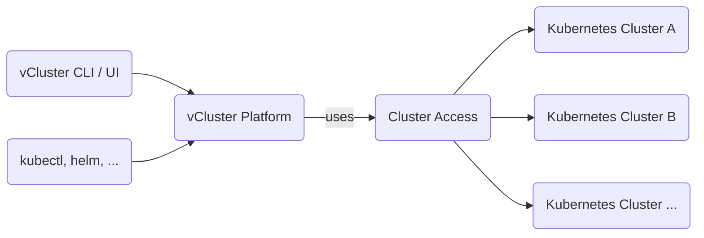

import NavStep from '@site/src/components/NavStep'
import Button from '@site/src/components/Button'
import Label from '@site/src/components/Label'
import Input from '@site/src/components/Input'
import Flow, { Step } from '@site/src/components/Flow'
import CreateSpaceStep1 from '@site/static/media/ui/screenshots/auth/login/login.png';
import CreateSpaceStep2 from '@site/static/media/ui/screenshots/spaces/create-space/button-open-drawer.png'
import PartialClusterAccessCreateUI from '../../../_partials/cluster/create-ui.mdx'

Cluster access allows you to give certain Users and Teams direct permission to a cluster without assigning them to a project. This is usually only useful for admin users or special privileged teams, while in all other cases you should prefer projects.

 

Cluster access lets you define access to certain clusters for your users or teams along with the cluster roles that would be synced for them in the connected cluster. You can create your own Cluster Access by following the below steps.

### Create a cluster access

<Flow id="create-clusteraccess-ui">
  <Step>
    Go to <NavStep>Infrastructure > Control Plane Clusters</NavStep>.
  </Step>
  <Step>
    Click the <NavStep>Cluster Access</NavStep> tab and then click <Button>Create Cluster Access</Button>.
  </Step>
  <Step>
    In the configuration sheet that opens, give the access a name by replacing the auto-generated placeholder name, or by updating the manifest YAML 'metadata.name' field.
  </Step>
  <Step>
    In the <Label>Options</Label> tab, choose the user or team to grant access from the <Label>Cluster Access</Label> selector, then choose the cluster role from the <Label>Cluster Roles</Label> selector.
  </Step>
  <Step>
    In the <Label>Clusters</Label> tab, choose the cluster to which the user or team should be granted access from the <Label>Select Clusters</Label> selector.
  </Step>
  <Step>
    In the <Label>Access</Label> tab, select the user or team that can manage this cluster access object, then choose their allowed permissions.
  </Step>
  <Step>
    Click <Button>Save Changes</Button> to create the cluster access.
  </Step>
</Flow>
