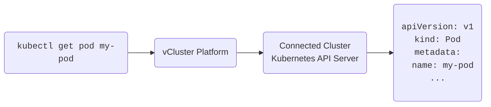

vCluster Platform lets you manage your virtual clusters and users across your Kubernetes clusters.

## vCluster features

vCluster Platform includes vCluster with enterprise features.

### Embedded etcd

The Managed Embedded Etcd feature in vCluster Platform allows you to enable an embedded managed etcd server instead of using the default SQLite backend or a custom managed external backend. This has the advantage of better performance as well as opens up the possibility to enable HA mode for k3s based vClusters.

### Kubernetes HA

The high availability feature in vCluster Platform allows you to run vCluster with the k3s distro in high-availability mode without an external datastore. High-Availability has the advantage, that if a replica should for what ever reason fail, another replica will jump in and take over without any downtime.

### Integrated CoreDNS

The Integrated CoreDNS feature in vCluster Platform combines the CoreDNS component within the vCluster syncer, allowing for a streamlined single-pod deployment containing all essential vCluster components instead of the usual two-pod setup. This simplifies deployment and can be enabled with custom configuration options.

### Cross-vCluster DNS

The Cross vCluster DNS feature allows you to add custom DNS rules to the vCluster to allow communication across services in separate vClusters as well as services deployed in the host cluster.

### Sync patches

The Sync Patches feature in vCluster Platform enables users to modify Kubernetes resources during synchronization just before they are applied to the Kubernetes API server, using a specified hook syntax.

### Isolated control plane

The Isolated Control Plane feature in vCluster Platform facilitates deploying the vCluster control plane in one Kubernetes cluster while running the actual workloads in a separate cluster, ensuring distinct separation of control and workload functions.

### Hardened security

vCluster Platform uses more secure, frequently updated base images and receives priority patches and communication about zero-day exploits before they are made public.

## Platform UI features

The vCluster Platform provides a robust UI that lets you connect your clusters, deploy virtual clusters, configure user access, and reduce operational costs.

### Projects

Projects are the highest organizational unit that vCluster Platform uses. They help logically group resources by team or division, and as a container to apply role based access controls (RBAC). Projects are central part of your vCluster Platform experience, so make sure to read more about them in the [Projects section]](/platform/projects/README.mdx).

### Clusters

vCluster Platform is installed into, and can connect to, as many physical Kubernetes clusters as you need to manage. vCluster Platform can then be used to manage workloads in each of the physical clusters, deploying spaces, virtual clusters, and apps as needed. vCluster Platform provides granular role based access control (RBAC) allowing for vCluster Platform administrators to limit which users and teams have access to which clusters, as well as much more granular control at the project, space, and virtual cluster levels. Read more about vCluster Platform integration with physical clusters in the [Clusters section ](/platform/clusters/README.mdx).

### Virtual Clusters

Virtual clusters are _virtual_ Kubernetes clusters. These virtual clusters run inside a namespace within the "parent" or "host" physical cluster, thereby allowing administrators to effectively create many Kubernetes instance in a single instance -- ideal for development, testing, and even production workloads. See the [Virtual Clusters section](/platform/virtual-clusters/README.mdx) for details.

### Apps

Apps allow users to define applications that users can then be empowered to deploy in clusters, spaces, and virtual clusters they have appropriate access to. The idea here is nothing new, however, vCluster Platform's Apps interface allows for easily packaging applications, and critically, exposing parameters that users can then select or input at deployment time. Apps can be specified via Kubernetes Manifests,
bash scripts, helm charts, etc. See the [Apps section](/platform/apps/README.mdx), and be sure to learn about [versioning](/platform/apps/versioning.mdx) and [parameters](/platform/apps/parameters.mdx).

### Cost Reduction Tools

vCluster Platform provides features to reduce Kubernetes costs.

- Sleep mode

  Put Kubernetes namespaces to sleep. vCluster Platform sets `replicas: 0` for all replica-controlled resources such as `Deployments` and `StatefulSets`. This means that Kubernetes will delete all pods but the entire configuration of resources within the namespace is still there. Sleep mode can be:

  - Invoked manually
  - Triggered by an inactivity timeout (no one has ran a `kubectl` command in this namespace for X
minutes)
  - Scheduled using a CRON syntax

- Auto delete inactive virtual clusters

  Configure an auto-delete for virtual clusters that have not been used for a certain period of time (inactivity). See [Sleep Mode](/platform/virtual-clusters/sleep-mode.mdx) for details.

- Inactivity Detection

  All requests that are made through vCluster Platform count as activity in the namespace.

  If your kube-context points to vCluster Platform's API server as a proxy before the actual connected cluster's API server, every `kubectl` request will be an activity and reset the inactivity timeout.
