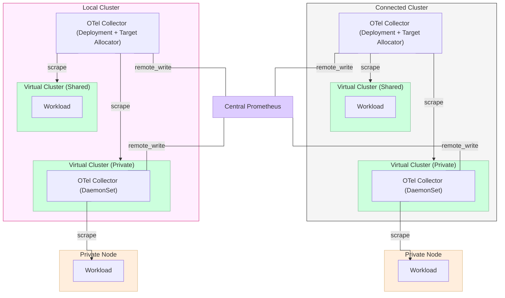

import Flow, { Step } from '@site/src/components/Flow'
import NavStep from '@site/src/components/NavStep'
import Button from '@site/src/components/Button'
import Tabs from '@theme/Tabs'
import TabItem from '@theme/TabItem'

This guide explains how to configure OpenTelemetry Collectors to collect
workload and control plane metrics from across multiple virtual clusters. All
metrics are enriched with vCluster identity labels at ingest time and pushed to
a central Prometheus via `remote_write`.

This architecture supports both the Shared Nodes and Private Nodes tenancy
models. Each model uses a different collector configuration deployed as a
vCluster Platform App.

:::warning
This guide isn't a production-ready monitoring solution that you can copy
directly to your infrastructure. Observability is highly specialized to the
underlying architecture. The goal is to lay out general capabilities and show
what's possible along with a stripped-down example architecture. Apply these patterns
with modifications to your actual use cases.
:::

## Architecture

<!-- vale off -->

<!-- vale on -->

The architecture comprises the following:

- Cluster architecture:
  - A local cluster that hosts vCluster Platform.
  - Two virtual clusters running on the local cluster:
    - One virtual cluster sharing the nodes of the local cluster (Shared Nodes tenancy model).
    - One virtual cluster with private nodes (Private Nodes tenancy model).
  - An external cluster connected to vCluster Platform.
  - Two virtual clusters running on the connected cluster with the same configuration.

- Collector architecture:
  - A central Prometheus with the remote write receiver enabled.
  - One OTel Collector Deployment with Target Allocator per host cluster (scrapes shared-nodes vClusters and their control planes via ServiceMonitors).
  - One OTel Collector DaemonSet per private-nodes vCluster (scrapes local kubelet, cAdvisor, and API server metrics from inside the vCluster).

## How it works

### Shared nodes

The shared-nodes collector runs on the host cluster as a Deployment with 2
replicas. A Target Allocator discovers vCluster ServiceMonitors and distributes
cAdvisor and ServiceMonitor scrape targets across replicas using
consistent-hashing.

**Metrics pipeline:**

```
prometheus receiver
    → memory_limiter
    → groupbyattrs        (split cAdvisor batch into per-pod resource scopes)
    → transform/pre_enrich (copy namespace/pod/node to k8s.* resource attributes)
    → k8sattributes       (resolve pod/namespace metadata, add vCluster labels)
    → filter/vcluster_only (drop metrics without vCluster identity)
    → resource/add_cluster (add cluster label from Platform variable)
    → transform            (copy resource attributes to datapoint attributes)
    → batch
    → prometheusremotewrite
```

The `groupbyattrs` processor is required because the Prometheus receiver batches
all cAdvisor metrics from a single node into one resource scope. Without it, the
`k8sattributes` processor matches one pod and applies its metadata to all
metrics in the batch, causing cross-contamination between vClusters on the same
node. The `groupbyattrs` processor splits the batch into per-pod resource scopes
(by `namespace`, `pod`, `node`) so each pod is matched correctly.

The `k8sattributes` processor resolves vCluster identity from Platform-managed
namespace labels (`loft.sh/project`, `loft.sh/vcluster-instance-name`, etc.) and
pod labels/annotations set by the vCluster syncer
(`vcluster.loft.sh/namespace`, `vcluster.loft.sh/name`).

The `filter/vcluster_only` processor drops any metrics where `vcluster.name` is
`nil` after enrichment. This means only vCluster workload metrics pass through,
which also prevents duplicate series with any existing Prometheus scrapes.

### Private nodes

The private-nodes collector runs inside each vCluster as a DaemonSet with one
pod per node. Each pod scrapes only its local node's kubelet `/metrics`,
cAdvisor `/metrics/cadvisor`, and API server `/metrics` endpoints.

**Metrics pipeline:**

```
prometheus receiver (kubelet, cAdvisor, API server)
    → memory_limiter
    → k8sattributes       (resolve pod metadata)
    → transform           (copy resource attributes to datapoint attributes)
    → batch
    → prometheusremotewrite
        + external_labels  (cluster, vcluster_name, project, user)
        + metric_relabel   (namespace → vcluster_virtual_namespace,
                            pod → vcluster_virtual_pod)
```

Since the collector runs inside the vCluster, it can't access host-cluster
namespace labels. Instead, the Platform injects `{{ .Values.loft.* }}` template
variables at deploy time, which are set as `external_labels` on the
`prometheusremotewrite` exporter. These are static per-vCluster values applied
to all exported metrics.

The `metric_relabel_configs` copy `namespace` to `vcluster_virtual_namespace`
and `pod` to `vcluster_virtual_pod`. Inside a private-nodes vCluster, the
`namespace` and `pod` labels already represent virtual names, so this copy
ensures dashboard compatibility with the shared-nodes collector.

## Metric labels

All metrics from both apps carry a consistent set of identity labels:

<!-- vale off -->
| Label | Shared nodes source | Private nodes source |
|-------|---------------------|----------------------|
| `cluster` | `resource/add_cluster` processor using `{{ .Values.loft.cluster }}` | `external_labels` using `{{ .Values.loft.cluster }}` |
| `vcluster_name` | `k8sattributes` from namespace label `loft.sh/vcluster-instance-name` | `external_labels` using `{{ .Values.loft.name }}` |
| `vcluster_project` | `k8sattributes` from namespace label `loft.sh/project` | `external_labels` using `{{ .Values.loft.project }}` |
| `vcluster_user` | `k8sattributes` from namespace label `loft.sh/user` | `external_labels` using `{{ .Values.loft.user.name }}` |
| `vcluster_project_namespace` | `k8sattributes` from namespace label `loft.sh/vcluster-instance-namespace` | `external_labels` using `{{ .Values.loft.space }}` |
| `vcluster_virtual_namespace` | `k8sattributes` from pod label `vcluster.loft.sh/namespace` | `metric_relabel_configs` copying `namespace` label |
| `vcluster_virtual_pod` | `k8sattributes` from pod annotation `vcluster.loft.sh/name` | `metric_relabel_configs` copying `pod` label |
<!-- vale on -->

:::info
`vcluster_virtual_namespace` and `vcluster_virtual_pod` are missing on some
metrics. These are vCluster system pods (syncer, CoreDNS) that don't have the
syncer labels and annotations because they aren't user workloads synced from
inside the vCluster.
:::

## Prerequisites

The central Prometheus must be configured as a remote write receiver. The
following Helm values enable this:

```yaml
server:
  extraFlags:
    - web.enable-remote-write-receiver
```

### Shared nodes prerequisites

- Prometheus Operator CRDs installed on the host cluster (`ServiceMonitor`,
  `PodMonitor`).
- Virtual clusters deployed with a ServiceMonitor enabled. This allows scraping
  their API server and controller metrics. Enable this in your `vcluster.yaml`:

  ```yaml
  controlPlane:
    serviceMonitor:
      enabled: true
  ```

- Kubelet scraping disabled in any existing kube-prometheus-stack to avoid
  duplicate cAdvisor series (`kubelet.enabled: false`).
- Platform namespace labels present (added automatically by the vCluster Platform).

### Private nodes prerequisites

- Virtual clusters with dedicated/private nodes.
- Node-to-node vCluster VPN enabled:

  ```yaml
  privateNodes:
    enabled: true
    vpn:
      enabled: true
      nodeToNode:
        enabled: true
  ```

<!-- vale off -->
## Deploy the shared nodes collector
<!-- vale on -->

Deploy one shared-nodes collector per host cluster. First, register the App
manifest with the Platform, then deploy it to each cluster through the UI.

<!-- vale off -->
### App manifest
<!-- vale on -->

The shared-nodes app deploys the
[`opentelemetry-kube-stack`](https://github.com/open-telemetry/opentelemetry-helm-charts/tree/main/charts/opentelemetry-kube-stack)
Helm chart (v0.14.4) with the following configuration:

<details>
<summary>otel-collector-shared-nodes-app.yaml</summary>

```yaml title="otel-collector-shared-nodes-app.yaml"
apiVersion: management.loft.sh/v1
kind: App
metadata:
  name: otel-collector-shared-nodes
spec:
  access:
  - users:
    - '*'
    verbs:
    - get
  config:
    chart:
      name: opentelemetry-kube-stack
      repoURL: https://open-telemetry.github.io/opentelemetry-helm-charts
      version: 0.14.4
    values: | # yaml
      ---
      clusterName: "{{ .Values.loft.cluster }}"
      crds:
        installPrometheus: false
      opentelemetry-operator:
        enabled: true
        manager:
          collectorImage:
            repository: otel/opentelemetry-collector-contrib
          featureGatesMap:
            operator.targetallocator.mtls: true
        admissionWebhooks:
          certManager:
            enabled: false
          autoGenerateCert:
            enabled: true
            recreate: true
      # Post-install job removes DELETE validation webhooks that block app uninstallation (operator bug).
      extraObjects:
      - apiVersion: v1
        kind: ServiceAccount
        metadata:
          name: patch-webhook-sa
          annotations:
            "helm.sh/hook": post-install,post-upgrade
            "helm.sh/hook-weight": "1"
            "helm.sh/hook-delete-policy": before-hook-creation,hook-succeeded
      - apiVersion: rbac.authorization.k8s.io/v1
        kind: ClusterRole
        metadata:
          name: otel-collector-shared-nodes-patch-webhook
          annotations:
            "helm.sh/hook": post-install,post-upgrade
            "helm.sh/hook-weight": "1"
            "helm.sh/hook-delete-policy": before-hook-creation,hook-succeeded
        rules:
        - apiGroups: ["admissionregistration.k8s.io"]
          resources: ["validatingwebhookconfigurations"]
          verbs: ["get", "patch"]
      - apiVersion: rbac.authorization.k8s.io/v1
        kind: ClusterRoleBinding
        metadata:
          name: otel-collector-shared-nodes-patch-webhook
          annotations:
            "helm.sh/hook": post-install,post-upgrade
            "helm.sh/hook-weight": "1"
            "helm.sh/hook-delete-policy": before-hook-creation,hook-succeeded
        subjects:
        - kind: ServiceAccount
          name: patch-webhook-sa
          namespace: otel
        roleRef:
          kind: ClusterRole
          name: otel-collector-shared-nodes-patch-webhook
          apiGroup: rbac.authorization.k8s.io
      - apiVersion: batch/v1
        kind: Job
        metadata:
          name: patch-webhook
          annotations:
            "helm.sh/hook": post-install,post-upgrade
            "helm.sh/hook-weight": "10"
            "helm.sh/hook-delete-policy": before-hook-creation,hook-succeeded
        spec:
          template:
            spec:
              restartPolicy: Never
              serviceAccountName: patch-webhook-sa
              containers:
              - name: patch
                image: "bitnami/kubectl:latest"
                command: ["bash", "-c"]
                args:
                - |
                  WH="otel-collector-shared-nodes-opentelemetry-operator-validation"
                  for i in $(seq 1 30); do kubectl get validatingwebhookconfiguration "$WH" >/dev/null 2>&1 && break; sleep 2; done
                  # Build JSON patch to remove webhooks with "delete" in name (reverse order to preserve indices)
                  PATCH=$(kubectl get validatingwebhookconfiguration "$WH" -o jsonpath='{range .webhooks[*]}{.name}{"\n"}{end}' \
                    | awk '/delete/{print NR-1}' | sort -rn \
                    | awk 'BEGIN{printf "["} NR>1{printf ","} {printf "{\"op\":\"remove\",\"path\":\"/webhooks/%d\"}",$1} END{printf "]"}')
                  [ "$PATCH" = "[]" ] && exit 0
                  echo "Removing DELETE webhooks: $PATCH"
                  kubectl patch validatingwebhookconfiguration "$WH" --type=json -p="$PATCH"
      collectors:
        # Disable the default DaemonSet collector
        daemon:
          enabled: false
        # Deployment-mode collector with Target Allocator
        cluster:
          enabled: true
          suffix: cluster
          mode: deployment
          replicas: 2
          resources:
            limits:
              memory: 1Gi
            requests:
              cpu: 250m
              memory: 512Mi
          livenessProbe:
            initialDelaySeconds: 15
            periodSeconds: 10
            failureThreshold: 5
          presets:
            kubernetesAttributes:
              enabled: true
          targetAllocator:
            enabled: true
            allocationStrategy: consistent-hashing
            prometheusCR:
              enabled: true
              serviceMonitorSelector:
                matchLabels:
                  app: vcluster
              podMonitorSelector: {}
          config:
            receivers:
              prometheus:
                config:
                  scrape_configs:
                    - job_name: 'kubelet-cadvisor'
                      scrape_interval: 60s
                      kubernetes_sd_configs:
                        - role: node
                      scheme: https
                      tls_config:
                        insecure_skip_verify: true
                      authorization:
                        credentials_file: /var/run/secrets/kubernetes.io/serviceaccount/token
                      metrics_path: /metrics/cadvisor
                      relabel_configs:
                        - source_labels: [__meta_kubernetes_node_address_InternalIP]
                          target_label: __address__
                          replacement: '$$1:10250'
                        - action: labelmap
                          regex: __meta_kubernetes_node_label_(.+)
                        - source_labels: [__meta_kubernetes_node_name]
                          target_label: node
            processors:
              groupbyattrs:
                keys:
                - namespace
                - pod
                - node
              transform/pre_enrich:
                error_mode: ignore
                metric_statements:
                - context: resource
                  statements:
                  - 'set(attributes["k8s.namespace.name"], attributes["namespace"]) where attributes["namespace"] != nil'
                  - 'set(attributes["k8s.pod.name"], attributes["pod"]) where attributes["pod"] != nil'
                  - 'set(attributes["k8s.node.name"], attributes["node"]) where attributes["node"] != nil'
              k8sattributes:
                auth_type: serviceAccount
                passthrough: false
                extract:
                  metadata:
                  - k8s.namespace.name
                  - k8s.pod.name
                  - k8s.pod.start_time
                  - k8s.pod.uid
                  - k8s.deployment.name
                  - k8s.node.name
                  - k8s.container.name
                  labels:
                  # Pod labels - vcluster syncer adds these to synced pods
                  - tag_name: vcluster.virtual.namespace
                    key: vcluster.loft.sh/namespace
                    from: pod
                  # Namespace labels - platform adds these to vcluster namespaces
                  - tag_name: vcluster.project
                    key: loft.sh/project
                    from: namespace
                  - tag_name: vcluster.project.namespace
                    key: loft.sh/vcluster-instance-namespace
                    from: namespace
                  - tag_name: vcluster.user
                    key: loft.sh/user
                    from: namespace
                  - tag_name: vcluster.name
                    key: loft.sh/vcluster-instance-name
                    from: namespace
                  annotations:
                  # Pod annotations - identifies the virtual pod name
                  - tag_name: vcluster.virtual.pod
                    key: vcluster.loft.sh/name
                    from: pod
              transform:
                error_mode: ignore
                metric_statements:
                - context: datapoint
                  statements:
                  - 'set(attributes["k8s.node.name"], resource.attributes["k8s.node.name"])'
                  - 'set(attributes["k8s.pod.name"], resource.attributes["k8s.pod.name"])'
                  - 'set(attributes["k8s.namespace.name"], resource.attributes["k8s.namespace.name"])'
                  - 'set(attributes["vcluster.virtual.pod"], resource.attributes["vcluster.virtual.pod"])'
                  - 'set(attributes["vcluster.virtual.namespace"], resource.attributes["vcluster.virtual.namespace"])'
                  - 'set(attributes["vcluster.project"], resource.attributes["vcluster.project"])'
                  - 'set(attributes["vcluster.project.namespace"], resource.attributes["vcluster.project.namespace"])'
                  - 'set(attributes["vcluster.user"], resource.attributes["vcluster.user"])'
                  - 'set(attributes["vcluster.name"], resource.attributes["vcluster.name"])'
              filter/vcluster_only:
                metrics:
                  datapoint:
                  - 'resource.attributes["vcluster.name"] == nil'
              resource/add_cluster:
                attributes:
                - action: upsert
                  key: cluster
                  value: "{{ .Values.loft.cluster }}"
              memory_limiter:
                check_interval: 1s
                limit_percentage: 75
                spike_limit_percentage: 15
              batch:
                send_batch_size: 10000
                send_batch_max_size: 10000
                timeout: 10s
            exporters:
              prometheusremotewrite:
                endpoint: '{{ .Values.prometheus.endpoint }}/api/v1/write'
      {{- if and .Values.prometheus.username .Values.prometheus.password }}
                auth:
                  authenticator: basicauth/prw
      {{- end }}
                tls:
                  insecure_skip_verify: {{ .Values.prometheus.insecure }}
                resource_to_telemetry_conversion:
                  enabled: true
            extensions:
              health_check:
                endpoint: 0.0.0.0:13133
      {{- if and .Values.prometheus.username .Values.prometheus.password }}
              basicauth/prw:
                client_auth:
                  username: "{{ .Values.prometheus.username }}"
                  password: "{{ .Values.prometheus.password }}"
      {{- end }}
            service:
              extensions:
              - health_check
      {{- if and .Values.prometheus.username .Values.prometheus.password }}
              - basicauth/prw
      {{- end }}
              pipelines:
                metrics:
                  receivers:
                  - prometheus
                  processors:
                  - memory_limiter
                  - groupbyattrs
                  - transform/pre_enrich
                  - k8sattributes
                  - filter/vcluster_only
                  - resource/add_cluster
                  - transform
                  - batch
                  exporters:
                  - prometheusremotewrite
  defaultNamespace: monitoring
  displayName: OTEL Collector - Shared Nodes
  icon: https://opentelemetry.io/img/logos/opentelemetry-logo-nav.png
  parameters:
  - description: The Prometheus remote write endpoint (without /api/v1/write suffix)
    label: Prometheus Endpoint
    required: true
    variable: prometheus.endpoint
  - description: Username for basic auth (optional)
    label: Prometheus Username
    variable: prometheus.username
  - description: Password for basic auth (optional)
    label: Prometheus Password
    type: password
    variable: prometheus.password
  - description: Skip TLS verification for the connection to Prometheus
    label: Prometheus Skip TLS Verification
    type: boolean
    variable: prometheus.insecure
  recommendedApp:
  - cluster
```

</details>

:::info Key configuration details
- **Deployment mode with Target Allocator**: A Deployment with 2 replicas and
  `consistent-hashing` allocation is more resource-efficient than a DaemonSet.
  Since the `prometheus` receiver is used (not `kubeletstats`), there's no need
  for local-node scraping.
- **`serviceMonitorSelector: app: vcluster`**: Without filtering, the Target
  Allocator discovers all ServiceMonitors in the cluster, overwhelming
  collectors with memory pressure.
- **`operator.targetallocator.mtls: true`**: Each vCluster exposes its API
  server metrics over mTLS. Without this feature gate, the Target Allocator
  redacts TLS private keys when passing scrape configs to collectors.
- **`otel/opentelemetry-collector-contrib` image**: The default image doesn't
  include the `prometheusremotewrite` exporter.
:::

### Register the app

Apply the App manifest to the management API so that it becomes available in the
Platform UI:

```bash
kubectl apply -f otel-collector-shared-nodes-app.yaml
```

### Deploy to a cluster

<Flow id="deploy-otel-shared">
  <Step>
    Go to the <NavStep>Infra</NavStep> section using the menu on the left, and
    select the <NavStep>Clusters</NavStep> view.
  </Step>
  <Step>
    Click on the cluster where you want to deploy the collector.
  </Step>
  <Step>
    Navigate to the <NavStep>Apps</NavStep> tab.
  </Step>
  <Step>
    Click <Button>Deploy App</Button> and select the
    **OTEL Collector - Shared Nodes** app.
  </Step>
  <Step>
    Configure the following parameters and click <Button>Install</Button>.
  </Step>
</Flow>

| Parameter | Required | Description |
|-----------|----------|-------------|
| Prometheus Endpoint | Yes | Remote write URL (without `/api/v1/write` suffix) |
| Prometheus Username | No | Basic auth username |
| Prometheus Password | No | Basic auth password |
| Prometheus Skip TLS Verification | No | Skip TLS verification for the Prometheus connection |

:::info
Repeat these steps for each host cluster.
:::

<!-- vale off -->
## Deploy the private nodes collector
<!-- vale on -->

Deploy one private-nodes collector into each private-nodes vCluster. All
vCluster identity labels are injected automatically by the Platform via
`{{ .Values.loft.* }}`.

<!-- vale off -->
### App manifest
<!-- vale on -->

The private-nodes app deploys the
[`opentelemetry-collector`](https://github.com/open-telemetry/opentelemetry-helm-charts/tree/main/charts/opentelemetry-collector)
Helm chart (v0.144.0) with the following configuration:

<details>
<summary>otel-collector-private-nodes-app.yaml</summary>

```yaml title="otel-collector-private-nodes-app.yaml"
apiVersion: management.loft.sh/v1
kind: App
metadata:
  name: otel-collector-private-nodes
spec:
  access:
  - users:
    - '*'
    verbs:
    - get
  config:
    chart:
      name: opentelemetry-collector
      repoURL: https://open-telemetry.github.io/opentelemetry-helm-charts
      version: 0.144.0
    values: | # yaml
      ---
      mode: daemonset
      image:
        repository: otel/opentelemetry-collector-contrib
      presets:
        kubeletMetrics:
          enabled: false
        kubernetesAttributes:
          enabled: true
      service:
        enabled: true
      # Explicitly inject node name for local-only scraping
      extraEnvs:
        - name: K8S_NODE_NAME
          valueFrom:
            fieldRef:
              fieldPath: spec.nodeName
      clusterRole:
        rules:
        - apiGroups: [""]
          resources: ["nodes", "nodes/metrics", "nodes/proxy", "services", "endpoints", "pods", "namespaces"]
          verbs: ["get", "list", "watch"]
        - apiGroups: ["apps"]
          resources: ["replicasets"]
          verbs: ["get", "list", "watch"]
        - apiGroups: ["extensions"]
          resources: ["replicasets"]
          verbs: ["get", "list", "watch"]
        - apiGroups: [""]
          resources: ["nodes/stats"]
          verbs: ["get", "list", "watch"]
        - nonResourceURLs: ["/metrics", "/metrics/cadvisor"]
          verbs: ["get"]
      config:
      {{- if and .Values.prometheus.username .Values.prometheus.password }}
        extensions:
          basicauth/prw:
            client_auth:
              username: "{{ .Values.prometheus.username }}"
              password: "{{ .Values.prometheus.password }}"
      {{- end }}
        receivers:
          prometheus:
            config:
              scrape_configs:
                - job_name: 'kubelet'
                  scrape_interval: 60s
                  kubernetes_sd_configs:
                    - role: node
                  scheme: https
                  tls_config:
                    insecure_skip_verify: {{ .Values.prometheus.insecure }}
                  authorization:
                    credentials_file: /var/run/secrets/kubernetes.io/serviceaccount/token
                  relabel_configs:
                    # Only scrape the node this pod is running on
                    - source_labels: [__meta_kubernetes_node_name]
                      regex: '${env:K8S_NODE_NAME}'
                      action: keep
                    - source_labels: [__meta_kubernetes_node_address_InternalIP]
                      target_label: __address__
                      replacement: '$$1:10250'
                    - action: labelmap
                      regex: __meta_kubernetes_node_label_(.+)
                    - source_labels: [__meta_kubernetes_node_name]
                      target_label: node
                  metric_relabel_configs:
                    - source_labels: [namespace]
                      target_label: vcluster_virtual_namespace
                    - source_labels: [pod]
                      target_label: vcluster_virtual_pod

                - job_name: 'kubelet-cadvisor'
                  scrape_interval: 60s
                  kubernetes_sd_configs:
                    - role: node
                  scheme: https
                  tls_config:
                    insecure_skip_verify: {{ .Values.prometheus.insecure }}
                  authorization:
                    credentials_file: /var/run/secrets/kubernetes.io/serviceaccount/token
                  metrics_path: /metrics/cadvisor
                  relabel_configs:
                    # Only scrape the node this pod is running on
                    - source_labels: [__meta_kubernetes_node_name]
                      regex: '${env:K8S_NODE_NAME}'
                      action: keep
                    - source_labels: [__meta_kubernetes_node_address_InternalIP]
                      target_label: __address__
                      replacement: '$$1:10250'
                    - action: labelmap
                      regex: __meta_kubernetes_node_label_(.+)
                    - source_labels: [__meta_kubernetes_node_name]
                      target_label: node
                  metric_relabel_configs:
                    - source_labels: [namespace]
                      target_label: vcluster_virtual_namespace
                    - source_labels: [pod]
                      target_label: vcluster_virtual_pod

                - job_name: 'apiserver'
                  scrape_interval: 60s
                  kubernetes_sd_configs:
                    - role: endpoints
                      namespaces:
                        names: ['default']
                  scheme: https
                  tls_config:
                    ca_file: /var/run/secrets/kubernetes.io/serviceaccount/ca.crt
                    insecure_skip_verify: {{ .Values.prometheus.insecure }}
                  authorization:
                    credentials_file: /var/run/secrets/kubernetes.io/serviceaccount/token
                  relabel_configs:
                    - source_labels: [__meta_kubernetes_service_name, __meta_kubernetes_endpoint_port_name]
                      action: keep
                      regex: kubernetes;https
        processors:
          k8sattributes:
            auth_type: 'serviceAccount'
            extract:
              metadata:
              - k8s.namespace.name
              - k8s.pod.name
              - k8s.pod.start_time
              - k8s.pod.uid
              - k8s.deployment.name
              - k8s.node.name
          transform:
            error_mode: ignore
            metric_statements:
            - context: datapoint
              statements:
              - 'set(attributes["k8s.node.name"], resource.attributes["k8s.node.name"])'
              - 'set(attributes["k8s.pod.name"], resource.attributes["k8s.pod.name"])'
              - 'set(attributes["k8s.namespace.name"], resource.attributes["k8s.namespace.name"])'
          memory_limiter:
            check_interval: 1s
            limit_percentage: 75
            spike_limit_percentage: 15
          batch:
            send_batch_size: 10000
            timeout: 10s
        exporters:
          prometheusremotewrite:
            endpoint: '{{ .Values.prometheus.endpoint }}/api/v1/write'
      {{- if and .Values.prometheus.username .Values.prometheus.password }}
            auth:
              authenticator: basicauth/prw
      {{- end }}
            tls:
              insecure_skip_verify: {{ .Values.prometheus.insecure }}
            # Use external_labels for loft labels (simpler than attributes processor for remote write)
            external_labels:
              cluster: "{{ .Values.loft.cluster }}"
              vcluster_name: "{{ .Values.loft.name }}"
              vcluster_project: "{{ .Values.loft.project }}"
              vcluster_project_namespace: "{{ .Values.loft.space }}"
              vcluster_user: "{{ .Values.loft.user.name }}"
            # Disable resource to telemetry conversion to avoid duplicate labels
            resource_to_telemetry_conversion:
              enabled: false
        service:
          extensions:
          - health_check
      {{- if and .Values.prometheus.username .Values.prometheus.password }}
          - basicauth/prw
      {{- end }}
          pipelines:
            metrics:
              receivers:
              - prometheus
              processors:
              - memory_limiter
              - k8sattributes
              - transform
              - batch
              exporters:
              - prometheusremotewrite
  defaultNamespace: monitoring
  description: |
    OpenTelemetry Collector for private/dedicated node vCluster monitoring.
    Deploys a DaemonSet-mode collector inside the vCluster, scraping kubelet,
    cAdvisor, and API server metrics from each node.
  displayName: OTEL Collector - Private Nodes
  icon: https://opentelemetry.io/img/logos/opentelemetry-logo-nav.png
  parameters:
  - description: The Prometheus endpoint to push metrics to
    label: Prometheus Endpoint
    required: true
    variable: prometheus.endpoint
  - description: The Prometheus username
    label: Prometheus Username
    variable: prometheus.username
  - description: The password to access Prometheus
    label: Prometheus Password
    type: password
    variable: prometheus.password
  - description: Skip TLS verification for the connection to Prometheus
    label: Prometheus Skip TLS Verification
    type: boolean
    variable: prometheus.insecure
  recommendedApp:
  - virtualcluster
```

</details>

:::info Key configuration details
- **DaemonSet mode**: Private-nodes vClusters have dedicated nodes. A DaemonSet
  ensures one collector per node, scraping only the local kubelet and cAdvisor
  via `${env:K8S_NODE_NAME}` filtering. No Target Allocator is needed.
- **`external_labels` instead of `k8sattributes` for identity**: The collector
  runs inside the vCluster, so it can't access host-cluster namespace labels.
  The Platform injects `{{ .Values.loft.* }}` template variables at deploy time.
- **`resource_to_telemetry_conversion: false`**: Setting this to `true` causes
  duplicate labels that break Grafana dashboards.
- **`metric_relabel_configs` for virtual namespace/pod**: Since
  `resource_to_telemetry_conversion` is disabled, OTel transform processor
  attributes don't reach the exported Prometheus labels. The relabel configs copy
  `namespace` and `pod` to `vcluster_virtual_namespace` and
  `vcluster_virtual_pod` at scrape time.
:::

### Register the app

Apply the App manifest to the management API so that it becomes available in the
Platform UI:

```bash
kubectl apply -f otel-collector-private-nodes-app.yaml
```

### Deploy to a virtual cluster

<Flow id="deploy-otel-private">
  <Step>
    Go to the <NavStep>Projects</NavStep> section using the menu on the left.
  </Step>
  <Step>
    Select the project containing your private-nodes virtual cluster.
  </Step>
  <Step>
    Click on the virtual cluster, then navigate to the <NavStep>Config</NavStep>
    tab.
  </Step>
  <Step>
    Scroll down to the **Apps & Objects** section and add the
    **OTEL Collector - Private Nodes** app.
  </Step>
  <Step>
    Configure the following parameters and click <Button>Save</Button>.
  </Step>
</Flow>

| Parameter | Required | Description |
|-----------|----------|-------------|
| Prometheus Endpoint | Yes | Remote write URL (without `/api/v1/write` suffix) |
| Prometheus Username | No | Basic auth username |
| Prometheus Password | No | Basic auth password |
| Prometheus Skip TLS Verification | No | Skip TLS verification for the Prometheus connection |

:::info
Repeat these steps for each private-nodes virtual cluster.
:::

<!-- vale off -->
## Golden signals queries
<!-- vale on -->

With the collectors deployed and forwarding metrics to the central Prometheus,
you can query the aggregated data. This section provides PromQL queries
organized around the
[Four Golden Signals](https://sre.google/sre-book/monitoring-distributed-systems/)
of monitoring: latency, traffic, errors, and saturation.

Because identity labels are enriched at ingest time, every query can filter and
aggregate by `cluster`, `vcluster_project`, and `vcluster_name` directly.

### Latency

<!-- vale off -->
#### kube-apiserver request latency (p99, by verb)
<!-- vale on -->

```promql
histogram_quantile(0.99,
  sum by (le, verb, cluster, vcluster_project, vcluster_name) (
    rate(apiserver_request_duration_seconds_bucket{vcluster_name!=""}[5m])
  )
)
```

**Why:** Shows the tail latency of API server requests broken down by operation
type (GET, LIST, PUT, POST, PATCH, DELETE, WATCH). The p99 captures outliers
that averages hide. WATCH is expected to show 60s (long-poll).

<!-- vale off -->
#### kube-apiserver request latency (p95, non-WATCH)
<!-- vale on -->

```promql
histogram_quantile(0.95,
  sum by (le, verb, cluster, vcluster_project, vcluster_name) (
    rate(apiserver_request_duration_seconds_bucket{verb!~"WATCH|CONNECT", vcluster_name!=""}[5m])
  )
)
```

**Why:** Excludes long-running connections to focus on latency for synchronous
API calls.

<!-- vale off -->
#### etcd backend latency (p99, by operation)
<!-- vale on -->

```promql
histogram_quantile(0.99,
  sum by (le, operation, cluster, vcluster_project, vcluster_name) (
    rate(etcd_request_duration_seconds_bucket{vcluster_name!=""}[5m])
  )
)
```

**Why:** etcd is the persistence backend. High latencies here (especially for
`get` and `list`) propagate to every API call.

### Traffic

<!-- vale off -->
#### kube-apiserver request rate (by verb)
<!-- vale on -->

```promql
sum by (verb, cluster, vcluster_project, vcluster_name) (
  rate(apiserver_request_total{vcluster_name!=""}[5m])
)
```

**Why:** The most fundamental measure of cluster workload. Shows how many
requests per second the API server handles, broken down by verb.

<!-- vale off -->
#### kube-apiserver request rate (by resource)
<!-- vale on -->

```promql
topk(10,
  sum by (resource, cluster, vcluster_project, vcluster_name) (
    rate(apiserver_request_total{vcluster_name!=""}[5m])
  )
)
```

**Why:** Identifies which Kubernetes resources generate the most API traffic,
revealing "hot" resource types.

<!-- vale off -->
#### Network I/O rate (by virtual namespace)
<!-- vale on -->

```promql
topk(10,
  sum by (vcluster_name, vcluster_virtual_namespace) (
    rate(container_network_receive_bytes_total{vcluster_name!="", vcluster_virtual_namespace!=""}[5m])
  )
)
```

```promql
topk(10,
  sum by (vcluster_name, vcluster_virtual_namespace) (
    rate(container_network_transmit_bytes_total{vcluster_name!="", vcluster_virtual_namespace!=""}[5m])
  )
)
```

**Why:** Measures network throughput per namespace, revealing which workloads
generate the most network traffic.

<!-- vale off -->
#### REST client outbound request rate (by code)
<!-- vale on -->

```promql
sum by (code, cluster, vcluster_project, vcluster_name) (
  rate(rest_client_requests_total{vcluster_name!=""}[5m])
)
```

**Why:** How many outbound API calls the control-plane components make.

### Errors

<!-- vale off -->
#### kube-apiserver error rate (4xx/5xx, by code)
<!-- vale on -->

```promql
sum by (code, cluster, vcluster_project, vcluster_name) (
  rate(apiserver_request_total{code=~"[45]..", vcluster_name!=""}[5m])
)
```

**Why:** HTTP-level error rates broken down by status code.

<!-- vale off -->
#### kube-apiserver error ratio (errors / total)
<!-- vale on -->

```promql
sum by (cluster, vcluster_project, vcluster_name) (
  rate(apiserver_request_total{code=~"5..", vcluster_name!=""}[5m])
)
/
sum by (cluster, vcluster_project, vcluster_name) (
  rate(apiserver_request_total{vcluster_name!=""}[5m])
)
```

**Why:** The fraction of server-side errors. A ratio above 1% is a red flag.

<!-- vale off -->
#### etcd request errors
<!-- vale on -->

```promql
sum by (operation, cluster, vcluster_project, vcluster_name) (
  rate(etcd_request_errors_total{vcluster_name!=""}[5m])
)
```

**Why:** Backend storage errors directly impact cluster health.

#### Container OOM kills

```promql
sum by (vcluster_name, vcluster_virtual_namespace, vcluster_virtual_pod) (
  rate(container_oom_events_total{vcluster_name!=""}[5m])
)
```

**Why:** Out-of-memory kills indicate resource misconfiguration.

<!-- vale off -->
#### REST client error rate (outbound 5xx)
<!-- vale on -->

```promql
sum by (host, cluster, vcluster_project, vcluster_name) (
  rate(rest_client_requests_total{code=~"5..", vcluster_name!=""}[5m])
)
```

**Why:** Errors when control-plane components call external APIs.

### Saturation

#### Container CPU usage (top pods)

```promql
topk(10,
  sum by (vcluster_name, vcluster_virtual_namespace, vcluster_virtual_pod) (
    rate(container_cpu_usage_seconds_total{vcluster_name!="", container!="", vcluster_virtual_pod!=""}[5m])
  )
)
```

**Why:** Shows the most CPU-hungry pods across the fleet.

#### Container memory working set (top pods)

```promql
topk(10,
  sum by (vcluster_name, vcluster_virtual_namespace, vcluster_virtual_pod) (
    container_memory_working_set_bytes{vcluster_name!="", container!="", vcluster_virtual_pod!=""}
  )
)
```

**Why:** Working set is the "real" memory usage that matters for OOM decisions.

#### CPU throttling ratio (by pod)

```promql
topk(10,
  sum by (vcluster_name, vcluster_virtual_namespace, vcluster_virtual_pod) (
    rate(container_cpu_cfs_throttled_periods_total{vcluster_name!="", vcluster_virtual_pod!=""}[5m])
  )
  /
  sum by (vcluster_name, vcluster_virtual_namespace, vcluster_virtual_pod) (
    rate(container_cpu_cfs_periods_total{vcluster_name!="", vcluster_virtual_pod!=""}[5m])
  )
)
```

**Why:** Shows which pods are being throttled by cgroup CPU limits.

<!-- vale off -->
#### kube-apiserver inflight requests
<!-- vale on -->

```promql
apiserver_current_inflight_requests{vcluster_name!=""}
```

**Why:** Shows current request concurrency for mutating vs read-only. When this
approaches flow control limits, requests start queuing.

<!-- vale off -->
#### kube-apiserver flow-control queue depth
<!-- vale on -->

```promql
sum by (priority_level, cluster, vcluster_project, vcluster_name) (
  apiserver_flowcontrol_current_inqueue_requests{vcluster_name!=""}
)
```

**Why:** Requests waiting in priority-level queues. Non-zero means the API
server is saturated for that priority level.

#### Workqueue depth (by queue name)

```promql
topk(10,
  workqueue_depth{vcluster_name!=""}
)
```

**Why:** Controller work queues. Growing depth means controllers can't keep up
with the event rate.

## Grafana dashboards

Two Grafana dashboards are provided for visualizing metrics collected by the
OTel Collectors. Both dashboards use the identity labels enriched at ingest
time, so all panels use straightforward PromQL queries without joins.

### Import a dashboard

1. Open Grafana and navigate to **Dashboards**.
2. Click **New** > **Import**.
3. Paste the JSON from the relevant section below, or save it as a `.json` file
   and upload it directly.
4. Select your Prometheus data source and click **Import**.

<!-- vale off -->
### vCluster projects dashboard
<!-- vale on -->

A platform admin overview of vCluster projects across shared and private node
vClusters. Use this dashboard to monitor resource consumption and API health at
the project level.

**Dashboard JSON file**

<details>
<summary>vcluster-projects.json</summary>

```json file=vcluster-projects.json
{
  "annotations": {
    "list": [
      {
        "builtIn": 1,
        "datasource": {
          "type": "grafana",
          "uid": "-- Grafana --"
        },
        "enable": true,
        "hide": true,
        "iconColor": "rgba(0, 211, 255, 1)",
        "name": "Annotations & Alerts",
        "type": "dashboard"
      }
    ]
  },
  "description": "Platform admin view of vCluster projects across shared and private node vClusters. Uses vcluster identity labels (vcluster_project, vcluster_name, cluster) enriched at ingest time by the OTel collectors.",
  "editable": true,
  "fiscalYearStartMonth": 0,
  "graphTooltip": 1,
  "id": null,
  "links": [],
  "panels": [
    {
      "collapsed": false,
      "gridPos": { "h": 1, "w": 24, "x": 0, "y": 0 },
      "id": 1,
      "panels": [],
      "title": "Project Summary",
      "type": "row"
    },
    {
      "datasource": { "type": "prometheus", "uid": "${datasource}" },
      "fieldConfig": {
        "defaults": {
          "mappings": [],
          "thresholds": { "mode": "absolute", "steps": [{ "color": "blue", "value": null }] },
          "unit": "short"
        },
        "overrides": []
      },
      "gridPos": { "h": 4, "w": 4, "x": 0, "y": 1 },
      "id": 2,
      "options": {
        "colorMode": "value",
        "graphMode": "none",
        "justifyMode": "auto",
        "orientation": "auto",
        "reduceOptions": { "calcs": ["lastNotNull"], "fields": "", "values": false },
        "showPercentChange": false,
        "textMode": "auto",
        "wideLayout": true
      },
      "pluginVersion": "12.3.1",
      "targets": [
        {
          "datasource": { "type": "prometheus", "uid": "${datasource}" },
          "expr": "count(count by (vcluster_project) (container_cpu_usage_seconds_total{vcluster_name!=\"\", cluster=~\"$cluster\", vcluster_project=~\"$project\"}))",
          "refId": "A"
        }
      ],
      "title": "Total Projects",
      "type": "stat"
    },
    {
      "datasource": { "type": "prometheus", "uid": "${datasource}" },
      "fieldConfig": {
        "defaults": {
          "mappings": [],
          "thresholds": { "mode": "absolute", "steps": [{ "color": "purple", "value": null }] },
          "unit": "short"
        },
        "overrides": []
      },
      "gridPos": { "h": 4, "w": 4, "x": 4, "y": 1 },
      "id": 3,
      "options": {
        "colorMode": "value",
        "graphMode": "none",
        "justifyMode": "auto",
        "orientation": "auto",
        "reduceOptions": { "calcs": ["lastNotNull"], "fields": "", "values": false },
        "showPercentChange": false,
        "textMode": "auto",
        "wideLayout": true
      },
      "pluginVersion": "12.3.1",
      "targets": [
        {
          "datasource": { "type": "prometheus", "uid": "${datasource}" },
          "expr": "count(count by (vcluster_name) (container_cpu_usage_seconds_total{vcluster_name!=\"\", cluster=~\"$cluster\", vcluster_project=~\"$project\"}))",
          "refId": "A"
        }
      ],
      "title": "Total vClusters",
      "type": "stat"
    },
    {
      "datasource": { "type": "prometheus", "uid": "${datasource}" },
      "fieldConfig": {
        "defaults": {
          "mappings": [],
          "thresholds": { "mode": "absolute", "steps": [{ "color": "green", "value": null }] },
          "unit": "short"
        },
        "overrides": []
      },
      "gridPos": { "h": 4, "w": 4, "x": 8, "y": 1 },
      "id": 4,
      "options": {
        "colorMode": "value",
        "graphMode": "area",
        "justifyMode": "auto",
        "orientation": "auto",
        "reduceOptions": { "calcs": ["lastNotNull"], "fields": "", "values": false },
        "showPercentChange": false,
        "textMode": "auto",
        "wideLayout": true
      },
      "pluginVersion": "12.3.1",
      "targets": [
        {
          "datasource": { "type": "prometheus", "uid": "${datasource}" },
          "expr": "count(count by (vcluster_name, vcluster_virtual_pod) (container_cpu_usage_seconds_total{vcluster_virtual_pod!=\"\", cluster=~\"$cluster\", vcluster_project=~\"$project\"}))",
          "refId": "A"
        }
      ],
      "title": "Total Pods",
      "type": "stat"
    },
    {
      "datasource": { "type": "prometheus", "uid": "${datasource}" },
      "fieldConfig": {
        "defaults": {
          "mappings": [],
          "thresholds": { "mode": "absolute", "steps": [{ "color": "orange", "value": null }] },
          "unit": "short"
        },
        "overrides": []
      },
      "gridPos": { "h": 4, "w": 4, "x": 12, "y": 1 },
      "id": 5,
      "options": {
        "colorMode": "value",
        "graphMode": "area",
        "justifyMode": "auto",
        "orientation": "auto",
        "reduceOptions": { "calcs": ["lastNotNull"], "fields": "", "values": false },
        "showPercentChange": false,
        "textMode": "auto",
        "wideLayout": true
      },
      "pluginVersion": "12.3.1",
      "targets": [
        {
          "datasource": { "type": "prometheus", "uid": "${datasource}" },
          "expr": "sum(rate(container_cpu_usage_seconds_total{vcluster_name!=\"\", container!=\"\", cluster=~\"$cluster\", vcluster_project=~\"$project\"}[5m]))",
          "refId": "A"
        }
      ],
      "title": "Total CPU (cores)",
      "type": "stat"
    },
    {
      "datasource": { "type": "prometheus", "uid": "${datasource}" },
      "fieldConfig": {
        "defaults": {
          "mappings": [],
          "thresholds": { "mode": "absolute", "steps": [{ "color": "blue", "value": null }] },
          "unit": "bytes"
        },
        "overrides": []
      },
      "gridPos": { "h": 4, "w": 4, "x": 16, "y": 1 },
      "id": 6,
      "options": {
        "colorMode": "value",
        "graphMode": "area",
        "justifyMode": "auto",
        "orientation": "auto",
        "reduceOptions": { "calcs": ["lastNotNull"], "fields": "", "values": false },
        "showPercentChange": false,
        "textMode": "auto",
        "wideLayout": true
      },
      "pluginVersion": "12.3.1",
      "targets": [
        {
          "datasource": { "type": "prometheus", "uid": "${datasource}" },
          "expr": "sum(container_memory_working_set_bytes{vcluster_name!=\"\", container!=\"\", cluster=~\"$cluster\", vcluster_project=~\"$project\"})",
          "refId": "A"
        }
      ],
      "title": "Total Memory",
      "type": "stat"
    },
    {
      "datasource": { "type": "prometheus", "uid": "${datasource}" },
      "fieldConfig": {
        "defaults": {
          "mappings": [],
          "thresholds": { "mode": "absolute", "steps": [{ "color": "green", "value": null }, { "color": "yellow", "value": 0.01 }, { "color": "red", "value": 0.05 }] },
          "unit": "percentunit"
        },
        "overrides": []
      },
      "gridPos": { "h": 4, "w": 4, "x": 20, "y": 1 },
      "id": 7,
      "options": {
        "colorMode": "value",
        "graphMode": "area",
        "justifyMode": "auto",
        "orientation": "auto",
        "reduceOptions": { "calcs": ["lastNotNull"], "fields": "", "values": false },
        "showPercentChange": false,
        "textMode": "auto",
        "wideLayout": true
      },
      "pluginVersion": "12.3.1",
      "targets": [
        {
          "datasource": { "type": "prometheus", "uid": "${datasource}" },
          "expr": "max(sum by (vcluster_name) (rate(apiserver_request_total{vcluster_name!=\"\", code=~\"5..\", cluster=~\"$cluster\", vcluster_project=~\"$project\"}[5m])) / sum by (vcluster_name) (rate(apiserver_request_total{vcluster_name!=\"\", cluster=~\"$cluster\", vcluster_project=~\"$project\"}[5m])))",
          "refId": "A"
        }
      ],
      "title": "Max Error Rate",
      "type": "stat"
    },
    {
      "collapsed": false,
      "gridPos": { "h": 1, "w": 24, "x": 0, "y": 5 },
      "id": 10,
      "panels": [],
      "title": "Resource Usage by Project",
      "type": "row"
    },
    {
      "datasource": { "type": "prometheus", "uid": "${datasource}" },
      "fieldConfig": {
        "defaults": {
          "color": { "mode": "palette-classic" },
          "custom": {
            "axisBorderShow": false,
            "axisCenteredZero": false,
            "axisColorMode": "text",
            "axisLabel": "",
            "axisPlacement": "auto",
            "fillOpacity": 80,
            "gradientMode": "none",
            "hideFrom": { "legend": false, "tooltip": false, "viz": false },
            "lineWidth": 1,
            "scaleDistribution": { "type": "linear" },
            "thresholdsStyle": { "mode": "off" }
          },
          "mappings": [],
          "thresholds": { "mode": "absolute", "steps": [{ "color": "green", "value": null }] },
          "unit": "short"
        },
        "overrides": []
      },
      "gridPos": { "h": 8, "w": 6, "x": 0, "y": 6 },
      "id": 11,
      "options": {
        "barRadius": 0,
        "barWidth": 0.7,
        "fullHighlight": false,
        "groupWidth": 0.7,
        "legend": { "calcs": [], "displayMode": "list", "placement": "bottom", "showLegend": false },
        "orientation": "horizontal",
        "showValue": "auto",
        "stacking": "none",
        "tooltip": { "mode": "single", "sort": "none" },
        "xTickLabelRotation": 0,
        "xTickLabelSpacing": 0
      },
      "pluginVersion": "12.3.1",
      "targets": [
        {
          "datasource": { "type": "prometheus", "uid": "${datasource}" },
          "expr": "sort_desc(sum by (vcluster_project) (rate(container_cpu_usage_seconds_total{vcluster_name!=\"\", container!=\"\", cluster=~\"$cluster\", vcluster_project=~\"$project\"}[5m])))",
          "format": "time_series",
          "instant": true,
          "legendFormat": "{{vcluster_project}}",
          "refId": "A"
        }
      ],
      "title": "CPU by Project (cores)",
      "type": "barchart"
    },
    {
      "datasource": { "type": "prometheus", "uid": "${datasource}" },
      "fieldConfig": {
        "defaults": {
          "color": { "mode": "palette-classic" },
          "custom": {
            "axisBorderShow": false,
            "axisCenteredZero": false,
            "axisColorMode": "text",
            "axisLabel": "",
            "axisPlacement": "auto",
            "fillOpacity": 80,
            "gradientMode": "none",
            "hideFrom": { "legend": false, "tooltip": false, "viz": false },
            "lineWidth": 1,
            "scaleDistribution": { "type": "linear" },
            "thresholdsStyle": { "mode": "off" }
          },
          "mappings": [],
          "thresholds": { "mode": "absolute", "steps": [{ "color": "green", "value": null }] },
          "unit": "bytes"
        },
        "overrides": []
      },
      "gridPos": { "h": 8, "w": 6, "x": 6, "y": 6 },
      "id": 12,
      "options": {
        "barRadius": 0,
        "barWidth": 0.7,
        "fullHighlight": false,
        "groupWidth": 0.7,
        "legend": { "calcs": [], "displayMode": "list", "placement": "bottom", "showLegend": false },
        "orientation": "horizontal",
        "showValue": "auto",
        "stacking": "none",
        "tooltip": { "mode": "single", "sort": "none" },
        "xTickLabelRotation": 0,
        "xTickLabelSpacing": 0
      },
      "pluginVersion": "12.3.1",
      "targets": [
        {
          "datasource": { "type": "prometheus", "uid": "${datasource}" },
          "expr": "sort_desc(sum by (vcluster_project) (container_memory_working_set_bytes{vcluster_name!=\"\", container!=\"\", cluster=~\"$cluster\", vcluster_project=~\"$project\"}))",
          "format": "time_series",
          "instant": true,
          "legendFormat": "{{vcluster_project}}",
          "refId": "A"
        }
      ],
      "title": "Memory by Project",
      "type": "barchart"
    },
    {
      "datasource": { "type": "prometheus", "uid": "${datasource}" },
      "fieldConfig": {
        "defaults": {
          "color": { "mode": "palette-classic" },
          "custom": {
            "axisBorderShow": false,
            "axisCenteredZero": false,
            "axisColorMode": "text",
            "axisLabel": "",
            "axisPlacement": "auto",
            "fillOpacity": 80,
            "gradientMode": "none",
            "hideFrom": { "legend": false, "tooltip": false, "viz": false },
            "lineWidth": 1,
            "scaleDistribution": { "type": "linear" },
            "thresholdsStyle": { "mode": "off" }
          },
          "mappings": [],
          "thresholds": { "mode": "absolute", "steps": [{ "color": "green", "value": null }] },
          "unit": "short"
        },
        "overrides": []
      },
      "gridPos": { "h": 8, "w": 6, "x": 12, "y": 6 },
      "id": 13,
      "options": {
        "barRadius": 0,
        "barWidth": 0.7,
        "fullHighlight": false,
        "groupWidth": 0.7,
        "legend": { "calcs": [], "displayMode": "list", "placement": "bottom", "showLegend": false },
        "orientation": "horizontal",
        "showValue": "auto",
        "stacking": "none",
        "tooltip": { "mode": "single", "sort": "none" },
        "xTickLabelRotation": 0,
        "xTickLabelSpacing": 0
      },
      "pluginVersion": "12.3.1",
      "targets": [
        {
          "datasource": { "type": "prometheus", "uid": "${datasource}" },
          "expr": "sort_desc(count by (vcluster_project) (count by (vcluster_project, vcluster_name, vcluster_virtual_pod) (container_cpu_usage_seconds_total{vcluster_virtual_pod!=\"\", cluster=~\"$cluster\", vcluster_project=~\"$project\"})))",
          "format": "time_series",
          "instant": true,
          "legendFormat": "{{vcluster_project}}",
          "refId": "A"
        }
      ],
      "title": "Pods by Project",
      "type": "barchart"
    },
    {
      "datasource": { "type": "prometheus", "uid": "${datasource}" },
      "fieldConfig": {
        "defaults": {
          "color": { "mode": "palette-classic" },
          "custom": {
            "axisBorderShow": false,
            "axisCenteredZero": false,
            "axisColorMode": "text",
            "axisLabel": "",
            "axisPlacement": "auto",
            "fillOpacity": 80,
            "gradientMode": "none",
            "hideFrom": { "legend": false, "tooltip": false, "viz": false },
            "lineWidth": 1,
            "scaleDistribution": { "type": "linear" },
            "thresholdsStyle": { "mode": "off" }
          },
          "mappings": [],
          "thresholds": { "mode": "absolute", "steps": [{ "color": "green", "value": null }] },
          "unit": "short"
        },
        "overrides": []
      },
      "gridPos": { "h": 8, "w": 6, "x": 18, "y": 6 },
      "id": 14,
      "options": {
        "barRadius": 0,
        "barWidth": 0.7,
        "fullHighlight": false,
        "groupWidth": 0.7,
        "legend": { "calcs": [], "displayMode": "list", "placement": "bottom", "showLegend": false },
        "orientation": "horizontal",
        "showValue": "auto",
        "stacking": "none",
        "tooltip": { "mode": "single", "sort": "none" },
        "xTickLabelRotation": 0,
        "xTickLabelSpacing": 0
      },
      "pluginVersion": "12.3.1",
      "targets": [
        {
          "datasource": { "type": "prometheus", "uid": "${datasource}" },
          "expr": "sort_desc(count by (vcluster_project) (count by (vcluster_project, vcluster_name) (container_cpu_usage_seconds_total{vcluster_name!=\"\", cluster=~\"$cluster\", vcluster_project=~\"$project\"})))",
          "format": "time_series",
          "instant": true,
          "legendFormat": "{{vcluster_project}}",
          "refId": "A"
        }
      ],
      "title": "vClusters by Project",
      "type": "barchart"
    },
    {
      "collapsed": false,
      "gridPos": { "h": 1, "w": 24, "x": 0, "y": 14 },
      "id": 20,
      "panels": [],
      "title": "API Health by Project",
      "type": "row"
    },
    {
      "datasource": { "type": "prometheus", "uid": "${datasource}" },
      "fieldConfig": {
        "defaults": {
          "color": { "mode": "palette-classic" },
          "custom": {
            "axisBorderShow": false,
            "axisCenteredZero": false,
            "axisColorMode": "text",
            "axisLabel": "",
            "axisPlacement": "auto",
            "barAlignment": 0,
            "barWidthFactor": 0.6,
            "drawStyle": "line",
            "fillOpacity": 10,
            "gradientMode": "none",
            "hideFrom": { "legend": false, "tooltip": false, "viz": false },
            "insertNulls": false,
            "lineInterpolation": "linear",
            "lineWidth": 1,
            "pointSize": 5,
            "scaleDistribution": { "type": "linear" },
            "showPoints": "never",
            "showValues": false,
            "spanNulls": true,
            "stacking": { "group": "A", "mode": "none" },
            "thresholdsStyle": { "mode": "off" }
          },
          "mappings": [],
          "thresholds": { "mode": "absolute", "steps": [{ "color": "green", "value": null }] },
          "unit": "reqps"
        },
        "overrides": []
      },
      "gridPos": { "h": 8, "w": 8, "x": 0, "y": 15 },
      "id": 21,
      "options": {
        "legend": { "calcs": ["mean", "max"], "displayMode": "table", "placement": "right", "showLegend": true },
        "tooltip": { "hideZeros": false, "mode": "multi", "sort": "desc" }
      },
      "pluginVersion": "12.3.1",
      "targets": [
        {
          "datasource": { "type": "prometheus", "uid": "${datasource}" },
          "expr": "sum by (vcluster_project) (rate(apiserver_request_total{vcluster_name!=\"\", cluster=~\"$cluster\", vcluster_project=~\"$project\"}[5m]))",
          "legendFormat": "{{vcluster_project}}",
          "refId": "A"
        }
      ],
      "title": "API Request Rate",
      "type": "timeseries"
    },
    {
      "datasource": { "type": "prometheus", "uid": "${datasource}" },
      "fieldConfig": {
        "defaults": {
          "color": { "mode": "palette-classic" },
          "custom": {
            "axisBorderShow": false,
            "axisCenteredZero": false,
            "axisColorMode": "text",
            "axisLabel": "",
            "axisPlacement": "auto",
            "barAlignment": 0,
            "barWidthFactor": 0.6,
            "drawStyle": "line",
            "fillOpacity": 10,
            "gradientMode": "none",
            "hideFrom": { "legend": false, "tooltip": false, "viz": false },
            "insertNulls": false,
            "lineInterpolation": "linear",
            "lineWidth": 1,
            "pointSize": 5,
            "scaleDistribution": { "type": "linear" },
            "showPoints": "never",
            "showValues": false,
            "spanNulls": true,
            "stacking": { "group": "A", "mode": "none" },
            "thresholdsStyle": { "mode": "off" }
          },
          "mappings": [],
          "thresholds": { "mode": "absolute", "steps": [{ "color": "green", "value": null }] },
          "unit": "reqps"
        },
        "overrides": []
      },
      "gridPos": { "h": 8, "w": 8, "x": 8, "y": 15 },
      "id": 22,
      "options": {
        "legend": { "calcs": ["mean", "max"], "displayMode": "table", "placement": "right", "showLegend": true },
        "tooltip": { "hideZeros": false, "mode": "multi", "sort": "desc" }
      },
      "pluginVersion": "12.3.1",
      "targets": [
        {
          "datasource": { "type": "prometheus", "uid": "${datasource}" },
          "expr": "sum by (vcluster_project) (rate(apiserver_request_total{vcluster_name!=\"\", code=~\"5..\", cluster=~\"$cluster\", vcluster_project=~\"$project\"}[5m]))",
          "legendFormat": "{{vcluster_project}}",
          "refId": "A"
        }
      ],
      "title": "API Error Rate (5xx)",
      "type": "timeseries"
    },
    {
      "datasource": { "type": "prometheus", "uid": "${datasource}" },
      "fieldConfig": {
        "defaults": {
          "color": { "mode": "palette-classic" },
          "custom": {
            "axisBorderShow": false,
            "axisCenteredZero": false,
            "axisColorMode": "text",
            "axisLabel": "",
            "axisPlacement": "auto",
            "barAlignment": 0,
            "barWidthFactor": 0.6,
            "drawStyle": "line",
            "fillOpacity": 10,
            "gradientMode": "none",
            "hideFrom": { "legend": false, "tooltip": false, "viz": false },
            "insertNulls": false,
            "lineInterpolation": "linear",
            "lineWidth": 1,
            "pointSize": 5,
            "scaleDistribution": { "type": "linear" },
            "showPoints": "never",
            "showValues": false,
            "spanNulls": true,
            "stacking": { "group": "A", "mode": "none" },
            "thresholdsStyle": { "mode": "off" }
          },
          "mappings": [],
          "thresholds": { "mode": "absolute", "steps": [{ "color": "green", "value": null }, { "color": "yellow", "value": 0.5 }, { "color": "red", "value": 1 }] },
          "unit": "s"
        },
        "overrides": []
      },
      "gridPos": { "h": 8, "w": 8, "x": 16, "y": 15 },
      "id": 23,
      "options": {
        "legend": { "calcs": ["mean", "max"], "displayMode": "table", "placement": "right", "showLegend": true },
        "tooltip": { "hideZeros": false, "mode": "multi", "sort": "desc" }
      },
      "pluginVersion": "12.3.1",
      "targets": [
        {
          "datasource": { "type": "prometheus", "uid": "${datasource}" },
          "expr": "histogram_quantile(0.95, sum by (vcluster_project, le) (rate(apiserver_request_duration_seconds_bucket{vcluster_name!=\"\", verb!~\"WATCH|CONNECT\", cluster=~\"$cluster\", vcluster_project=~\"$project\"}[5m])))",
          "legendFormat": "{{vcluster_project}}",
          "refId": "A"
        }
      ],
      "title": "API P95 Latency",
      "type": "timeseries"
    },
    {
      "collapsed": false,
      "gridPos": { "h": 1, "w": 24, "x": 0, "y": 23 },
      "id": 30,
      "panels": [],
      "title": "Resource Trends",
      "type": "row"
    },
    {
      "datasource": { "type": "prometheus", "uid": "${datasource}" },
      "fieldConfig": {
        "defaults": {
          "color": { "mode": "palette-classic" },
          "custom": {
            "axisBorderShow": false,
            "axisCenteredZero": false,
            "axisColorMode": "text",
            "axisLabel": "",
            "axisPlacement": "auto",
            "barAlignment": 0,
            "barWidthFactor": 0.6,
            "drawStyle": "line",
            "fillOpacity": 30,
            "gradientMode": "none",
            "hideFrom": { "legend": false, "tooltip": false, "viz": false },
            "insertNulls": false,
            "lineInterpolation": "linear",
            "lineWidth": 1,
            "pointSize": 5,
            "scaleDistribution": { "type": "linear" },
            "showPoints": "never",
            "showValues": false,
            "spanNulls": true,
            "stacking": { "group": "A", "mode": "normal" },
            "thresholdsStyle": { "mode": "off" }
          },
          "mappings": [],
          "thresholds": { "mode": "absolute", "steps": [{ "color": "green", "value": null }] },
          "unit": "short"
        },
        "overrides": []
      },
      "gridPos": { "h": 8, "w": 12, "x": 0, "y": 24 },
      "id": 31,
      "options": {
        "legend": { "calcs": ["mean", "max"], "displayMode": "table", "placement": "right", "showLegend": true },
        "tooltip": { "hideZeros": false, "mode": "multi", "sort": "desc" }
      },
      "pluginVersion": "12.3.1",
      "targets": [
        {
          "datasource": { "type": "prometheus", "uid": "${datasource}" },
          "expr": "sum by (vcluster_project) (rate(container_cpu_usage_seconds_total{vcluster_name!=\"\", container!=\"\", cluster=~\"$cluster\", vcluster_project=~\"$project\"}[5m]))",
          "legendFormat": "{{vcluster_project}}",
          "refId": "A"
        }
      ],
      "title": "CPU Usage Trend (stacked)",
      "type": "timeseries"
    },
    {
      "datasource": { "type": "prometheus", "uid": "${datasource}" },
      "fieldConfig": {
        "defaults": {
          "color": { "mode": "palette-classic" },
          "custom": {
            "axisBorderShow": false,
            "axisCenteredZero": false,
            "axisColorMode": "text",
            "axisLabel": "",
            "axisPlacement": "auto",
            "barAlignment": 0,
            "barWidthFactor": 0.6,
            "drawStyle": "line",
            "fillOpacity": 30,
            "gradientMode": "none",
            "hideFrom": { "legend": false, "tooltip": false, "viz": false },
            "insertNulls": false,
            "lineInterpolation": "linear",
            "lineWidth": 1,
            "pointSize": 5,
            "scaleDistribution": { "type": "linear" },
            "showPoints": "never",
            "showValues": false,
            "spanNulls": true,
            "stacking": { "group": "A", "mode": "normal" },
            "thresholdsStyle": { "mode": "off" }
          },
          "mappings": [],
          "thresholds": { "mode": "absolute", "steps": [{ "color": "green", "value": null }] },
          "unit": "bytes"
        },
        "overrides": []
      },
      "gridPos": { "h": 8, "w": 12, "x": 12, "y": 24 },
      "id": 32,
      "options": {
        "legend": { "calcs": ["mean", "max"], "displayMode": "table", "placement": "right", "showLegend": true },
        "tooltip": { "hideZeros": false, "mode": "multi", "sort": "desc" }
      },
      "pluginVersion": "12.3.1",
      "targets": [
        {
          "datasource": { "type": "prometheus", "uid": "${datasource}" },
          "expr": "sum by (vcluster_project) (container_memory_working_set_bytes{vcluster_name!=\"\", container!=\"\", cluster=~\"$cluster\", vcluster_project=~\"$project\"})",
          "legendFormat": "{{vcluster_project}}",
          "refId": "A"
        }
      ],
      "title": "Memory Usage Trend (stacked)",
      "type": "timeseries"
    }
  ],
  "preload": false,
  "refresh": "30s",
  "schemaVersion": 42,
  "tags": ["vcluster", "projects", "platform-admin"],
  "templating": {
    "list": [
      {
        "current": { "text": "default", "value": "default" },
        "includeAll": false,
        "label": "Data source",
        "name": "datasource",
        "options": [],
        "query": "prometheus",
        "refresh": 1,
        "regex": "",
        "type": "datasource"
      },
      {
        "allValue": ".*",
        "current": { "selected": true, "text": "All", "value": "$__all" },
        "datasource": { "type": "prometheus", "uid": "${datasource}" },
        "definition": "label_values(container_cpu_usage_seconds_total{vcluster_name!=\"\"}, cluster)",
        "description": "Filter by cluster",
        "includeAll": true,
        "label": "Cluster",
        "name": "cluster",
        "options": [],
        "query": {
          "qryType": 1,
          "query": "label_values(container_cpu_usage_seconds_total{vcluster_name!=\"\"}, cluster)",
          "refId": "PrometheusVariableQueryEditor-VariableQuery"
        },
        "refresh": 2,
        "regex": "",
        "skipUrlSync": false,
        "sort": 1,
        "type": "query"
      },
      {
        "allValue": ".*",
        "current": { "selected": true, "text": "All", "value": "$__all" },
        "datasource": { "type": "prometheus", "uid": "${datasource}" },
        "definition": "label_values(container_cpu_usage_seconds_total{vcluster_name!=\"\", cluster=~\"$cluster\"}, vcluster_project)",
        "description": "Filter by project",
        "includeAll": true,
        "label": "Project",
        "name": "project",
        "options": [],
        "query": {
          "qryType": 1,
          "query": "label_values(container_cpu_usage_seconds_total{vcluster_name!=\"\", cluster=~\"$cluster\"}, vcluster_project)",
          "refId": "PrometheusVariableQueryEditor-VariableQuery"
        },
        "refresh": 2,
        "regex": "",
        "skipUrlSync": false,
        "sort": 1,
        "type": "query"
      }
    ]
  },
  "time": { "from": "now-1h", "to": "now" },
  "timepicker": {},
  "timezone": "browser",
  "title": "vCluster / Projects",
  "uid": "vcluster-projects",
  "version": 1
}
```

</details>


**Template variables:**

| Variable | Description |
|----------|-------------|
| `datasource` | Prometheus data source |
| `cluster` | Filter by cluster (supports multi-select) |
| `project` | Filter by project (supports multi-select) |

**Panels:**

| Section | Panels |
|---------|--------|
| Project summary | Total Projects, Total vClusters, Total Pods, Total CPU (cores), Total Memory, Max Error Rate (stat panels) |
| Resource usage by project | CPU by Project (cores), Memory by Project, Pods by Project, vClusters by Project (bar charts) |
| API health by project | API Request Rate, API Error Rate (5xx), API P95 Latency (time series) |
| Resource trends | CPU Usage Trend (stacked), Memory Usage Trend (stacked) (time series) |

<!-- vale off -->
### vCluster detail dashboard
<!-- vale on -->

A detailed drill-down view for individual vClusters. Use this dashboard to
investigate resource consumption and control plane health for a specific virtual
cluster.

**Dashboard JSON file**

<details>
<summary>vcluster-detail.json</summary>

```json file=vcluster-detail.json
{
  "annotations": {
    "list": [
      {
        "builtIn": 1,
        "datasource": { "type": "grafana", "uid": "-- Grafana --" },
        "enable": true,
        "hide": true,
        "iconColor": "rgba(0, 211, 255, 1)",
        "name": "Annotations & Alerts",
        "type": "dashboard"
      }
    ]
  },
  "description": "Detailed vCluster monitoring across shared and private node types. Uses vcluster identity labels enriched at ingest time by OTel collectors — no PromQL joins needed.",
  "editable": true,
  "fiscalYearStartMonth": 0,
  "graphTooltip": 1,
  "id": null,
  "links": [
    {
      "asDropdown": false,
      "icon": "external link",
      "includeVars": true,
      "keepTime": true,
      "tags": [],
      "targetBlank": true,
      "title": "vCluster / Projects",
      "tooltip": "View projects dashboard",
      "type": "link",
      "url": "/d/vcluster-projects"
    }
  ],
  "panels": [
    {
      "collapsed": false,
      "gridPos": { "h": 1, "w": 24, "x": 0, "y": 0 },
      "id": 1,
      "panels": [],
      "title": "vCluster Overview",
      "type": "row"
    },
    {
      "datasource": { "type": "prometheus", "uid": "${datasource}" },
      "fieldConfig": {
        "defaults": {
          "mappings": [],
          "thresholds": { "mode": "absolute", "steps": [{ "color": "green", "value": null }] },
          "unit": "short"
        },
        "overrides": []
      },
      "gridPos": { "h": 4, "w": 4, "x": 0, "y": 1 },
      "id": 2,
      "options": {
        "colorMode": "value",
        "graphMode": "area",
        "justifyMode": "auto",
        "orientation": "auto",
        "reduceOptions": { "calcs": ["lastNotNull"], "fields": "", "values": false },
        "showPercentChange": false,
        "textMode": "auto",
        "wideLayout": true
      },
      "pluginVersion": "12.3.1",
      "targets": [
        {
          "datasource": { "type": "prometheus", "uid": "${datasource}" },
          "expr": "count(count by (vcluster_virtual_pod) (container_cpu_usage_seconds_total{vcluster_name=~\"$vcluster\", vcluster_project=~\"$project\", vcluster_virtual_pod!=\"\", cluster=~\"$cluster\"}))",
          "refId": "A"
        }
      ],
      "title": "Pods",
      "type": "stat"
    },
    {
      "datasource": { "type": "prometheus", "uid": "${datasource}" },
      "fieldConfig": {
        "defaults": {
          "mappings": [],
          "thresholds": { "mode": "absolute", "steps": [{ "color": "green", "value": null }] },
          "unit": "short"
        },
        "overrides": []
      },
      "gridPos": { "h": 4, "w": 4, "x": 4, "y": 1 },
      "id": 3,
      "options": {
        "colorMode": "value",
        "graphMode": "area",
        "justifyMode": "auto",
        "orientation": "auto",
        "reduceOptions": { "calcs": ["lastNotNull"], "fields": "", "values": false },
        "showPercentChange": false,
        "textMode": "auto",
        "wideLayout": true
      },
      "pluginVersion": "12.3.1",
      "targets": [
        {
          "datasource": { "type": "prometheus", "uid": "${datasource}" },
          "expr": "count(count by (vcluster_virtual_namespace) (container_cpu_usage_seconds_total{vcluster_name=~\"$vcluster\", vcluster_project=~\"$project\", vcluster_virtual_namespace!=\"\", cluster=~\"$cluster\"}))",
          "refId": "A"
        }
      ],
      "title": "Namespaces",
      "type": "stat"
    },
    {
      "datasource": { "type": "prometheus", "uid": "${datasource}" },
      "fieldConfig": {
        "defaults": {
          "mappings": [],
          "thresholds": { "mode": "absolute", "steps": [{ "color": "orange", "value": null }] },
          "unit": "short"
        },
        "overrides": []
      },
      "gridPos": { "h": 4, "w": 4, "x": 8, "y": 1 },
      "id": 4,
      "options": {
        "colorMode": "value",
        "graphMode": "area",
        "justifyMode": "auto",
        "orientation": "auto",
        "reduceOptions": { "calcs": ["lastNotNull"], "fields": "", "values": false },
        "showPercentChange": false,
        "textMode": "auto",
        "wideLayout": true
      },
      "pluginVersion": "12.3.1",
      "targets": [
        {
          "datasource": { "type": "prometheus", "uid": "${datasource}" },
          "expr": "sum(rate(container_cpu_usage_seconds_total{vcluster_name=~\"$vcluster\", vcluster_project=~\"$project\", container!=\"\", cluster=~\"$cluster\"}[5m]))",
          "refId": "A"
        }
      ],
      "title": "Total CPU (cores)",
      "type": "stat"
    },
    {
      "datasource": { "type": "prometheus", "uid": "${datasource}" },
      "fieldConfig": {
        "defaults": {
          "mappings": [],
          "thresholds": { "mode": "absolute", "steps": [{ "color": "blue", "value": null }] },
          "unit": "bytes"
        },
        "overrides": []
      },
      "gridPos": { "h": 4, "w": 4, "x": 12, "y": 1 },
      "id": 5,
      "options": {
        "colorMode": "value",
        "graphMode": "area",
        "justifyMode": "auto",
        "orientation": "auto",
        "reduceOptions": { "calcs": ["lastNotNull"], "fields": "", "values": false },
        "showPercentChange": false,
        "textMode": "auto",
        "wideLayout": true
      },
      "pluginVersion": "12.3.1",
      "targets": [
        {
          "datasource": { "type": "prometheus", "uid": "${datasource}" },
          "expr": "sum(container_memory_working_set_bytes{vcluster_name=~\"$vcluster\", vcluster_project=~\"$project\", container!=\"\", cluster=~\"$cluster\"})",
          "refId": "A"
        }
      ],
      "title": "Total Memory",
      "type": "stat"
    },
    {
      "datasource": { "type": "prometheus", "uid": "${datasource}" },
      "fieldConfig": {
        "defaults": {
          "mappings": [],
          "thresholds": { "mode": "absolute", "steps": [{ "color": "green", "value": 0 }] },
          "unit": "reqps"
        },
        "overrides": []
      },
      "gridPos": { "h": 4, "w": 4, "x": 16, "y": 1 },
      "id": 6,
      "options": {
        "colorMode": "value",
        "graphMode": "area",
        "justifyMode": "auto",
        "orientation": "auto",
        "reduceOptions": { "calcs": ["lastNotNull"], "fields": "", "values": false },
        "showPercentChange": false,
        "textMode": "auto",
        "wideLayout": true
      },
      "pluginVersion": "12.3.1",
      "targets": [
        {
          "datasource": { "type": "prometheus", "uid": "${datasource}" },
          "expr": "sum(rate(apiserver_request_total{vcluster_name=~\"$vcluster\", vcluster_project=~\"$project\", cluster=~\"$cluster\"}[5m]))",
          "refId": "A"
        }
      ],
      "title": "API Request Rate",
      "type": "stat"
    },
    {
      "datasource": { "type": "prometheus", "uid": "${datasource}" },
      "fieldConfig": {
        "defaults": {
          "mappings": [],
          "thresholds": { "mode": "absolute", "steps": [{ "color": "green", "value": 0 }, { "color": "yellow", "value": 0.01 }, { "color": "red", "value": 0.05 }] },
          "unit": "percentunit"
        },
        "overrides": []
      },
      "gridPos": { "h": 4, "w": 4, "x": 20, "y": 1 },
      "id": 7,
      "options": {
        "colorMode": "value",
        "graphMode": "area",
        "justifyMode": "auto",
        "orientation": "auto",
        "reduceOptions": { "calcs": ["lastNotNull"], "fields": "", "values": false },
        "showPercentChange": false,
        "textMode": "auto",
        "wideLayout": true
      },
      "pluginVersion": "12.3.1",
      "targets": [
        {
          "datasource": { "type": "prometheus", "uid": "${datasource}" },
          "expr": "sum(rate(apiserver_request_total{vcluster_name=~\"$vcluster\", vcluster_project=~\"$project\", code=~\"5..\", cluster=~\"$cluster\"}[5m])) / sum(rate(apiserver_request_total{vcluster_name=~\"$vcluster\", vcluster_project=~\"$project\", cluster=~\"$cluster\"}[5m]))",
          "refId": "A"
        }
      ],
      "title": "API Error Rate",
      "type": "stat"
    },
    {
      "collapsed": false,
      "gridPos": { "h": 1, "w": 24, "x": 0, "y": 5 },
      "id": 50,
      "panels": [],
      "title": "API Server",
      "type": "row"
    },
    {
      "datasource": { "type": "prometheus", "uid": "${datasource}" },
      "fieldConfig": {
        "defaults": {
          "color": { "mode": "palette-classic" },
          "custom": { "axisBorderShow": false, "axisCenteredZero": false, "axisColorMode": "text", "axisLabel": "", "axisPlacement": "auto", "barAlignment": 0, "barWidthFactor": 0.6, "drawStyle": "line", "fillOpacity": 10, "gradientMode": "none", "hideFrom": { "legend": false, "tooltip": false, "viz": false }, "insertNulls": false, "lineInterpolation": "linear", "lineWidth": 1, "pointSize": 5, "scaleDistribution": { "type": "linear" }, "showPoints": "never", "showValues": false, "spanNulls": true, "stacking": { "group": "A", "mode": "none" }, "thresholdsStyle": { "mode": "off" } },
          "mappings": [],
          "thresholds": { "mode": "absolute", "steps": [{ "color": "green", "value": null }] },
          "unit": "reqps"
        },
        "overrides": []
      },
      "gridPos": { "h": 8, "w": 12, "x": 0, "y": 6 },
      "id": 51,
      "options": {
        "legend": { "calcs": ["mean", "max"], "displayMode": "table", "placement": "right", "showLegend": true },
        "tooltip": { "hideZeros": false, "mode": "multi", "sort": "desc" }
      },
      "pluginVersion": "12.3.1",
      "targets": [
        {
          "datasource": { "type": "prometheus", "uid": "${datasource}" },
          "expr": "sum by (resource) (rate(apiserver_request_total{vcluster_name=~\"$vcluster\", vcluster_project=~\"$project\", cluster=~\"$cluster\"}[5m]))",
          "legendFormat": "{{resource}}",
          "refId": "A"
        }
      ],
      "title": "API Request Rate by Resource",
      "type": "timeseries"
    },
    {
      "datasource": { "type": "prometheus", "uid": "${datasource}" },
      "fieldConfig": {
        "defaults": {
          "color": { "mode": "palette-classic" },
          "custom": { "axisBorderShow": false, "axisCenteredZero": false, "axisColorMode": "text", "axisLabel": "", "axisPlacement": "auto", "barAlignment": 0, "barWidthFactor": 0.6, "drawStyle": "line", "fillOpacity": 10, "gradientMode": "none", "hideFrom": { "legend": false, "tooltip": false, "viz": false }, "insertNulls": false, "lineInterpolation": "linear", "lineWidth": 1, "pointSize": 5, "scaleDistribution": { "type": "linear" }, "showPoints": "never", "showValues": false, "spanNulls": true, "stacking": { "group": "A", "mode": "none" }, "thresholdsStyle": { "mode": "off" } },
          "mappings": [],
          "thresholds": { "mode": "absolute", "steps": [{ "color": "green", "value": null }] },
          "unit": "s"
        },
        "overrides": []
      },
      "gridPos": { "h": 8, "w": 12, "x": 12, "y": 6 },
      "id": 52,
      "options": {
        "legend": { "calcs": ["mean", "max"], "displayMode": "table", "placement": "right", "showLegend": true },
        "tooltip": { "hideZeros": false, "mode": "multi", "sort": "desc" }
      },
      "pluginVersion": "12.3.1",
      "targets": [
        {
          "datasource": { "type": "prometheus", "uid": "${datasource}" },
          "expr": "histogram_quantile(0.95, sum by (le, verb) (rate(apiserver_request_duration_seconds_bucket{vcluster_name=~\"$vcluster\", vcluster_project=~\"$project\", verb!~\"WATCH|CONNECT\", cluster=~\"$cluster\"}[5m])))",
          "legendFormat": "{{verb}}",
          "refId": "A"
        }
      ],
      "title": "API Latency P95 by Verb",
      "type": "timeseries"
    },
    {
      "datasource": { "type": "prometheus", "uid": "${datasource}" },
      "fieldConfig": {
        "defaults": {
          "color": { "mode": "palette-classic" },
          "custom": { "axisBorderShow": false, "axisCenteredZero": false, "axisColorMode": "text", "axisLabel": "", "axisPlacement": "auto", "barAlignment": 0, "barWidthFactor": 0.6, "drawStyle": "line", "fillOpacity": 10, "gradientMode": "none", "hideFrom": { "legend": false, "tooltip": false, "viz": false }, "insertNulls": false, "lineInterpolation": "linear", "lineWidth": 1, "pointSize": 5, "scaleDistribution": { "type": "linear" }, "showPoints": "never", "showValues": false, "spanNulls": true, "stacking": { "group": "A", "mode": "none" }, "thresholdsStyle": { "mode": "off" } },
          "mappings": [],
          "thresholds": { "mode": "absolute", "steps": [{ "color": "green", "value": null }] },
          "unit": "reqps"
        },
        "overrides": []
      },
      "gridPos": { "h": 8, "w": 8, "x": 0, "y": 14 },
      "id": 53,
      "options": {
        "legend": { "calcs": ["mean", "max"], "displayMode": "table", "placement": "right", "showLegend": true },
        "tooltip": { "hideZeros": false, "mode": "multi", "sort": "desc" }
      },
      "pluginVersion": "12.3.1",
      "targets": [
        {
          "datasource": { "type": "prometheus", "uid": "${datasource}" },
          "expr": "sum by (code) (rate(apiserver_request_total{vcluster_name=~\"$vcluster\", vcluster_project=~\"$project\", code=~\"[45]..\", cluster=~\"$cluster\"}[5m]))",
          "legendFormat": "{{code}}",
          "refId": "A"
        }
      ],
      "title": "API Errors by Status Code",
      "type": "timeseries"
    },
    {
      "datasource": { "type": "prometheus", "uid": "${datasource}" },
      "fieldConfig": {
        "defaults": {
          "color": { "mode": "palette-classic" },
          "custom": { "axisBorderShow": false, "axisCenteredZero": false, "axisColorMode": "text", "axisLabel": "", "axisPlacement": "auto", "barAlignment": 0, "barWidthFactor": 0.6, "drawStyle": "line", "fillOpacity": 10, "gradientMode": "none", "hideFrom": { "legend": false, "tooltip": false, "viz": false }, "insertNulls": false, "lineInterpolation": "linear", "lineWidth": 1, "pointSize": 5, "scaleDistribution": { "type": "linear" }, "showPoints": "never", "showValues": false, "spanNulls": true, "stacking": { "group": "A", "mode": "none" }, "thresholdsStyle": { "mode": "off" } },
          "mappings": [],
          "thresholds": { "mode": "absolute", "steps": [{ "color": "green", "value": null }] },
          "unit": "short"
        },
        "overrides": []
      },
      "gridPos": { "h": 8, "w": 8, "x": 8, "y": 14 },
      "id": 54,
      "options": {
        "legend": { "calcs": ["mean", "max"], "displayMode": "table", "placement": "right", "showLegend": true },
        "tooltip": { "hideZeros": false, "mode": "multi", "sort": "desc" }
      },
      "pluginVersion": "12.3.1",
      "targets": [
        {
          "datasource": { "type": "prometheus", "uid": "${datasource}" },
          "expr": "apiserver_current_inflight_requests{vcluster_name=~\"$vcluster\", vcluster_project=~\"$project\", cluster=~\"$cluster\"}",
          "legendFormat": "{{request_kind}}",
          "refId": "A"
        }
      ],
      "title": "In-Flight Requests",
      "type": "timeseries"
    },
    {
      "datasource": { "type": "prometheus", "uid": "${datasource}" },
      "fieldConfig": {
        "defaults": {
          "color": { "mode": "palette-classic" },
          "custom": { "axisBorderShow": false, "axisCenteredZero": false, "axisColorMode": "text", "axisLabel": "", "axisPlacement": "auto", "barAlignment": 0, "barWidthFactor": 0.6, "drawStyle": "line", "fillOpacity": 10, "gradientMode": "none", "hideFrom": { "legend": false, "tooltip": false, "viz": false }, "insertNulls": false, "lineInterpolation": "linear", "lineWidth": 1, "pointSize": 5, "scaleDistribution": { "type": "linear" }, "showPoints": "never", "showValues": false, "spanNulls": true, "stacking": { "group": "A", "mode": "none" }, "thresholdsStyle": { "mode": "off" } },
          "mappings": [],
          "thresholds": { "mode": "absolute", "steps": [{ "color": "green", "value": null }] },
          "unit": "short"
        },
        "overrides": []
      },
      "gridPos": { "h": 8, "w": 8, "x": 16, "y": 14 },
      "id": 55,
      "options": {
        "legend": { "calcs": ["mean", "max"], "displayMode": "table", "placement": "right", "showLegend": true },
        "tooltip": { "hideZeros": false, "mode": "multi", "sort": "desc" }
      },
      "pluginVersion": "12.3.1",
      "targets": [
        {
          "datasource": { "type": "prometheus", "uid": "${datasource}" },
          "expr": "apiserver_longrunning_requests{vcluster_name=~\"$vcluster\", vcluster_project=~\"$project\", verb!=\"WATCH\", cluster=~\"$cluster\"}",
          "legendFormat": "{{verb}} {{resource}}",
          "refId": "A"
        }
      ],
      "title": "Long-Running Requests (CONNECT)",
      "type": "timeseries"
    },
    {
      "collapsed": false,
      "gridPos": { "h": 1, "w": 24, "x": 0, "y": 22 },
      "id": 20,
      "panels": [],
      "title": "CPU",
      "type": "row"
    },
    {
      "datasource": { "type": "prometheus", "uid": "${datasource}" },
      "fieldConfig": {
        "defaults": {
          "color": { "mode": "palette-classic" },
          "custom": { "axisBorderShow": false, "axisCenteredZero": false, "axisColorMode": "text", "axisLabel": "", "axisPlacement": "auto", "barAlignment": 0, "barWidthFactor": 0.6, "drawStyle": "line", "fillOpacity": 30, "gradientMode": "none", "hideFrom": { "legend": false, "tooltip": false, "viz": false }, "insertNulls": false, "lineInterpolation": "linear", "lineWidth": 1, "pointSize": 5, "scaleDistribution": { "type": "linear" }, "showPoints": "never", "showValues": false, "spanNulls": true, "stacking": { "group": "A", "mode": "normal" }, "thresholdsStyle": { "mode": "off" } },
          "mappings": [],
          "thresholds": { "mode": "absolute", "steps": [{ "color": "green", "value": null }] },
          "unit": "short"
        },
        "overrides": []
      },
      "gridPos": { "h": 8, "w": 12, "x": 0, "y": 23 },
      "id": 21,
      "options": {
        "legend": { "calcs": ["mean", "max"], "displayMode": "table", "placement": "right", "showLegend": true },
        "tooltip": { "hideZeros": false, "mode": "multi", "sort": "desc" }
      },
      "pluginVersion": "12.3.1",
      "targets": [
        {
          "datasource": { "type": "prometheus", "uid": "${datasource}" },
          "expr": "sum by (vcluster_virtual_namespace) (rate(container_cpu_usage_seconds_total{vcluster_name=~\"$vcluster\", vcluster_project=~\"$project\", vcluster_virtual_namespace!=\"\", container!=\"\", cluster=~\"$cluster\"}[5m]))",
          "legendFormat": "{{vcluster_virtual_namespace}}",
          "refId": "A"
        }
      ],
      "title": "CPU by Virtual Namespace (stacked)",
      "type": "timeseries"
    },
    {
      "datasource": { "type": "prometheus", "uid": "${datasource}" },
      "fieldConfig": {
        "defaults": {
          "color": { "mode": "palette-classic" },
          "custom": { "axisBorderShow": false, "axisCenteredZero": false, "axisColorMode": "text", "axisLabel": "", "axisPlacement": "auto", "barAlignment": 0, "barWidthFactor": 0.6, "drawStyle": "line", "fillOpacity": 10, "gradientMode": "none", "hideFrom": { "legend": false, "tooltip": false, "viz": false }, "insertNulls": false, "lineInterpolation": "linear", "lineWidth": 1, "pointSize": 5, "scaleDistribution": { "type": "linear" }, "showPoints": "never", "showValues": false, "spanNulls": true, "stacking": { "group": "A", "mode": "none" }, "thresholdsStyle": { "mode": "off" } },
          "mappings": [],
          "thresholds": { "mode": "absolute", "steps": [{ "color": "green", "value": null }] },
          "unit": "short"
        },
        "overrides": []
      },
      "gridPos": { "h": 8, "w": 12, "x": 12, "y": 23 },
      "id": 22,
      "options": {
        "legend": { "calcs": ["mean", "max"], "displayMode": "table", "placement": "right", "showLegend": true },
        "tooltip": { "hideZeros": false, "mode": "multi", "sort": "desc" }
      },
      "pluginVersion": "12.3.1",
      "targets": [
        {
          "datasource": { "type": "prometheus", "uid": "${datasource}" },
          "expr": "topk(15, sum by (vcluster_virtual_pod) (rate(container_cpu_usage_seconds_total{vcluster_name=~\"$vcluster\", vcluster_project=~\"$project\", vcluster_virtual_pod!=\"\", container!=\"\", cluster=~\"$cluster\"}[5m])))",
          "legendFormat": "{{vcluster_virtual_pod}}",
          "refId": "A"
        }
      ],
      "title": "CPU by Pod (top 15)",
      "type": "timeseries"
    },
    {
      "datasource": { "type": "prometheus", "uid": "${datasource}" },
      "fieldConfig": {
        "defaults": {
          "color": { "mode": "palette-classic" },
          "custom": { "axisBorderShow": false, "axisCenteredZero": false, "axisColorMode": "text", "axisLabel": "", "axisPlacement": "auto", "barAlignment": 0, "barWidthFactor": 0.6, "drawStyle": "line", "fillOpacity": 10, "gradientMode": "none", "hideFrom": { "legend": false, "tooltip": false, "viz": false }, "insertNulls": false, "lineInterpolation": "linear", "lineWidth": 1, "pointSize": 5, "scaleDistribution": { "type": "linear" }, "showPoints": "never", "showValues": false, "spanNulls": true, "stacking": { "group": "A", "mode": "none" }, "thresholdsStyle": { "mode": "off" } },
          "mappings": [],
          "thresholds": { "mode": "absolute", "steps": [{ "color": "green", "value": null }] },
          "unit": "short"
        },
        "overrides": []
      },
      "gridPos": { "h": 8, "w": 12, "x": 0, "y": 31 },
      "id": 23,
      "options": {
        "legend": { "calcs": ["mean", "max"], "displayMode": "table", "placement": "right", "showLegend": true },
        "tooltip": { "hideZeros": false, "mode": "multi", "sort": "desc" }
      },
      "pluginVersion": "12.3.1",
      "targets": [
        {
          "datasource": { "type": "prometheus", "uid": "${datasource}" },
          "expr": "sum by (vcluster_virtual_pod) (rate(container_cpu_cfs_throttled_periods_total{vcluster_name=~\"$vcluster\", vcluster_project=~\"$project\", vcluster_virtual_pod!=\"\", cluster=~\"$cluster\"}[5m])) / sum by (vcluster_virtual_pod) (rate(container_cpu_cfs_periods_total{vcluster_name=~\"$vcluster\", vcluster_project=~\"$project\", vcluster_virtual_pod!=\"\", cluster=~\"$cluster\"}[5m])) > 0",
          "legendFormat": "{{vcluster_virtual_pod}}",
          "refId": "A"
        }
      ],
      "title": "CPU Throttling by Pod (ratio)",
      "type": "timeseries"
    },
    {
      "datasource": { "type": "prometheus", "uid": "${datasource}" },
      "fieldConfig": {
        "defaults": {
          "color": { "mode": "palette-classic" },
          "custom": { "axisBorderShow": false, "axisCenteredZero": false, "axisColorMode": "text", "axisLabel": "", "axisPlacement": "auto", "barAlignment": 0, "barWidthFactor": 0.6, "drawStyle": "line", "fillOpacity": 10, "gradientMode": "none", "hideFrom": { "legend": false, "tooltip": false, "viz": false }, "insertNulls": false, "lineInterpolation": "linear", "lineWidth": 1, "pointSize": 5, "scaleDistribution": { "type": "linear" }, "showPoints": "never", "showValues": false, "spanNulls": true, "stacking": { "group": "A", "mode": "none" }, "thresholdsStyle": { "mode": "off" } },
          "mappings": [],
          "thresholds": { "mode": "absolute", "steps": [{ "color": "green", "value": null }] },
          "unit": "short"
        },
        "overrides": []
      },
      "gridPos": { "h": 8, "w": 12, "x": 12, "y": 31 },
      "id": 24,
      "options": {
        "legend": { "calcs": ["mean", "max"], "displayMode": "table", "placement": "right", "showLegend": true },
        "tooltip": { "hideZeros": false, "mode": "multi", "sort": "desc" }
      },
      "pluginVersion": "12.3.1",
      "targets": [
        {
          "datasource": { "type": "prometheus", "uid": "${datasource}" },
          "expr": "sum by (node) (rate(container_cpu_usage_seconds_total{vcluster_name=~\"$vcluster\", vcluster_project=~\"$project\", container!=\"\", cluster=~\"$cluster\"}[5m]))",
          "legendFormat": "{{node}}",
          "refId": "A"
        }
      ],
      "title": "CPU by Node",
      "type": "timeseries"
    },
    {
      "collapsed": false,
      "gridPos": { "h": 1, "w": 24, "x": 0, "y": 39 },
      "id": 30,
      "panels": [],
      "title": "Memory",
      "type": "row"
    },
    {
      "datasource": { "type": "prometheus", "uid": "${datasource}" },
      "fieldConfig": {
        "defaults": {
          "color": { "mode": "palette-classic" },
          "custom": { "axisBorderShow": false, "axisCenteredZero": false, "axisColorMode": "text", "axisLabel": "", "axisPlacement": "auto", "barAlignment": 0, "barWidthFactor": 0.6, "drawStyle": "line", "fillOpacity": 30, "gradientMode": "none", "hideFrom": { "legend": false, "tooltip": false, "viz": false }, "insertNulls": false, "lineInterpolation": "linear", "lineWidth": 1, "pointSize": 5, "scaleDistribution": { "type": "linear" }, "showPoints": "never", "showValues": false, "spanNulls": true, "stacking": { "group": "A", "mode": "normal" }, "thresholdsStyle": { "mode": "off" } },
          "mappings": [],
          "thresholds": { "mode": "absolute", "steps": [{ "color": "green", "value": null }] },
          "unit": "bytes"
        },
        "overrides": []
      },
      "gridPos": { "h": 8, "w": 12, "x": 0, "y": 40 },
      "id": 31,
      "options": {
        "legend": { "calcs": ["mean", "max"], "displayMode": "table", "placement": "right", "showLegend": true },
        "tooltip": { "hideZeros": false, "mode": "multi", "sort": "desc" }
      },
      "pluginVersion": "12.3.1",
      "targets": [
        {
          "datasource": { "type": "prometheus", "uid": "${datasource}" },
          "expr": "sum by (vcluster_virtual_namespace) (container_memory_working_set_bytes{vcluster_name=~\"$vcluster\", vcluster_project=~\"$project\", vcluster_virtual_namespace!=\"\", container!=\"\", cluster=~\"$cluster\"})",
          "legendFormat": "{{vcluster_virtual_namespace}}",
          "refId": "A"
        }
      ],
      "title": "Memory by Virtual Namespace (stacked)",
      "type": "timeseries"
    },
    {
      "datasource": { "type": "prometheus", "uid": "${datasource}" },
      "fieldConfig": {
        "defaults": {
          "color": { "mode": "palette-classic" },
          "custom": { "axisBorderShow": false, "axisCenteredZero": false, "axisColorMode": "text", "axisLabel": "", "axisPlacement": "auto", "barAlignment": 0, "barWidthFactor": 0.6, "drawStyle": "line", "fillOpacity": 10, "gradientMode": "none", "hideFrom": { "legend": false, "tooltip": false, "viz": false }, "insertNulls": false, "lineInterpolation": "linear", "lineWidth": 1, "pointSize": 5, "scaleDistribution": { "type": "linear" }, "showPoints": "never", "showValues": false, "spanNulls": true, "stacking": { "group": "A", "mode": "none" }, "thresholdsStyle": { "mode": "off" } },
          "mappings": [],
          "thresholds": { "mode": "absolute", "steps": [{ "color": "green", "value": null }] },
          "unit": "bytes"
        },
        "overrides": []
      },
      "gridPos": { "h": 8, "w": 12, "x": 12, "y": 40 },
      "id": 32,
      "options": {
        "legend": { "calcs": ["mean", "max"], "displayMode": "table", "placement": "right", "showLegend": true },
        "tooltip": { "hideZeros": false, "mode": "multi", "sort": "desc" }
      },
      "pluginVersion": "12.3.1",
      "targets": [
        {
          "datasource": { "type": "prometheus", "uid": "${datasource}" },
          "expr": "topk(15, sum by (vcluster_virtual_pod) (container_memory_working_set_bytes{vcluster_name=~\"$vcluster\", vcluster_project=~\"$project\", vcluster_virtual_pod!=\"\", container!=\"\", cluster=~\"$cluster\"}))",
          "legendFormat": "{{vcluster_virtual_pod}}",
          "refId": "A"
        }
      ],
      "title": "Memory by Pod (top 15)",
      "type": "timeseries"
    },
    {
      "datasource": { "type": "prometheus", "uid": "${datasource}" },
      "fieldConfig": {
        "defaults": {
          "color": { "mode": "palette-classic" },
          "custom": { "axisBorderShow": false, "axisCenteredZero": false, "axisColorMode": "text", "axisLabel": "", "axisPlacement": "auto", "barAlignment": 0, "barWidthFactor": 0.6, "drawStyle": "line", "fillOpacity": 10, "gradientMode": "none", "hideFrom": { "legend": false, "tooltip": false, "viz": false }, "insertNulls": false, "lineInterpolation": "linear", "lineWidth": 1, "pointSize": 5, "scaleDistribution": { "type": "linear" }, "showPoints": "never", "showValues": false, "spanNulls": true, "stacking": { "group": "A", "mode": "none" }, "thresholdsStyle": { "mode": "off" } },
          "mappings": [],
          "thresholds": { "mode": "absolute", "steps": [{ "color": "green", "value": null }] },
          "unit": "bytes"
        },
        "overrides": []
      },
      "gridPos": { "h": 8, "w": 12, "x": 0, "y": 48 },
      "id": 33,
      "options": {
        "legend": { "calcs": ["mean", "max"], "displayMode": "table", "placement": "right", "showLegend": true },
        "tooltip": { "hideZeros": false, "mode": "multi", "sort": "desc" }
      },
      "pluginVersion": "12.3.1",
      "targets": [
        {
          "datasource": { "type": "prometheus", "uid": "${datasource}" },
          "expr": "topk(15, sum by (vcluster_virtual_pod) (container_memory_rss{vcluster_name=~\"$vcluster\", vcluster_project=~\"$project\", vcluster_virtual_pod!=\"\", container!=\"\", cluster=~\"$cluster\"}))",
          "legendFormat": "{{vcluster_virtual_pod}}",
          "refId": "A"
        }
      ],
      "title": "RSS Memory by Pod (top 15)",
      "type": "timeseries"
    },
    {
      "datasource": { "type": "prometheus", "uid": "${datasource}" },
      "fieldConfig": {
        "defaults": {
          "color": { "mode": "palette-classic" },
          "custom": { "axisBorderShow": false, "axisCenteredZero": false, "axisColorMode": "text", "axisLabel": "", "axisPlacement": "auto", "barAlignment": 0, "barWidthFactor": 0.6, "drawStyle": "line", "fillOpacity": 10, "gradientMode": "none", "hideFrom": { "legend": false, "tooltip": false, "viz": false }, "insertNulls": false, "lineInterpolation": "linear", "lineWidth": 1, "pointSize": 5, "scaleDistribution": { "type": "linear" }, "showPoints": "never", "showValues": false, "spanNulls": true, "stacking": { "group": "A", "mode": "none" }, "thresholdsStyle": { "mode": "off" } },
          "mappings": [],
          "thresholds": { "mode": "absolute", "steps": [{ "color": "green", "value": null }] },
          "unit": "short"
        },
        "overrides": []
      },
      "gridPos": { "h": 8, "w": 12, "x": 12, "y": 48 },
      "id": 34,
      "options": {
        "legend": { "calcs": ["mean", "max"], "displayMode": "table", "placement": "right", "showLegend": true },
        "tooltip": { "hideZeros": false, "mode": "multi", "sort": "desc" }
      },
      "pluginVersion": "12.3.1",
      "targets": [
        {
          "datasource": { "type": "prometheus", "uid": "${datasource}" },
          "expr": "sum by (vcluster_virtual_pod) (rate(container_oom_events_total{vcluster_name=~\"$vcluster\", vcluster_project=~\"$project\", vcluster_virtual_pod!=\"\", cluster=~\"$cluster\"}[5m])) > 0",
          "legendFormat": "{{vcluster_virtual_pod}}",
          "refId": "A"
        }
      ],
      "title": "OOM Events by Pod",
      "type": "timeseries"
    },
    {
      "collapsed": false,
      "gridPos": { "h": 1, "w": 24, "x": 0, "y": 56 },
      "id": 40,
      "panels": [],
      "title": "Network",
      "type": "row"
    },
    {
      "datasource": { "type": "prometheus", "uid": "${datasource}" },
      "fieldConfig": {
        "defaults": {
          "color": { "mode": "palette-classic" },
          "custom": { "axisBorderShow": false, "axisCenteredZero": false, "axisColorMode": "text", "axisLabel": "", "axisPlacement": "auto", "barAlignment": 0, "barWidthFactor": 0.6, "drawStyle": "line", "fillOpacity": 10, "gradientMode": "none", "hideFrom": { "legend": false, "tooltip": false, "viz": false }, "insertNulls": false, "lineInterpolation": "linear", "lineWidth": 1, "pointSize": 5, "scaleDistribution": { "type": "linear" }, "showPoints": "never", "showValues": false, "spanNulls": true, "stacking": { "group": "A", "mode": "none" }, "thresholdsStyle": { "mode": "off" } },
          "mappings": [],
          "thresholds": { "mode": "absolute", "steps": [{ "color": "green", "value": null }] },
          "unit": "Bps"
        },
        "overrides": []
      },
      "gridPos": { "h": 8, "w": 12, "x": 0, "y": 57 },
      "id": 41,
      "options": {
        "legend": { "calcs": ["mean", "max"], "displayMode": "table", "placement": "right", "showLegend": true },
        "tooltip": { "hideZeros": false, "mode": "multi", "sort": "desc" }
      },
      "pluginVersion": "12.3.1",
      "targets": [
        {
          "datasource": { "type": "prometheus", "uid": "${datasource}" },
          "expr": "topk(10, sum by (vcluster_virtual_pod) (rate(container_network_receive_bytes_total{vcluster_name=~\"$vcluster\", vcluster_project=~\"$project\", vcluster_virtual_pod!=\"\", cluster=~\"$cluster\"}[5m])))",
          "legendFormat": "{{vcluster_virtual_pod}}",
          "refId": "A"
        }
      ],
      "title": "Network Receive by Pod (top 10)",
      "type": "timeseries"
    },
    {
      "datasource": { "type": "prometheus", "uid": "${datasource}" },
      "fieldConfig": {
        "defaults": {
          "color": { "mode": "palette-classic" },
          "custom": { "axisBorderShow": false, "axisCenteredZero": false, "axisColorMode": "text", "axisLabel": "", "axisPlacement": "auto", "barAlignment": 0, "barWidthFactor": 0.6, "drawStyle": "line", "fillOpacity": 10, "gradientMode": "none", "hideFrom": { "legend": false, "tooltip": false, "viz": false }, "insertNulls": false, "lineInterpolation": "linear", "lineWidth": 1, "pointSize": 5, "scaleDistribution": { "type": "linear" }, "showPoints": "never", "showValues": false, "spanNulls": true, "stacking": { "group": "A", "mode": "none" }, "thresholdsStyle": { "mode": "off" } },
          "mappings": [],
          "thresholds": { "mode": "absolute", "steps": [{ "color": "green", "value": null }] },
          "unit": "Bps"
        },
        "overrides": []
      },
      "gridPos": { "h": 8, "w": 12, "x": 12, "y": 57 },
      "id": 42,
      "options": {
        "legend": { "calcs": ["mean", "max"], "displayMode": "table", "placement": "right", "showLegend": true },
        "tooltip": { "hideZeros": false, "mode": "multi", "sort": "desc" }
      },
      "pluginVersion": "12.3.1",
      "targets": [
        {
          "datasource": { "type": "prometheus", "uid": "${datasource}" },
          "expr": "topk(10, sum by (vcluster_virtual_pod) (rate(container_network_transmit_bytes_total{vcluster_name=~\"$vcluster\", vcluster_project=~\"$project\", vcluster_virtual_pod!=\"\", cluster=~\"$cluster\"}[5m])))",
          "legendFormat": "{{vcluster_virtual_pod}}",
          "refId": "A"
        }
      ],
      "title": "Network Transmit by Pod (top 10)",
      "type": "timeseries"
    },
    {
      "datasource": { "type": "prometheus", "uid": "${datasource}" },
      "fieldConfig": {
        "defaults": {
          "color": { "mode": "palette-classic" },
          "custom": { "axisBorderShow": false, "axisCenteredZero": false, "axisColorMode": "text", "axisLabel": "", "axisPlacement": "auto", "barAlignment": 0, "barWidthFactor": 0.6, "drawStyle": "line", "fillOpacity": 10, "gradientMode": "none", "hideFrom": { "legend": false, "tooltip": false, "viz": false }, "insertNulls": false, "lineInterpolation": "linear", "lineWidth": 1, "pointSize": 5, "scaleDistribution": { "type": "linear" }, "showPoints": "never", "showValues": false, "spanNulls": true, "stacking": { "group": "A", "mode": "none" }, "thresholdsStyle": { "mode": "off" } },
          "mappings": [],
          "thresholds": { "mode": "absolute", "steps": [{ "color": "green", "value": null }] },
          "unit": "pps"
        },
        "overrides": []
      },
      "gridPos": { "h": 8, "w": 12, "x": 0, "y": 65 },
      "id": 43,
      "options": {
        "legend": { "calcs": ["mean", "max"], "displayMode": "table", "placement": "right", "showLegend": true },
        "tooltip": { "hideZeros": false, "mode": "multi", "sort": "desc" }
      },
      "pluginVersion": "12.3.1",
      "targets": [
        {
          "datasource": { "type": "prometheus", "uid": "${datasource}" },
          "expr": "sum by (vcluster_virtual_pod) (rate(container_network_receive_packets_dropped_total{vcluster_name=~\"$vcluster\", vcluster_project=~\"$project\", vcluster_virtual_pod!=\"\", cluster=~\"$cluster\"}[5m])) > 0",
          "legendFormat": "rx drop {{vcluster_virtual_pod}}",
          "refId": "A"
        },
        {
          "datasource": { "type": "prometheus", "uid": "${datasource}" },
          "expr": "sum by (vcluster_virtual_pod) (rate(container_network_transmit_packets_dropped_total{vcluster_name=~\"$vcluster\", vcluster_project=~\"$project\", vcluster_virtual_pod!=\"\", cluster=~\"$cluster\"}[5m])) > 0",
          "legendFormat": "tx drop {{vcluster_virtual_pod}}",
          "refId": "B"
        }
      ],
      "title": "Network Packet Drops",
      "type": "timeseries"
    },
    {
      "datasource": { "type": "prometheus", "uid": "${datasource}" },
      "fieldConfig": {
        "defaults": {
          "color": { "mode": "palette-classic" },
          "custom": { "axisBorderShow": false, "axisCenteredZero": false, "axisColorMode": "text", "axisLabel": "", "axisPlacement": "auto", "barAlignment": 0, "barWidthFactor": 0.6, "drawStyle": "line", "fillOpacity": 10, "gradientMode": "none", "hideFrom": { "legend": false, "tooltip": false, "viz": false }, "insertNulls": false, "lineInterpolation": "linear", "lineWidth": 1, "pointSize": 5, "scaleDistribution": { "type": "linear" }, "showPoints": "never", "showValues": false, "spanNulls": true, "stacking": { "group": "A", "mode": "none" }, "thresholdsStyle": { "mode": "off" } },
          "mappings": [],
          "thresholds": { "mode": "absolute", "steps": [{ "color": "green", "value": null }] },
          "unit": "pps"
        },
        "overrides": []
      },
      "gridPos": { "h": 8, "w": 12, "x": 12, "y": 65 },
      "id": 44,
      "options": {
        "legend": { "calcs": ["mean", "max"], "displayMode": "table", "placement": "right", "showLegend": true },
        "tooltip": { "hideZeros": false, "mode": "multi", "sort": "desc" }
      },
      "pluginVersion": "12.3.1",
      "targets": [
        {
          "datasource": { "type": "prometheus", "uid": "${datasource}" },
          "expr": "sum by (vcluster_virtual_pod) (rate(container_network_receive_errors_total{vcluster_name=~\"$vcluster\", vcluster_project=~\"$project\", vcluster_virtual_pod!=\"\", cluster=~\"$cluster\"}[5m])) > 0",
          "legendFormat": "rx err {{vcluster_virtual_pod}}",
          "refId": "A"
        },
        {
          "datasource": { "type": "prometheus", "uid": "${datasource}" },
          "expr": "sum by (vcluster_virtual_pod) (rate(container_network_transmit_errors_total{vcluster_name=~\"$vcluster\", vcluster_project=~\"$project\", vcluster_virtual_pod!=\"\", cluster=~\"$cluster\"}[5m])) > 0",
          "legendFormat": "tx err {{vcluster_virtual_pod}}",
          "refId": "B"
        }
      ],
      "title": "Network Errors",
      "type": "timeseries"
    },
    {
      "collapsed": false,
      "gridPos": { "h": 1, "w": 24, "x": 0, "y": 73 },
      "id": 60,
      "panels": [],
      "title": "Disk I/O",
      "type": "row"
    },
    {
      "datasource": { "type": "prometheus", "uid": "${datasource}" },
      "fieldConfig": {
        "defaults": {
          "color": { "mode": "palette-classic" },
          "custom": { "axisBorderShow": false, "axisCenteredZero": false, "axisColorMode": "text", "axisLabel": "", "axisPlacement": "auto", "barAlignment": 0, "barWidthFactor": 0.6, "drawStyle": "line", "fillOpacity": 10, "gradientMode": "none", "hideFrom": { "legend": false, "tooltip": false, "viz": false }, "insertNulls": false, "lineInterpolation": "linear", "lineWidth": 1, "pointSize": 5, "scaleDistribution": { "type": "linear" }, "showPoints": "never", "showValues": false, "spanNulls": true, "stacking": { "group": "A", "mode": "none" }, "thresholdsStyle": { "mode": "off" } },
          "mappings": [],
          "thresholds": { "mode": "absolute", "steps": [{ "color": "green", "value": null }] },
          "unit": "Bps"
        },
        "overrides": []
      },
      "gridPos": { "h": 8, "w": 12, "x": 0, "y": 74 },
      "id": 61,
      "options": {
        "legend": { "calcs": ["mean", "max"], "displayMode": "table", "placement": "right", "showLegend": true },
        "tooltip": { "hideZeros": false, "mode": "multi", "sort": "desc" }
      },
      "pluginVersion": "12.3.1",
      "targets": [
        {
          "datasource": { "type": "prometheus", "uid": "${datasource}" },
          "expr": "topk(10, sum by (vcluster_virtual_pod) (rate(container_fs_reads_bytes_total{vcluster_name=~\"$vcluster\", vcluster_project=~\"$project\", vcluster_virtual_pod!=\"\", cluster=~\"$cluster\"}[5m])))",
          "legendFormat": "{{vcluster_virtual_pod}}",
          "refId": "A"
        }
      ],
      "title": "Disk Read by Pod (top 10)",
      "type": "timeseries"
    },
    {
      "datasource": { "type": "prometheus", "uid": "${datasource}" },
      "fieldConfig": {
        "defaults": {
          "color": { "mode": "palette-classic" },
          "custom": { "axisBorderShow": false, "axisCenteredZero": false, "axisColorMode": "text", "axisLabel": "", "axisPlacement": "auto", "barAlignment": 0, "barWidthFactor": 0.6, "drawStyle": "line", "fillOpacity": 10, "gradientMode": "none", "hideFrom": { "legend": false, "tooltip": false, "viz": false }, "insertNulls": false, "lineInterpolation": "linear", "lineWidth": 1, "pointSize": 5, "scaleDistribution": { "type": "linear" }, "showPoints": "never", "showValues": false, "spanNulls": true, "stacking": { "group": "A", "mode": "none" }, "thresholdsStyle": { "mode": "off" } },
          "mappings": [],
          "thresholds": { "mode": "absolute", "steps": [{ "color": "green", "value": null }] },
          "unit": "Bps"
        },
        "overrides": []
      },
      "gridPos": { "h": 8, "w": 12, "x": 12, "y": 74 },
      "id": 62,
      "options": {
        "legend": { "calcs": ["mean", "max"], "displayMode": "table", "placement": "right", "showLegend": true },
        "tooltip": { "hideZeros": false, "mode": "multi", "sort": "desc" }
      },
      "pluginVersion": "12.3.1",
      "targets": [
        {
          "datasource": { "type": "prometheus", "uid": "${datasource}" },
          "expr": "topk(10, sum by (vcluster_virtual_pod) (rate(container_fs_writes_bytes_total{vcluster_name=~\"$vcluster\", vcluster_project=~\"$project\", vcluster_virtual_pod!=\"\", cluster=~\"$cluster\"}[5m])))",
          "legendFormat": "{{vcluster_virtual_pod}}",
          "refId": "A"
        }
      ],
      "title": "Disk Write by Pod (top 10)",
      "type": "timeseries"
    },
    {
      "collapsed": false,
      "gridPos": { "h": 1, "w": 24, "x": 0, "y": 82 },
      "id": 70,
      "panels": [],
      "title": "Filesystem",
      "type": "row"
    },
    {
      "datasource": { "type": "prometheus", "uid": "${datasource}" },
      "fieldConfig": {
        "defaults": {
          "color": { "mode": "palette-classic" },
          "custom": { "axisBorderShow": false, "axisCenteredZero": false, "axisColorMode": "text", "axisLabel": "", "axisPlacement": "auto", "barAlignment": 0, "barWidthFactor": 0.6, "drawStyle": "line", "fillOpacity": 10, "gradientMode": "none", "hideFrom": { "legend": false, "tooltip": false, "viz": false }, "insertNulls": false, "lineInterpolation": "linear", "lineWidth": 1, "pointSize": 5, "scaleDistribution": { "type": "linear" }, "showPoints": "never", "showValues": false, "spanNulls": true, "stacking": { "group": "A", "mode": "none" }, "thresholdsStyle": { "mode": "off" } },
          "mappings": [],
          "thresholds": { "mode": "absolute", "steps": [{ "color": "green", "value": null }] },
          "unit": "bytes"
        },
        "overrides": []
      },
      "gridPos": { "h": 8, "w": 12, "x": 0, "y": 83 },
      "id": 71,
      "options": {
        "legend": { "calcs": ["lastNotNull"], "displayMode": "table", "placement": "right", "showLegend": true },
        "tooltip": { "hideZeros": false, "mode": "multi", "sort": "desc" }
      },
      "pluginVersion": "12.3.1",
      "targets": [
        {
          "datasource": { "type": "prometheus", "uid": "${datasource}" },
          "expr": "sum by (vcluster_name) (container_fs_usage_bytes{vcluster_name=~\"$vcluster\", vcluster_project=~\"$project\", cluster=~\"$cluster\"})",
          "legendFormat": "{{vcluster_name}} - used",
          "refId": "A"
        },
        {
          "datasource": { "type": "prometheus", "uid": "${datasource}" },
          "expr": "sum by (vcluster_name) (container_fs_limit_bytes{vcluster_name=~\"$vcluster\", vcluster_project=~\"$project\", cluster=~\"$cluster\"})",
          "legendFormat": "{{vcluster_name}} - limit",
          "refId": "B"
        }
      ],
      "description": "Node-level filesystem usage and limits. Only available for private-node vClusters — shared-node vClusters do not emit these metrics.",
      "title": "Filesystem Usage vs Limit",
      "type": "timeseries"
    },
    {
      "datasource": { "type": "prometheus", "uid": "${datasource}" },
      "fieldConfig": {
        "defaults": {
          "color": { "mode": "palette-classic" },
          "custom": { "axisBorderShow": false, "axisCenteredZero": false, "axisColorMode": "text", "axisLabel": "", "axisPlacement": "auto", "barAlignment": 0, "barWidthFactor": 0.6, "drawStyle": "line", "fillOpacity": 10, "gradientMode": "none", "hideFrom": { "legend": false, "tooltip": false, "viz": false }, "insertNulls": false, "lineInterpolation": "linear", "lineWidth": 1, "pointSize": 5, "scaleDistribution": { "type": "linear" }, "showPoints": "never", "showValues": false, "spanNulls": true, "stacking": { "group": "A", "mode": "none" }, "thresholdsStyle": { "mode": "off" } },
          "mappings": [],
          "thresholds": { "mode": "absolute", "steps": [{ "color": "green", "value": null }] },
          "unit": "Bps"
        },
        "overrides": []
      },
      "gridPos": { "h": 8, "w": 12, "x": 12, "y": 83 },
      "id": 72,
      "options": {
        "legend": { "calcs": ["lastNotNull"], "displayMode": "table", "placement": "right", "showLegend": true },
        "tooltip": { "hideZeros": false, "mode": "multi", "sort": "desc" }
      },
      "pluginVersion": "12.3.1",
      "targets": [
        {
          "datasource": { "type": "prometheus", "uid": "${datasource}" },
          "expr": "sum by (vcluster_name) (rate(container_fs_reads_bytes_total{vcluster_name=~\"$vcluster\", vcluster_project=~\"$project\", cluster=~\"$cluster\"}[$__rate_interval]))",
          "legendFormat": "{{vcluster_name}} - reads",
          "refId": "A"
        },
        {
          "datasource": { "type": "prometheus", "uid": "${datasource}" },
          "expr": "sum by (vcluster_name) (rate(container_fs_writes_bytes_total{vcluster_name=~\"$vcluster\", vcluster_project=~\"$project\", cluster=~\"$cluster\"}[$__rate_interval]))",
          "legendFormat": "{{vcluster_name}} - writes",
          "refId": "B"
        }
      ],
      "title": "Filesystem I/O Throughput",
      "type": "timeseries"
    }
  ],
  "preload": false,
  "refresh": "30s",
  "schemaVersion": 42,
  "tags": ["vcluster", "detail", "platform-admin"],
  "templating": {
    "list": [
      {
        "current": { "text": "default", "value": "default" },
        "includeAll": false,
        "label": "Data source",
        "name": "datasource",
        "options": [],
        "query": "prometheus",
        "refresh": 1,
        "regex": "",
        "type": "datasource"
      },
      {
        "allValue": ".*",
        "current": { "selected": true, "text": "All", "value": "$__all" },
        "datasource": { "type": "prometheus", "uid": "${datasource}" },
        "definition": "label_values(container_cpu_usage_seconds_total{vcluster_name!=\"\"}, cluster)",
        "description": "Filter by cluster",
        "includeAll": true,
        "label": "Cluster",
        "name": "cluster",
        "options": [],
        "query": {
          "qryType": 1,
          "query": "label_values(container_cpu_usage_seconds_total{vcluster_name!=\"\"}, cluster)",
          "refId": "PrometheusVariableQueryEditor-VariableQuery"
        },
        "refresh": 2,
        "regex": "",
        "skipUrlSync": false,
        "sort": 1,
        "type": "query"
      },
      {
        "allValue": ".*",
        "current": { "selected": true, "text": "All", "value": "$__all" },
        "datasource": { "type": "prometheus", "uid": "${datasource}" },
        "definition": "label_values(container_cpu_usage_seconds_total{vcluster_name!=\"\", cluster=~\"$cluster\"}, vcluster_project)",
        "description": "Filter by project",
        "includeAll": true,
        "label": "Project",
        "name": "project",
        "options": [],
        "query": {
          "qryType": 1,
          "query": "label_values(container_cpu_usage_seconds_total{vcluster_name!=\"\", cluster=~\"$cluster\"}, vcluster_project)",
          "refId": "PrometheusVariableQueryEditor-VariableQuery"
        },
        "refresh": 2,
        "regex": "",
        "skipUrlSync": false,
        "sort": 1,
        "type": "query"
      },
      {
        "allValue": ".*",
        "current": { "selected": false, "text": "", "value": "" },
        "datasource": { "type": "prometheus", "uid": "${datasource}" },
        "definition": "label_values(container_cpu_usage_seconds_total{vcluster_name!=\"\", cluster=~\"$cluster\", vcluster_project=~\"$project\"}, vcluster_name)",
        "description": "Select a vCluster",
        "includeAll": true,
        "label": "vCluster",
        "name": "vcluster",
        "options": [],
        "query": {
          "qryType": 1,
          "query": "label_values(container_cpu_usage_seconds_total{vcluster_name!=\"\", cluster=~\"$cluster\", vcluster_project=~\"$project\"}, vcluster_name)",
          "refId": "PrometheusVariableQueryEditor-VariableQuery"
        },
        "refresh": 2,
        "regex": "",
        "skipUrlSync": false,
        "sort": 1,
        "type": "query"
      }
    ]
  },
  "time": { "from": "now-1h", "to": "now" },
  "timepicker": {},
  "timezone": "browser",
  "title": "vCluster / vClusters",
  "uid": "vcluster-vclusters",
  "version": 1
}
```

</details>

**Template variables:**

| Variable | Description |
|----------|-------------|
| `datasource` | Prometheus data source |
| `cluster` | Filter by cluster |
| `project` | Filter by project |
| `vcluster` | Filter by vCluster name |

**Panels:**

| Section | Panels |
|---------|--------|
| vCluster overview | Pods, Namespaces, Total CPU (cores), Total Memory, API Request Rate, API Error Rate (stat panels) |
| API server | API Request Rate by Resource, API Latency P95 by Verb, API Errors by Status Code, In-Flight Requests, Long-Running Requests (CONNECT) (time series) |
| CPU | CPU by Virtual Namespace (stacked), CPU by Pod (top 15), CPU Throttling by Pod (ratio), CPU by Node (time series) |
| Memory | Memory by Virtual Namespace (stacked), Memory by Pod (top 15), RSS Memory by Pod (top 15), OOM Events by Pod (time series) |
| Network | Network Receive by Pod (top 10), Network Transmit by Pod (top 10), Network Packet Drops, Network Errors (time series) |
| Disk I/O | Disk Read by Pod (top 10), Disk Write by Pod (top 10) (time series) |
| Filesystem | Filesystem Usage vs Limit, Filesystem I/O Throughput (time series) |
