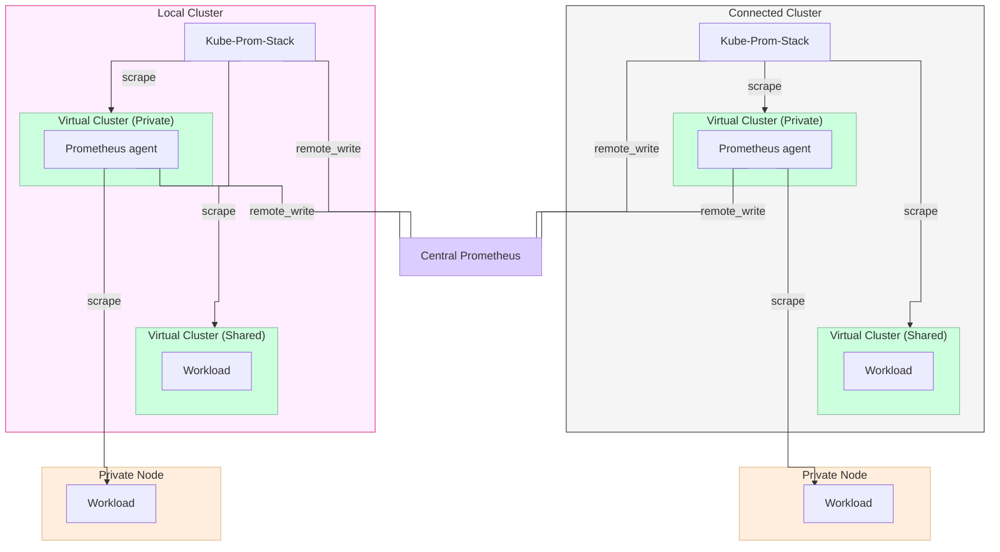

import Flow, { Step } from '@site/src/components/Flow'
import NavStep from '@site/src/components/NavStep'
import Button from '@site/src/components/Button'
import PageVariables from '@site/src/components/PageVariables';
import InterpolatedCodeBlock from "@site/src/components/InterpolatedCodeBlock";

This guide explains how to configure Prometheus to collect workload metrics
from across multiple virtual clusters. Metrics can be aggregated by cluster,
project, and virtual cluster. Because the architecture uses Prometheus
`remote_write`, it supports both the Shared Nodes and Private Nodes tenancy
models. Without `remote_write`, private nodes could not be scraped directly
using Prometheus' regular "pull-based" metrics ingestion model.

:::warning
This guide is by no means meant to be a day 2 monitoring solution that can just
be copied to your current infrastructure. Especially Observability is highly
specialized to the underlying architecture. The guide's goal is to lay out
general capabilities and to show what's possible along a stripped-down example
architecture. Those can be applied with modifications to your actual use cases.
:::

## Architecture

<!-- vale off -->

<!-- vale on -->

The architecture comprises the following:

- Cluster Architecture:
  - A local cluster that hosts vCluster Platform.
  - Two virtual clusters running on the local cluster:
    - One virtual cluster sharing the nodes of the local cluster (Shared Nodes Tenancy Model).
    - One virtual cluster with two private nodes and node-to-node VPN (Private Nodes Tenancy Model).
  - An external cluster that is connected to vCluster Platform (hosting vCluster Platform agent).
  - Two virtual clusters running on the connected cluster:
    - One virtual cluster sharing the nodes of the connected cluster (Shared Nodes Tenancy Model).
    - One virtual cluster with two private nodes and node-to-node VPN (Private Nodes Tenancy Model).

- Prometheus Architecture
  - A central Prometheus (remote_write receiver)
  - A Prometheus Operator (to scrape virtual cluster own metrics via `ServiceMonitors`) and a Prometheus Agent (remote_writer) per Cluster
  - A Prometheus Agent (remote_writer) per virtual cluster with private nodes (Private Nodes Tenancy Model).

<!-- vale off -->
## Deploy Prometheus Agent and Prometheus Operator on each Cluster
<!-- vale on -->

:::info Prerequisites
The central Prometheus must be configured as a remote write receiver. The following Helm values enable this:

```yaml
server:
  extraFlags:
    - web.enable-remote-write-receiver
```

Virtual clusters with shared nodes must be deployed with a ServiceMonitor. This
allows scraping their API server and controller metrics from the Prometheus
agent running on the host cluster. Enable this in your `vcluster.yaml`:

```yaml
controlPlane:
  serviceMonitor:
    enabled: true
```
:::

Deploy Prometheus Agent and Prometheus Operator using the Platform Apps UI.

<Flow id="deploy-prometheus">
  <Step>
Go to the <NavStep>Infra</NavStep> section using the menu on the left, and select the <NavStep>Clusters</NavStep> view.
  </Step>
  <Step>
    Click on the <code>Cluster</code> to deploy Prometheus.
  </Step>
  <Step>
    Navigate to the <NavStep>Apps</NavStep> tab.
  </Step>
  <Step>
    Click <Button>Deploy App</Button> and configure a Helm chart with the following settings.
  </Step>
</Flow>

<!-- vale off -->
| Setting | Value |
|---------|-------|
| Chart Repository URL | `https://prometheus-community.github.io/helm-charts` |
| Chart Name | `kube-prometheus-stack` |
| Namespace | `monitoring` |
| Release Name | `prometheus-agent` |
<!-- vale on -->

Use the following chart values by specifying the URL of the central Prometheus,
the namespace of platform/agent, and the cluster name.

:::info
Below steps must be repeated for each cluster.
:::

<PageVariables CENTRAL_PROMETHEUS_URL="http://127.0.0.1"/>
<PageVariables PLATFORM_NAMESPACE="vcluster-platform"/>
<PageVariables CLUSTER_NAME="local-cluster"/>

<InterpolatedCodeBlock
  code={`# ---------------------------------------------------------------------------
  # kube-prometheus-stack values — Prometheus agent for vCluster Platform
  # ---------------------------------------------------------------------------

  # We need kube-state-metrics in order to make use of the "vcluster.loft.sh"
  # Pod labels, which are configred via the sub chart values below.
  kubeStateMetrics:
    enabled: true

  kube-state-metrics:
    enabled: false
    collectors:
      - pods
    extraArgs:
      - --metric-allowlist=kube_pod_labels
      - --metric-labels-allowlist=pods=[*]

  alertmanager:
    enabled: false

  grafana:
    enabled: false

  nodeExporter:
    enabled: false

  defaultRules:
    create: false

  # ---------------------------------------------------------------------------
  # Disable all default ServiceMonitors
  # ---------------------------------------------------------------------------
  kubeApiServer:
    enabled: false

  kubelet:
    enabled: false

  kubeControllerManager:
    enabled: false

  coreDns:
    enabled: false

  kubeEtcd:
    enabled: false

  kubeScheduler:
    enabled: false

  kubeProxy:
    enabled: false

  # ---------------------------------------------------------------------------
  # Prometheus Operator in order to be able to scrape from ServiceMonitors
  # ---------------------------------------------------------------------------
  prometheusOperator:
    enabled: true
    resources:
      requests:
        cpu: 50m
        memory: 64Mi
      limits:
        cpu: 200m
        memory: 128Mi

  # ---------------------------------------------------------------------------
  # Prometheus in agent mode with remote write
  # ---------------------------------------------------------------------------
  prometheus:
    agentMode: true

    prometheusSpec:
      scrapeInterval: 1m
      evaluationInterval: 1m
      externalLabels:
        # The external label is necessary to later aggregate by cluster.
        cluster: "[[GLOBAL:CLUSTER_NAME]]"

      remoteWrite:
        - url: "[[GLOBAL:CENTRAL_PROMETHEUS_URL]]/api/v1/write"

      # No persistent storage — operator defaults to emptyDir
      # storageSpec: {}

      resources:
        requests:
          cpu: 50m
          memory: 192Mi
        limits:
          cpu: 300m
          memory: 384Mi

      securityContext:
        fsGroup: 65534
        runAsNonRoot: true
        runAsUser: 65534

      # -----------------------------------------------------------------------
      # Pick up ServiceMonitors and PodMonitors from ALL namespaces/labels.
      # The NilUsesHelmValues flags must be false, otherwise the chart injects
      # a matchLabels selector scoped to the Helm release name.
      # -----------------------------------------------------------------------
      serviceMonitorSelectorNilUsesHelmValues: false
      serviceMonitorSelector: {}
      serviceMonitorNamespaceSelector: {}
      podMonitorSelectorNilUsesHelmValues: false
      podMonitorSelector: {}
      podMonitorNamespaceSelector: {}
      probeSelectorNilUsesHelmValues: false
      scrapeConfigSelectorNilUsesHelmValues: false

      # -----------------------------------------------------------------------
      # Custom scrape configs
      # -----------------------------------------------------------------------
      additionalScrapeConfigs:
        - job_name: 'kubelet'
          kubernetes_sd_configs:
            - role: node
          scheme: https
          tls_config:
            insecure_skip_verify: true
          authorization:
            credentials_file: /var/run/secrets/kubernetes.io/serviceaccount/token
          relabel_configs:
            - source_labels: [__meta_kubernetes_node_address_InternalIP]
              target_label: __address__
              replacement: ${1}:10250
            - action: labelmap
              regex: __meta_kubernetes_node_label_(.+)
            - source_labels: [__meta_kubernetes_node_name]
              target_label: node
        - job_name: 'kubelet-cadvisor'
          kubernetes_sd_configs:
            - role: node
          scheme: https
          tls_config:
            insecure_skip_verify: true
          authorization:
            credentials_file: /var/run/secrets/kubernetes.io/serviceaccount/token
          metrics_path: /metrics/cadvisor
          relabel_configs:
            - source_labels: [__meta_kubernetes_node_address_InternalIP]
              target_label: __address__
              replacement: ${1}:10250
            - action: labelmap
              regex: __meta_kubernetes_node_label_(.+)
            - source_labels: [__meta_kubernetes_node_name]
              target_label: node
        - job_name: 'kubelet-resource'
          kubernetes_sd_configs:
            - role: node
          scheme: https
          tls_config:
            insecure_skip_verify: true
          authorization:
            credentials_file: /var/run/secrets/kubernetes.io/serviceaccount/token
          metrics_path: /metrics/resource
          relabel_configs:
            - source_labels: [__meta_kubernetes_node_address_InternalIP]
              target_label: __address__
              replacement: ${1}:10250
            - action: labelmap
              regex: __meta_kubernetes_node_label_(.+)
            - source_labels: [__meta_kubernetes_node_name]
              target_label: node
        - job_name: 'loft'
          kubernetes_sd_configs:
          - role: pod
            namespaces:
              names:
              - [[GLOBAL:PLATFORM_NAMESPACE]]
            selectors:
            - role: pod
              label: app=loft
          scheme: http
          authorization:
            credentials_file: /var/run/secrets/kubernetes.io/serviceaccount/token
          relabel_configs:
            - source_labels: [__meta_kubernetes_pod_container_port_name, __meta_kubernetes_pod_container_port_number]
              action: keep
              regex: http;8080
  `}
  language="yaml"
  title="prometheus-cluster-values.yaml"
/>

Click <Button>Install</Button> to deploy Prometheus.

<!-- vale off -->
## Deploy Prometheus Agent on each Virtual Cluster with Private Nodes
<!-- vale on -->

Each virtual cluster with private nodes needs its own Prometheus instance to
scrape kubelet metrics from its dedicated nodes and forward them to the central
Prometheus via remote write.

:::info Prerequisites
Virtual clusters with private nodes must be deployed with node-to-node vCluster VPN enabled. Add the following to your `vcluster.yaml`:

```yaml
privateNodes:
  enabled: true
  vpn:
    enabled: true
    nodeToNode:
      enabled: true
```

Below steps must be repeated for each virtual cluster.
:::

<PageVariables VCLUSTER_NAME="private-vcluster-1"/>

**1. Connect to the virtual cluster:**

<InterpolatedCodeBlock
  code={'vcluster connect [[GLOBAL:VCLUSTER_NAME]]'}
  language="bash"
/>

**2. Configure Helm values:**

Save the following as `prometheus-virtualcluster-values.yaml` and set the name of the virtual
cluster. This is necessary in order to be able to aggregate any workload
running on the private nodes to their corresponding virtual cluster.

<InterpolatedCodeBlock
  code={`# ---------------------------------------------------------------------------
  # Disable unused subcharts
  # ---------------------------------------------------------------------------
  alertmanager:
    enabled: false

  kube-state-metrics:
    enabled: false

  prometheus-node-exporter:
    enabled: false

  prometheus-pushgateway:
    enabled: false

  # ---------------------------------------------------------------------------
  # Service account and RBAC
  # ---------------------------------------------------------------------------
  serviceAccounts:
    server:
      create: true

  rbac:
    create: true

  # ---------------------------------------------------------------------------
  # Server configuration
  # ---------------------------------------------------------------------------
  server:
    # Agent mode: override ALL default flags because the defaults include TSDB
    # flags (--storage.tsdb.*) that are incompatible with --agent.
    defaultFlagsOverride:
      - --config.file=/etc/config/prometheus.yml
      - --agent
      - --storage.agent.path=/data
      - --web.enable-lifecycle

    global:
      scrape_interval: 1m
      evaluation_interval: 1m
      # The external label is necessary to later aggregate by virtual cluster.
      external_labels:
        vcluster_name: "[[GLOBAL:VCLUSTER_NAME]]"

    remoteWrite:
      - url: "[[GLOBAL:CENTRAL_PROMETHEUS_URL]]/api/v1/write"

    persistentVolume:
      enabled: false
    emptyDir:
      sizeLimit: 256Mi

    resources:
      requests:
        cpu: 50m
        memory: 192Mi
      limits:
        cpu: 300m
        memory: 384Mi

    securityContext:
      fsGroup: 65534
      runAsNonRoot: true
      runAsUser: 65534

    livenessProbeInitialDelay: 30
    liveProbePeriodSeconds: 15
    readinessProbeInitialDelay: 5
    readinessProbePeriodSeconds: 5

  # ---------------------------------------------------------------------------
  # Suppress chart-default rule_files and alerting as they are not allowed
  # in agent mode.
  # ---------------------------------------------------------------------------
  serverFiles:
    prometheus.yml:
      rule_files: []

  # ---------------------------------------------------------------------------
  # Disable all built-in scrape configs.
  # All other scrape_configs are provided via extraScrapeConfigs.
  # ---------------------------------------------------------------------------
  scrapeConfigs:
    prometheus:
      enabled: false
    kubernetes-api-servers:
      enabled: false
    kubernetes-nodes:
      enabled: false
    kubernetes-nodes-cadvisor:
      enabled: false
    kubernetes-service-endpoints:
      enabled: false
    kubernetes-service-endpoints-slow:
      enabled: false
    prometheus-pushgateway:
      enabled: false
    kubernetes-pods:
      enabled: false
    kubernetes-pods-slow:
      enabled: false
    kubernetes-services:
      enabled: false

  # ---------------------------------------------------------------------------
  # Custom scrape configs: kubelet, cAdvisor, resource metrics
  #
  # These use __meta_kubernetes_node_address_InternalIP for direct kubelet access.
  # ---------------------------------------------------------------------------
  extraScrapeConfigs: |
    - job_name: 'kubelet'
      kubernetes_sd_configs:
        - role: node
      scheme: https
      tls_config:
        insecure_skip_verify: true
      authorization:
        credentials_file: /var/run/secrets/kubernetes.io/serviceaccount/token
      relabel_configs:
        - source_labels: [__meta_kubernetes_node_address_InternalIP]
          target_label: __address__
          replacement: ${1}:10250
        - action: labelmap
          regex: __meta_kubernetes_node_label_(.+)
        - source_labels: [__meta_kubernetes_node_name]
          target_label: node
    - job_name: 'kubelet-cadvisor'
      kubernetes_sd_configs:
        - role: node
      scheme: https
      tls_config:
        insecure_skip_verify: true
      authorization:
        credentials_file: /var/run/secrets/kubernetes.io/serviceaccount/token
      metrics_path: /metrics/cadvisor
      relabel_configs:
        - source_labels: [__meta_kubernetes_node_address_InternalIP]
          target_label: __address__
          replacement: ${1}:10250
        - action: labelmap
          regex: __meta_kubernetes_node_label_(.+)
        - source_labels: [__meta_kubernetes_node_name]
          target_label: node
    - job_name: 'kubelet-resource'
      kubernetes_sd_configs:
        - role: node
      scheme: https
      tls_config:
        insecure_skip_verify: true
      authorization:
        credentials_file: /var/run/secrets/kubernetes.io/serviceaccount/token
      metrics_path: /metrics/resource
      relabel_configs:
        - source_labels: [__meta_kubernetes_node_address_InternalIP]
          target_label: __address__
          replacement: ${1}:10250
        - action: labelmap
          regex: __meta_kubernetes_node_label_(.+)
        - source_labels: [__meta_kubernetes_node_name]
          target_label: node
    - job_name: 'apiserver'
      kubernetes_sd_configs:
        - role: endpoints
          namespaces:
            names: ['default']
      scheme: https
      tls_config:
        ca_file: /var/run/secrets/kubernetes.io/serviceaccount/ca.crt
        insecure_skip_verify: false
      authorization:
        credentials_file: /var/run/secrets/kubernetes.io/serviceaccount/token
      relabel_configs:
        - source_labels: [__meta_kubernetes_service_name, __meta_kubernetes_endpoint_port_name]
          action: keep
          regex: kubernetes;https
  `}
  language="yaml"
  title="prometheus-virtualcluster-values.yaml"
/>

**3. Install Prometheus inside the vCluster:**

<InterpolatedCodeBlock
  code={`helm repo add prometheus-community https://prometheus-community.github.io/helm-charts
  helm repo update
  helm install prometheus-agent prometheus-community/prometheus \
  --namespace monitoring \
  --create-namespace \
  -f prometheus-virtualcluster-values.yaml
  `}
  language="bash"
/>

## Golden Signals Queries

With Prometheus deployed and forwarding metrics to the central receiver, you can
query the aggregated data. This section provides PromQL queries organized around
the Golden Signals framework.

The [Four Golden Signals](https://sre.google/sre-book/monitoring-distributed-systems/) of monitoring are:
- Latency
- Traffic
- Errors
- Saturation

The queries below serve two purposes:
1. To provide a set of labels that makes it possible to aggregate by cluster, project, and virtual cluster.
2. To adhere to the Golden Signals mentioned above.

### Custom Agent Metrics

The vCluster Platform agent emits a set of custom metrics carrying information
about virtual clusters as labels. These metrics always return `1` and can
therefore be joined via PromQL in order to make those labels available for
aggregation later.

#### `instance_info`

Following labels are attached:

- `kind`: `VirtualClusterInstance`
- `name`: the name of the instance.
- `namespace`: the namespace of the instance. This is usually the project namespace.
- `project`: the Project that the instance belongs to.

#### `virtualcluster_info`

Following labels are attached:
- `kind`: Kind of the virtual cluster (StatefulSet or Deployment)
- `name`: Name of the virtual cluster
- `namespace`: Namespace of the virtual cluster
- `instance_name`: Name of the accompanying VirtualClusterInstance (only present if the virtual cluster is registered with the platform)
- `instance_namespace`: Namespace of the accompanying VirtualClusterInstance (only present if the virtual cluster is registered with the platform)
- `creation_timestamp`: Creation timestamp of the virtual cluster

### Latency

Each query below uses an `instance_info` join to enrich metrics with cluster and
project labels. The pattern
`* on (vcluster_name) group_left (...) label_replace(instance_info, ...)`
maps the virtual cluster name to its corresponding `instance_info` entry,
copying labels like `cluster` and `project` into the result. Subsequent queries
use the same technique.

#### kube-apiserver request latency (p99, by verb) (virtual cluster only)

```promql
histogram_quantile(0.99,
  sum by (le, verb, cluster, project, vcluster_name) (
      (
          rate(apiserver_request_duration_seconds_bucket{vcluster_name!=""}[5m])
        * on (vcluster_name) group_left (cluster, project)
          label_replace(instance_info, "vcluster_name", "$1", "name", "(.*)")
      )
    or
      (
          label_replace(
            rate(apiserver_request_duration_seconds_bucket{job!~"apiserver|kubelet|loft"}[5m]),
            "vcluster_name",
            "$1",
            "job",
            "(.*)"
          )
        * on (vcluster_name) group_left (project)
          label_replace(instance_info, "vcluster_name", "$1", "name", "(.*)")
      )
  )
)
```

**Why:** Shows the tail latency of API server requests broken down by operation
type (GET, LIST, PUT, POST, PATCH, DELETE, WATCH). The p99 captures outliers
that averages hide. WATCH is expected to show 60s (long-poll).

#### kube-apiserver request latency (p95, non-WATCH) (virtual cluster only)

```promql
histogram_quantile(0.95,
  sum by (le, verb, cluster, project, vcluster_name) (
      (
          rate(apiserver_request_duration_seconds_bucket{verb!~"WATCH|CONNECT", vcluster_name!=""}[5m])
        * on (vcluster_name) group_left (cluster, project)
          label_replace(instance_info, "vcluster_name", "$1", "name", "(.*)")
      )
    or
      (
          label_replace(
            rate(apiserver_request_duration_seconds_bucket{verb!~"WATCH|CONNECT", job!~"apiserver|kubelet|loft"}[5m]),
            "vcluster_name",
            "$1",
            "job",
            "(.*)"
          )
        * on (vcluster_name) group_left (project)
          label_replace(instance_info, "vcluster_name", "$1", "name", "(.*)")
      )
  )
)
```

**Why:** Excludes long-running connections to focus on latency for synchronous
API calls.

#### etcd backend latency (p99, by operation) (virtual cluster only)

```promql
histogram_quantile(0.99,
  sum by (le, operation, cluster, project, vcluster_name) (
      (
          rate(etcd_request_duration_seconds_bucket{vcluster_name!=""}[5m])
        * on (vcluster_name) group_left (cluster, project)
          label_replace(instance_info, "vcluster_name", "$1", "name", "(.*)")
      )
    or
      (
          label_replace(
            rate(etcd_request_duration_seconds_bucket{job!~"apiserver|kubelet|loft"}[5m]),
            "vcluster_name",
            "$1",
            "job",
            "(.*)"
          )
        * on (vcluster_name) group_left (project)
          label_replace(instance_info, "vcluster_name", "$1", "name", "(.*)")
      )
  )
)
```

**Why:** etcd is the persistence backend. High latencies here (especially for
`get` and `list`) propagate to every API call.

#### API gateway latency (p99, by route type) (vCluster Platform only)

```promql
histogram_quantile(0.99,
  sum(rate(apigateway_kubernetes_request_duration_seconds_bucket[5m])) by (le, cluster)
)
```

```promql
histogram_quantile(0.99,
  sum(rate(apigateway_auth_request_duration_seconds_bucket[5m])) by (le, cluster)
)
```

```promql
histogram_quantile(0.99,
  sum(rate(apigateway_ui_request_duration_seconds_bucket[5m])) by (le, cluster)
)
```

**Why:** The vCluster Platform apigateway proxies Kubernetes, auth, and UI
requests. These three queries cover end-to-end latency as experienced by
platform users.

#### Kubelet pod start latency (p99) (vCluster Platform only)

```promql
histogram_quantile(0.99,
  sum(rate(kubelet_pod_start_sli_duration_seconds_bucket[5m])) by (le, cluster)
)
```

**Why:** Measures how quickly the kubelet can launch new pods. Critical for
scaling responsiveness.

#### Scheduler end-to-end scheduling latency (p99) (vCluster Platform only)

```promql
histogram_quantile(0.99,
  sum(rate(scheduler_scheduling_attempt_duration_seconds_bucket[5m])) by (le, result, cluster)
)
```

**Why:** How long the scheduler takes to place a pod. Slow scheduling causes
queuing and delays workload startup.

### Traffic

#### kube-apiserver request rate (by verb) (virtual cluster only)

```promql
sum by (verb, cluster, project, instance_name) (
    (
        rate(apiserver_request_total{instance_name!=""}[5m])
      * on (instance_name) group_left (cluster, project)
        label_replace(instance_info, "instance_name", "$1", "name", "(.*)")
    )
  or
    (
        label_replace(
          rate(apiserver_request_total{job!~"apiserver|kubelet|loft"}[5m]),
          "instance_name",
          "$1",
          "job",
          "(.*)"
        )
      * on (instance_name) group_left (project)
        label_replace(instance_info, "instance_name", "$1", "name", "(.*)")
    )
)
```

**Why:** The most fundamental measure of cluster workload. Shows how many requests per second the API server handles, broken down by verb.

#### kube-apiserver request rate (by resource) (virtual cluster only)

```promql
topk(10,
  sum by (resource, cluster, project, instance_name) (
      (
          rate(apiserver_request_total{instance_name!=""}[5m])
        * on (instance_name) group_left (cluster, project)
          label_replace(instance_info, "instance_name", "$1", "name", "(.*)")
      )
    or
      (
          label_replace(
            rate(apiserver_request_total{job!~"apiserver|kubelet|loft"}[5m]),
            "instance_name",
            "$1",
            "job",
            "(.*)"
          )
        * on (instance_name) group_left (project)
          label_replace(instance_info, "instance_name", "$1", "name", "(.*)")
      )
  )
)
```

**Why:** Identifies which Kubernetes resources generate the most API traffic, revealing "hot" resource types.

#### API gateway traffic (by route type) (vCluster Platform only)

```promql
sum(rate(apigateway_kubernetes_request_total[5m])) by (cluster)
```

```promql
sum(rate(apigateway_auth_request_total[5m])) by (cluster)
```

```promql
sum(rate(apigateway_ui_request_total[5m])) by (cluster)
```

**Why:** Measures platform-level traffic through the gateway, split by Kubernetes API proxy, auth, and UI.

#### REST client outbound request rate (by code) (virtual cluster only)

```promql
sum by (code, cluster, project, instance_name) (
    (
        rate(rest_client_requests_total{instance_name!=""}[5m])
      * on (instance_name) group_left (cluster, project)
        label_replace(instance_info, "instance_name", "$1", "name", "(.*)")
    )
  or
    (
        label_replace(
          rate(rest_client_requests_total{job!~"apiserver|kubelet|loft"}[5m]),
          "instance_name",
          "$1",
          "job",
          "(.*)"
        )
      * on (instance_name) group_left (project)
        label_replace(instance_info, "instance_name", "$1", "name", "(.*)")
    )
)
```

**Why:** How many outbound API calls the control-plane components make.

#### Network I/O rate (by namespace) (virtual cluster only)

```promql
topk(10,
  sum by (namespace, cluster, project, instance_name) (
      (
          label_replace(
              rate(container_network_receive_bytes_total{instance_name=""}[5m])
            * on (namespace) group_left (name, project)
              (virtualcluster_info * on (name) group_left (project) instance_info),
            "instance_name",
            "$1",
            "name",
            "(.*)"
          )
        * on (pod, cluster) group_left (namespace)
          label_replace(kube_pod_labels, "namespace", "$1", "label_vcluster_loft_sh_namespace", "(.*)")
      )
    or
      (
          label_replace(
            rate(container_network_receive_bytes_total{instance_name!=""}[5m]),
            "name",
            "$1",
            "instance_name",
            "(.*)"
          )
        * on (name) group_left (cluster, project)
          instance_info
      )
  )
)
```

```promql
topk(10,
  sum by (namespace, cluster, project, instance_name) (
      (
          label_replace(
              rate(container_network_transmit_bytes_total{instance_name=""}[5m])
            * on (namespace) group_left (name, project)
              (virtualcluster_info * on (name) group_left (project) instance_info),
            "instance_name",
            "$1",
            "name",
            "(.*)"
          )
        * on (pod, cluster) group_left (namespace)
          label_replace(kube_pod_labels, "namespace", "$1", "label_vcluster_loft_sh_namespace", "(.*)")
      )
    or
      (
          label_replace(
            rate(container_network_transmit_bytes_total{instance_name!=""}[5m]),
            "name",
            "$1",
            "instance_name",
            "(.*)"
          )
        * on (name) group_left (cluster, project)
          instance_info
      )
  )
)
```

**Why:** Measures network throughput per namespace, revealing which workloads generate the most network traffic.

### Errors

#### kube-apiserver error rate (4xx/5xx, by code) (virtual cluster only)

```promql
sum by (code, cluster, project, instance_name) (
    (
        rate(apiserver_request_total{code=~"[45]..", instance_name!=""}[5m])
      * on (instance_name) group_left (cluster, project)
        label_replace(instance_info, "instance_name", "$1", "name", "(.*)")
    )
  or
    (
        label_replace(
          rate(apiserver_request_total{code=~"[45]..", job!~"apiserver|kubelet|loft"}[5m]),
          "instance_name",
          "$1",
          "job",
          "(.*)"
        )
      * on (instance_name) group_left (project)
        label_replace(instance_info, "instance_name", "$1", "name", "(.*)")
    )
)
```

**Why:** HTTP-level error rates.

#### kube-apiserver error ratio (errors / total) (virtual cluster only)

```promql
sum by (cluster, project, instance_name) (
    (
        rate(apiserver_request_total{code=~"5..", instance_name!=""}[5m])
      * on (instance_name) group_left (cluster, project)
        label_replace(instance_info, "instance_name", "$1", "name", "(.*)")
    )
  or
    (
        label_replace(
          rate(apiserver_request_total{code=~"5..", job!~"apiserver|kubelet|loft"}[5m]),
          "instance_name",
          "$1",
          "job",
          "(.*)"
        )
      * on (instance_name) group_left (project)
        label_replace(instance_info, "instance_name", "$1", "name", "(.*)")
    )
)
/
sum by (cluster, project, instance_name) (
    (
        rate(apiserver_request_total{instance_name!=""}[5m])
      * on (instance_name) group_left (cluster, project)
        label_replace(instance_info, "instance_name", "$1", "name", "(.*)")
    )
  or
    (
        label_replace(
          rate(apiserver_request_total{job!~"apiserver|kubelet|loft"}[5m]),
          "instance_name",
          "$1",
          "job",
          "(.*)"
        )
      * on (instance_name) group_left (project)
        label_replace(instance_info, "instance_name", "$1", "name", "(.*)")
    )
)
```

**Why:** The fraction of server-side errors. A ratio above 1% is a red flag.

#### etcd request errors (virtual cluster only)

```promql
sum by (operation, cluster, project, instance_name) (
    (
        rate(etcd_request_errors_total{instance_name!=""}[5m])
      * on (instance_name) group_left (cluster, project)
        label_replace(instance_info, "instance_name", "$1", "name", "(.*)")
    )
  or
    (
        label_replace(
          rate(etcd_request_errors_total{job!~"apiserver|kubelet|loft"}[5m]),
          "instance_name",
          "$1",
          "job",
          "(.*)"
        )
      * on (instance_name) group_left (project)
        label_replace(instance_info, "instance_name", "$1", "name", "(.*)")
    )
)
```

**Why:** Backend storage errors directly impact cluster health.

#### Container OOM kills (virtual cluster only)

```promql
sum by (namespace, pod, cluster, project, instance_name) (
    (
        label_replace(
            rate(container_oom_events_total{instance_name=""}[5m])
          * on (namespace) group_left (name, project)
            (virtualcluster_info * on (name) group_left (project) instance_info),
          "instance_name",
          "$1",
          "name",
          "(.*)"
        )
      * on (pod, cluster) group_left (namespace)
        label_replace(kube_pod_labels, "namespace", "$1", "label_vcluster_loft_sh_namespace", "(.*)")
    )
  or
    (
        label_replace(
          rate(container_oom_events_total{instance_name!=""}[5m]),
          "name",
          "$1",
          "instance_name",
          "(.*)"
        )
      * on (name) group_left (cluster, project)
        instance_info
    )
)
```

**Why:** Out-of-memory kills indicate resource misconfiguration.

#### Kubelet runtime operation errors (vCluster Platform only)

```promql
sum(rate(kubelet_runtime_operations_errors_total[5m])) by (operation_type, cluster)
```

**Why:** Container runtime failures (image pulls, container create/start failures).

#### REST client error rate (outbound 5xx) (virtual cluster only)

```promql
sum by (host, cluster, project, instance_name) (
    (
        rate(rest_client_requests_total{code=~"5..", instance_name!=""}[5m])
      * on (instance_name) group_left (cluster, project)
        label_replace(instance_info, "instance_name", "$1", "name", "(.*)")
    )
  or
    (
        label_replace(
          rate(rest_client_requests_total{code=~"5..", job!~"apiserver|kubelet|loft"}[5m]),
          "instance_name",
          "$1",
          "job",
          "(.*)"
        )
      * on (instance_name) group_left (project)
        label_replace(instance_info, "instance_name", "$1", "name", "(.*)")
    )
)
```

**Why:** Errors when control-plane components call external APIs.

#### Container restart rate (vCluster Platform only)

```promql
sum(rate(kubelet_restarted_pods_total[5m])) by (static, cluster)
```

**Why:** Frequent pod restarts indicate crashloops or unhealthy workloads.

### Saturation

#### Container CPU usage (top pods) (virtual cluster only)

```promql
topk(10,
  sum by (namespace, pod, cluster, project, instance_name) (
      (
          label_replace(
              rate(container_cpu_usage_seconds_total{instance_name=""}[5m])
            * on (namespace) group_left (name, project)
              (virtualcluster_info * on (name) group_left (project) instance_info),
            "instance_name",
            "$1",
            "name",
            "(.*)"
          )
        * on (pod, cluster) group_left (namespace)
          label_replace(kube_pod_labels, "namespace", "$1", "label_vcluster_loft_sh_namespace", "(.*)")
      )
    or
      (
          label_replace(
            rate(container_cpu_usage_seconds_total{instance_name!=""}[5m]),
            "name",
            "$1",
            "instance_name",
            "(.*)"
          )
        * on (name) group_left (cluster, project)
          instance_info
      )
  )
)
```

**Why:** Shows the most CPU-hungry pods across the cluster.

#### Container memory working set (top pods) (virtual cluster only)

```promql
topk(10,
  sum by (namespace, pod, cluster, project, instance_name) (
      (
          label_replace(
              container_memory_working_set_bytes{instance_name=""}
            * on (namespace) group_left (name, project)
              (virtualcluster_info * on (name) group_left (project) instance_info),
            "instance_name",
            "$1",
            "name",
            "(.*)"
          )
        * on (pod, cluster) group_left (namespace)
          label_replace(kube_pod_labels, "namespace", "$1", "label_vcluster_loft_sh_namespace", "(.*)")
      )
    or
      (
          label_replace(
            container_memory_working_set_bytes{instance_name!=""},
            "name",
            "$1",
            "instance_name",
            "(.*)"
          )
        * on (name) group_left (cluster, project)
          instance_info
      )
  )
)
```

**Why:** Working set is the "real" memory usage that matters for OOM decisions.

#### CPU throttling ratio (by pod) (virtual cluster only)

```promql
topk(10,
  sum by (namespace, pod, cluster, project, instance_name) (
      (
          label_replace(
              rate(container_cpu_cfs_throttled_periods_total{instance_name=""}[5m])
            * on (namespace) group_left (name, project)
              (virtualcluster_info * on (name) group_left (project) instance_info),
            "instance_name",
            "$1",
            "name",
            "(.*)"
          )
        * on (pod, cluster) group_left (namespace)
          label_replace(kube_pod_labels, "namespace", "$1", "label_vcluster_loft_sh_namespace", "(.*)")
      )
    or
      (
          label_replace(
            rate(container_cpu_cfs_throttled_periods_total{instance_name!=""}[5m]),
            "name",
            "$1",
            "instance_name",
            "(.*)"
          )
        * on (name) group_left (cluster, project)
          instance_info
      )
  )
  /
  sum by (namespace, pod, cluster, project, instance_name) (
      (
          label_replace(
              rate(container_cpu_cfs_periods_total{instance_name=""}[5m])
            * on (namespace) group_left (name, project)
              (virtualcluster_info * on (name) group_left (project) instance_info),
            "instance_name",
            "$1",
            "name",
            "(.*)"
          )
        * on (pod, cluster) group_left (namespace)
          label_replace(kube_pod_labels, "namespace", "$1", "label_vcluster_loft_sh_namespace", "(.*)")
      )
    or
      (
          label_replace(
            rate(container_cpu_cfs_periods_total{instance_name!=""}[5m]),
            "name",
            "$1",
            "instance_name",
            "(.*)"
          )
        * on (name) group_left (cluster, project)
          instance_info
      )
  )
)
```

**Why:** Shows which pods are being throttled by cgroup CPU limits.

#### kube-apiserver inflight requests (virtual cluster only)

```promql
(
    apiserver_current_inflight_requests{instance_name!=""}
  * on (instance_name) group_left (cluster, project)
    label_replace(instance_info, "instance_name", "$1", "name", "(.*)")
)
or
(
    label_replace(
      apiserver_current_inflight_requests{job!~"apiserver|kubelet|loft"},
      "instance_name",
      "$1",
      "job",
      "(.*)"
    )
  * on (instance_name) group_left (project)
    label_replace(instance_info, "instance_name", "$1", "name", "(.*)")
)
```

**Why:** Shows current request concurrency for mutating vs read-only. When this approaches flow control limits, requests start queuing.

#### kube-apiserver flow-control queue depth (virtual cluster only)

```promql
sum by (priority_level, cluster, project, instance_name) (
    (
        apiserver_flowcontrol_current_inqueue_requests{instance_name!=""}
      * on (instance_name) group_left (cluster, project)
        label_replace(instance_info, "instance_name", "$1", "name", "(.*)")
    )
  or
    (
        label_replace(
          apiserver_flowcontrol_current_inqueue_requests{job!~"apiserver|kubelet|loft"},
          "instance_name",
          "$1",
          "job",
          "(.*)"
        )
      * on (instance_name) group_left (project)
        label_replace(instance_info, "instance_name", "$1", "name", "(.*)")
    )
)
```

**Why:** Requests waiting in priority-level queues. Non-zero means the API server is saturated for that priority level.

#### Scheduler pending pods (by queue) (vCluster Platform only)

```promql
scheduler_pending_pods
```

**Why:** Pods waiting for scheduling. Non-zero in `unschedulable` means cluster capacity is exhausted.

#### Workqueue depth (by queue name) (virtual cluster only)

```promql
topk(10,
    (
        workqueue_depth{instance_name!=""}
      * on (instance_name) group_left (cluster, project)
        label_replace(instance_info, "instance_name", "$1", "name", "(.*)")
    )
  or
    (
        label_replace(
          workqueue_depth{job!~"apiserver|kubelet|loft"},
          "instance_name",
          "$1",
          "job",
          "(.*)"
        )
      * on (instance_name) group_left (project)
        label_replace(instance_info, "instance_name", "$1", "name", "(.*)")
    )
)
```

**Why:** Controller work queues. Growing depth = controllers can't keep up with the event rate.

#### WATCH connection count (long-running requests) (virtual cluster only)

```promql
sum by (verb, cluster, project, instance_name) (
    (
        apiserver_longrunning_requests{instance_name!=""}
      * on (instance_name) group_left (cluster, project)
        label_replace(instance_info, "instance_name", "$1", "name", "(.*)")
    )
  or
    (
        label_replace(
          apiserver_longrunning_requests{job!~"apiserver|kubelet|loft"},
          "instance_name",
          "$1",
          "job",
          "(.*)"
        )
      * on (instance_name) group_left (project)
        label_replace(instance_info, "instance_name", "$1", "name", "(.*)")
    )
)
```

**Why:** A proxy for how many controllers/informers are active. Sudden spikes may indicate reconnect storms.

#### Node CPU usage rate (vCluster Platform only)

```promql
rate(node_cpu_usage_seconds_total[5m])
```

**Why:** Overall node-level CPU consumption from kubelet resource metrics.

#### Node memory working set (vCluster Platform only)

```promql
node_memory_working_set_bytes
```

**Why:** Overall node memory pressure.

#### Filesystem usage (by PVC / volume) (vCluster Platform only)

```promql
kubelet_volume_stats_used_bytes / kubelet_volume_stats_capacity_bytes
```

**Why:** Volume fill percentage. Approaching 100% means workloads will fail.
