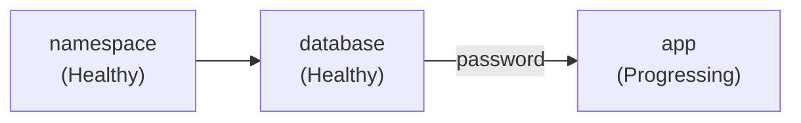

A stack deploys several applications into one destination in dependency order. Each
application is a task, tasks declare which other tasks they wait for, and the platform
rolls them out in that order. A task can pass a captured value, such as a generated
password or a load balancer address, to a task that runs later.

Use a stack when a single [App](../apps/use-on-demand.mdx) is not enough because the
components have to land in a specific order, or because one component needs a value that
another component only produces at deploy time.

## StackTemplate and StackInstance

Stacks are built from two resources.

| Resource | Scope | Purpose |
|----------|-------|---------|
| `StackTemplate` | Cluster-scoped | A reusable, parameterized blueprint: declared parameters and a task graph. It has no controller of its own and is resolved when an instance reconciles. |
| `StackInstance` | Namespaced (project) | One deployment of a stack into one destination. It either references a `StackTemplate` or carries its definition inline. |

A `StackTemplate` is passive. Nothing happens until a `StackInstance` references it and
supplies values for its parameters.

## Example

This stack creates a namespace, deploys a database, then deploys an application that
needs the password the database generated.



```yaml
apiVersion: management.loft.sh/v1
kind: StackTemplate
metadata:
  name: demo-app
spec:
  displayName: Demo application
  parameters:
    - variable: appVersion
      type: string
      required: true
      defaultValue: "1.4.0"
      label: Application version
  tasks:
    - name: namespace
      app:
        templateRef:
          name: demo-namespace

    - name: database
      dependsOn: [namespace]
      app:
        templateRef:
          name: demo-postgres
      outputs:
        - name: password
          fromSecret:
            namespace: demo
            name: demo-postgres
            key: password

    - name: app
      dependsOn: [database]
      app:
        templateRef:
          name: demo-frontend
        parameters:
          version: "{{ .Values.appVersion }}"
          databasePassword: "{{ .Outputs.database.password }}"

  publishedOutputs:
    - name: databasePassword
      fromTask:
        task: database
        output: password
```

Note the two kinds of reference. `{{ .Values.appVersion }}` reads a stack parameter, and
`{{ .Outputs.database.password }}` reads a value captured from the `database` task after
that task became healthy. See [Parameters and outputs](./parameters-and-outputs.mdx).

## Access and permissions

Stacks are an administrator feature. The built-in **Project Admin** role
(`loft-management-project-admin`) grants full access to `stackinstances` and the
`stackinstances/outputs` subresource. The built-in **Project User** and **Project Viewer**
roles do not include either resource, so users holding those roles cannot create stacks,
list them, or read their outputs.

Licensing is applied per task type rather than to stacks as a whole:

| Task type | Required license feature |
|-----------|--------------------------|
| `app` | Apps |
| `argoCDApplication` | Argo CD integration |

If a license does not cover the features a stack's tasks need, the instance is blocked
with the reason `FeatureNotAllowed` and nothing is deployed.

## Certified templates

With an Apps-bearing license, the platform seeds a set of certified NVIDIA Run:ai
`StackTemplate` resources, labeled `vcluster.com/certified: "true"`. They cover the
self-hosted control plane model and the shared central control plane model. These are
separate from
[Certified Stacks](../../integrations/certified-stacks/index.mdx), the reference
deployments maintained in a public repository.

## Next steps

- [Create a stack template](./create-a-stack-template.mdx)
- [Task types](./task-types.mdx)
- [Parameters and outputs](./parameters-and-outputs.mdx)
- [Deploy a stack](./deploy-a-stack.mdx)
- [Lifecycle and status](./lifecycle.mdx)
- [Declare stacks in vcluster.yaml](./vcluster-yaml.mdx)
