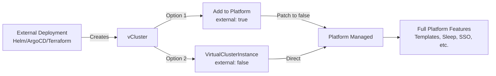

import Tabs from "@theme/Tabs";
import TabItem from "@theme/TabItem";
import Flow, { Step } from "@site/src/components/Flow";
import NavStep from "@site/src/components/NavStep";
import Button from "@site/src/components/Button";
import Label from "@site/src/components/Label";
import InterpolatedCodeBlock from "@site/src/components/InterpolatedCodeBlock";
import BasePrerequisites from '../../_partials/install/base-prerequisites.mdx';

import FragmentVirtualClustersSelect from '../../_fragments/ui-steps/virtual-cluster-select.mdx'
import FragmentConnectPlatform from '../../_fragments/cli-steps/connect-platform.mdx'
import FragmentPlatformAddCluster from '../../_fragments/cli-steps/platform-add-cluster.mdx'

# Add existing virtual clusters

Any running virtual cluster can be added to the Platform. When adding a virtual cluster to the Platform, you can choose between two integration levels based on your needs.

:::tip Related documentation
For conceptual understanding of externally vs. Platform-deployed virtual clusters, see [Externally deployed virtual clusters](/platform/understand/externally-vs-platform-deployed).
:::

## Integration levels

When adding an existing vCluster to the Platform, you can choose between two integration levels based on your needs:



### Management modes

- **Visibility and access only** - Platform provides monitoring and access features while you continue managing the vCluster with your existing tools
- **Full Platform management** - Platform takes over complete lifecycle management, enabling all Platform features like templates, sleep mode, and auto-delete

:::info Technical details
The Platform uses a VirtualClusterInstance resource to track virtual clusters. The management level is controlled automatically based on how you add the vCluster. For more details, see the [VirtualClusterInstance API reference](../../api/resources/virtualclusterinstance/virtualclusterinstance.mdx).
:::

## Add for visibility and access

Use this approach when you want to keep managing the vCluster with your existing tools (Helm, Argo CD, etc.) while gaining visibility and access through the Platform, including SSO integration.

<Flow id="add-virtual-cluster-visibility">
  <Step>
    <FragmentConnectPlatform />
  </Step>
  <Step>
    **Add Virtual Cluster to the Platform**: Before running this command, be sure that your kubecontext is set to the
    host cluster running the vcluster that you want to add.

    <InterpolatedCodeBlock
      code={`VCLUSTER_NAME=[[VAR:VCLUSTER_NAME:my-vcluster]]
PROJECT=[[VAR:PROJECT:default]]
IMPORT_NAME="[[VAR:IMPORT_NAME:My vCluster]]"
vcluster platform add vcluster $VCLUSTER_NAME \\
  --project $PROJECT \\
  --import-name "$IMPORT_NAME"`}
      language="bash"
      title="Add vcluster to the platform in a project."
    />

    This creates a `VirtualClusterInstance` with `external: true`, meaning the Platform will not manage the lifecycle.
  </Step>
  <Step>
    **Add Host Cluster to the Platform (Optional)**: For additional visibility of the host cluster in the Platform UI, you can also add the host cluster itself.
    Before running this command, be sure that your kubecontext is set to the host cluster.

    <InterpolatedCodeBlock
      code={`CLUSTER=[[VAR:CLUSTER:my-host-cluster]]
DISPLAY_NAME="[[VAR:DISPLAY_NAME:My Host Cluster]]"
vcluster platform add cluster $CLUSTER --display-name "$DISPLAY_NAME"`}
      language="bash"
      title="Connect host cluster to platform."
    />

    This step is optional and provides additional management capabilities for the host cluster infrastructure.
  </Step>
</Flow>

With visibility and access mode:
- ✅ View vCluster status in Platform UI
- ✅ Access through Platform with SSO integration
- ✅ Basic monitoring and metrics
- ✅ Continue managing with original deployment tool
- ❌ No Platform lifecycle management
- ❌ No templates, sleep mode, or auto-delete

## Enable full Platform management

Use this approach when you want the Platform to take over complete management of your externally deployed vCluster, unlocking all Platform features.

### Why enable Platform management?

Organizations often have existing deployment pipelines using tools like Helm, Argo CD, or Terraform. This option allows you to:

- Maintain existing CI/CD workflows for initial deployment
- Transition to Platform management for ongoing operations
- Enable Platform features like <GlossaryTerm term="sleep-mode">sleep mode</GlossaryTerm>, SSO, and centralized management
- Integrate existing vClusters into Platform-managed projects with quotas and policies

### Post-deployment platform registration

Deploy your vCluster using any tool, then add it to <GlossaryTerm term="platform">the Platform</GlossaryTerm> and enable full management:

<InterpolatedCodeBlock
  code={`# Deploy vCluster with Helm
helm install [[VAR:VCLUSTER_NAME:vc-name]] loft/vcluster \\
  --namespace [[VAR:NAMESPACE:vc-namespace]] \\
  --create-namespace

# Add to Platform (creates VirtualClusterInstance with external: true)
vcluster platform add vcluster [[VAR:VCLUSTER_NAME:vc-name]] \\
  --namespace [[VAR:NAMESPACE:vc-namespace]] \\
  --project [[VAR:PROJECT:default]]

# Enable full Platform management
kubectl patch virtualclusterinstances.storage.loft.sh [[VAR:VCLUSTER_NAME:vc-name]] \\
  -n p-[[VAR:PROJECT:default]] \\
  --type='json' \\
  -p='[{"op": "replace", "path": "/spec/external", "value": false}]'`}
  language="bash"
/>

### Helm wrapper for VirtualClusterInstance

Create a Helm chart that deploys the `VirtualClusterInstance` directly, allowing the Platform to manage the vCluster from creation. This approach is ideal when you want Helm to deploy the CRD but let the Platform handle the actual vCluster.

```yaml title="templates/virtualclusterinstance.yaml"
apiVersion: storage.loft.sh/v1
kind: VirtualClusterInstance
metadata:
  name: {{ .Values.name }}
  namespace: p-{{ .Values.project | default "default" }}  # Project namespace
spec:
  clusterRef:
    cluster: {{ .Values.cluster | default "loft-cluster" }}
    namespace: {{ .Values.namespace }}
    virtualCluster: {{ .Values.vclusterName }}
  external: false  # Platform manages lifecycle
  owner:
    user: {{ .Values.owner }}
  template:
    helmRelease:
      chart:
        version: {{ .Values.vclusterVersion }}
      values: |
        {{ .Values.vclusterValues | nindent 8 }}
```

:::warning Namespace requirements
The Platform must create and manage the namespace when `external: false`. Pre-existing namespaces will cause the error: "namespace exists and is not managed"
:::

### GitOps with VirtualClusterInstance

For [GitOps deployments](/platform/install/gitops), create the [VirtualClusterInstance](../../api/resources/virtualclusterinstance/virtualclusterinstance.mdx) directly in your Git repository. Tools like [Argo CD](/platform/integrations/argocd) or Flux will apply the CRD, and the Platform will manage the virtual cluster:

```yaml title="gitops/vcluster-instance.yaml"
apiVersion: storage.loft.sh/v1
kind: VirtualClusterInstance
metadata:
  name: gitops-vcluster
  namespace: p-default  # Platform project namespace
spec:
  clusterRef:
    cluster: loft-cluster
    namespace: gitops-vcluster-ns
    virtualCluster: gitops-cluster
  external: false  # Platform manages from creation
  owner:
    user: admin
  template:
    helmRelease:
      chart:
        version: "0.27.0"
      values: |
        controlPlane:
          backingStore:
            etcd:
              deploy:
                enabled: true
```

:::tip GitOps best practices
- Store VirtualClusterInstance manifests in your Git repository
- Use Kustomize or Helm for environment-specific configurations
- Let Argo CD or Flux handle the CRD lifecycle while Platform manages the vCluster
- See [Platform GitOps installation guide](/platform/install/gitops) for complete setup
:::

## Implementation example

### Prerequisites

<BasePrerequisites />

Additionally, you'll need:
- vCluster CLI installed and configured: See [vCluster CLI Installation](https://www.vcluster.com/docs/getting-started/setup)

### Implementation steps

<Flow id="helm-to-platform">
  <Step>
    **Deploy vCluster with Helm**

    <InterpolatedCodeBlock
      code={`helm repo add loft https://charts.loft.sh
helm install [[VAR:NAME:vc-name]] loft/vcluster \\
  --namespace [[VAR:NAMESPACE:vc-namespace]] \\
  --create-namespace \\
  --set controlPlane.backingStore.etcd.deploy.enabled=true`}
      language="bash"
    />

    Or use your preferred deployment tool (Argo CD, Terraform, etc.).

:::info
This example shows basic vCluster configuration. For complete vCluster configuration options, see the [vCluster configuration reference](/vcluster/configure/vcluster-yaml).
:::
  </Step>
  <Step>
    **Add the vCluster to Platform**

    <InterpolatedCodeBlock
      code={`vcluster platform add vcluster [[VAR:NAME:vc-name]] \\
  --namespace [[VAR:NAMESPACE:vc-namespace]] \\
  --project [[VAR:PROJECT:default]] \\
  --import-name "[[VAR:IMPORT_NAME:imported-vc]]"`}
      language="bash"
    />

    This creates a `VirtualClusterInstance` with `external: true`.
  </Step>
  <Step>
    **Enable full Platform management**

    <InterpolatedCodeBlock
      code={`kubectl patch virtualclusterinstances.storage.loft.sh \\
  [[VAR:IMPORT_NAME:imported-vc]] -n p-[[VAR:PROJECT:default]] \\
  --type='json' -p='[{"op": "replace", "path": "/spec/external", "value": false}]'`}
      language="bash"
    />

    Platform now manages the vCluster lifecycle.
  </Step>
  <Step>
    **Verify Platform features are active**

    <InterpolatedCodeBlock
      code={`# Check VirtualClusterInstance status
kubectl get virtualclusterinstances.storage.loft.sh \\
  -n p-[[VAR:PROJECT:default]] [[VAR:IMPORT_NAME:imported-vc]] -o yaml

# Verify in Platform UI
vcluster platform list vcluster`}
      language="bash"
    />
  </Step>
</Flow>

## Verification

Verify that the virtual cluster is correctly managed by the Platform. You can check this using the CLI:

<InterpolatedCodeBlock
  code={`# List all VirtualClusterInstances
kubectl get virtualclusterinstances.storage.loft.sh -A

# Verify external field is false (empty means false)
kubectl get virtualclusterinstances.storage.loft.sh [[VAR:NAME:vc-name]] \\
  -n p-[[VAR:PROJECT:default]] \\
  -o jsonpath='{.spec.external}'

# Check Platform-managed virtual clusters
vcluster list --driver=platform

# Access Platform UI
vcluster platform ui`}
  language="bash"
/>

## Platform features available with full management

Once `external: false` is set, the following Platform features become available:

- **[Full lifecycle management](/platform/use-platform/virtual-clusters/manage-access)**: Platform handles upgrades and configuration changes
- **[Templates](../../administer/templates/create-templates.mdx)**: Use and enforce vCluster templates for consistency
- **[Auto-delete](./key-features/sleep-mode.mdx#work-with-auto-delete)**: Automatic cleanup after inactivity periods
- **[Sleep mode](/platform/use-platform/virtual-clusters/key-features/sleep-mode)**: Automatic sleep/wake based on activity to save resources
- **[Project assignment](/platform/administer/projects/create)**: Organize virtual clusters into projects with quotas
- **[SSO integration](/platform/configure/single-sign-on/overview)**: <GlossaryTerm term="user">User</GlossaryTerm> access through Platform SSO providers
- **[Audit logging](/platform/configure/advanced/audit)**: Centralized audit trails for compliance
- **[Resource quotas](/platform/administer/projects/quotas)**: Enforce resource limits via <GlossaryTerm term="project">project</GlossaryTerm> settings
- **[UI management](./add-virtual-clusters.mdx)**: Full control through Platform UI
- **[Backup/restore](/platform/administer/backup-restore/backup-restore-platform)**: Platform-managed backup policies

## Limitations and considerations

### Architectural considerations

**Single source of truth principle:** when `external: false`, the Platform becomes the sole manager of the virtual cluster. This means:
- Avoid making changes through the original deployment tool (Helm, Argo CD)
- Configuration updates should be done through Platform UI or by modifying the VirtualClusterInstance
- Competing reconciliation loops can cause conflicts and unpredictable behavior

### Technical requirements

- **Namespace management**: The Platform must create and manage the namespace when `external: false`. Pre-existing namespaces will cause deployment failures with error: "namespace exists and is not managed"
- **Reconciliation conflicts**: If external tools continue to manage the virtual cluster after setting `external: false`, both systems may fight to enforce their desired state
- **Version compatibility**: Requires vCluster v0.20.0 or later for full Platform integration

### Alternative approaches

For specific scenarios where full Platform management isn't suitable:

1. **Hybrid management**: Keep `external: true` to maintain external lifecycle management while still gaining Platform features like SSO and monitoring

2. **GitOps compatibility**: Use VirtualClusterInstance CRDs in your GitOps repository, letting Argo CD deploy them while Platform manages the resulting virtual clusters

3. **Gradual migration**: Start with external management, evaluate Platform features, then transition to full management when ready

## Next steps

- Learn about [managing virtual cluster access](/platform/use-platform/virtual-clusters/manage-access)
- Configure [sleep mode](/platform/use-platform/virtual-clusters/key-features/sleep-mode) for cost optimization
- Set up [templates](../../administer/templates/create-templates.mdx) for consistent deployments
- Explore [GitOps integration](/platform/install/gitops) for declarative management
