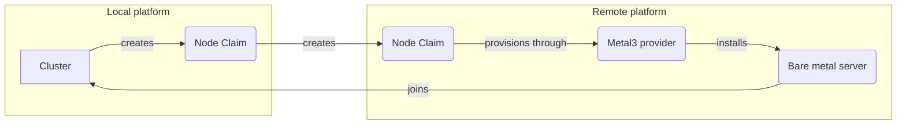

import FeatureTable from '@site/src/components/FeatureTable';
import Flow, {Step} from "@site/src/components/Flow";
import Label from "@site/src/components/Label";

<FeatureTable names="auto-nodes-external-platform,machine-management" />

The external platform provider lets one vCluster Platform supply private nodes from bare metal servers that another platform manages.
On this page, the local platform runs the <GlossaryTerm term="tenant-cluster">clusters</GlossaryTerm>, and the remote platform owns the servers.

The remote platform keeps full control of its hardware.
It provisions the servers with its own [Metal3 provider](./metal3/overview.mdx), and it decides which node types and servers the local platform can use.
The local platform uses that inventory like its own.
Clusters select the node types through Auto Nodes, and the servers appear as Machines on the local platform.

Use this provider when one platform operates a bare metal fleet and another platform consumes part of it.
For example, an AI cloud provider can give a customer's own platform a share of its GPU servers.
The customer's platform gets an access key for one Tenant, not access to the Metal3 infrastructure.

<br />


## How the provider works

The provider connects to the remote platform's API with an access key.
It mirrors what the access key can read from the remote Metal3 provider, and it creates a remote NodeClaim for every local one.

| Local platform | Remote platform |
|----------------|-----------------|
| NodeProvider with `spec.externalPlatform` | Metal3 NodeProvider named in `nodeProvider` |
| NodeType `<local provider>.<name>` | NodeType `<remote provider>.<name>` |
| Machine `<local provider>.<machine ID>` | Machine `<remote provider>.<machine ID>` |
| NodeClaim in a local project | NodeClaim in the project named in `project` |

### Node types and capacity

The provider mirrors every node type of the remote provider that the access key can read, and refreshes them periodically.
A mirrored node type copies the remote resources, cost, display name, and properties.
It records the remote node type in the `platform.vcluster.com/remote-node-type` property.
Properties that reference objects on the remote platform, such as `vcluster.com/os-image`, are dropped.

A remote node type counts the servers of every Tenant on the remote platform.
The local capacity is therefore the remote node type's free capacity, capped at the free remote Machines the access key can read.
Without the cap, servers assigned to another Tenant would look free on the local platform.
A remote node type with unlimited capacity stays unlimited.

### Provisioning

For every local NodeClaim, the provider creates a NodeClaim in the remote project.
It resolves every reference to a local object first, so the remote platform never needs those objects:

- **OS image:** the provider reads the OSImage named in `vcluster.com/os-image` on the local platform. It copies the image properties, such as the image URL and checksum, onto the remote claim.
- **User data:** the local platform renders cloud-init, including SSH keys and user data templates. The server therefore joins the local cluster.
- **Network:** the properties of the local network environment are copied onto the remote claim. A network data template stays unrendered, because the remote platform renders it with the IP address it allocates.

All other properties pass through to the remote claim unchanged, where the remote Metal3 provider applies them.

The local NodeClaim is provisioned once the remote one is.
The provider copies the remote machine ID and the node IP address onto the local claim, in the `platform.vcluster.com/machine-id` and `nodeclaim.vcluster.com/ip-address` annotations.
A local NodeClaim that references one of the mirrored Machines is provisioned on the same machine on the remote platform.

### Deprovisioning

Deleting a local NodeClaim deletes its remote NodeClaim.
The local claim is removed once the remote one is gone.
The remote Metal3 provider then returns the server to its pool, the same as for any other claim.

## Before you begin

- A remote vCluster Platform with a working [Metal3 provider](./metal3/overview.mdx). Only Metal3 providers are supported on the remote side.
- The license features listed at the top of this page on the local platform.
- Network access:
  - The local platform reaches the remote platform's URL.
  - The remote servers reach the cluster they join, as with any private node.
  - The remote site can download the OS image, because the remote Metal3 provider installs the server from its URL.
- An [OSImage](../../images/os-images.mdx) on the local platform that sets the Metal3 [image properties](./metal3/overview.mdx#image-configuration).

## Prepare the remote platform

Complete these steps on the remote platform.
They give the local platform an access key for one Tenant, so it can only use the node types and servers you grant that Tenant.

<Flow>
<Step>
Create a Tenant and grant it node types.

Grant the node types of the Metal3 provider by name.
The local platform mirrors only the node types granted here.

```yaml title="tenant.yaml"
apiVersion: management.loft.sh/v1
kind: Tenant
metadata:
  name: acme
spec:
  nodeTypes:
    enabled: true
    allow:
      byName:
        - metal3-provider.gpu-node
```

Creating the Tenant also creates the tenant admin user `acme--admin` and the project `acme--default`.
</Step>
<Step>
Assign servers to the Tenant.

A Tenant's NodeClaims only land on Machines the Tenant owns or that you assign to it.
Assign each Machine the local platform may use with the `tenant.vcluster.com/exclusive-to` label.

```bash title="Assign a Machine to the Tenant"
kubectl label machines.management.loft.sh metal3-provider.gpu-server-1 tenant.vcluster.com/exclusive-to=acme
```
</Step>
<Step>
Create an access key for the tenant admin.

Create an [access key](../../../administer/authentication/access-keys.mdx#create-an-access-key) for the `acme--admin` user and copy it.
You need it on the local platform in the next section.
</Step>
</Flow>

:::warning Password resets delete access keys
Changing or resetting the password of the tenant admin deletes its access keys.
The local platform then can't reach the remote platform until it gets a new access key.
:::

The access key can also belong to a remote user outside any Tenant.
The user must be able to manage NodeClaims in the project and read the remote node provider, its node types, and its Machines.
The local platform then sees every node type and Machine that user can read.

## Connect the local platform

Complete these steps on the local platform.

<Flow>
<Step>
Store the access key in a Secret.

Create the Secret in the platform namespace, for example `vcluster-platform`.
The access key goes under the `accessKey` key.

```yaml title="access-key-secret.yaml"
apiVersion: v1
kind: Secret
metadata:
  name: remote-platform-access-key
  namespace: vcluster-platform
stringData:
  accessKey: <access key from the remote platform>
```
</Step>
<Step>
Create the node provider.

```yaml title="node-provider.yaml"
apiVersion: management.loft.sh/v1
kind: NodeProvider
metadata:
  name: remote-metal3
spec:
  displayName: Remote bare metal
  properties:
    # OSImage on the local platform to install on every node
    vcluster.com/os-image: ubuntu-noble
  externalPlatform:
    # URL of the remote platform
    host: https://platform.example.com
    # Secret that holds the access key under the key "accessKey"
    secretRef:
      name: remote-platform-access-key
      namespace: vcluster-platform
    # Metal3 NodeProvider on the remote platform
    nodeProvider: metal3-provider
    # Project on the remote platform to create NodeClaims in
    project: acme--default
```

In the UI, create a node provider and choose <Label>External Platform</Label> as its type.
The <Label>Remote Platform Configuration</Label> section holds the same fields.
</Step>
<Step>
Check that the provider is available.

```bash title="Check the provider and its node types"
kubectl get nodeproviders.management.loft.sh remote-metal3 -o jsonpath='{.status.phase}'
kubectl get nodetypes.management.loft.sh
```

The provider reports the `Available` phase.
The node types of the remote provider appear with the local provider as prefix, for example `remote-metal3.gpu-node`.
</Step>
</Flow>

### Configure TLS

By default, the provider verifies the remote platform's serving certificate against the system root certificates.
If the remote platform uses a certificate from a private CA, set `caData` to the base64-encoded PEM CA bundle:

```yaml title="node-provider.yaml"
spec:
  externalPlatform:
    host: https://platform.internal.example.com
    caData: LS0tLS1CRUdJTiBDRVJUSUZJQ0FURS0tLS0t...
```

For development only, `insecureSkipTLSVerify: true` turns verification off.
You can't combine it with `caData`.

## Use the node types in a cluster

Reference the provider in the `vcluster.yaml` of a cluster, the same as any other node provider.
The `vcluster.com/node-type` property matches the mirrored node type with or without the provider prefix.

```yaml title="vcluster.yaml"
privateNodes:
  enabled: true
  autoNodes:
    - provider: remote-metal3
      static:
        - name: gpu-pool
          quantity: 2
          nodeTypeSelector:
            - property: vcluster.com/node-type
              value: gpu-node
```

[Node claim properties](/docs/vcluster/configure/vcluster-yaml/private-nodes/auto-nodes#node-claim-properties) set in `vcluster.yaml` override the ones on the NodeProvider.
For example, to install a different OSImage for one cluster, set `vcluster.com/os-image` under `properties` in its node pool.

## Limitations

- The remote provider must be a Metal3 provider.
- You can't change `nodeProvider` or `project` after you create the provider, because the provider finds its remote NodeClaims through them. Create another provider to target a different remote provider or project.
- One provider uses one access key. To consume the inventory of another remote Tenant, create another provider.

## Troubleshoot

The provider reports problems as the reason of a condition on the NodeProvider or the NodeClaim:

```bash title="Show the conditions of the provider"
kubectl get nodeproviders.management.loft.sh remote-metal3 -o jsonpath='{.status.conditions}'
```

| Reason | Meaning |
|--------|---------|
| `RemoteNodeProviderNotFound` | The remote node provider doesn't exist, or the access key can't read it. |
| `UnsupportedRemoteNodeProvider` | The remote node provider isn't a Metal3 provider. |
| `InvalidConfiguration` | The Secret has no `accessKey` key, or a NodeClaim references an OSImage that doesn't exist on the local platform. |
| `RemoteNodeClaimConflict` | A NodeClaim with the same name in the remote project belongs to another claim, for example of another platform that shares the project. |
| `RemoteNodeClaimDeleted` | The remote NodeClaim is being deleted on the remote platform, for example because someone deleted it there. |

A failure on the remote NodeClaim fails the local NodeClaim with the reason and message of the remote claim.
