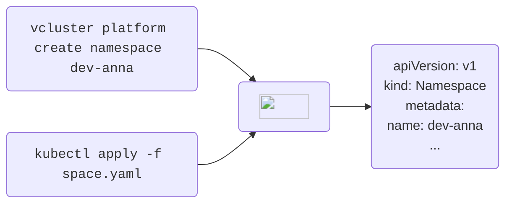

<!-- vale off -->

```mermaid
flowchart LR;
  CLI("<code>vcluster platform create namespace dev-anna</code>") --> Loft
  kubectl("<code>kubectl apply -f space.yaml</code>") --> Loft

  Loft("<img src='/docs/media/loft-logo-white.svg' width='60' height='30' />")

  Loft --> Namespace("apiVersion: v1<br/>kind: Namespace<br/>metadata:<br/>  name: dev-anna<br/>...")

  class CLI,kubectl code
  class Namespace yaml
  class Loft loft
```
<!-- vale on -->
