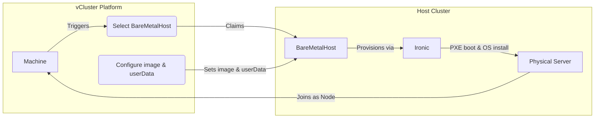

import Tabs from '@theme/Tabs';
import TabItem from '@theme/TabItem';
import FeatureTable from '@site/src/components/FeatureTable';
import Flow, {Step} from "@site/src/components/Flow";

<FeatureTable names="auto-nodes-metal3" />

The Metal3 provider allows you to provision bare metal servers as Machines using [Metal3](https://metal3.io/) and [Ironic](https://ironicbaremetal.org/).
When a Machine is requested, the platform claims an available `BareMetalHost` resource, configures it with the requested OS image and user data, and Ironic handles the PXE boot and OS installation on the physical server.

This enables you to offer different configurations of bare metal servers, all managed through BareMetalHost resources on a host cluster. Machines can be used as private nodes for virtual clusters or provisioned independently.



## Overview

The Metal3 provider works by selecting available BareMetalHost resources on a host cluster and provisioning them with an OS image and user data configuration.
Node types allow organizing bare metal servers based on type, location, or other criteria. When a Machine is created, the platform:

1. Selects an available BareMetalHost matching the node type's label selector and resource requirements
2. Configures the BareMetalHost with the OS image, user data, and optional network configuration
3. Ironic provisions the server through a series of steps (power management, PXE boot, in-memory installer)
4. The server boots into the provisioned OS and is initialized

When the Machine is deleted, the platform restores the BareMetalHost to its original state, making it available for reuse.

## How it works: Provisioning

When a Machine is created, the platform provisions the bare metal server through the following steps:

1. The platform generates a user data configuration and stores it in a Kubernetes Secret on the host cluster.
2. The provider sets the BareMetalHost's `userData` reference to this Secret and the image information from the configured [OSImage](../../use-platform/machines/os-images.mdx) or direct image properties.
3. Ironic provisions the server through a series of steps: power management, PXE boot, and an in-memory installer that writes the OS to disk.
4. The server boots into the provisioned OS and is initialized with the user data configuration.

When a Machine is used as a private node for a vCluster, the user data includes registration scripts that automatically join the server to the virtual cluster.

## Infrastructure deployment

The Metal3 provider can deploy the required infrastructure components on the host cluster. Each component can be individually enabled and customized with Helm values. Metal3 and Ironic may also be managed yourself — disable the respective component and the provider uses whatever is already deployed.

<Tabs>
<TabItem value="metal3" label="Metal3 & Ironic">

Bare metal provisioning and lifecycle management. Deploys the Bare Metal Operator and Ironic.

**Helm values:**

| Value | Description | Default |
|---|---|---|
| `ironic.image.repository` | Ironic container image | `quay.io/metal3-io/ironic` |
| `ironic.image.tag` | Ironic image tag | `release-32.0` |
| `ipaDownloader.image.repository` | IPA ramdisk downloader image | `quay.io/metal3-io/ironic-ipa-downloader` |
| `ipaDownloader.image.tag` | IPA ramdisk downloader tag | `latest` |
| `bareMetalOperator.image.repository` | Bare Metal Operator image | `quay.io/metal3-io/baremetal-operator` |
| `bareMetalOperator.image.tag` | Bare Metal Operator tag | `v0.12.0` |

```yaml
deploy:
  metal3:
    enabled: true
    helmValues: |
      ironic:
        image:
          tag: release-32.0
```

</TabItem>
<TabItem value="dhcp" label="DHCP Server">

Handles PXE boot by acting as a proxy between bare metal servers and Ironic, which may reside in a different network. When Metal3 is also deployed by the provider, the Ironic endpoint URLs are configured automatically.

**Helm values:**

| Value | Description | Default |
|---|---|---|
| `networkAttachmentDefinition.vip` | Virtual IP with prefix for the DHCP server. Injected into the NetworkAttachmentDefinition under `ipam.static`. | — |
| `networkAttachmentDefinition.config` | CNI configuration JSON for the NetworkAttachmentDefinition. Use `bridge` if host nodes have a bridge attached to the provisioning network. Use `macvlan` if the bare metal servers are on the same network as the host cluster nodes. | — |
| `proxy.ironicHttpUrl` | Ironic HTTP endpoint for image serving | Auto-configured when Metal3 is enabled |
| `proxy.ironicApiUrl` | Ironic API endpoint | Auto-configured when Metal3 is enabled |
| `proxy.image.registry` | Container image registry | `ghcr.io` |
| `proxy.image.repository` | Container image repository | `loft-sh/vcluster-platform-dhcp-server` |
| `proxy.image.tag` | Container image tag | Chart app version |

Example with a bridge:

```yaml
deploy:
  dhcp:
    enabled: true
    helmValues: |
      networkAttachmentDefinition:
        vip: 192.168.100.2/24
        config: |
          {
            "cniVersion": "0.3.1",
            "type": "bridge",
            "bridge": "br0",
            "isDefaultGateway": false
          }
```

Example with macvlan (bare metal servers on the same network as the host cluster nodes):

```yaml
deploy:
  dhcp:
    enabled: true
    helmValues: |
      networkAttachmentDefinition:
        vip: 10.0.0.2/24
        config: |
          {
            "cniVersion": "0.3.1",
            "type": "macvlan",
            "master": "eth0",
            "mode": "bridge"
          }
```

</TabItem>
<TabItem value="multus" label="Multus">

CNI plugin that enables attaching the DHCP server to a separate provisioning network.

**Helm values:**

| Value | Description | Default |
|---|---|---|
| `namespace` | Namespace to deploy Multus into | Provider namespace |
| `image.registry` | Container image registry | `ghcr.io` |
| `image.repository` | Container image repository | `k8snetworkplumbingwg/multus-cni` |
| `image.tag` | Container image tag | `snapshot-thick` |

```yaml
deploy:
  multus:
    enabled: true
    helmValues: |
      namespace: kube-system
```

</TabItem>
</Tabs>

The DHCP server is automatically configured based on BareMetalHost resources and platform IPAM when using network properties.

## Configuration

A Metal3 `NodeProvider` configuration consists of a cluster reference, optional infrastructure deployment settings, and a list of node types.

### Cluster reference

The `clusterRef` specifies the host cluster where the platform installs Metal3 components and where the BareMetalHost resources live. This cluster must be connected to vCluster Platform.

| Field | Description | Required |
|---|---|---|
| `clusterRef.cluster` | Name of the connected host cluster | Yes |
| `clusterRef.namespace` | Namespace on the host cluster for Metal3 components and BareMetalHost resources | Yes |

:::info Ironic network access
Ironic must have network access to the BMC addresses of the bare metal servers. Ensure the host cluster where Ironic is deployed can reach the BMC network (Redfish/IPMI endpoints).
:::

### Example

This configuration deploys Metal3, Ironic, the DHCP server, and Multus, and defines a single node type that selects BareMetalHosts with the label `role: compute`.

```yaml
apiVersion: management.loft.sh/v1
kind: NodeProvider
metadata:
  name: metal3-provider
spec:
  displayName: "Metal3 Bare Metal Provider"
  metal3:
    clusterRef:
      cluster: bare-metal-cluster
      namespace: metal3-system
    deploy:
      metal3:
        enabled: true
      dhcp:
        enabled: true
        helmValues: |
          networkAttachmentDefinition:
            vip: 192.168.100.2/24
      multus:
        enabled: true
        helmValues: |
          namespace: kube-system
    nodeTypes:
    - name: "compute-node"
      displayName: "Compute Node"
      resources:
        cpu: "32"
        memory: 128Gi
      bareMetalHosts:
        selector:
          matchLabels:
            role: compute
      properties:
        vcluster.com/os-image: ubuntu-noble
```

## Get started

This walkthrough covers the essential steps to go from a connected host cluster to a provisioned bare metal server.

<Flow>
<Step>
Apply the NodeProvider.

Create a NodeProvider that references your host cluster and defines at least one node type. The node type's label selector determines which BareMetalHosts it can claim.

```yaml
apiVersion: management.loft.sh/v1
kind: NodeProvider
metadata:
  name: metal3-provider
spec:
  displayName: "Metal3 Bare Metal Provider"
  metal3:
    clusterRef:
      cluster: bare-metal-cluster
      namespace: metal3-system
    deploy:
      metal3:
        enabled: true
      dhcp:
        enabled: true
    nodeTypes:
    - name: "compute-node"
      displayName: "Compute Node"
      resources:
        cpu: "32"
        memory: 128Gi
      bareMetalHosts:
        selector:
          matchLabels:
            role: compute
      properties:
        vcluster.com/os-image: ubuntu-noble
```

```bash
kubectl apply -f metal3-provider.yaml
```

Wait for Metal3 and Ironic to be running on the host cluster before creating BareMetalHost resources. The Metal3 webhook must be ready to validate them.
</Step>

<Step>
Create BMC credentials.

Create a Secret with the BMC username and password for your server. This Secret is referenced by the BareMetalHost resource.

```yaml
apiVersion: v1
kind: Secret
metadata:
  name: server-01-bmc
  namespace: metal3-system
type: Opaque
stringData:
  username: admin
  password: <BMC-PASSWORD>
```

```bash
kubectl apply -f server-01-bmc-secret.yaml
```
</Step>

<Step>
Create a BareMetalHost.

Register the physical server by creating a BareMetalHost resource. The `bmc.address` scheme determines which driver Metal3 uses (Redfish, IPMI, etc.). The `bootMACAddress` identifies the NIC used for PXE boot.

```yaml
apiVersion: metal3.io/v1alpha1
kind: BareMetalHost
metadata:
  name: server-01
  namespace: metal3-system
  labels:
    role: compute
spec:
  bmc:
    address: redfish://192.168.1.100
    credentialsName: server-01-bmc
    disableCertificateVerification: true
  bootMACAddress: "aa:bb:cc:dd:ee:01"
```

```bash
kubectl apply -f server-01-bmh.yaml
```

The server moves through `registering` and `inspecting` states as Metal3 verifies BMC access and collects hardware inventory.
</Step>

<Step>
Verify the server reaches available state.

Once the BareMetalHost passes inspection, it transitions to `available`. This means the server is registered, its hardware inventory is collected, and it is ready for provisioning.

```bash
kubectl get baremetalhost -n metal3-system
```

```text
NAME        STATE       CONSUMER   ONLINE   ERROR
server-01   available              true
```
</Step>

<Step>
Create a vCluster that claims the server.

Create a vCluster with private nodes configured to use the Metal3 provider. The platform provisions a Machine, which claims the BareMetalHost and installs the OS through Ironic.

```yaml
privateNodes:
  enabled: true
  autoNodes:
    - provider: metal3-provider
      static:
        - name: compute-nodes
          quantity: 1
          nodeTypeSelector:
            - property: vcluster.com/node-type
              value: compute-node
```

After provisioning completes, the server boots into the configured OS and joins the virtual cluster as a worker node.
</Step>
</Flow>

## Define NodeTypes

Each node type specifies which BareMetalHosts it can claim and what properties to apply during provisioning.

### Select BareMetalHosts by label

Use `bareMetalHosts.selector` to match BareMetalHosts by labels. Only hosts matching the selector and having sufficient resources are eligible.

```yaml
nodeTypes:
- name: "gpu-server"
  displayName: "GPU Server"
  resources:
    cpu: "64"
    memory: 256Gi
    nvidia.com/gpu: "4"
  bareMetalHosts:
    selector:
      matchLabels:
        role: gpu
        datacenter: us-east

- name: "general-compute"
  displayName: "General Compute"
  resources:
    cpu: "32"
    memory: 128Gi
  bareMetalHosts:
    selector:
      matchLabels:
        role: compute
```

## Configuration properties

Properties are key-value pairs on node types or Machines that control provisioning behavior.

### Image configuration

#### `vcluster.com/os-image`

**Type:** `string`

References an [OSImage](../../use-platform/machines/os-images.mdx) resource by name. The OSImage's properties are used to configure the image URL, checksum, and checksum type. This is the recommended way to configure OS images.

#### `metal3.vcluster.com/image-url`

**Type:** `string`
**Required:** Yes (if not using `vcluster.com/os-image`)

Direct URL to the OS image. Example: `https://cloud-images.ubuntu.com/noble/current/noble-server-cloudimg-amd64.img`

#### `metal3.vcluster.com/image-checksum`

**Type:** `string`
**Required:** Yes (if not using `vcluster.com/os-image`)

Checksum of the OS image for verification.

#### `metal3.vcluster.com/image-checksum-type`

**Type:** `string`

Checksum algorithm. Supported values: `md5`, `sha256`, `sha512`. If omitted, the type is auto-detected.

### Network configuration

#### `metal3.vcluster.com/network-cidr`

**Type:** `string` (format: `CIDR/gateway`)

Specifies a CIDR range with gateway for IP allocation. The platform allocates IPs from this range using its built-in IPAM.

Example: `10.0.0.0/24/10.0.0.1`

#### `metal3.vcluster.com/network-ip-range`

**Type:** `string` (comma-separated IP ranges)

Specifies explicit IP ranges for allocation instead of CIDR-based allocation. Format: `IP1-IP2,IP3-IP4`

Example: `10.0.0.20-10.0.0.30,10.0.0.40-10.0.0.50`

#### `metal3.vcluster.com/dns-servers`

**Type:** `string` (comma-separated)

DNS servers to configure on the provisioned server. Example: `8.8.8.8,8.8.4.4`

#### `metal3.vcluster.com/network-data`

**Type:** `string`

Complete custom network-data configuration. When set, this overrides automatic network configuration from CIDR or IP range properties.

### Server pinning

#### `metal3.vcluster.com/server-name`

**Type:** `string`

Pins a Machine to a specific BareMetalHost by name. This is useful when creating a Machine directly and you want to target a particular server. Set this property on the Machine, not on the node type.

### SSH and user data

#### `vcluster.com/ssh-keys`

**Type:** `string` (comma-separated)

References [SSHKey](../../use-platform/machines/ssh-keys.mdx) resources by name. The public keys are included in the user data during provisioning.

#### `vcluster.com/extra-user-data`

**Type:** `string`

Additional cloud-init configuration appended to the generated user data.

## Try it yourself

The [vCluster Bare Metal with KubeVirt](https://github.com/loft-sh/vcluster-bare-metal-with-kubevirt) guide lets you run the full Metal3 bare metal provisioning flow locally using KubeVirt VMs as fake bare metal servers. It sets up a [vind](/docs/vcluster/deploy/control-plane/container/basics) (vCluster in Docker) cluster with KubeVirt, a Metal3 NodeProvider, and simulated BareMetalHosts with Redfish BMC endpoints — no physical hardware required.
