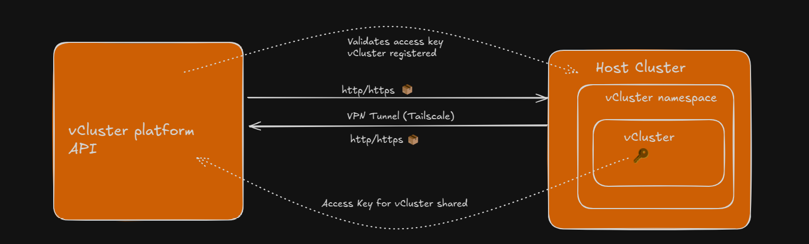
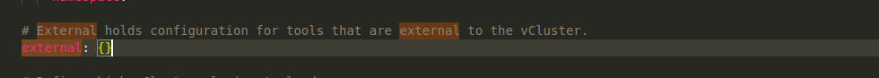

Several processes run in the background when a vCluster is created and needs to communicate with the platform. Let's explore what happens, which components are involved, and the key takeaways from the communication between the vCluster and the platform.

## Important Components in vCluster-Platform Communication

- **vCluster Platform / API**
- **vCluster**
- **Access Key**
- **VPN Tunnel**

## What is a VPN Tunnel?
A VPN tunnel is a secure connection between endpoints and the internet that keeps your data private. It helps safeguard your privacy and reduces the risk of hackers intercepting your information.

## What is VPN Mesh?
A VPN mesh is a secure, decentralized network where devices connect directly to each other using encrypted tunnels.

In cluster architecture, **VPN mesh (Tailscale)** secures communication between the vCluster platform and vClusters.

## Registering vCluster on Platform
Regardless of where the vCluster platform is deployed (same cluster as vCluster, a separate management cluster, or vCluster cloud), the key components for communication are the **platform and the API**.

The **vCluster always initiates communication** with the platform by providing its **access key**. Once the platform receives the access key, it **registers and validates the vCluster**.

Next, a **bi-directional VPN tunnel** is set up, enabling secure communication between the platform and the vCluster. It also works with all types of load balancers.

## vCluster Platform details
The endpoint and access key for the platform can be configured using Helm values as shown below:

## Key Takeaways

- **vCluster initiates communication** with the platform, making it an egress-only connection.
- The **platform and vClusters create a VPN mesh**.
- A **simple flat network topology** is used.

This explains how a vCluster is registered and how communication occurs between the platform and the vCluster.
