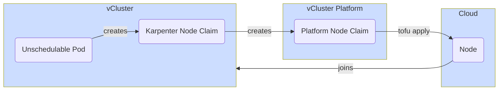

import PageVariables from '@site/src/components/PageVariables';
import InterpolatedCodeBlock from '@site/src/components/InterpolatedCodeBlock';

vCluster uses [Karpenter](https://karpenter.sh/docs/) to provision nodes. 
Karpenter is an open source node autoscaler built for Kubernetes which can dramatically improve the efficiency and cost of running workloads on that cluster. 

Karpenter works by:
* **Watching** for pods that the Kubernetes scheduler has marked as unschedulable
* **Evaluating** scheduling constraints (resource requests, nodeselectors, affinities, tolerations, and topology spread constraints) requested by the pods
* **Provisioning** nodes that meet the requirements of the pods
* **Disrupting** the nodes when the nodes are no longer needed

Under the hood, vCluster creates [Karpenter NodePools](https://karpenter.sh/docs/concepts/nodepools/) which are read-only to the end-users inside the vCluster.
When Karpenter finds unschedulable pods inside the vCluster or if there is a static node pool that does not have the desired quantity of nodes deployed, a new [Karpenter NodeClaim](https://karpenter.sh/docs/concepts/nodeclaims/)
is created. Out of the Karpenter node claim, vCluster will create a platform node claim, which then is assigned to a node type and provisioned by the node provider (e.g. terraform).
Terraform then creates a new node according to the specified terraform script and joins the node via [cloud-init](https://cloud-init.io/) into the vCluster.

<br />


For each node claim, Karpenter specifies the potentially fitting platform node types sorted by cost as well as the requested resources for the node. 
In addition, requirements within node pools can be defined by the user to filter node types, e.g. by region, cpu generation or custom defined properties.
The platform will then do the final scheduling based on Karpenter suggestions what node type to use and then ultimately provision.
The decided node type is then passed to the node provider which in turn creates the actual node based on the node type and joins it into the vCluster.

#### Scheduling Example

For example, when using the following `vcluster.yaml` configuration:
```yaml
privateNodes:
  enabled: true
  autoNodes:
    provider: my-node-provider
    properties:
      my-custom_property: my-value
    dynamic:
      - name: my-node-pool
```

The following Karpenter NodePool will get created:
```yaml
apiVersion: karpenter.sh/v1
kind: NodePool
metadata:
  name: my-node-pool
spec:
  template:
    metadata:
      labels:
        vcluster.loft.sh/provider-platform: my-node-provider
    spec:
      requirements:
        - key: my-custom-property
          operator: In
          values:
            - my-value
```

When Karpenter decides to create a new node, it will create a new node claim resource that looks like this (the `j6b8n` is an example of the 
auto-generated ID by Kubernetes):
```yaml
apiVersion: karpenter.sh/v1
kind: NodeClaim
metadata:
  name: my-node-pool-j6b8n
spec:
  requirements:
    - key: my-custom-property
      operator: In
      values:
        - my-value
    - key: node.kubernetes.io/instance-type
      operator: In
      values:
        - my-node-provider.large
        - my-node-provider.medium
  resources:
    requests:
      cpu: 120m
      memory: 114Mi
      pods: '5'
```

vCluster will then create a new platform node claim in the project the vCluster was created or connected to:
```yaml
apiVersion: management.loft.sh/v1
kind: NodeClaim
metadata:
  name: vcluster-62ftb
  namespace: p-default
spec:
  desiredCapacity:
    cpu: 120m
    memory: 114Mi
    pods: '5'
  requirements:
    - key: my-custom_property
      operator: In
      values:
        - my-value
    - key: node.kubernetes.io/instance-type
      operator: In
      values:
        - my-node-provider.large
        - my-node-provider.medium
  providerRef: my-node-provider
  vClusterRef: vcluster
```

Karpenter will only list the node types that would actually fit the desired capacity, so there might be a `my-node-provider.small` which would have been filtered out by Karpenter already.

The platform will then decide what node type to use based on the specified requirements and then set the `spec.typeRef` field. 
In this case it would use the `my-node-provider.medium` node type as that is cheaper than the large one an then create a node based with the node provider (e.g. through `tofu apply`).

:::warning
Additional workloads and pods might be introduced across different vCluster versions which would require additional resources. When auto node is enabled in older versions, 
the vCluster will automatically provision more nodes to meet the increased resource demands in newer versions.
:::