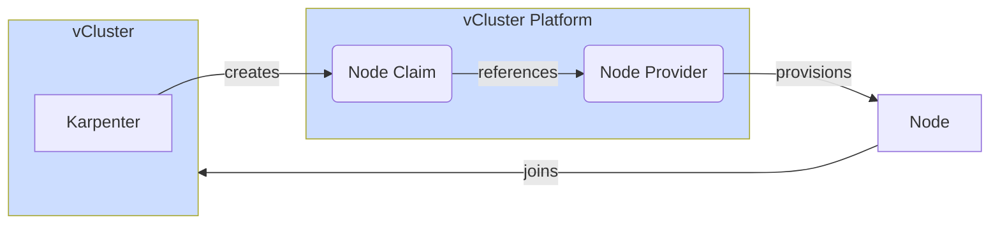

You can configure vCluster to automatically provision and join worker nodes based on the node and resource requirements. To use auto nodes, you need vCluster Platform installed and vCluster needs to be connected to it.

The feature is based on [Karpenter](https://karpenter.sh/), which is a cluster autoscaler for Kubernetes that chooses the best node for the requested amount of pods and resources. 
Karpenter is built into vCluster and does not need to be installed. This allows vCluster to use Karpenter to do the node management and scheduling. The 
provisioning of the nodes is handled by vCluster Platform. 

 

