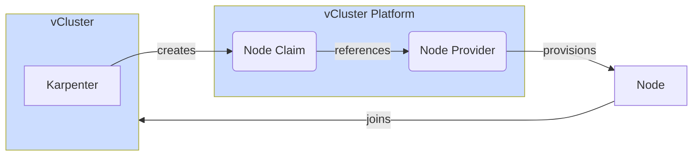

import AutoNodes from '../../_partials/config/privateNodes/autoNodes.mdx'

:::info vCluster Platform
To use auto nodes, you need vCluster Platform installed and the vCluster needs to be connected to the platform.
:::

Auto nodes allow you to automatically deploy and join worker nodes into the vCluster. 
The auto nodes feature is based on [Karpenter](https://karpenter.sh/) which is a next-gen cluster autoscaler for Kubernetes that always chooses the best fitting node for the requested amount of pods and resources.

Karpenter is built into vCluster itself and does not need to get installed. Instead vCluster uses Karpenter to do the node management and scheduling while the actual nodes will then be provisioned by vCluster platform. 
Before you can configure auto nodes in vCluster you need to configure at least on [Node Provider](/platform/next/administer/node-providers/overview) in vCluster platform. 

<br />


There is two types of node pools you can create:
* **static**: You define a fixed quantity of nodes to provision
* **dynamic**: You only define node type requirements without a fixed quantity of nodes and the in-built [Karpenter](https://karpenter.sh/) will automatically figure out how many nodes are needed

An example configuration with a static and dynamic node pool can look like this:
```yaml
privateNodes:
  # Private nodes need to be enabled for this feature to work
  enabled: true 
  autoNodes:
    # Fixed size node pool of 2
    static:
    - name: my-static-node-pool
      quantity: 2
      requirements:
      - property: vcluster.com/node-provider
        value: my-node-provider
    # Dynamic node pool
    dynamic:
    - name: my-dynamic-node-pool
      requirements:
      - property: vcluster.com/node-provider
        value: my-node-provider
```

:::info No vCluster restart required
Changing fields within `privateNodes.autoNodes` will not restart the vCluster even on a `helm upgrade`
:::

## Dynamic node pools

Dynamic node pools are powered by Karpenter and can be configured via the `privateNodes.autoNodes.dynamic` setting. Out of a dynamic node pool a [Karpenter Node Pool](https://karpenter.sh/docs/concepts/nodepools/) is created.

To configure a dynamic node pool that uses nodes from the node provider `my-node-provider`:
```yaml
privateNodes:
  # Private nodes need to be enabled for this feature to work
  enabled: true 
  autoNodes:
    dynamic:
    - name: my-dynamic-node-pool
      requirements:
      - property: vcluster.com/node-provider
        value: my-node-provider
```

### Disruption

Disruption configures how Karpenter should disrupt nodes and the config corresponds to the [Karpenter disruption config](https://karpenter.sh/docs/concepts/disruption/).
By default, Karpenter will disrupt nodes if they are empty or underutilized after 30 seconds of inactivity.

You can define more advanced ways of disruptions via schedules or budgets according to the [Karpenter config](https://karpenter.sh/docs/concepts/disruption/#nodepool-disruption-budgets):
```yaml
privateNodes:
  enabled: true
  autoNodes:
    dynamic:
    - name: my-dynamic-node-pool
      disruption:
        consolidationPolicy: WhenEmptyOrUnderutilized
        budgets:
        - nodes: "20%"
          reasons:
          - "Empty"
          - "Drifted"
        - nodes: "5"
        - nodes: "0"
          schedule: "@daily"
          duration: 10m
          reasons:
          - "Underutilized"
```

### Limits

Limits can be used as an upper limit for scheduling. These limits correspond to [Karpenter limits](https://karpenter.sh/docs/concepts/nodepools/#speclimits). Besides what Karpenter offers, it is also possible to specify `nodes` as a limit itself.

For example to configure a limit of 10 nodes or 100 cpus total:
```yaml
privateNodes:
  enabled: true 
  autoNodes:
    dynamic:
    - name: my-dynamic-node-pool
      limits:
        cpu: 100  # either combined amount of cpus across all nodes in this node pool
        nodes: 10 # or maximum amount of nodes
```

## Static node pools

Static node pools can be configured via the `privateNodes.autoNodes.static` option and are always created indepent of the actual required amount of nodes. They require a quantity and requirements. Since these are also Karpenter [NodeClaims](https://karpenter.sh/docs/concepts/nodeclaims/), Karpenter will take these into account when a dynamic node pool is configured as well.

To configure a static node pool that uses nodes from the node provider `my-node-provider`:
```yaml
privateNodes:
  # Private nodes need to be enabled for this feature to work
  enabled: true 
  autoNodes:
    static:
    - name: my-static-node-pool
      quantity: 2
      requirements:
      - property: vcluster.com/node-provider
        value: my-node-provider
```

## Requirements

Requirements on a node pool can be used to include or exclude certain node types. These allow you to select properties on node types via [Kubernetes set-based requirements](https://kubernetes.io/docs/concepts/overview/working-with-objects/labels/#set-based-requirement):

```yaml
privateNodes:
  enabled: true
  autoNodes:
    static:
      - name: my-static-pool
        requirements:
        # Exact match
        - property: my-property
          value: my-value
        # One of
        - property: my-property
          operator: In
          values: ["value-1", "value-2", "value-3"]
        # Not in
        - property: my-property
          operator: NotIn
          values: ["value-1", "value-2", "value-3"]
        # Exists
        - property: my-property
          operator: Exists
        # NotExists
        - property: my-property
          operator: NotExists
```

The following operators are available and supported:
* `In` (default): Matches one or multiple values on the node type
* `NotIn`: Matches if the given values aren't part of the properties
* `Exists`: Matches if the property is defined on the node type
* `NotExists`: Matches if the property is not defined on the node type

#### In-built properties

These properties are available on every node type:
* `vcluster.com/node-provider`: The name of the node provider to use. Makes it possible to map vCluster node pools to only use a specific node provider.
* `vcluster.com/node-type`: The name of the node type to use. Makes it possible to map vCluster node pools to only use a specific node type. Since node type names are globally unique, they also always map to a single node provider.
* `node.kubernetes.io/instance-type`: Same as `vcluster.com/node-type`, but just the official Kubernetes label.
* `kubernetes.io/os`: Currently is always fixed to `linux`.
* `topology.kubernetes.io/zone`: Maps to the `spec.zone` field of the node type. If unspecified, will be `global`.
* `karpenter.sh/capacity-type`: Currently always `on-demand` as we don't distinguish between capacity types for now.

## Taints and node labels

You can define taints and node labels for each node pool via the `taints` and `nodeLabels` fields which are useful to control scheduling on these nodes.

For example:
```yaml
privateNodes:
  enabled: true
  autoNodes:
    static:
      - name: my-static-pool
        quantity: 1
        nodeLabels:
          my-label: my-value
        taints:
        - key: my-taint
          effect: NoSchedule
    dynamic:
      - name: my-static-pool
        nodeLabels:
          my-label: my-value
        taints:
        - key: my-taint
          effect: NoSchedule

```

## Config reference

<AutoNodes />
