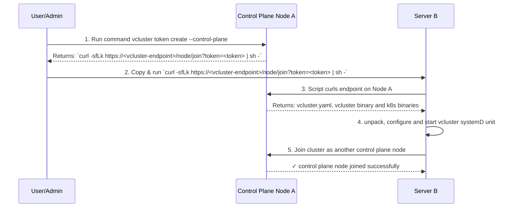

import ProAdmonition from '../_partials/admonitions/pro-admonition.mdx'

<ProAdmonition/>

## Standalone vCluster

Standalone mode allows you to spin up a new standalone cluster, which can be managed via vCluster Platform.
It is a regular Kubernetes control plane, with vCluster features on top. It runs on the VM or bare-metal node, and it is configured as a systemd service which uses single vCluster binary.

It provides the best isolation for you workloads, as they run on [private nodes](../configure/vcluster-yaml/private-nodes/README.mdx) instead of shared host cluster nodes.
It also enables new deploy topologies, where standalone control plane can run in isolated VM / bare-metal server, which is not exposed as a Kubernetes control plane node.

<br />

<center>
  
</center>


Syncing is disabled for standalone vCluster, as it does not run inside the host Kubernetes Cluster.

You can connect and manage standalone vCluster via vCluster Platform.

## Pre-requisites
- VirtualMachine or bare-metal server with SystemD installed (e.g. Ubuntu 24.04.2 LTS EC2 instance in AWS)
- root user access
- `curl` in stalled
- `https://github.com/loft-sh/vcluster/releases/download/<version>/install-standalone.sh` reachable from the VM

## Quickstart

Setting up vCluster standalone is easy and done with one script.

For this demo, you may use following `vcluster.yaml` configuration:

```yaml title="vcluster.yaml"
controlPlane:
  standalone:
    enabled: true
    joinNode:
      enabled: true
privateNodes:
  enabled: true
```

It enables standalone mode for vCluster, enables private nodes (so no worker nodes are available until you join them) and sets
`joinNode.enabled = true` which installs kubelet, kube-proxy and other Kubernetes node components on the control plane node and makes it available.
This means that once installation is done, you can see that there is one (control plane) node in the cluster.


### Install

Save this `vcluster.yaml` locally on the VM:
```bash title="save vcluster.yaml"
cat <<EOF > vcluster.yaml
controlPlane:
  standalone:
    enabled: true
    joinNode:
      enabled: true
privateNodes:
  enabled: true
EOF
```

:::tip
For following this quickstart tutorial, we recommend using Ubuntu 24.04.2 LTS.
vCluster.yaml is configured to join the node to the cluster, which uses `iptables` binaries (they are installed by default on Ubuntu, so no additional steps are needed).
:::

now, run the install script and pass created `vcluster.yaml` as a config:

```bash title="install standalone vCluster"
sudo su -
export VCLUSTER_VERSION="v0.26.0-beta.2"
curl -sfL https://github.com/loft-sh/vcluster/releases/download/${VCLUSTER_VERSION}/install-standalone.sh | sh -s -- --vcluster-name standalone --config ${PWD}/vcluster.yaml
```

:::tip
you can provide additional flags:
- `--vcluster-version` (specifies vCluster version)
- `--skip-download` when set, script is not pulling vCluster binary
- `--skip-wait` when set, script exits without waiting for vCluster being ready
- `--extra-env` extra environment variable for vCluster
- `--config` path to the `vcluster.yaml`
:::

:::tip
To connect standalone vCluster to the vCluster Platform, set following flags:
- `--platform-access-key` set to the Access Key generated via `vcluster platform create accesskey --vcluster-role`
- `--platform-host` your vCluster Platform host (has to be reachable from the VM)
- `--platform-insecure` sets `InsecureSkipTLSVerify` on the platform config
- `--platform-instance-name` sets Platform instance name
- `--platform-project` configure to which project your standalone cluster belongs
- `--vcluster-name` configure the name of your standalone vCluster in the vCluster Platform
:::

Install script pulls vCluster binary and configures a systemD service.
All Kubernetes control plane components are contained in the single vCluster binary.

### Check cluster readiness

To ensure that your VM correctly joined the cluster as a control plane node, check the node list using `kubectl`:

```bash title="Check node"
kubectl get nodes -A
```

You should see similar output (node with `Ready` status):
```bash title="Check node output"
NAME               STATUS   ROLES                  AGE   VERSION
ip-192-168-3-131   Ready    control-plane,master   11m   v1.32.1
```

### Run pod on your cluster

Now, your cluster can run pods. You can list pods:
```bash title="Get pods"
kubectl get pods -A
```

you should see that there are several pods running:
```bash title="Get pods output"
kubectl get pods -A
NAMESPACE            NAME                                      READY   STATUS    RESTARTS   AGE
kube-flannel         kube-flannel-ds-86k2s                     1/1     Running   0          15m
kube-system          coredns-94f599b5-g8wb7                    1/1     Running   0          16m
kube-system          konnectivity-agent-6df99d9c5c-cpv2l       1/1     Running   0          16m
kube-system          kube-proxy-wn4h2                          1/1     Running   0          15m
local-path-storage   local-path-provisioner-74f9666bc9-bstv4   1/1     Running   0          16m
```

These are Kubernetes node components:
- Flannel is a CNI which is installed by default (you can replace it with different one and disable Flannel installation)
- CoreDNS which provides DNS for your cluster
- KubeProxy, which handles network traffic routing and load balancing
- Konnectivity, which handles secure control plane to worker node communication
- Local Path Provisioner, which handles dynamic storage provisioning (PersistentVolumeClaims) using local storage

all of these (except CoreDNS) can be disabled in the private node configuration.
This is useful when user prefers to replace / configure node components by himself.

Check [Private node configuration options](../configure/vcluster-yaml/private-nodes/README.mdx#privateNodes) on how to disable them.

now, create a pod manifest and run in on your cluster:

```bash title="Create pod manifest"
cat <<EOF > pod.yaml
apiVersion: v1
kind: Pod
metadata:
  name: nginx
  labels:
    app: nginx
spec:
  containers:
    - image: nginx
      name: nginx
EOF
```

Create pod:

```bash title="Create pod"
kubectl create -f pod.yaml
```

wait for pod running:

```bash title="Wait for pod running"
kubectl wait --for=condition=Ready pod nginx
pod/nginx condition met
```

Delete your pod:

```bash title="Delete pod"
kubectl delete pod -f pod.yaml
```

Control plane nodes are usually reserved for running control plane components, but for the sake of simplicity in this section, you used it to run your workload.
In the usual scenario, you need to join worker nodes to the cluster to run your workloads.

### Join more nodes to the cluster

To join nodes to the standalone vCluster, API Server endpoint has to be reachable from the worker nodes.
There are multiple ways to expose it from the VM/EC2 Instance, you need to pick one that suits your needs and then re-install standalone vCluster with `controlPlane.endpoint` & `controlPlane.proxy.extraSANs` configured.

Once your standalone vCluster is installed on the node, you can add more worker nodes.
For more information, follow [Private Nodes](../configure/vcluster-yaml/private-nodes/README.mdx#join-worker-nodes) section.


### Troubleshoot

You can look up standalone vCluster logs using `journalctl`:

```bash title="Check vCluster logs"
$ journalctl -u vcluster.service --since="2 minutes ago" -f
```

## vCluster standalone HA

vCluster standalone high-availability can be achieved by running multiple control plane nodes and using embedded ETCD as a backing store.

:::warning
vCluster standalone high-availability uses embedded ETCD as a backing store. Other backing-store options are currently not supported.
:::

### Provision first control plane node

Enable embedded etcd in `vcluster.yaml`:
```yaml title="vcluster.yaml"
controlPlane:
  backingStore:
    etcd:
      embedded:
        enabled: true
```

optionally, if you want to have control plane nodes visible via API Server, add:

```yaml title="vcluster.yaml"
controlPlane:
  standalone:
    joinNode:
      enabled: true
```

and follow instructions on [Install](#install) section.

Once your first control plane node is up and running, you can proceed to adding more control plane nodes.

### Add control plane node

Adding control plane workflow is designed to work in the air-gapped environments. It requires a network connection only to the existing control plane node.

### Pre-requisites
- VirtualMachine or bare-metal server with SystemD installed
- root user access
- `curl`
- existing vCluster control plane standalone endpoint accessible from the VM / server


### Workflow


#### Create control plane join token

Make sure your kube config context is set to the vCluster standalone context.

Then, generate a join token for another control plane node:

```shell title="generate join token"
vcluster token create --control-plane
```

:::tip
You can specify expiry for the join token, by using `--expires=24h` flag on the token create command.
:::

it outputs similar command:

```shell title="join command"
curl -sfLk https://<vcluster-endpoint>/node/join?token=<token> | sh -
```

copy it.

#### Join another control plane node

Now, in the terminal of the server you want to join as a node, execute copied command:

```shell title="join control plane node"
curl -sfLk https://<vcluster-endpoint>/node/join?token=<token> | sh -
```

this outputs:

```shell
🔄 Downloading vCluster control plane bundle...
adding 10.244.0.5 to /var/lib/vcluster/peers.txt
🔄 Creating systemd service file /etc/systemd/system/vcluster.service
🔄 Starting vcluster...
Created symlink /etc/systemd/system/multi-user.target.wants/vcluster.service → /etc/systemd/system/vcluster.service.
✅ Successfully installed vcluster
🔄 vCluster is initializing...
🔄 vCluster is initializing...
✅ vCluster is ready. Use 'kubectl get pods' to access the vCluster.
```

then, you can interact with API Server using `kubectl`. If you enabled `controlPlane.standalone.joinNode.enabled: true` in `vcluster.yaml`, node is reported as ready:
```shell
kubectl get nodes
NAME         STATUS     ROLES               AGE   VERSION
node-2       Ready   control-plane,master   29m   v1.32.1
node-1       Ready   control-plane,master   45m   v1.32.1
```

### Remove control plane node

Removing control plane node differs depending on the node being part of the cluster (check if `controlPlane.standalone.joinNode.enabled` is true in `vcluster.yaml`).
If your control plane node is joined as a node, follow the steps described in [Removing worker node](../configure/vcluster-yaml/private-nodes/README.mdx#remove-worker-node).

Otherwise, only following steps are needed:

1. Stop vCluster standalone systemD service:
```shell title="stop vcluster.service"
systemctl stop vcluster.service
```

2. Remove vCluster related files:
```shell title="remove vCluster files"
rm -rf /var/lib/vcluster && rm /etc/systemd/system/vcluster.service
```


