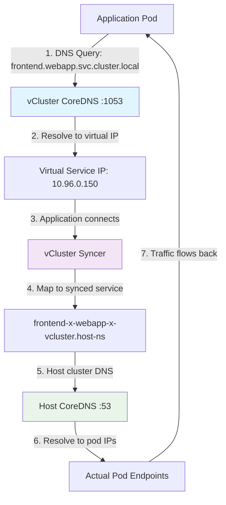
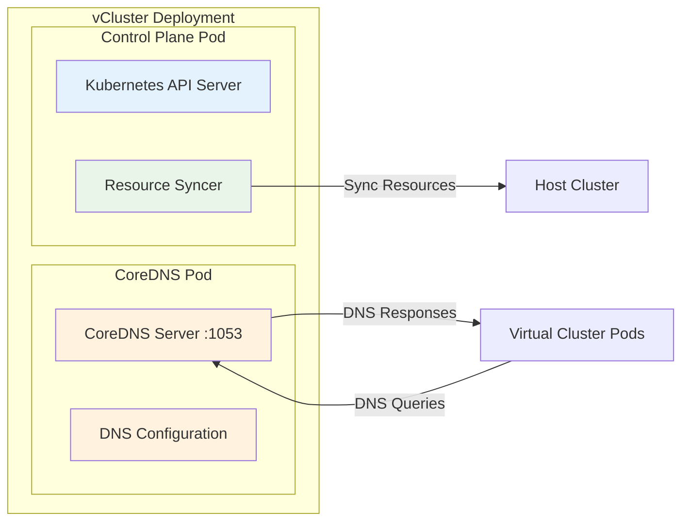
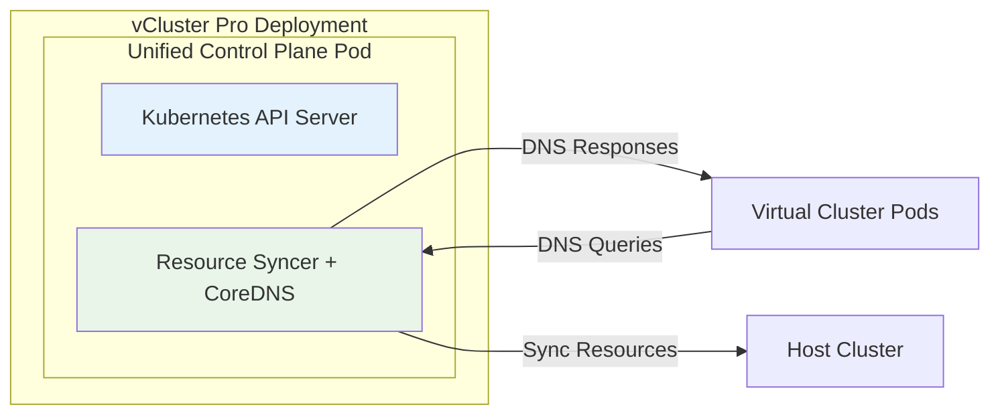
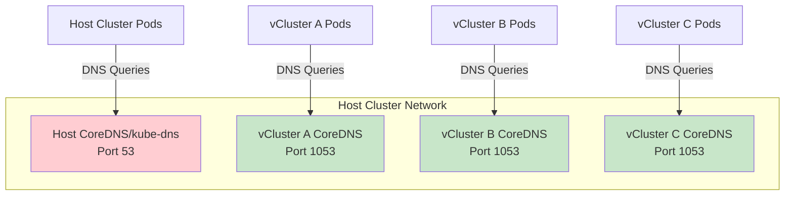
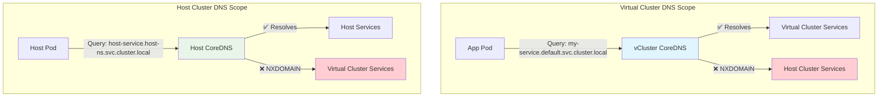

import CoreDNS from '../../../../_partials/config/controlPlane/coredns.mdx'
import ProAdmonition from '../../../../_partials/admonitions/pro-admonition.mdx'

<ProAdmonition/>


Each vCluster instance operates with its own DNS service, typically CoreDNS. Pods and services within each virtual cluster can discover each other using familiar Kubernetes DNS names such as `my-service.default.svc.cluster.local`. Each virtual cluster maintains its own separate DNS view, which means applications running in different virtual clusters cannot accidentally discover or access each other's services, even though they share the same underlying host cluster infrastructure

The DNS system in vCluster serves multiple critical functions that go beyond simple name resolution. It maintains the familiar Kubernetes DNS patterns that applications expect, ensuring that service discovery works exactly as it would in a standalone Kubernetes cluster. When a pod queries for a service like `my-app.default.svc.cluster.local`, the CoreDNS instance returns an IP address that appears to be a normal cluster service IP, even though the underlying infrastructure involves complex resource synchronization between the virtual and host clusters.

The vCluster syncer ensures that intuitive Kubernetes DNS naming logic applies, allowing users to connect to DNS names that map to synchronized services in the host cluster. This synchronization happens transparently, so applications running in virtual clusters experience normal Kubernetes networking behavior without any awareness of the underlying virtual cluster architecture.

## How DNS resolution works in vCluster

DNS resolution in vCluster involves a multi-stage process that maintains Kubernetes compatibility while managing the virtual-to-physical resource mapping. This ensures apps receive expected DNS responses while the infrastructure handles routing to actual host cluster resources.



When an application pod initiates a DNS query, the request travels to the virtual clusters's CoreDNS instance listening on port 1053. This CoreDNS maintains a complete view of all services that exist within the virtual cluster's namespace scope and resolves queries to virtual IP addresses that exist only within the context of that specific virtual cluster.

The application then attempts to establish a connection to the resolved virtual IP address. At this point, the vCluster syncer component intercepts the network traffic and performs the translation between virtual cluster resources and their corresponding sync resources in the host cluster. The syncer understands the mapping between virtual services and host services, which typically have names that include prefixes and suffixes to ensure uniqueness across multiple virtual clusters sharing the same host infrastructure.

After the syncer translates the virtual service reference to the actual host cluster service name, the host cluster's DNS system takes over and performs standard Kubernetes service resolution. This resolves to the actual pod IP addresses that serve the application traffic.

## Deployment architectures

vCluster supports two distinct CoreDNS deployment models.

### Separate CoreDNS deployment

A normal vCluster deployment consists of two pods per vCluster instance: the vCluster pod containing the API server and syncer components, and a separate CoreDNS pod.



The separate deployment model isolates DNS operations from the critical API server and sync functions. This prevents resource contention between these different types of workloads. DNS operations typically involve different performance characteristics than API server operations, with DNS requiring consistent low-latency responses while API operations may involve more complex processing and variable response times.

This isolation provides some operational benefits for production environments. DNS issues can be debugged, updated, or restarted independently without affecting the virtual cluster's control plane availability. Resource allocation can be tuned specifically for DNS workloads, which may require different CPU and memory profiles than the API server and syncer components.

The separate model also simplifies monitoring and observability since DNS metrics, logs, and performance characteristics can be tracked independently. This separation becomes particularly valuable when scaling operations, as DNS and control plane components may need different horizontal scaling strategies based on their respective workload patterns.

### Integrated CoreDNS deployment with vCluster Pro

The integrated CoreDNS feature allows you to run CoreDNS as part of the syncer, which saves the overhead of an external CoreDNS pod. This Pro feature consolidates all three vCluster components into a single pod, creating a more resource-efficient deployment model.



This integration provides benefits including avoiding cluster max pods limits and optimized resource allocation where more components share allocated resources instead of having independently allocated resources, reducing wastage due to bin-packing constraints. The unified approach particularly benefits environments where pod limits present operational constraints or where resource optimization is a primary concern.

The integrated model reduces memory overhead by sharing certain base system libraries and runtime environments between the syncer and DNS components. Network communication between DNS and syncer functions becomes more efficient since they operate within the same process space, eliminating inter-pod networking overhead.

However, the integrated approach requires careful consideration of operational trade-offs. Troubleshooting may become more complex since DNS and synchronization functions share the same container and process space. Resource allocation must account for the combined workload of both DNS and syncer operations, which may require different tuning approaches compared to separate deployments.

## Why CoreDNS uses port 1053

CoreDNS in vCluster listens on port 1053 instead of the default DNS port 53 to avoid conflicts with the host cluster's DNS. This port selection addresses several technical and operational challenges inherent in running DNS services within virtual cluster environments.



The host cluster already operates its own DNS service on the standard port 53, making it impossible for virtual cluster DNS services to bind to the same port. Since multiple virtual clusters may run on the same host cluster, each requires its own DNS service that operates independently without interfering with either the host DNS or other virtual cluster DNS instances.

Port 53 is classified as a privileged port on most operating systems, requiring elevated permissions to bind to it. By using port 1053, CoreDNS containers can operate with standard user privileges, aligning with security best practices for containerized applications. This approach reduces the attack surface and eliminates the need for special security contexts or capabilities that would be required to bind to privileged ports.

The non-standard port also simplifies network policy management and firewall configuration. Network administrators can easily distinguish between host cluster DNS traffic on port 53 and virtual cluster DNS traffic on port 1053, enabling more granular security policies and clearer traffic analysis for troubleshooting purposes.

### Cloud provider networking considerations

Different cloud providers have varying network policies that can affect DNS traffic on port 1053, particularly EKS clusters where DNS queries might fail when pods are scheduled on different nodes. Understanding these provider-specific requirements is essential for ensuring reliable DNS operation.

EKS clusters created with Terraform often set up separate security groups for control plane and worker nodes, and the default node security group does not allow inbound traffic on port 1053. This configuration can cause DNS resolution failures when CoreDNS pods and application pods are scheduled on different nodes, since the DNS queries cannot reach the CoreDNS service across node boundaries.

Google GKE typically allows internal cluster traffic by default, but organizations with custom firewall policies may need to explicitly permit UDP traffic on port 1053 between cluster nodes. GKE's network policies, when enabled, require specific ingress rules to allow DNS traffic to flow correctly between pods and CoreDNS instances across different nodes.

Azure AKS generally permits internal cluster communication through its default network security groups, but enterprises with advanced networking configurations may need to verify that port 1053 traffic is allowed. AKS clusters using custom virtual networks or restrictive network policies may require additional configuration to ensure DNS traffic operates correctly.

## DNS isolation and limitations

Virtual cluster DNS isolation serves as both a security feature and an operational constraint that developers and operators must understand when designing applications and implementing service communication patterns. This isolation maintains clear boundaries between virtual clusters while creating specific challenges for cross-cluster communication.

### Understanding DNS boundaries

Virtual clusters cannot directly access host services via DNS, and host cluster pods can only access virtual cluster services by their synced name. This limitation is intentional and maintains the security and isolation guarantees that make virtual clusters suitable for multi-tenant environments.



When a pod inside a virtual cluster attempts to resolve a DNS name for a service that exists only in the host cluster, the vCluster CoreDNS instance returns an NXDOMAIN response because it maintains no knowledge of host cluster resources. This behavior ensures that virtual clusters cannot accidentally discover or access resources they should not have permission to use.

The isolation extends beyond services to include all network-discoverable resources in the host cluster. Virtual cluster applications cannot resolve DNS names for host cluster ingresses, external services, or any other resources that exist outside their virtual cluster boundary. This creates a clean separation that prevents information leakage and unauthorized access between tenants.

Similarly, applications running directly in the host cluster cannot resolve virtual cluster services using their virtual names. Host cluster applications can only access virtual cluster services by using the synchronized service names, which include prefixes and suffixes that identify the virtual cluster instance. This naming scheme ensures that host cluster applications must explicitly reference virtual cluster resources rather than accidentally discovering them through DNS queries.

### Service mapping strategies

Several patterns enable controlled communication between virtual clusters and host cluster services while maintaining appropriate security boundaries. These strategies range from simple DNS aliasing to sophisticated resource synchronization approaches.

External name services provide the most straightforward approach for mapping host cluster services into a virtual cluster's DNS namespace. This pattern creates a virtual cluster service that acts as a DNS alias, allowing applications to use familiar service names while the underlying traffic routes to host cluster resources.

```yaml title="External name service configuration"
apiVersion: v1
kind: Service
metadata:
  name: database-proxy
  namespace: my-application
spec:
  type: ExternalName
  externalName: postgres.data-tier.svc.cluster.local
  ports:
  - port: 5432
    targetPort: 5432
    protocol: TCP
```

This configuration creates a service named `database-proxy` that applications can access using normal Kubernetes DNS patterns. When applications connect to `database-proxy.my-application.svc.cluster.local`, the DNS resolution returns the host cluster service `postgres.data-tier.svc.cluster.local`, and traffic flows to the host cluster database service.

Resource synchronization offers a more sophisticated approach by importing actual host cluster services into the virtual cluster namespace. This pattern uses vCluster's synchronization capabilities to create mirror services that represent host cluster resources with full Kubernetes service features.

```yaml title="Resource synchronization configuration"
sync:
  fromHost:
    services:
      enabled: true
      selector:
        matchLabels:
          vcluster.loft.sh/import: "true"
    endpoints: true
```

When configured with this synchronization pattern, vCluster imports services from the host cluster that match the specified label selector. The imported services appear as native virtual cluster services with complete endpoints and all standard Kubernetes service capabilities, enabling full integration with service mesh technologies, network policies, and other Kubernetes-native tools.

## CoreDNS configuration patterns

CoreDNS configuration in vCluster supports extensive customization that enables operators to adapt DNS behavior for specific environments, integrate with existing infrastructure, and optimize performance for particular workloads. Understanding these configuration patterns helps in implementing sophisticated DNS policies and troubleshooting complex networking scenarios.

### Basic CoreDNS setup

The fundamental CoreDNS configuration provides essential DNS functionality with sensible defaults that work for most virtual cluster deployments. This configuration includes core plugins for resolution, health monitoring, and basic observability.

```yaml title="Basic CoreDNS configuration"
coredns:
  enabled: true
  replicas: 1
  resources:
    requests:
      cpu: 20m
      memory: 32Mi
    limits:
      cpu: 100m
      memory: 128Mi
  plugins:
    errors: true
    health: true
    prometheus:
      enabled: true
      port: 9153
```

This configuration allocates minimal but sufficient resources for DNS operations in small to medium virtual clusters. The resource requests ensure that CoreDNS receives guaranteed CPU and memory allocation, providing consistent performance even when the host cluster experiences resource pressure. The limits prevent DNS operations from consuming excessive resources that could impact other cluster components.

The plugin configuration enables error logging and health checking, which are essential for operational monitoring and troubleshooting. Prometheus metrics provide observability into DNS query patterns, response times, and error rates, enabling proactive monitoring and performance optimization based on actual usage patterns.

### Private registry configuration

Organizations with security policies or compliance requirements often need to deploy CoreDNS images from private container registries. This configuration pattern demonstrates the necessary image pull settings and authentication mechanisms.

```yaml title="Private registry CoreDNS configuration"
coredns:
  image:
    repository: registry.company.com/security/coredns
    tag: "1.10.1-hardened"
    pullPolicy: Always
  imagePullSecrets:
    - name: company-registry-credentials
  nodeSelector:
    node-role.kubernetes.io/system: "true"
  tolerations:
    - key: "node-role.kubernetes.io/system"
      operator: "Equal"
      value: "true"
      effect: "NoSchedule"
```

This configuration specifies a custom registry location with organization-specific image tags that may include security patches, compliance modifications, or other customizations. The `pullPolicy` setting ensures that image updates are retrieved promptly, which is particularly important for security patches and updates.

The `imagePullSecrets` reference provides authentication credentials for accessing the private registry. These secrets must be created in the vCluster namespace with appropriate authentication tokens or certificates. The node selector and tolerations ensure that CoreDNS pods are scheduled on nodes that have access to the private registry and any required network policies or firewall configurations.

### Advanced DNS configuration with custom zones

Advanced CoreDNS configurations enable sophisticated DNS routing, custom domain handling, and integration with external DNS systems. These configurations support complex networking environments with multiple DNS domains, upstream servers, and specialized routing requirements.

```yaml title="Advanced CoreDNS with custom zones"
coredns:
  overwriteConfig: |
    .:1053 {
        errors
        health {
            lameduck 5s
        }
        ready
        kubernetes cluster.local in-addr.arpa ip6.arpa {
            pods insecure
            fallthrough in-addr.arpa ip6.arpa
            ttl 30
        }
        hosts /etc/coredns/NodeHosts {
            ttl 60
            reload 15s
            fallthrough
        }
        prometheus :9153
        forward . /etc/resolv.conf {
            max_concurrent 1000
            except cluster.local
        }
        cache 300 {
            success 9984 30
            denial 9984 5
            prefetch 10 60s 30%
        }
        loop
        reload
        loadbalance
    }
    
    company.internal:1053 {
        forward . 10.100.0.53 10.100.0.54
        cache 600
        errors
    }
    
    external-services.com:1053 {
        forward . 8.8.8.8 1.1.1.1
        cache 120
        errors
    }
```

This advanced configuration demonstrates multiple DNS zones with different handling characteristics. The main zone handles standard Kubernetes DNS resolution with optimized settings for concurrent queries, appropriate caching, and performance tuning. The health check configuration includes lame duck periods to ensure graceful shutdowns during updates or maintenance operations.

The custom zones show how to handle corporate internal domains and specific external domains with different upstream DNS servers. The `company.internal` zone forwards queries to corporate DNS servers with longer cache times, enabling efficient resolution of internal company resources. The `external-services.com` zone uses public DNS servers with moderate caching for external service resolution.

Cache configuration in this example includes sophisticated settings for different query types, prefetch capabilities to proactively refresh frequently-queried names, and size limits to prevent memory exhaustion. These settings can be adjusted based on observed DNS query patterns and performance requirements specific to the applications running in the virtual cluster.

### Integrated CoreDNS configuration

vCluster Pro's integrated CoreDNS feature combines CoreDNS functionality within the syncer container, reducing the pod footprint while maintaining full DNS capabilities. This configuration requires vCluster Pro and provides optimization for resource-constrained environments.

```yaml title="Integrated CoreDNS Pro configuration"
pro: true
controlPlane:
  coredns:
    embedded: true
    resources:
      requests:
        cpu: 10m
        memory: 16Mi
      limits:
        cpu: 50m
        memory: 64Mi
    plugin:
      enabled: true
      config: |
        .:1053 {
            errors
            health
            ready
            kubernetes cluster.local {
                pods insecure
                fallthrough
            }
            forward . /etc/resolv.conf
            cache 30
            loop
            reload
        }
```

The integrated configuration reduces total resource allocation since DNS and syncer functions share the same container runtime environment. This approach is particularly beneficial in environments where pod limits constrain the number of virtual clusters that can be deployed, or where resource optimization is a primary concern.

The embedded configuration maintains full CoreDNS functionality while operating within the syncer process. Custom DNS policies, upstream forwarding, and caching configurations remain fully supported in the integrated model, providing the same flexibility as separate deployments with reduced operational overhead.

## Troubleshooting DNS issues

DNS problems in vCluster environments can manifest in various ways, from complete service discovery failures to intermittent connectivity issues. Systematic troubleshooting approaches help identify root causes quickly and implement appropriate solutions that restore normal operation.

### Diagnosing resolution failures

DNS resolution failures typically present as applications being unable to connect to services, with error messages indicating that hostnames cannot be resolved. The troubleshooting process begins with verifying basic DNS infrastructure health and progresses through increasingly specific diagnostic tests.

The first diagnostic step involves checking CoreDNS pod status and examining logs for error messages that might indicate configuration problems, resource constraints, or runtime issues.

```bash title="Basic CoreDNS health checks"
# Verify CoreDNS pod status
kubectl get pods -l app=vcluster-coredns -n vcluster-my-cluster

# Examine CoreDNS logs for errors
kubectl logs -l app=vcluster-coredns -n vcluster-my-cluster --tail=100

# Check CoreDNS configuration
kubectl get configmap coredns -n vcluster-my-cluster -o yaml
```

Testing DNS resolution from within the virtual cluster helps determine whether issues affect all DNS queries or only specific services. These tests should include both system services that are always present and application-specific services to isolate the scope of the problem.

```bash title="DNS resolution testing"
# Create a test pod for DNS diagnostics
kubectl run dns-test --image=busybox:1.35 --restart=Never -- sleep 3600

# Test system service resolution
kubectl exec dns-test -- nslookup kubernetes.default.svc.cluster.local

# Test application service resolution
kubectl exec dns-test -- nslookup my-app.my-namespace.svc.cluster.local

# Test external domain resolution
kubectl exec dns-test -- nslookup google.com
```

If DNS queries succeed for system services but fail for application services, the issue likely involves service configuration or synchronization problems rather than fundamental DNS infrastructure failures. Conversely, if all DNS queries fail, the problem probably involves CoreDNS configuration, networking, or resource constraints.

### Network connectivity troubleshooting

Network connectivity issues can prevent DNS queries from reaching CoreDNS or block CoreDNS from communicating with upstream DNS servers. These problems often manifest as DNS timeouts rather than immediate resolution failures, making them more difficult to diagnose.

Testing network connectivity to the CoreDNS service helps identify whether DNS queries can reach the DNS service on port 1053. Network policy restrictions, firewall rules, or security group configurations may block this traffic, particularly in cloud environments with restrictive default settings.

```bash title="Network connectivity diagnostics"
# Test UDP connectivity to CoreDNS service
kubectl exec dns-test -- nc -u -v coredns.kube-system.svc.cluster.local 1053

# Monitor CoreDNS logs while generating queries
kubectl logs -l app=vcluster-coredns -n vcluster-my-cluster --tail=0 -f &
kubectl exec dns-test -- nslookup test.example.com

# Test upstream DNS connectivity from CoreDNS
kubectl exec -it $(kubectl get pod -l app=vcluster-coredns -n vcluster-my-cluster -o name) -n vcluster-my-cluster -- nslookup google.com 8.8.8.8
```

EKS environments commonly experience DNS issues when CoreDNS pods and application pods are scheduled on different nodes, requiring manual security group updates to allow traffic on port 1053. This specific problem can be diagnosed by checking whether DNS queries succeed when pods are on the same node but fail when they are on different nodes.

Monitoring CoreDNS logs while generating test queries reveals whether queries reach the CoreDNS service. If queries appear in the logs but resolution fails, the issue likely involves CoreDNS configuration or upstream connectivity. If queries do not appear in the logs, network connectivity or routing problems are the likely cause.

### Performance and resource issues

DNS performance problems can manifest as slow application startup times, intermittent connection failures, or degraded application responsiveness. These issues often correlate with high DNS query volumes, insufficient CoreDNS resources, or suboptimal caching configurations.

Resource monitoring helps identify whether CoreDNS pods are approaching their CPU or memory limits, which can cause query processing delays or complete failures. High resource usage may indicate the need for resource limit adjustments, horizontal scaling, or optimization of DNS query patterns.

```bash title="Performance monitoring and analysis"
# Monitor CoreDNS resource usage
kubectl top pods -l app=vcluster-coredns -n vcluster-my-cluster

# Examine DNS query metrics
kubectl port-forward svc/coredns -n vcluster-my-cluster 9153:9153
curl http://localhost:9153/metrics | grep coredns_dns

# Analyze DNS query patterns in logs
kubectl logs -l app=vcluster-coredns -n vcluster-my-cluster | grep -E "(AAAA|A)" | head -100
```

DNS metrics from the Prometheus endpoint provide detailed information about query rates, response times, error rates, and cache performance. High query rates combined with slow response times may indicate insufficient resources or inefficient cache configurations. Elevated error rates help identify whether performance issues are causing query failures.

Analyzing DNS query patterns in the logs helps identify whether applications are making inefficient DNS queries, such as repeated queries for the same hostname or queries for non-existent services. These patterns may indicate opportunities for application optimization, DNS cache tuning, or configuration adjustments that reduce unnecessary DNS load.

## Performance optimization strategies

CoreDNS performance optimization in vCluster environments requires understanding DNS query patterns, resource allocation strategies, and configuration tuning approaches that balance performance with resource consumption and operational complexity.

### Resource allocation optimization

Resource allocation for CoreDNS must account for the specific query patterns and performance requirements of applications running in the virtual cluster. Different workloads generate varying DNS query volumes and have different latency tolerance levels that influence optimal resource sizing.

```yaml title="Optimized resource allocation"
coredns:
  resources:
    requests:
      cpu: 100m      # Guaranteed CPU for consistent performance
      memory: 128Mi  # Base memory for cache and processing
    limits:
      cpu: 500m      # Burst capacity for high query volumes
      memory: 512Mi  # Prevent memory exhaustion under load
  
  # Horizontal scaling for high-traffic environments
  replicas: 2
  
  # Pod anti-affinity for distribution
  affinity:
    podAntiAffinity:
      preferredDuringSchedulingIgnoredDuringExecution:
      - weight: 100
        podAffinityTerm:
          labelSelector:
            matchLabels:
              app: vcluster-coredns
          topologyKey: kubernetes.io/hostname
```

The resource requests ensure that CoreDNS receives guaranteed CPU and memory allocation, providing consistent performance even when the host cluster experiences resource pressure. CPU requests should be sized based on observed query rates and desired response times, with higher values needed for environments with high query volumes or strict latency requirements.

Memory allocation must accommodate DNS cache storage, query processing buffers, and the CoreDNS process overhead. Insufficient memory leads to cache evictions that reduce performance, while excessive memory allocation wastes cluster resources. Monitoring actual memory usage patterns over time helps determine optimal allocation levels that balance performance and efficiency.

Running multiple CoreDNS replicas provides horizontal scaling that improves both performance and availability. Pod anti-affinity rules ensure that replicas are distributed across different nodes, reducing the impact of node failures and potentially improving query response times by placing DNS services closer to application pods.

### Cache configuration tuning

DNS cache configuration significantly impacts both performance and resource usage. Appropriate cache settings reduce upstream DNS queries, improve response times, and reduce load on both CoreDNS instances and upstream DNS servers.

```yaml title="Advanced cache configuration"
coredns:
  overwriteConfig: |
    .:1053 {
        errors
        health
        ready
        kubernetes cluster.local in-addr.arpa ip6.arpa {
            pods insecure
            fallthrough in-addr.arpa ip6.arpa
            ttl 30
        }
        prometheus :9153
        forward . /etc/resolv.conf {
            max_concurrent 1000
        }
        cache 300 {
            success 9984 30
            denial 9984 5
            prefetch 10 60s 30%
        }
        loop
        reload
        loadbalance
    }
```

This cache configuration specifies different cache behaviors for successful and failed DNS queries. Successful queries are cached for longer periods because successful resolutions are likely to be queried again by the same or different applications. Failed queries use shorter cache periods to allow quick recovery when services become available or configuration issues are resolved.

The prefetch configuration enables proactive cache refreshing for frequently queried names. When a cached entry approaches expiration and has been queried recently, CoreDNS proactively refreshes the cache entry before it expires. This approach reduces the likelihood that applications experience DNS resolution delays due to cache misses during normal operation.

Cache size limits prevent memory exhaustion while providing sufficient capacity for typical workloads. The cache size should be adjusted based on the number of unique DNS names queried by applications and available memory resources. Monitoring cache hit rates and eviction rates helps determine whether cache sizes are appropriate for the workload characteristics.

## Production deployment best practices

Production CoreDNS deployments in vCluster environments require careful attention to reliability, security, monitoring, and operational procedures. These practices help ensure stable DNS resolution while minimizing operational complexity and security risks.

### High availability configuration

DNS service availability is critical because DNS failures can render entire applications unusable. Implementing redundancy and resilience patterns ensures consistent DNS availability even during maintenance events, infrastructure failures, or unexpected load spikes.

```yaml title="High availability CoreDNS configuration"
coredns:
  replicas: 3
  
  # Pod disruption budget for maintenance operations
  podDisruptionBudget:
    enabled: true
    minAvailable: 2
  
  # Anti-affinity for node distribution
  affinity:
    podAntiAffinity:
      requiredDuringSchedulingIgnoredDuringExecution:
      - labelSelector:
          matchLabels:
            app: vcluster-coredns
        topologyKey: kubernetes.io/hostname
  
  # Resource allocation for stable performance
  resources:
    requests:
      cpu: 100m
      memory: 128Mi
    limits:
      cpu: 200m
      memory: 256Mi
  
  # Topology spread for even distribution
  topologySpreadConstraints:
    - maxSkew: 1
      topologyKey: kubernetes.io/hostname
      whenUnsatisfiable: DoNotSchedule
      labelSelector:
        matchLabels:
          app: vcluster-coredns
```

Running multiple CoreDNS replicas provides redundancy that ensures DNS availability even when individual pods fail, are updated, or experience resource constraints. The pod disruption budget limits the number of CoreDNS pods that can be unavailable simultaneously during voluntary disruptions such as node maintenance or cluster upgrades.

Anti-affinity rules ensure that CoreDNS pods are distributed across different nodes, preventing single node failures from affecting all DNS services. This distribution also improves performance by reducing network latency for DNS queries, since applications are more likely to have a CoreDNS instance on the same node or nearby nodes.

Topology spread constraints provide additional control over pod distribution, ensuring that CoreDNS pods are evenly distributed across available nodes. This distribution improves resilience and can optimize performance by balancing DNS query load across the cluster infrastructure.

### Security hardening

DNS services present potential security risks that must be addressed through appropriate security configurations, access controls, and monitoring. Security hardening focuses on reducing attack surfaces, implementing least-privilege principles, and ensuring DNS integrity.

```yaml title="Security-hardened CoreDNS configuration"
coredns:
  securityContext:
    runAsNonRoot: true
    runAsUser: 1000
    fsGroup: 1000
    capabilities:
      drop:
        - ALL
    readOnlyRootFilesystem: true
    allowPrivilegeEscalation: false
  
  # Network policies for traffic restriction
  networkPolicy:
    enabled: true
    ingress:
      - from:
        - podSelector: {}
        ports:
        - protocol: UDP
          port: 1053
        - protocol: TCP
          port: 9153
    egress:
      - to: []
        ports:
        - protocol: UDP
          port: 53
        - protocol: TCP
          port: 53
```

The security context configuration ensures that CoreDNS runs with minimal privileges, reducing the potential impact of security vulnerabilities. Running as a non-root user and dropping all capabilities prevents privilege escalation attacks, while the read-only root filesystem prevents malicious code from modifying the container filesystem.

Network policies implement defense-in-depth security principles by restricting network access to and from CoreDNS pods. Ingress policies limit which pods can access DNS services, while egress policies control which external services CoreDNS can communicate with for upstream DNS resolution. These restrictions help contain potential security incidents and provide clearer audit trails for network access.

Regular security updates and vulnerability scanning help ensure that CoreDNS deployments do not contain known vulnerabilities. Using specific image tags rather than latest tags provides better control over deployed versions and enables systematic update processes that can be tested and validated before production deployment.

### Monitoring and observability

Comprehensive monitoring enables proactive identification of DNS issues and provides the data needed for performance optimization, capacity planning, and incident response. Monitoring should cover DNS-specific metrics, general infrastructure health, and application-level indicators.

```yaml title="Comprehensive monitoring configuration"
coredns:
  # Enable Prometheus metrics
  prometheus:
    enabled: true
    port: 9153
    
  # Service monitor for automatic discovery
  serviceMonitor:
    enabled: true
    interval: 30s
    scrapeTimeout: 10s
    labels:
      monitoring: enabled
  
  # Alerting rules for proactive monitoring
  prometheusRule:
    enabled: true
    groups:
    - name: coredns
      rules:
      - alert: CoreDNSDown
        expr: up{job="coredns"} == 0
        for: 5m
        labels:
          severity: critical
        annotations:
          summary: "CoreDNS instance is down"
          description: "CoreDNS instance {{ $labels.instance }} has been down for more than 5 minutes"
      
      - alert: CoreDNSHighErrorRate
        expr: rate(coredns_dns_responses_total{rcode!="NOERROR"}[5m]) / rate(coredns_dns_responses_total[5m]) > 0.1
        for: 2m
        labels:
          severity: warning
        annotations:
          summary: "High DNS error rate detected"
          description: "DNS error rate is {{ $value | humanizePercentage }} for the last 2 minutes"
      
      - alert: CoreDNSHighLatency
        expr: histogram_quantile(0.99, rate(coredns_dns_request_duration_seconds_bucket[5m])) > 0.1
        for: 5m
        labels:
          severity: warning
        annotations:
          summary: "High DNS query latency detected"
          description: "99th percentile DNS latency is {{ $value }} seconds"
```

Service monitor configuration enables Prometheus to automatically discover and scrape DNS metrics, providing visibility into query rates, response times, error rates, and cache performance. The scrape interval balances monitoring granularity with the overhead of metrics collection, providing sufficient detail for operational needs without excessive resource consumption.

Alerting rules provide automated notification of DNS issues before they impact applications. Critical alerts for service availability enable rapid response to complete DNS failures, while warning alerts for error rates and performance degradation enable proactive intervention before issues become severe. The alert thresholds should be tuned based on observed baseline performance and acceptable service level objectives.

Comprehensive dashboards using tools like Grafana provide visual monitoring of DNS trends and enable correlation of DNS performance with application behavior and infrastructure changes. Dashboards should include both real-time metrics for operational response and historical trends for capacity planning and performance optimization activities.

## Config reference

| Deprecated Field | New Field |
| ----------------- | ---------------- |
| `coredns.config` | `coredns.overwriteConfig` |
| `coredns.manifests` | `coredns.overwriteManifests` |


<CoreDNS/>

