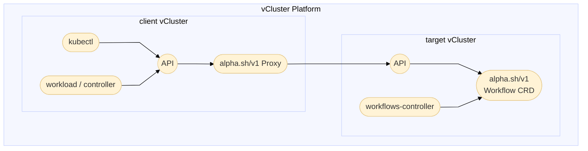
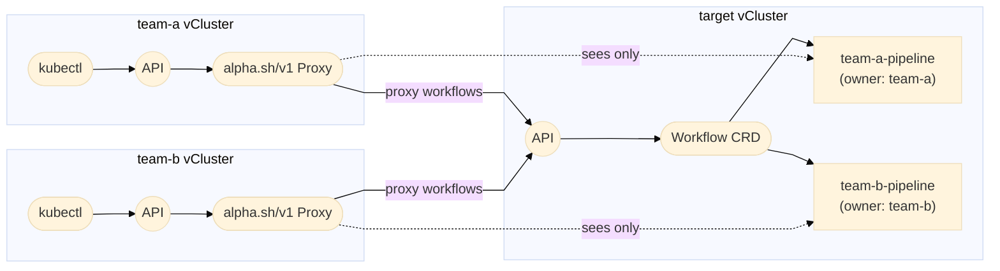
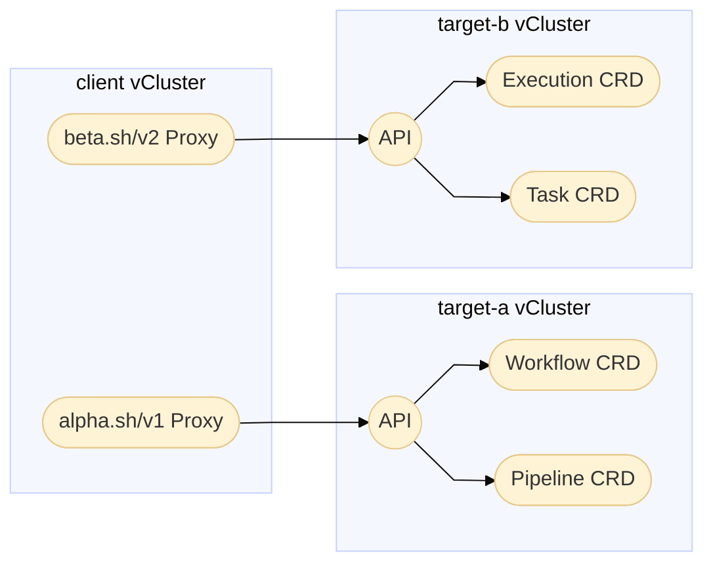
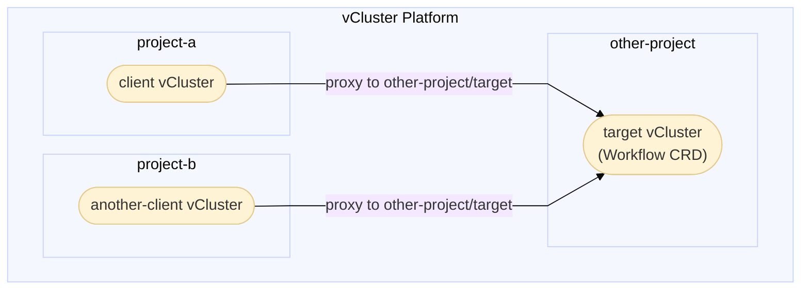

import ProAdmonition from '../../../_partials/admonitions/pro-admonition.mdx'
import Flow, { Step } from '@site/src/components/Flow';
import CodeBlock from '@theme/CodeBlock';
import ProxyBasicConfig from '!!raw-loader!@site/vcluster/configure/vcluster-yaml/experimental/_code/proxy-basic-config.yaml'
import ProxyMultiTargetConfig from '!!raw-loader!@site/vcluster/configure/vcluster-yaml/experimental/_code/proxy-multi-target-config.yaml'
import ProxyAccessModesConfig from '!!raw-loader!@site/vcluster/configure/vcluster-yaml/experimental/_code/proxy-access-modes-config.yaml'
import ProxyCrossProjectConfig from '!!raw-loader!@site/vcluster/configure/vcluster-yaml/experimental/_code/proxy-cross-project-config.yaml'

<ProAdmonition/>

:::note vCluster Platform required
This feature requires [vCluster Platform][vcluster-platform]. Both the client and target virtual clusters must be managed as [VirtualClusterInstance][virtualclusterinstance-api] within the platform.
:::

The Resource Proxy feature enables vCluster to proxy custom resource (CRD) requests to other virtual clusters. When enabled, the client virtual cluster transparently stores resources in and delegates management to a target virtual cluster. This enables cross-cluster communication patterns, centralized resource management, and multi-tenant architectures.

## How it works {#how-it-works}

When you configure a client virtual cluster to proxy custom resources, vCluster intercepts API requests for those resources and forwards them to the target virtual cluster through vCluster Platform.



The proxy performs several key functions:

1. **Request interception**: The client's Kubernetes API server intercepts requests for configured custom resources and routes them to the proxy.
2. **Authentication**: The proxy authenticates to the target using the client's vCluster Platform identity (`loft:vcluster:<project>:<name>`).
3. **Owner labeling**: On create and update operations, the proxy adds owner labels to track which client created each resource.
4. **Visibility filtering**: When listing resources, the proxy filters results based on the configured access mode (`owned` or `all`).
5. **Namespace synchronization**: If a namespace doesn't exist on the target, the proxy creates it automatically.

### Multi-client isolation {#multi-client-isolation-overview}

When multiple client virtual clusters proxy to the same target, each client only sees resources it created by default. The proxy achieves this through owner labels and label selector injection.



## Key capabilities {#key-capabilities}

- **Transparent access**: Users interact with custom resources as if they were local to their virtual cluster.
- **Centralized storage**: A dedicated target virtual cluster stores all resources.
- **Multi-tenant isolation**: Each client virtual cluster only sees its own resources by default.
- **RBAC enforcement**: The target virtual cluster enforces its own RBAC policies on proxied requests.

## Configuration {#configuration}

To enable resource proxying, configure the `experimental.proxy.customResources` section in your `vcluster.yaml`:

<CodeBlock language="yaml" title="vcluster.yaml">{ProxyBasicConfig}</CodeBlock>

### Configuration options {#configuration-options}

| Field | Type | Description |
|-------|------|-------------|
| `enabled` | boolean | Enable or disable the proxy for this resource. |
| `targetVirtualCluster` | object | Reference to the target [VirtualClusterInstance][virtualclusterinstance-api] to proxy requests to. |
| `targetVirtualCluster.name` | string | Name of the target virtual cluster. Required when enabled. |
| `targetVirtualCluster.project` | string | Project of the target virtual cluster. Defaults to the same project as the client vCluster. |
| `accessResources` | string | Resource visibility mode: `owned` (default) or `all`. See [Access modes](#access-modes). |

### Resource key format {#resource-key-format}

The resource key follows the format `resource.apiGroup/version`:

- `workflows.alpha.sh/v1` - proxies Workflow resources from the `alpha.sh` API group, version `v1`
- `executions.beta.sh/v2` - proxies Execution resources from the `beta.sh` API group, version `v2`
- `tasks.example.com/v1alpha1` - proxies Task resources from the `example.com` API group, version `v1alpha1`

## Example: Basic proxy setup {#basic-setup}

This example demonstrates a simple two-cluster setup where a client virtual cluster proxies Workflow resources to a target virtual cluster.

<Flow id="basic-proxy-setup">

<Step>

**Create the target virtual cluster**.

Create a virtual cluster to serve as the target. The target doesn't need any proxy configuration - it just stores the resources and enforces RBAC:

```bash title="Create target virtual cluster"
vcluster create target
```

</Step>

<Step>

**Install the CustomResourceDefinition in the target virtual cluster**.

The CustomResourceDefinition must exist in the target virtual cluster:

```yaml title="workflow-crd.yaml"
apiVersion: apiextensions.k8s.io/v1
kind: CustomResourceDefinition
metadata:
  name: workflows.alpha.sh
spec:
  group: alpha.sh
  names:
    kind: Workflow
    listKind: WorkflowList
    plural: workflows
    singular: workflow
  scope: Namespaced
  versions:
    - name: v1
      served: true
      storage: true
      schema:
        openAPIV3Schema:
          type: object
          properties:
            spec:
              type: object
              properties:
                name:
                  type: string
                priority:
                  type: string
```

Apply the CustomResourceDefinition to the target virtual cluster:

```bash title="Apply CustomResourceDefinition to target"
vcluster connect target -- kubectl apply -f workflow-crd.yaml
```

</Step>

<Step>

**Configure RBAC in the target virtual cluster**.

Create RBAC rules to allow the client virtual cluster to access resources. The client virtual cluster authenticates using its vCluster Platform identity in the format `loft:vcluster:<project>:<name>`:

```yaml title="proxy-rbac.yaml"
apiVersion: rbac.authorization.k8s.io/v1
kind: ClusterRole
metadata:
  name: vcluster-proxy-client
rules:
  - apiGroups: ["alpha.sh"]
    resources: ["workflows"]
    verbs: ["get", "list", "watch", "create", "update", "patch", "delete"]
  - apiGroups: ["alpha.sh"]
    resources: ["workflows/status"]
    verbs: ["get", "update", "patch"]
  - apiGroups: [""]
    resources: ["namespaces"]
    verbs: ["get", "list", "watch", "create"]
---
apiVersion: rbac.authorization.k8s.io/v1
kind: ClusterRoleBinding
metadata:
  name: vcluster-proxy-client
roleRef:
  apiGroup: rbac.authorization.k8s.io
  kind: ClusterRole
  name: vcluster-proxy-client
subjects:
  - kind: User
    # vCluster identity format: loft:vcluster:<project>:<name>
    name: "loft:vcluster:p-default:client"
    apiGroup: rbac.authorization.k8s.io
```

Apply RBAC to the target virtual cluster:

```bash title="Apply RBAC to target"
vcluster connect target -- kubectl apply -f proxy-rbac.yaml
```

</Step>

<Step>

**Create the client virtual cluster with proxy configuration**.

Configure the client virtual cluster to proxy Workflow resources to the target:

```yaml title="client-vcluster.yaml"
experimental:
  proxy:
    customResources:
      workflows.alpha.sh/v1:
        enabled: true
        targetVirtualCluster:
          name: "target"
```

Deploy the client virtual cluster:

```bash title="Deploy client virtual cluster"
vcluster create client -f client-vcluster.yaml
```

</Step>

<Step>

**Test the proxy**.

Create a workflow in the client virtual cluster:

```bash title="Create workflow in client"
vcluster connect client -- kubectl apply -f - <<EOF
apiVersion: alpha.sh/v1
kind: Workflow
metadata:
  name: test-workflow
  namespace: default
spec:
  name: "Test Pipeline"
  priority: "high"
EOF
```

Verify the workflow exists in both virtual clusters:

```bash title="Verify workflow in both clusters"
# Check in client via proxy
vcluster connect client -- kubectl get workflows

# Check in target where resources are stored
vcluster connect target -- kubectl get workflows
```

</Step>

</Flow>

## Example: Multi-target proxy {#multi-target}

A single virtual cluster can proxy different resources to different target virtual clusters based on API group and version.



<CodeBlock language="yaml" title="client-multi-target.yaml">{ProxyMultiTargetConfig}</CodeBlock>

In this configuration:
- `target-a` stores Workflow and Pipeline resources from `alpha.sh/v1`
- `target-b` stores Execution and Task resources from `beta.sh/v2`

## Example: Cross-project proxy {#cross-project}

By default, the target virtual cluster is assumed to be in the same project as the client. You can proxy to a virtual cluster in a different project by specifying the `project` field. This works across different host clusters connected to the same vCluster Platform.



<CodeBlock language="yaml" title="client-cross-project.yaml">{ProxyCrossProjectConfig}</CodeBlock>

This is useful for scenarios where:
- A shared resource storage cluster exists in a centralized project
- Teams in different projects need to access common resources
- Virtual clusters across different host clusters need to share CRDs
- CI/CD environments need access to centralized workflow management

## Access modes {#access-modes}

The `accessResources` field controls which resources a client virtual cluster can see in the target:

<CodeBlock language="yaml" title="Access modes configuration">{ProxyAccessModesConfig}</CodeBlock>

### `owned` mode - default {#owned-mode}

Each client virtual cluster only sees resources it created. This enables multi-tenant isolation where multiple client virtual clusters can share a target without seeing each other's resources.

### `all` mode {#all-mode}

The client virtual cluster can see all resources in the target, regardless of who created them. This is useful for read-only observers, centralized dashboards, or admin access.

:::tip Combine access modes with RBAC
The `accessResources` mode controls **visibility** - what resources a virtual cluster can see. RBAC in the target virtual cluster controls **permissions** - what operations the virtual cluster can perform.

For example, a virtual cluster with `accessResources: all` but read-only RBAC can see all resources but can't modify any.
:::

## Example: Multi-client isolation {#multi-client}

This example demonstrates how multiple client virtual clusters can share a target while maintaining isolation.

<Flow id="multi-client-setup">

<Step>

**Configure client virtual clusters**.

Both clients proxy to the same target:

```yaml title="team-a-vcluster.yaml"
experimental:
  proxy:
    customResources:
      workflows.alpha.sh/v1:
        enabled: true
        targetVirtualCluster:
          name: "orchestrator"
        # Uses default accessResources: owned
```

```yaml title="team-b-vcluster.yaml"
experimental:
  proxy:
    customResources:
      workflows.alpha.sh/v1:
        enabled: true
        targetVirtualCluster:
          name: "orchestrator"
        # Uses default accessResources: owned
```

</Step>

<Step>

**Configure RBAC for multiple clients**.

Configure RBAC in the target for both clients:

```yaml title="multi-client-rbac.yaml"
apiVersion: rbac.authorization.k8s.io/v1
kind: ClusterRole
metadata:
  name: vcluster-proxy-client
rules:
  - apiGroups: ["alpha.sh"]
    resources: ["workflows"]
    verbs: ["get", "list", "watch", "create", "update", "patch", "delete"]
  - apiGroups: ["alpha.sh"]
    resources: ["workflows/status"]
    verbs: ["get", "update", "patch"]
  - apiGroups: [""]
    resources: ["namespaces"]
    verbs: ["get", "list", "watch", "create"]
---
# Bind for team-a
apiVersion: rbac.authorization.k8s.io/v1
kind: ClusterRoleBinding
metadata:
  name: vcluster-proxy-team-a
roleRef:
  apiGroup: rbac.authorization.k8s.io
  kind: ClusterRole
  name: vcluster-proxy-client
subjects:
  - kind: User
    name: "loft:vcluster:p-default:team-a"
    apiGroup: rbac.authorization.k8s.io
---
# Bind for team-b
apiVersion: rbac.authorization.k8s.io/v1
kind: ClusterRoleBinding
metadata:
  name: vcluster-proxy-team-b
roleRef:
  apiGroup: rbac.authorization.k8s.io
  kind: ClusterRole
  name: vcluster-proxy-client
subjects:
  - kind: User
    name: "loft:vcluster:p-default:team-b"
    apiGroup: rbac.authorization.k8s.io
```

</Step>

<Step>

**Test isolation**.

```bash title="Test multi-client isolation"
# Team A creates a workflow
vcluster connect team-a -- kubectl apply -f - <<EOF
apiVersion: alpha.sh/v1
kind: Workflow
metadata:
  name: team-a-pipeline
spec:
  name: "Team A Data Pipeline"
EOF

# Team B creates a workflow
vcluster connect team-b -- kubectl apply -f - <<EOF
apiVersion: alpha.sh/v1
kind: Workflow
metadata:
  name: team-b-pipeline
spec:
  name: "Team B ML Pipeline"
EOF

# Team A only sees their workflow
vcluster connect team-a -- kubectl get workflows
# NAME              AGE
# team-a-pipeline   1m

# Team B only sees their workflow
vcluster connect team-b -- kubectl get workflows
# NAME              AGE
# team-b-pipeline   1m

# Target orchestrator sees both
vcluster connect orchestrator -- kubectl get workflows
# NAME              AGE
# team-a-pipeline   2m
# team-b-pipeline   1m
```

</Step>

</Flow>

## Limitations {#limitations}

- All `CustomResources` within the same API `GroupVersion` must use the same target virtual cluster.
- When configuring RBAC for status updates, include permissions for the status subresource.

## Troubleshoot {#troubleshoot}

### Resources not appearing {#resources-not-appearing}

If resources don't appear after creation:

1. **Check RBAC configuration**: Ensure the client virtual cluster's identity has correct permissions in the target.

2. **Verify the CustomResourceDefinition exists in target**:

```bash title="Check CustomResourceDefinition in target"
vcluster connect <target> -- kubectl get crd <resource>.<group>
```

3. **Check virtual cluster logs** for errors:

```bash title="Check virtual cluster logs"
kubectl logs -n vcluster-<name> -l app=vcluster --tail=100
```

### Permission denied errors {#permission-denied}

1. **Verify the virtual cluster identity format**: The identity follows `loft:vcluster:<project>:<name>`.

2. **Test RBAC directly**:

```bash title="Test RBAC permissions"
vcluster connect <target> -- kubectl auth can-i create workflows.alpha.sh \
  --as="loft:vcluster:p-default:client"
```

### Target unavailable errors {#target-unavailable}

Ensure the target virtual cluster is running and healthy. vCluster automatically attempts to reconnect when the target becomes available.

## Config reference {#config-reference}

### `experimental.proxy` {#experimental-proxy}

| Field | Type | Default | Description |
|-------|------|---------|-------------|
| `customResources` | `map[string]CustomResourceProxy` | `{}` | Map of resource keys to proxy configuration. |

### `CustomResourceProxy` {#custom-resource-proxy}

| Field | Type | Default | Description |
|-------|------|---------|-------------|
| `enabled` | `boolean` | `false` | Enable the proxy for this resource. |
| `targetVirtualCluster` | `VirtualClusterRef` | - | Reference to the target virtual cluster. Required when enabled. |
| `accessResources` | `string` | `"owned"` | Resource visibility mode: `owned` or `all`. |

### `VirtualClusterRef` {#virtual-cluster-ref}

| Field | Type | Default | Description |
|-------|------|---------|-------------|
| `name` | `string` | - | Name of the target virtual cluster. Required. |
| `project` | `string` | Same as source | Project of the target virtual cluster. |

{/* Links */}
[vcluster-platform]: /platform/
[virtualclusterinstance-api]: /platform/api/resources/virtualclusterinstance
