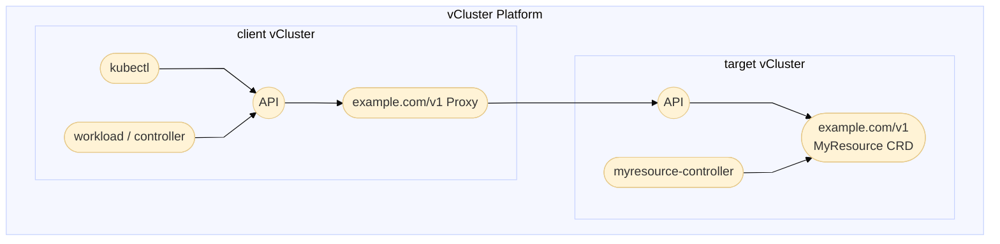
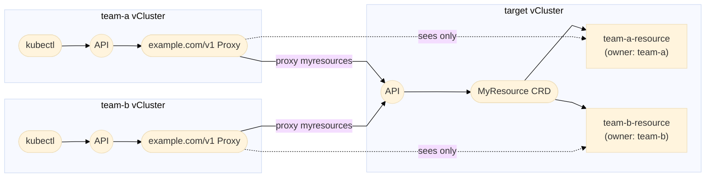
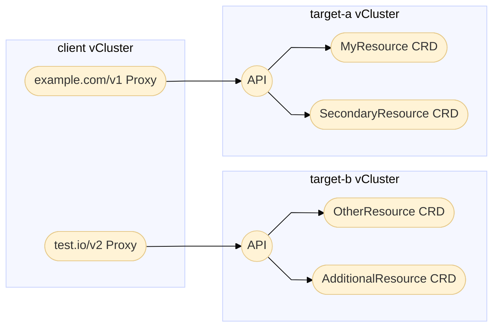
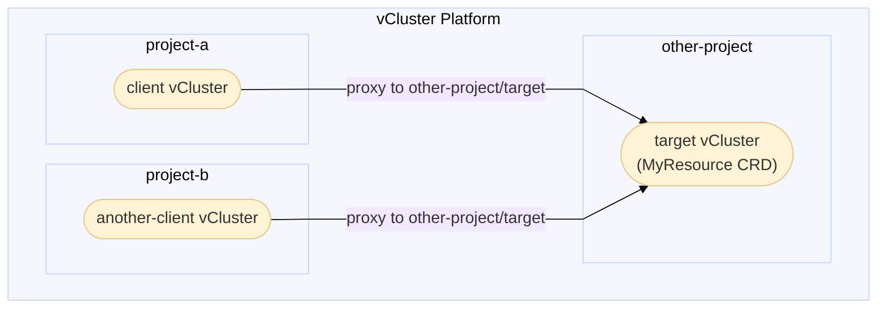

import ProAdmonition from '../../../_partials/admonitions/pro-admonition.mdx'
import Flow, { Step } from '@site/src/components/Flow';
import CodeBlock from '@theme/CodeBlock';
import ProxyBasicConfig from '!!raw-loader!@site/vcluster/configure/vcluster-yaml/experimental/_code/proxy-basic-config.yaml'
import ProxyMultiTargetConfig from '!!raw-loader!@site/vcluster/configure/vcluster-yaml/experimental/_code/proxy-multi-target-config.yaml'
import ProxyAccessModesConfig from '!!raw-loader!@site/vcluster/configure/vcluster-yaml/experimental/_code/proxy-access-modes-config.yaml'
import ProxyCrossProjectConfig from '!!raw-loader!@site/vcluster/configure/vcluster-yaml/experimental/_code/proxy-cross-project-config.yaml'
import ProxyPlatformRbac from '!!raw-loader!@site/vcluster/configure/vcluster-yaml/experimental/_code/proxy-platform-rbac.yaml'
import ProxyWildcardConfig from '!!raw-loader!@site/vcluster/configure/vcluster-yaml/experimental/_code/proxy-wildcard-config.yaml'

<ProAdmonition/>

:::note vCluster Platform required
This feature requires [vCluster Platform][vcluster-platform]. Both the client and target tenant clusters must be managed as [VirtualClusterInstance][virtualclusterinstance-api] within the platform.
:::

The Resource Proxy feature enables vCluster to proxy custom resource (CRD) requests to other tenant clusters. When enabled, the client tenant cluster transparently stores resources in and delegates management to a target tenant cluster. This enables cross-cluster communication patterns, centralized resource management, and multi-tenant architectures.

## How it works {#how-it-works}

When you configure a client tenant cluster to proxy custom resources, vCluster intercepts API requests for those resources and forwards them to the target tenant cluster through vCluster Platform.


```mermaid
%%{init: {'theme': 'base', 'themeVariables': {'edgeLabelBackground':'#F3E8FF','edgeLabelColor':'#111827'}, 'flowchart': {'curve': 'linear', 'htmlLabels': true}}}%%
flowchart LR
  subgraph platform["vCluster Platform"]
    direction LR

    subgraph client["client vCluster"]
      direction LR
      kubectl([kubectl])
      workload([workload / controller])
      api((API))
      proxy([example.com/v1 Proxy])

      kubectl --> api
      workload --> api
      api --> proxy
    end

    subgraph target["target vCluster"]
      direction LR
      tapi((API))
      crd([example.com/v1<br/>MyResource CRD])
      ctrl([myresource-controller])

      tapi --> crd
      ctrl --> crd
    end
  end

  proxy --> tapi

  classDef node fill:#FFF3D6,stroke:#E6C98A,stroke-width:1px,rx:0,ry:0;
  class kubectl,workload,api,proxy,tapi,crd,ctrl node;

  style platform fill:#F5F7FF,stroke:#C7D2FE,stroke-width:1px,rx:0,ry:0;
  style client fill:#F5F7FF,stroke:#C7D2FE,stroke-width:1px,rx:0,ry:0;
  style target fill:#F5F7FF,stroke:#C7D2FE,stroke-width:1px,rx:0,ry:0;
```

The proxy performs several key functions:

1. **Request interception**: The client's Kubernetes API server intercepts requests for configured custom resources and routes them to the proxy.
2. **Authentication**: The proxy authenticates to the target using the client's vCluster Platform identity (`loft:vcluster:p-<project>:<name>`).
3. **Owner labeling**: On create and update operations, the proxy adds owner labels to track which client created each resource.
4. **Visibility filtering**: When listing resources, the proxy filters results based on the configured access mode (`owned` or `all`).
5. **Namespace synchronization**: If a namespace doesn't exist on the target, the proxy creates it automatically.

### Multi-client isolation {#multi-client-isolation-overview}

When multiple client tenant clusters proxy to the same target, each client only sees resources it created by default. The proxy achieves this through owner labels and label selector injection.


```mermaid
%%{init: {'theme': 'base', 'flowchart': {'curve': 'linear', 'htmlLabels': 'true'}}}%%
flowchart LR
  subgraph team_a_vc["team-a vCluster"]
    direction LR
    a_kubectl([kubectl]) --> a_api((API)) --> a_proxy([example.com/v1 Proxy])
  end

  subgraph team_b_vc["team-b vCluster"]
    direction LR
    b_kubectl([kubectl]) --> b_api((API)) --> b_proxy([example.com/v1 Proxy])
  end

  subgraph target_vc["target vCluster"]
    direction LR
    t_api((API)) --> t_crd([MyResource CRD])
    t_crd --> wf_a["team-a-resource<br/>(owner: team-a)"]
    t_crd --> wf_b["team-b-resource<br/>(owner: team-b)"]

    %% vertical centering constraints (invisible)
    wf_a ~~~ t_api
    t_api ~~~ wf_b
    wf_a ~~~ t_crd
    t_crd ~~~ wf_b
  end

  a_proxy -->|proxy myresources| t_api
  b_proxy -->|proxy myresources| t_api

  a_proxy -.->|sees only| wf_a
  b_proxy -.->|sees only| wf_b
```

### Proxy objects in the client tenant cluster {#proxy-objects}

The proxy wires itself into the client's Kubernetes aggregation layer. The troubleshooting steps on this page reference these objects and conventions:

| What | Where | Notes |
|------|-------|-------|
| APIService `v<version>.<group>` | Client tenant cluster | Registered by the elected leader replica. `kubectl get apiservice` is the first health signal. |
| Service `proxy-<group>-<version>` | `kube-system` namespace in the client tenant cluster | ExternalName Service pointing to `localhost`. Dots in the group become dashes, and long names are shortened with a hash suffix. |
| Proxy port | `localhost:9100+n` inside the vCluster control plane pod | One proxy per group and version, sorted alphabetically so all replicas agree on port assignment. Not reachable from outside the pod. |
| Ownership labels | Objects in the target tenant cluster | `vcluster.com/owner-vcluster=<client-name>` and `vcluster.com/owner-project=<project>`, injected on every write through the proxy. |
| Deletion protection (v0.37.0 and later) | Client tenant cluster | The APIService and proxy Service carry the `vcluster.loft.sh/protected=resource-proxy` label, and a ValidatingAdmissionPolicy denies deleting them. See [Deletion of the proxy APIService or Service is denied](#deletion-denied). |

### Connection path and peer health {#connection-path}

A **caller** is anything that talks to the client tenant cluster's API server: `kubectl`, a controller, or a CI job. A proxied request travels this path:

1. The caller sends a request to the client tenant cluster's API server.
2. The APIService registration routes the request through the `proxy-<group>-<version>` Service to the resource proxy, which listens on a local port inside the client's vCluster control plane pod.
3. The proxy forwards the request over the platform network, using a direct WireGuard peer-to-peer connection where possible and the vCluster Platform DERP relay as a fallback.
4. The target tenant cluster's API server serves the request.

The proxy discovers the target's control plane pods as peers on the platform network and distributes requests across them round-robin. Peer health is tracked per host:

- A single dial attempt times out after **5 seconds**.
- After **3 consecutive dial failures**, a peer is **quarantined for 20 seconds**, then given a single trial dial. Requests fail fast instead of hanging while a peer is quarantined.
- If the peer list cannot be refreshed for more than **60 seconds**, the proxy treats it as stale and fails requests with 503 rather than trusting it.
- Non-watch requests are capped at **60 seconds** end to end. Watches stream indefinitely.

Peer quarantine and fail-fast behavior require vCluster v0.34.7 or later on the v0.34 line, or v0.37.0 and later.

### Behavior when the target is unreachable {#degraded-behavior}

Two design decisions explain most confusing symptoms:

1. **Discovery never goes down.** When the target is unreachable, or answers discovery with 401, 404, or 5xx, the proxy serves discovery requests locally so the APIService stays `Available` and the client tenant cluster's API server keeps functioning. `kubectl api-resources` can therefore look healthy while every real request fails with 503. Use [metrics](#monitoring) and [logs](#log-reference), not discovery, to judge proxy health.
2. **Failures degrade to 503 with `Retry-After: 1`.** Peer discovery problems, quarantined peers, a stale peer list, and target-side 5xx responses all surface to callers as `503 Service Unavailable`. The cause is distinguishable from logs and metrics, not from the error the caller sees.

## Key capabilities {#key-capabilities}

- **Transparent access**: Users interact with custom resources as if they were local to their tenant cluster.
- **Centralized storage**: A dedicated target tenant cluster stores all resources.
- **Multi-tenant isolation**: Each client tenant cluster only sees its own resources by default.
- **RBAC enforcement**: The target tenant cluster enforces its own RBAC policies on proxied requests.

## Platform RBAC requirements {#platform-rbac}

For the resource proxy to function, the client tenant cluster must be authorized to access the target tenant cluster through vCluster Platform. This requires RBAC configuration on the platform's management cluster.

### Platform RBAC configuration {#platform-rbac-config}

Create a Role and RoleBinding in the project namespace (`p-<project-name>`) on the platform's management cluster:

<CodeBlock language="yaml" title="platform-proxy-rbac.yaml">{ProxyPlatformRbac}</CodeBlock>

Apply this configuration to the platform's management cluster (not the tenant clusters):

```bash title="Apply platform RBAC"
kubectl apply -f platform-proxy-rbac.yaml --context <platform-context>
```

## Configuration {#configuration}

To enable resource proxying, configure the `experimental.proxy.customResources` section in your `vcluster.yaml`:

<CodeBlock language="yaml" title="vcluster.yaml">{ProxyBasicConfig}</CodeBlock>

### Configuration options {#configuration-options}

| Field | Type | Description |
|-------|------|-------------|
| `enabled` | boolean | Enable or disable the proxy for this resource. |
| `targetVirtualCluster` | object | Reference to the target [VirtualClusterInstance][virtualclusterinstance-api] to proxy requests to. |
| `targetVirtualCluster.name` | string | Name of the target tenant cluster. Required when enabled. |
| `targetVirtualCluster.project` | string | Project of the target tenant cluster. Defaults to the same project as the client vCluster. |
| `accessResources` | string | Resource visibility mode: `owned` (default) or `all`. See [Access modes](#access-modes). |

### Resource key format {#resource-key-format}

The resource key follows the format `resource.apiGroup/version`:

- `myresources.example.com/v1` - proxies MyResource resources from the `example.com` API group, version `v1`
- `otherresources.test.io/v2` - proxies OtherResource resources from the `test.io` API group, version `v2`
- `additionalresources.acme.org/v1alpha1` - proxies AdditionalResource resources from the `acme.org` API group, version `v1alpha1`

#### Wildcard kind matching {#wildcard-kind-matching}

You can use `*` as the resource name to match all resource kinds in an API group and version:

- `*.example.com/v1` - proxies **all** resource kinds from the `example.com` API group, version `v1`
- `*.test.io/v2` - proxies all resource kinds from the `test.io` API group, version `v2`

This is useful when a CRD API group has multiple kinds that all target the same cluster, so your `vcluster.yaml` does not need updating whenever a new kind is added to the group.

:::note Wildcard and explicit entries are mutually exclusive
A wildcard key (for example `*.example.com/v1`) and an explicit key (for example `myresources.example.com/v1`) cannot both be enabled for the same group and version. vCluster rejects that combination at startup. A disabled explicit entry (`enabled: false`) does not conflict with a wildcard for the same group and version.
:::

## Example: Basic proxy setup {#basic-setup}

This example demonstrates a simple two-cluster setup where a client tenant cluster proxies MyResource resources to a target tenant cluster.

<Flow id="basic-proxy-setup">

<Step>

**Create the target tenant cluster**.

Create a tenant cluster to serve as the target. The target doesn't need any proxy configuration - it just stores the resources and enforces RBAC:

```bash title="Create target tenant cluster"
vcluster create target
```

</Step>

<Step>

**Install the CustomResourceDefinition in the target tenant cluster**.

The CustomResourceDefinition must exist in the target tenant cluster:

```yaml title="myresource-crd.yaml"
apiVersion: apiextensions.k8s.io/v1
kind: CustomResourceDefinition
metadata:
  name: myresources.example.com
spec:
  group: example.com
  names:
    kind: MyResource
    listKind: MyResourceList
    plural: myresources
    singular: myresource
  scope: Namespaced
  versions:
    - name: v1
      served: true
      storage: true
      schema:
        openAPIV3Schema:
          type: object
          properties:
            spec:
              type: object
              properties:
                name:
                  type: string
                priority:
                  type: string
```

Apply the CustomResourceDefinition to the target tenant cluster:

```bash title="Apply CustomResourceDefinition to target"
vcluster connect target -- kubectl apply -f myresource-crd.yaml
```

</Step>

<Step>

**Configure RBAC in the target tenant cluster**.

Create RBAC rules to allow the client tenant cluster to access resources. The client tenant cluster authenticates using its vCluster Platform identity in the format `loft:vcluster:p-<project>:<name>`:

```yaml title="target-rbac.yaml"
apiVersion: rbac.authorization.k8s.io/v1
kind: ClusterRole
metadata:
  name: vcluster-proxy-client
rules:
  - apiGroups: ["example.com"]
    resources: ["myresources"]
    verbs: ["get", "list", "watch", "create", "update", "patch", "delete"]
  - apiGroups: ["example.com"]
    resources: ["myresources/status"]
    verbs: ["get", "update", "patch"]
  - apiGroups: [""]
    resources: ["namespaces"]
    verbs: ["get", "list", "watch", "create"]
---
apiVersion: rbac.authorization.k8s.io/v1
kind: ClusterRoleBinding
metadata:
  name: vcluster-proxy-client
roleRef:
  apiGroup: rbac.authorization.k8s.io
  kind: ClusterRole
  name: vcluster-proxy-client
subjects:
  - kind: User
    # vCluster identity format: loft:vcluster:p-<project>:<name>
    name: "loft:vcluster:p-default:client"
    apiGroup: rbac.authorization.k8s.io
```

Apply RBAC to the target tenant cluster:

```bash title="Apply RBAC to target"
vcluster connect target -- kubectl apply -f target-rbac.yaml
```

</Step>

<Step>

**Configure platform RBAC**.

Grant the client tenant cluster permission to access the target through vCluster Platform. Apply this to the platform's management cluster:

<CodeBlock language="yaml" title="platform-rbac.yaml">{ProxyPlatformRbac}</CodeBlock>

Apply to the platform's management cluster:

```bash title="Apply platform RBAC"
kubectl apply -f platform-rbac.yaml --context <platform-context>
```

</Step>

<Step>

**Create the client tenant cluster with proxy configuration**.

Configure the client tenant cluster to proxy MyResource resources to the target:

```yaml title="client-vcluster.yaml"
experimental:
  proxy:
    customResources:
      myresources.example.com/v1:
        enabled: true
        targetVirtualCluster:
          name: "target"
```

Deploy the client tenant cluster:

```bash title="Deploy client tenant cluster"
vcluster create client -f client-vcluster.yaml
```

</Step>

<Step>

**Test the proxy**.

Create a MyResource in the client tenant cluster:

```bash title="Create MyResource in client"
vcluster connect client -- kubectl apply -f - <<EOF
apiVersion: example.com/v1
kind: MyResource
metadata:
  name: test-resource
  namespace: default
spec:
  name: "Test Resource"
  priority: "high"
EOF
```

Verify the resource exists in both tenant clusters:

```bash title="Verify resource in both clusters"
# Check in client via proxy
vcluster connect client -- kubectl get myresources

# Check in target where resources are stored
vcluster connect target -- kubectl get myresources
```

</Step>

</Flow>

## Example: Multi-target proxy {#multi-target}

A single tenant cluster can proxy different resources to different target tenant clusters based on API group and version.


```mermaid
%%{init: {'theme': 'base', 'themeVariables': {'edgeLabelBackground':'#F3E8FF','edgeLabelColor':'#111827'}, 'flowchart': {'curve': 'linear', 'htmlLabels': true}}}%%
flowchart LR
  subgraph client["client vCluster"]
    direction TB
    p_example([example.com/v1 Proxy])
    p_test([test.io/v2 Proxy])
  end

  subgraph target_b["target-b vCluster"]
    direction LR
    tb_api((API))
    tb_exec([OtherResource CRD])
    tb_task([AdditionalResource CRD])
    tb_api --> tb_exec
    tb_api --> tb_task
  end

  subgraph target_a["target-a vCluster"]
    direction LR
    ta_api((API))
    ta_wf([MyResource CRD])
    ta_pipe([SecondaryResource CRD])
    ta_api --> ta_wf
    ta_api --> ta_pipe
  end

  p_example --> ta_api
  p_test --> tb_api

  classDef node fill:#FFF3D6,stroke:#E6C98A,stroke-width:1px,rx:0,ry:0;
  class p_example,p_test,ta_api,ta_wf,ta_pipe,tb_api,tb_exec,tb_task node;

  style client fill:#F5F7FF,stroke:#C7D2FE,stroke-width:1px,rx:0,ry:0;
  style target_a fill:#F5F7FF,stroke:#C7D2FE,stroke-width:1px,rx:0,ry:0;
  style target_b fill:#F5F7FF,stroke:#C7D2FE,stroke-width:1px,rx:0,ry:0;
```

<CodeBlock language="yaml" title="client-multi-target.yaml">{ProxyMultiTargetConfig}</CodeBlock>

In this configuration:
- `target-a` stores MyResource and SecondaryResource resources from `example.com/v1`
- `target-b` stores OtherResource and AdditionalResource resources from `test.io/v2`

## Example: Wildcard kind proxy {#wildcard-kind}

When an API group contains several resource kinds that all belong to the same target, use a wildcard key so you don't have to update the config each time a new kind is added.

<CodeBlock language="yaml" title="client-wildcard.yaml">{ProxyWildcardConfig}</CodeBlock>

Any resource kind served by the `example.com/v1` API group in the target tenant cluster is automatically proxied. You do not need to enumerate individual resource names.

## Example: Cross-project proxy {#cross-project}

By default, the target tenant cluster is assumed to be in the same project as the client. You can proxy to a tenant cluster in a different project by specifying the `project` field. This works across different control plane clusters connected to the same vCluster Platform.


```mermaid
%%{init: {'theme': 'base', 'themeVariables': {'edgeLabelBackground':'#F3E8FF','edgeLabelColor':'#111827'}, 'flowchart': {'curve': 'linear'}}}%%
flowchart TB
  subgraph platform["vCluster Platform"]
    direction LR

    subgraph project_a["project-a"]
      direction TB
      client_a([client vCluster])
    end

    subgraph project_b["project-b"]
      direction TB
      client_b([another-client vCluster])
    end

    subgraph other_project["other-project"]
      direction TB
      target(["target vCluster<br />(MyResource CRD)"])
    end
  end

  client_a -->|proxy to other-project/target| target
  client_b -->|proxy to other-project/target| target

  classDef node fill:#FFF3D6,stroke:#E6C98A,stroke-width:1px,rx:0,ry:0;
  class client_a,client_b,target node;

  style platform fill:#F5F7FF,stroke:#C7D2FE,stroke-width:1px,rx:0,ry:0;
  style project_a fill:#F5F7FF,stroke:#C7D2FE,stroke-width:1px,rx:0,ry:0;
  style project_b fill:#F5F7FF,stroke:#C7D2FE,stroke-width:1px,rx:0,ry:0;
  style other_project fill:#F5F7FF,stroke:#C7D2FE,stroke-width:1px,rx:0,ry:0;
```

<CodeBlock language="yaml" title="client-cross-project.yaml">{ProxyCrossProjectConfig}</CodeBlock>

This is useful for scenarios where:
- A shared resource storage cluster exists in a centralized project
- Teams in different projects need to access common resources
- Tenant clusters across different control plane clusters need to share CRDs
- CI/CD environments need access to centralized resource management

## Access modes {#access-modes}

The `accessResources` field controls which resources a client tenant cluster can see in the target:

<CodeBlock language="yaml" title="Access modes configuration">{ProxyAccessModesConfig}</CodeBlock>

### `owned` mode - default {#owned-mode}

Each client tenant cluster only sees resources it created. This enables tenant isolation where multiple client tenant clusters can share a target without seeing each other's resources.

### `all` mode {#all-mode}

The client tenant cluster can see all resources in the target, regardless of who created them. This is useful for read-only observers, centralized dashboards, or admin access.

:::tip Combine access modes with RBAC
The `accessResources` mode controls **visibility** - what resources a tenant cluster can see. RBAC in the target tenant cluster controls **permissions** - what operations the tenant cluster can perform.

For example, a tenant cluster with `accessResources: all` but read-only RBAC can see all resources but can't modify any.
:::

## Example: Multi-client isolation {#multi-client}

This example demonstrates how multiple client tenant clusters can share a target while maintaining isolation.

<Flow id="multi-client-setup">

<Step>

**Configure client tenant clusters**.

Both clients proxy to the same target:

```yaml title="team-a-vcluster.yaml"
experimental:
  proxy:
    customResources:
      myresources.example.com/v1:
        enabled: true
        targetVirtualCluster:
          name: "orchestrator"
        # Uses default accessResources: owned
```

```yaml title="team-b-vcluster.yaml"
experimental:
  proxy:
    customResources:
      myresources.example.com/v1:
        enabled: true
        targetVirtualCluster:
          name: "orchestrator"
        # Uses default accessResources: owned
```

</Step>

<Step>

**Configure target RBAC for multiple clients**.

Configure RBAC in the target for both clients:

```yaml title="multi-client-target-rbac.yaml"
apiVersion: rbac.authorization.k8s.io/v1
kind: ClusterRole
metadata:
  name: vcluster-proxy-client
rules:
  - apiGroups: ["example.com"]
    resources: ["myresources"]
    verbs: ["get", "list", "watch", "create", "update", "patch", "delete"]
  - apiGroups: ["example.com"]
    resources: ["myresources/status"]
    verbs: ["get", "update", "patch"]
  - apiGroups: [""]
    resources: ["namespaces"]
    verbs: ["get", "list", "watch", "create"]
---
# Bind for team-a
apiVersion: rbac.authorization.k8s.io/v1
kind: ClusterRoleBinding
metadata:
  name: vcluster-proxy-team-a
roleRef:
  apiGroup: rbac.authorization.k8s.io
  kind: ClusterRole
  name: vcluster-proxy-client
subjects:
  - kind: User
    name: "loft:vcluster:p-default:team-a"
    apiGroup: rbac.authorization.k8s.io
---
# Bind for team-b
apiVersion: rbac.authorization.k8s.io/v1
kind: ClusterRoleBinding
metadata:
  name: vcluster-proxy-team-b
roleRef:
  apiGroup: rbac.authorization.k8s.io
  kind: ClusterRole
  name: vcluster-proxy-client
subjects:
  - kind: User
    name: "loft:vcluster:p-default:team-b"
    apiGroup: rbac.authorization.k8s.io
```

Apply to the target tenant cluster:

```bash title="Apply target RBAC"
vcluster connect orchestrator -- kubectl apply -f multi-client-target-rbac.yaml
```

</Step>

<Step>

**Configure platform RBAC for multiple clients**.

Grant both client tenant clusters permission to access the target through vCluster Platform:

```yaml title="multi-client-platform-rbac.yaml"
apiVersion: rbac.authorization.k8s.io/v1
kind: Role
metadata:
  name: vcluster-proxy-target-access
  namespace: p-default
rules:
  - apiGroups: ["management.loft.sh"]
    resources: ["virtualclusterinstances"]
    resourceNames: ["orchestrator"]
    verbs: ["use"]
---
apiVersion: rbac.authorization.k8s.io/v1
kind: RoleBinding
metadata:
  name: team-a-vcluster-proxy-access
  namespace: p-default
subjects:
  - kind: User
    name: "loft:vcluster:p-default:team-a"
    apiGroup: rbac.authorization.k8s.io
roleRef:
  kind: Role
  name: vcluster-proxy-target-access
  apiGroup: rbac.authorization.k8s.io
---
apiVersion: rbac.authorization.k8s.io/v1
kind: RoleBinding
metadata:
  name: team-b-vcluster-proxy-access
  namespace: p-default
subjects:
  - kind: User
    name: "loft:vcluster:p-default:team-b"
    apiGroup: rbac.authorization.k8s.io
roleRef:
  kind: Role
  name: vcluster-proxy-target-access
  apiGroup: rbac.authorization.k8s.io
```

Apply to the platform's management cluster:

```bash title="Apply platform RBAC"
kubectl apply -f multi-client-platform-rbac.yaml --context <platform-context>
```

</Step>

<Step>

**Test isolation**.

```bash title="Test multi-client isolation"
# Team A creates a resource
vcluster connect team-a -- kubectl apply -f - <<EOF
apiVersion: example.com/v1
kind: MyResource
metadata:
  name: team-a-resource
spec:
  name: "Team A Data Resource"
EOF

# Team B creates a resource
vcluster connect team-b -- kubectl apply -f - <<EOF
apiVersion: example.com/v1
kind: MyResource
metadata:
  name: team-b-resource
spec:
  name: "Team B ML Resource"
EOF

# Team A only sees their resource
vcluster connect team-a -- kubectl get myresources
# NAME              AGE
# team-a-resource   1m

# Team B only sees their resource
vcluster connect team-b -- kubectl get myresources
# NAME              AGE
# team-b-resource   1m

# Target orchestrator sees both
vcluster connect orchestrator -- kubectl get myresources
# NAME              AGE
# team-a-resource   2m
# team-b-resource   1m
```

</Step>

</Flow>

## Best practices {#best-practices}

- **Prefer explicit resource keys over wildcards.** With explicit keys such as `myresources.example.com/v1`, fallback discovery stays accurate when the target is briefly unreachable. With `*.example.com/v1`, discovery degrades to an empty list, which some controllers and CLIs handle poorly.
- **Use one target per group and version.** Validation enforces that all entries for a group and version agree on `targetVirtualCluster` and `accessResources`. Split API groups if two targets must serve sibling resources.
- **Stay on `accessResources: owned` unless you have a reason not to.** It gives setups with several client tenant clusters collision safety by construction. Use `all` only when the client must manage objects it did not create, and treat that client as privileged.
- **Pre-create namespaces on the client.** Writes to namespaced proxied resources require the namespace to exist in the client tenant cluster. The proxy handles creating it on the target.
- **Expect and honor `Retry-After`.** Callers, especially controllers, should back off on 503 responses instead of retrying in a tight loop. The proxy always sets `Retry-After: 1` on unavailability.
- **Keep versions current on both ends.** The peer staleness fixes span vCluster (v0.34.6 improved connection lifecycle handling, and v0.34.7 and v0.37.0 added peer quarantine and fail-fast behavior) and vCluster Platform (stale peer cleanup). Running a new client against an old platform keeps the degradation risk alive.
- **Mutual proxying is supported.** Two tenant clusters can proxy resources from each other. Each is the client in one direction and the target in the other, and the directions are independent. Monitor both directions separately: the `target` metric label distinguishes them.

### Prefer direct connections over the DERP relay {#direct-connections}

Proxy traffic between tenant clusters flows over the platform network. Peers first try a direct connection and fall back to relaying through the vCluster Platform DERP server when a direct path cannot be established. The relay is a correctness fallback, not a performance path: relayed traffic adds latency and concentrates all proxy bandwidth on the platform pod, making it a throughput bottleneck and a shared failure domain for otherwise independent tenant clusters.

To keep connections direct:

- Allow UDP between the node networks of the control plane clusters that host the client and the target. WireGuard-based direct paths need UDP reachability in at least one direction. Environments that only allow TCP 443 egress force everything through the relay.
- Review the NAT topology. Symmetric NAT between the clusters defeats hole punching. Clusters in the same VPC or in peered VPCs typically connect directly without special work.
- Check NetworkPolicies and security groups applied to the vCluster control plane pods. They must not block the direct path that the platform negotiates.

Symptoms of running on the relay include noticeably higher latency on proxied requests compared to direct requests against the target, and proxy throughput that tracks platform pod load.

## Monitor the proxy {#monitoring}

Proxy metrics require vCluster v0.37.0 or later. On earlier versions, use the [synthetic probe](#synthetic-probe) as the primary detection mechanism.

### Scrape proxy metrics {#scrape-metrics}

The client tenant cluster exposes proxy metrics at the `/metrics/syncer` path of its API server, using the same delegated authentication as the other metrics paths: the caller needs `get` on the non-resource URL `/metrics/syncer` inside the tenant cluster.

```bash title="Check proxy metrics manually"
kubectl get --raw /metrics/syncer | grep vcluster_proxy
```

Run this against the client tenant cluster API.

```yaml title="RBAC for a metrics scraper - apply inside the client tenant cluster"
apiVersion: rbac.authorization.k8s.io/v1
kind: ClusterRole
metadata:
  name: metrics-syncer-reader
rules:
- nonResourceURLs: ["/metrics/syncer"]
  verbs: ["get"]
```

With the Prometheus Operator, setting `controlPlane.serviceMonitor.enabled: true` in the client's `vcluster.yaml` adds a [ServiceMonitor](../control-plane/deployment/service-monitor.mdx) that scrapes `/metrics/syncer` alongside the other control plane endpoints. The ServiceMonitor authenticates with the TLS client certificate from the `vc-<release>` secret, so it needs no extra RBAC. The ClusterRole above is only for scrapers you wire up yourself.

### Metrics reference {#metrics-reference}

Every series is labeled `target="<project>/<name>"`, and the tables list only additional labels. No series carries per-peer-host labels, because peer hostnames churn with target restarts. Counter series only appear after their first event, so don't alert on counter absence: a missing counter means the event has never happened since the pod started.

Most series are proxy-side equivalents of standard Kubernetes API server metrics, so existing `apiserver_*` dashboards and alert patterns translate directly.

#### Request metrics {#request-metrics}

| Metric | Type | Labels | What it tells you |
|--------|------|--------|-------------------|
| `vcluster_proxy_request_total` | counter | `group_version`, `verb`, `code`, `reason` | Traffic and error rate. The `reason` label separates proxy-generated failures (`no_peer`, `stale_peers`, `all_quarantined`, `ownership_masked`, `namespace_missing`, `deadline`) from `upstream` responses, so a 503 spike is attributable without log access. |
| `vcluster_proxy_request_duration_seconds` | histogram | `verb` | Latency distribution, with buckets up to the 60-second request deadline. Fast 503s point at proxy-side degradation. Creeping p99 points at a slow target or a relayed network path. |
| `vcluster_proxy_request_terminations_total` | counter | `reason` | Requests the proxy itself terminated, such as hitting the 60-second deadline or a rejected connection upgrade, as distinct from target-side errors. |
| `vcluster_proxy_inflight_requests` | gauge | | Concurrent proxied requests, for saturation tracking. |

#### Peer health metrics {#peer-health-metrics}

| Metric | Type | Labels | What it tells you |
|--------|------|--------|-------------------|
| `vcluster_proxy_peers` | gauge | `state` | Current peer count per state: `healthy`, `quarantined`, or `half_open`. No healthy peers means requests to that target fail right now. Unlike the transition counters, this also catches a pod that starts already degraded. |
| `vcluster_proxy_peer_list_age_seconds` | gauge | | Freshness of the peer list. Values approaching the 60-second staleness tolerance predict 503s before they happen. |
| `vcluster_proxy_peer_quarantines_total` | counter | | A target endpoint was quarantined after 3 consecutive dial failures. A steady increase over tens of minutes means a dead or stale endpoint is re-quarantined every cycle, or the target is flapping. |
| `vcluster_proxy_target_all_peers_quarantined_total` | counter | | Every endpoint for a target became quarantined at once. Requests to that target fail fast with 503, so any increase means callers are seeing errors. |
| `vcluster_proxy_peer_recoveries_total` | counter | | A previously failing or quarantined endpoint recovered on a successful dial. No increases while quarantines keep increasing means nothing is recovering. |
| `vcluster_proxy_peer_dial_failures_total` | counter | `reason` | Every failed dial, not only the third consecutive failure that triggers quarantine. |
| `vcluster_proxy_peer_dial_duration_seconds` | histogram | | Dial latency, with buckets up to the 5-second dial timeout. Creep here is the earliest signal of network path degradation. |

#### Watch metrics {#watch-metrics}

| Metric | Type | Labels | What it tells you |
|--------|------|--------|-------------------|
| `vcluster_proxy_active_watches` | gauge | | Open watch streams. Watches are long-running and bypass the 60-second request deadline. |
| `vcluster_proxy_watch_events_total` | counter | | Events flowing per target. A connected but silent watch, such as a half-dead connection, shows up only here. |

### Alert starting points {#alerts}

```yaml title="Prometheus alert rules"
# A target has no healthy peers: requests are failing with 503 right now.
- alert: ResourceProxyNoHealthyPeers
  expr: sum by (target) (vcluster_proxy_peers{state="healthy"}) == 0
  for: 2m
  labels: {severity: critical}
  annotations:
    summary: 'Resource proxy target {{ $labels.target }}: no healthy peers, requests fail with 503'

# All peers for a target became quarantined at once within the window.
- alert: ResourceProxyTargetUnavailable
  expr: increase(vcluster_proxy_target_all_peers_quarantined_total[10m]) > 0
  labels: {severity: critical}
  annotations:
    summary: 'Resource proxy target {{ $labels.target }}: all peers quarantined, requests fail with 503'

# Sustained quarantine churn with no recovery: stale peers or a flapping target.
- alert: ResourceProxyPeerChurn
  expr: >
    increase(vcluster_proxy_peer_quarantines_total[30m]) > 5
    and increase(vcluster_proxy_peer_recoveries_total[30m]) == 0
  labels: {severity: warning}
  annotations:
    summary: 'Resource proxy target {{ $labels.target }}: peers repeatedly quarantined without recovery'
```

Complementary signals worth having:

- Caller-observed errors from the client tenant cluster's own API server metrics: `apiserver_request_total{group="<your-group>",code=~"5.."}`.
- APIService availability inside the client tenant cluster: `kube_apiservice_status_condition` if you run kube-state-metrics there, or a scheduled `kubectl get apiservice`.
- A [synthetic probe](#synthetic-probe), because counters only move when traffic flows.

### Synthetic probe {#synthetic-probe}

Metrics report the proxy's own view. A synthetic request reports what callers experience, including the parts before the proxy, such as the APIService wiring and the aggregation layer. Run a probe like this on a schedule against the client tenant cluster:

```bash title="proxy-probe.sh"
#!/usr/bin/env bash
# Probe one proxied group/version end to end. Exits non-zero on failure.
set -euo pipefail
GROUP_VERSION="example.com/v1"   # API group and version, adjust
RESOURCE="myresources"           # plural resource name, adjust
NAMESPACE="default"              # adjust

# --request-timeout keeps a degraded path from hanging the probe for 60s.
kubectl get --raw "/apis/${GROUP_VERSION}/namespaces/${NAMESPACE}/${RESOURCE}?limit=1" \
  --request-timeout=15s > /dev/null
```

Alert when the probe fails more than N times in a row. A single 503 during a target rolling restart is expected and self-heals. If you use log-based alerts, match on recurring 503 request failures and on `context deadline exceeded` errors mentioning `.vcluster.invalid:443` hostnames in the client's vCluster control plane logs.

## Limitations {#limitations}

- All `CustomResources` within the same API `GroupVersion` must use the same target tenant cluster and access mode.
- Connection upgrade verbs such as `exec`, `attach`, and `port-forward` are not supported through the proxy. See [501: connection upgrades are not supported](#connection-upgrades).
- When configuring RBAC for status updates, include permissions for the status subresource.

## Troubleshoot {#troubleshoot}

Start with the [quick triage](#quick-triage) to decide whether the proxy or the target is at fault, then jump to the matching symptom playbook.

### Quick triage: proxy degraded, or target down? {#quick-triage}

This is the question that matters during an incident. Work through it in order. Each step takes under a minute.

**Step 1: Is the target actually up?**

Check the target tenant cluster directly, using its own kubeconfig or the platform UI: are the control plane pods `Ready`?

**Step 2: What do the proxy metrics say?** (v0.37.0 and later)

Run this against the client tenant cluster API:

```bash title="Check proxy metrics"
kubectl get --raw /metrics/syncer | grep vcluster_proxy
```

**Step 3: What do the client logs say?**

Check the client's vCluster control plane pod logs for the messages listed in the [log reference](#log-reference):

```bash title="Check client control plane logs"
kubectl logs -n vcluster-<name> -l app=vcluster --tail=100
```

Then read the verdict from this table:

| Target pods | Metrics or logs on the client | Verdict |
|-------------|-------------------------------|---------|
| Not `Ready` | Anything | The target is down. Fix the target. The proxy recovers on its own once a peer is dialable. |
| `Ready` | `vcluster_proxy_peers` shows no `healthy` peers, `vcluster_proxy_target_all_peers_quarantined_total` increased recently, quarantine log lines | Proxy-side degradation: the peer list points at dead or stale endpoints. See [503 errors persist after a target restart or upgrade](#stale-peers). |
| `Ready` | `peer cache not synced` or `peer watch subscription is down` in logs | The client cannot reach the platform because of a license, network, or platform issue. The target is fine. The path to it is not. |
| `Ready` | No quarantine activity, requests still return 503 | The target API server is returning 5xx through the proxy. Check the target's own API server health and logs. |
| `Ready` | Requests hang about 60 seconds, then fail without a fast 503 | Dials are stalling without failing fast. Expected only on versions before the quarantine logic. Upgrade. See [Requests hang for about 60 seconds, then fail](#requests-hang). |

A useful rule of thumb: fail-fast 503 responses mean the proxy knows something is wrong (peer down, quarantine, stale list) and is protecting callers. Slow timeouts mean it does not know yet, because the first failures are still counting toward quarantine, or the target itself is slow.

### 503: target tenant cluster is unavailable {#target-unavailable}

Requests fail with `target tenant cluster "<name>" for <group>/<version> is unavailable`. This is the generic degraded-path error. Causes, most common first:

1. **Target down or restarting.** Verify the target pods. No action is needed on the client. Recovery is automatic when a peer accepts a dial.
2. **No peer list yet.** The client has not received a peer list from the platform since startup. Check that the vCluster has platform connectivity and a valid license, and that the platform is reachable from the client pod. Startup log: `peer cache did not sync in time for the startup probe, requests fail with 503 until the first netmap arrives`.
3. **All peers quarantined.** Every known endpoint failed 3 consecutive dials. Log: `all peer hosts for the proxy target are quarantined; requests fail fast with 503 until a peer becomes dialable`. If the target pods are `Ready` at the same time, the peer list is stale. See [503 errors persist after a target restart or upgrade](#stale-peers).
4. **Peer list stale.** Log: `peer watch subscription is down and no fresh netmap is available; requests to the target fail with 503 until it recovers`, including a `lastNetmapAge` field. This points at client-to-platform connectivity, not the target.
5. **Target returned 5xx.** The proxy maps upstream 5xx responses to 503. Check the target API server itself: its backing store, webhooks, and load.

Callers see the same 503 text in all five cases. The `reason` label on `vcluster_proxy_request_total` (`no_peer`, `all_quarantined`, `stale_peers`, or `upstream`) or the log lines above distinguish them.

### Requests hang for about 60 seconds, then fail {#requests-hang}

Non-watch requests are hard-capped at 60 seconds. Persistent hangs mean dials or the target are slow but not failing outright:

- Look for quarantine log lines arriving after the hangs: the proxy is in the counting phase, up to 3 dials of 5 seconds each, before it starts failing fast.
- If hangs persist without quarantine kicking in, the target API server is accepting connections but responding slowly. Investigate the target rather than the proxy. Backing store latency is the usual suspect.
- On versions before the quarantine logic, this was the dominant failure mode of stale-peer degradation: every request hung to timeout and read like a full outage. Upgrade.

### 401: `auth failed` {#auth-failed}

The target rejected the client's platform access key. This is a platform trust issue, not a Kubernetes RBAC issue:

- Confirm both the client and the target are connected to the same platform and the project pairing is correct. `targetVirtualCluster.project` defaults to the client's own project when unset.
- Restart the client's vCluster control plane pod to refresh the platform connection if the access key was rotated.

### Permission denied errors {#permission-denied}

Permission errors can occur at two levels: the platform level and the target tenant cluster level.

1. **Check platform RBAC**: Ensure the client has "use" permission on the target VirtualClusterInstance:

```bash title="Check platform RBAC"
kubectl auth can-i use virtualclusterinstances/target \
  --as="loft:vcluster:p-default:client" \
  -n p-default \
  --context <platform-context>
```

2. **Verify the tenant cluster identity format**: The identity follows `loft:vcluster:p-<project>:<name>`.

3. **Test target RBAC directly**:

```bash title="Test target RBAC permissions"
vcluster connect <target> -- kubectl auth can-i create myresources.example.com \
  --as="loft:vcluster:p-default:client"
```

### 404 on resources that exist in the target {#resources-not-appearing}

With `accessResources: owned` (the default), the proxy hides anything it did not create:

- Reads, writes, and deletes of objects without both ownership labels return `404 resource not found` by design, even though the object exists on the target.
- Lists and watches are silently filtered to owned objects through an injected label selector.

Fixes, depending on intent:

- If the client should manage pre-existing objects, label them on the target with `vcluster.com/owner-vcluster=<client-name>` and `vcluster.com/owner-project=<project>`.
- If the client should see everything, set `accessResources: all` for that entry. Understand the blast radius first: `all` allows mutating objects owned by other tenant clusters.

Two more causes of 404 look similar:

- **Namespace missing on the client.** Writes to a namespaced proxied resource require the namespace to exist in the client tenant cluster first. The proxy then creates it on the target on demand (log: `creating namespace on target cluster`). A namespace missing on the client returns 404.
- **Genuine 404 from the target.** The object or the CustomResourceDefinition is truly absent, for example when the CRD is not installed on the target. Verify it exists:

```bash title="Check CustomResourceDefinition in target"
vcluster connect <target> -- kubectl get crd <resource>.<group>
```

### Discovery lists resources with only a get verb, or an empty list {#discovery-fallback}

This is the locally served fallback discovery document, which means the target is unreachable, or answered discovery with an error, right now:

- With explicit resource keys, the fallback lists your configured resources with a single `get` verb.
- With a wildcard key (`*.<group>/<version>`), the fallback is an empty resource list, because the proxy cannot enumerate resources without the target. `kubectl api-resources` and other discovery-based commands return no resource kinds for that group and version during the outage.

Full, accurate discovery returns automatically once the target is reachable. Treat fallback-shaped discovery as a symptom, and triage it with the [503 playbook](#target-unavailable).

### 501: connection upgrades are not supported {#connection-upgrades}

`exec`, `attach`, `port-forward`, and other upgrade-based verbs are not supported through the resource proxy, by design. The proxy rejects them with `resource proxy does not support connection upgrades`. Access the target directly for those operations.

### The proxy does not start {#proxy-does-not-start}

Check the client's vCluster control plane pod logs from startup:

- **License**: The feature requires vCluster Pro with an online platform connection. Look for a feature or license error right at startup.
- **Configuration rejected**: Invalid `experimental.proxy.customResources` entries fail validation at startup. The key format is `<resource>.<group>/<version>` or `*.<group>/<version>`, a group is required, `targetVirtualCluster.name` is required, and all entries for the same group and version must agree on target and access mode.
- **Nothing enabled**: Entries with `enabled: false` or an empty target name are skipped. With no valid entries, the proxy does not start.

Healthy startup logs show, per group and version: `Starting proxy server`, then `Starting target transport`, and at verbose log level `Connected to target` once the first probe succeeds.

### Deletion of the proxy APIService or Service is denied {#deletion-denied}

On vCluster v0.37.0 and later, attempts to delete the proxy's APIService or its `kube-system` Service inside the client tenant cluster fail with:

```text title="Admission denial message"
deletion of vCluster-protected resources is denied; remove the corresponding
entry from your vCluster configuration
```

This is intentional. Both objects are labeled `vcluster.loft.sh/protected=resource-proxy`, and a ValidatingAdmissionPolicy (`vcluster-protected-apiservices`, binding `vcluster-protected-resource-proxy`) denies DELETE requests on labeled objects. Deleting the APIService by hand does not fix proxy problems anyway. It only breaks discovery for the group until the leader re-registers it.

To decommission a proxied API group on purpose:

1. Remove the entry from `experimental.proxy.customResources` and apply the updated `vcluster.yaml`. The control plane pod restarts.
2. The APIService from the removed entry is not garbage collected automatically. If it lingers and keeps the group unavailable, remove the protection label (updates are allowed, only deletes are denied), then delete the APIService and the matching Service:

```bash title="Remove orphaned proxy objects"
kubectl label apiservice v<version>.<group> vcluster.loft.sh/protected-
kubectl delete apiservice v<version>.<group>
kubectl label -n kube-system service proxy-<group-with-dashes>-<version> vcluster.loft.sh/protected-
kubectl delete -n kube-system service proxy-<group-with-dashes>-<version>
```

### 503 errors persist after a target restart or upgrade {#stale-peers}

When the target restarts or upgrades, its control plane pods come back as new peers. If the client keeps dialing the old endpoints, requests keep failing even though the target is `Ready`:

- **On current versions**, the sequence is self-healing: stale endpoints are quarantined (`vcluster_proxy_peer_quarantines_total` increases), requests fail fast instead of hanging, and the proxy recovers within seconds of a fresh peer list arriving (`vcluster_proxy_peer_recoveries_total` increases). If it does not recover, the platform is not publishing the new peers: check platform health and client-to-platform connectivity.
- **On versions before v0.34.7**, the degraded state can persist indefinitely, with requests hanging to timeout instead of failing fast. As a workaround, scale the client's vCluster control plane workload to zero and back up to force a fresh peer list. The durable fix is upgrading to v0.34.7 or later, or v0.37.0 and later, together with a platform version that cleans up stale peers.

### Log reference {#log-reference}

All messages appear in the client's vCluster control plane pod (syncer) logs. Search for the substrings in the first column:

| Message | Meaning | Action |
|---------|---------|--------|
| `Starting proxy server` and `Starting target transport` | The proxy for a group and version started. | None. One pair per configured group and version. |
| `peer cache did not sync in time for the startup probe` | No peer list arrived from the platform within 1 minute of startup. Requests return 503 until it arrives. | Check platform connectivity and license. |
| `initial probe of proxy target failed, requests will keep retrying` | The startup reachability check to the target failed. Serving continues, and requests retry individually. | Check target health. Transient during target restarts. |
| `quarantining proxy target peer host after consecutive dial failures` | One endpoint left rotation for 20 seconds. The entry includes `host`, `consecutiveFailures`, and `target` fields. | Expected during target restarts. For sustained repetition, see [503 errors persist after a target restart or upgrade](#stale-peers). |
| `all peer hosts for the proxy target are quarantined` | Requests to that target now fail fast with 503. | Incident-grade. Triage with the [verdict table](#quick-triage). |
| `peer watch subscription is down and no fresh netmap is available` | The platform peer feed dropped and the cached list expired. The entry includes a `lastNetmapAge` field. | Client-to-platform problem. Check platform reachability. |
| `creating namespace on target cluster` | First write into a namespace. The proxy mirrored it to the target. | None. |
| `inject source labels failed` | A write body could not be parsed for ownership labeling (the ownership labels are called "source labels" internally), and the write proceeded without ownership labels. | Rare. In `owned` mode the created object is invisible to its creator. Inspect the caller's request encoding, and label the object manually to adopt it. |

A note on hostnames like `kube.<name>.<project>.vcluster.invalid`: the `.invalid` address is an internal placeholder that is rewritten to a concrete peer endpoint on every request. Seeing it in error messages is normal and does not indicate a DNS misconfiguration. The error text around it, such as a dial timeout or no healthy peer, carries the real signal.

### Fixed thresholds {#fixed-thresholds}

The proxy's timing behavior is fixed and not configurable:

| Constant | Value | Effect |
|----------|-------|--------|
| Non-watch request timeout | 60s | Hard cap on any single proxied request and response. Watches are exempt. |
| Peer dial timeout | 5s | Converts hanging dials into countable failures. |
| Quarantine threshold | 3 consecutive dial failures | The endpoint leaves rotation. |
| Quarantine duration | 20s | Then a single trial dial. |
| Peer list staleness tolerance | 60s | Older peer data is discarded, and requests return 503. |
| `Retry-After` on 503 | 1s | Caller backoff hint. |
| Proxy ports | 9100 and up | One per group and version, alphabetical, identical across replicas. |

## Config reference {#config-reference}

### `experimental.proxy` {#experimental-proxy}

| Field | Type | Default | Description |
|-------|------|---------|-------------|
| `customResources` | `map[string]CustomResourceProxy` | `{}` | Map of resource keys to proxy configuration. |

### `CustomResourceProxy` {#custom-resource-proxy}

| Field | Type | Default | Description |
|-------|------|---------|-------------|
| `enabled` | `boolean` | `false` | Enable the proxy for this resource. |
| `targetVirtualCluster` | `VirtualClusterRef` | - | Reference to the target tenant cluster. Required when enabled. |
| `accessResources` | `string` | `"owned"` | Resource visibility mode: `owned` or `all`. |

### `VirtualClusterRef` {#virtual-cluster-ref}

| Field | Type | Default | Description |
|-------|------|---------|-------------|
| `name` | `string` | - | Name of the target tenant cluster. Required. |
| `project` | `string` | Same as source | Project of the target tenant cluster. |

{/* Links */}
[vcluster-platform]: /platform/
[virtualclusterinstance-api]: /platform/api/resources/virtualclusterinstance
