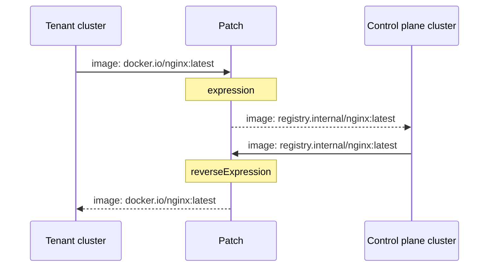

import TenancySupport from '../../../../_fragments/tenancy-support.mdx';
import FeatureTable from '@site/src/components/FeatureTable';

<FeatureTable names="vcp-distro-sync-patches,vcp-distro-translate-patches" />

<TenancySupport hostNodes="true" />

Use patches when a resource needs different field values on each side of the sync boundary. For example, you can rewrite image references to a private registry, or rewrite fields that contain the name of another synced object that vCluster translates. Without a patch, vCluster copies field values unchanged.

Patches are translation rules. When a resource changes, vCluster rewrites the fields that match your patch configuration and writes the result to the target cluster.



## Path syntax

A path identifies the field in the Kubernetes object the patch targets. Patch paths use a dot notation.

### Bracket notation

Use bracket notation for map keys that contain `.`, `[`, or `]`.

```yaml
patches:
  - path: metadata.annotations["example.com/key"]
    expression: '"patched-" + value'
```

### All entries

Use `[*]` to match all elements of an array or all keys of a map. `*` does not match patterns or globs. Rather, it selects every entry at that position in the path. vCluster runs the patch once for each.

You can use `[*]` multiple times in a single path. `spec.containers[*].volumeMounts[*].mountPath` applies the patch to every `mountPath` across every container.

```yaml
patches:
  - path: spec.containers[*].env[*].value
    expression: 'value.replace("internal.svc", "internal.svc.cluster.local")'
```

## Patch modes

Choose the mode based on what the field contains:

| When you need to transform ... | Use |
| --- | --- |
| A field value | `expression` / `reverseExpression` |
| A field referencing another Kubernetes object | `reference` |
| Labels on a custom resource | `labels` |

You can use `expression` and `reverseExpression` together in one entry.

## Validation rules

- Each patch requires a `path`.
- Each patch uses exactly one mode. `expression` and `reverseExpression` can coexist in one entry, but neither can be combined with `reference` or `labels`.
- A resource's patch list cannot contain duplicate paths.
- `metadata.name` and `metadata.namespace` are not valid patch paths.
- Reference patches require a vCluster mapper for the referenced resource type.

## Expression patches

Expression patches run JavaScript against each matched value. The expression receives `value` as the current field value and its return value replaces it.

For `sync.toHost`, `expression` transforms changes from the tenant cluster to the control plane cluster. `reverseExpression` transforms changes from the control plane cluster back to the tenant cluster.
If you omit `expression`, vCluster drops that field from the patch when syncing to the control plane cluster. If you omit `reverseExpression`, it drops the field when syncing back to the tenant cluster. Write only one to create a one-way transform.

For `sync.fromHost`, the transform only happens in one direction, from the control plane cluster to the tenant cluster. Whether to use `expression` or `reverseExpression` depends on the resource. See the [Supported resources](#from-the-control-plane-cluster) table for which to use. If you configure the wrong keyword for a resource, vCluster silently skips the expression and syncs the field unchanged.

```yaml title="Rewrite container images to a private registry"
sync:
  toHost:
    pods:
      enabled: true
      patches:
        - path: spec.containers[*].image
          expression: 'value.replace("docker.io/", "registry.internal/")'
```

In this example, any container image from `docker.io` in the tenant cluster is rewritten when the Pod syncs to the control plane cluster. A Pod with `image: docker.io/nginx:latest` runs as `image: registry.internal/nginx:latest` on the control plane cluster.

```yaml title="Prefix service port names when syncing to the control plane cluster"
sync:
  toHost:
    services:
      enabled: true
      patches:
        - path: spec.ports[*].name
          expression: '"tenant-" + value'
          reverseExpression: 'value.replace(/^tenant-/, "")'
```

In this example, a port named `http` in the tenant cluster becomes `tenant-http` on the control plane cluster. When a change flows back from the control plane cluster, the prefix is stripped and the port is `http` again in the tenant cluster.

```yaml title="Remove a prefix from imported ConfigMap annotations"
sync:
  fromHost:
    configMaps:
      enabled: true
      mappings:
        byName:
          "default/my-cm": "tenant/my-cm"
      patches:
        - path: metadata.annotations[*]
          reverseExpression: 'value.startsWith("www.") ? value.slice(4) : value'
```

In this example, the ConfigMap `my-cm` from the `default` namespace on the control plane cluster is synced into the `tenant` namespace in the tenant cluster. For every annotation value, if the value starts with `www.`, that prefix is stripped in the tenant cluster. An annotation value of `www.example.com` on the control plane cluster appears as `example.com` in the tenant cluster. The control plane cluster object is unchanged.

### JavaScript runtime

Expressions can use these variables:

| Variable | Description |
| --- | --- |
| `value` | The matched value. |
| `valueExists` | `true` when the matched path exists in the patch. |
| `context.vcluster.name` | Tenant cluster name. |
| `context.vcluster.namespace` | Tenant cluster namespace in the control plane cluster. |
| `context.vcluster.config` | Effective `vcluster.yaml` configuration. |
| `context.hostObject` | Control plane cluster object, or `null` when unavailable. |
| `context.virtualObject` | Tenant cluster object, or `null` when unavailable. |
| `context.path` | The concrete matched path, useful with wildcards. |

Expressions can use these helper functions:

| Function | Description |
| --- | --- |
| `btoa(value)` | Base64-encode a string. |
| `atob(value)` | Base64-decode a string. |
| `virtualToHostDNS(value)` | Rewrite a tenant service DNS name to the control plane cluster service DNS name. |

`virtualToHostDNS` supports service DNS names in the form `<name>.<namespace>.svc` or `<name>.<namespace>.svc.<cluster-domain>`.

### Empty paths

Empty paths are an advanced use case. Use them when you need to read multiple fields to decide what to change, or when you need to set multiple fields in a single expression.

With a normal path, `value` is the single field the patch targets. With an empty path, `value` is the entire set of fields being changed in this sync operation. This is only the changed fields, not the full object. The expression must return the modified change set.

```yaml
patches:
  - path: ""
    expression: |
      (value => {
        value.metadata ??= {};
        value.metadata.annotations ??= {};
        value.metadata.annotations["patched-by"] = "vcluster";
        return value;
      })(value)
```

If the incoming change set is `{"spec": {"replicas": 3}}`, the expression receives that object, adds the annotation, and returns `{"spec": {"replicas": 3}, "metadata": {"annotations": {"patched-by": "vcluster"}}}`. Both changes are then applied together.

## Reference patches

Reference patches tell vCluster that a field contains the name of another synced object. When syncing, vCluster rewrites the name to its translated value in the target cluster.

vCluster renames synced objects on the control plane cluster to avoid collisions across tenant clusters. A Secret named `my-secret` in the `default` namespace becomes `default-x-my-secret-x-my-vcluster` on the control plane cluster. Any field that holds that name must be rewritten to match, or the reference breaks.

### Simple reference patch

Use a simple reference patch when the field value is a plain string holding only the object name.

```yaml title="Treat an annotation value as a Secret name"
sync:
  toHost:
    pods:
      enabled: true
      patches:
        - path: metadata.annotations["example.com/secret-name"]
          reference:
            apiVersion: v1
            kind: Secret
```

If a Pod in the tenant cluster has the annotation `example.com/secret-name: my-secret`, vCluster rewrites it when syncing the Pod to the control plane cluster. On the control plane cluster, the annotation becomes `example.com/secret-name: default-x-my-secret-x-my-vcluster`. Without the patch, the annotation stays as `my-secret`, which would not match the actual Secret name on the control plane cluster.

### Structured reference patch

Use a structured reference patch when the field value is a nested object that contains the name as a sub-field, such as a Kubernetes `ObjectReference` or `LocalObjectReference`.

```yaml title="Rewrite a structured Secret reference"
sync:
  toHost:
    customResources:
      widgets.example.com:
        enabled: true
        patches:
          - path: spec.secretRef
            reference:
              apiVersion: v1
              kind: Secret
              namePath: name
              namespacePath: namespace
```

In the tenant cluster, `spec.secretRef` holds an object like:

```yaml
name: my-secret
namespace: default
```

`namePath: name` and `namespacePath: namespace` are paths relative to that object, pointing to the sub-fields vCluster should rewrite. On the control plane cluster, those values become the translated Secret name and namespace:

```yaml
name: default-x-my-secret-x-my-vcluster
namespace: my-vcluster-ns
```

The values you set for `namePath` and `namespacePath` depend on how the resource defines its reference. If the sub-field were named `secretName` instead of `name`, you would write `namePath: secretName`.

`namePath` is required when you set `namespacePath`, `kindPath`, or `apiVersionPath`.

## Labels patches

Use `labels` patches only with custom resource sync. They are not supported on built-in resources.

vCluster translates pod label keys when syncing to the control plane cluster to prevent collisions across tenant clusters. If a custom resource has a field containing label selectors, such as `spec.selector.matchLabels`, those keys must be translated the same way or the selector will not match any pods on the control plane cluster. Setting `labels: {}` on a path tells vCluster to apply that translation to the field. The `labels` key takes an empty object — there are no configuration options inside it.

```yaml title="Translate selector labels on a custom resource"
sync:
  toHost:
    customResources:
      widgets.example.com:
        enabled: true
        patches:
          - path: spec.selector.matchLabels
            labels: {}
```

If `spec.selector.matchLabels` held `{app: my-app}` in the tenant cluster, vCluster rewrites the key to its translated form on the control plane cluster so the selector continues to match the correct pods.

## Supported resources

### To the control plane cluster

These resources sync tenant cluster state to the control plane cluster. Use `expression` for changes flowing outbound and `reverseExpression` for changes flowing back.

| Resource | Config key |
| --- | --- |
| [Pods](../to-host/core/pods/README.mdx) | `sync.toHost.pods.patches` |
| [ConfigMaps](../to-host/core/config-maps.mdx) | `sync.toHost.configMaps.patches` |
| [Secrets](../to-host/core/secrets.mdx) | `sync.toHost.secrets.patches` |
| [Services](../to-host/networking/services.mdx) | `sync.toHost.services.patches` |
| [Endpoints](../to-host/networking/endpoints.mdx) | `sync.toHost.endpoints.patches` |
| [EndpointSlices](../to-host/networking/endpointslices.mdx) | `sync.toHost.endpointSlices.patches` |
| [Ingresses](../to-host/networking/ingresses.mdx) | `sync.toHost.ingresses.patches` |
| [NetworkPolicies](../to-host/networking/network-policies.mdx) | `sync.toHost.networkPolicies.patches` |
| [Gateway API: HTTPRoutes](../to-host/networking/gateway-api.mdx) | `sync.toHost.gatewayApi.httpRoutes.patches` |
| [Gateway API: TLSRoutes](../to-host/networking/gateway-api.mdx) | `sync.toHost.gatewayApi.tlsRoutes.patches` |
| [Gateway API: BackendTLSPolicies](../to-host/networking/gateway-api.mdx) | `sync.toHost.gatewayApi.backendTLSPolicies.patches` |
| [Gateway API: ReferenceGrants](../to-host/networking/gateway-api.mdx) | `sync.toHost.gatewayApi.referenceGrants.patches` |
| [PersistentVolumeClaims](../to-host/storage/persistent-volume-claims.mdx) | `sync.toHost.persistentVolumeClaims.patches` |
| [PersistentVolumes](../to-host/storage/persistent-volumes.mdx) | `sync.toHost.persistentVolumes.patches` |
| [StorageClasses](../to-host/storage/storage-classes.mdx) | `sync.toHost.storageClasses.patches` |
| [ResourceClaims](../to-host/DRA/resourceclaims.mdx) | `sync.toHost.resourceClaims.patches` |
| [ResourceClaimTemplates](../to-host/DRA/resourceclaimtemplates.mdx) | `sync.toHost.resourceClaimTemplates.patches` |
| [PodDisruptionBudgets](../to-host/advanced/pod-disruption-budgets.mdx) | `sync.toHost.podDisruptionBudgets.patches` |
| [Custom resources](../to-host/advanced/custom-resources.mdx) | `sync.toHost.customResources.<resource>.patches` |

### From the control plane cluster

These resources sync control plane cluster state into the tenant cluster. Unlike toHost resources, the keyword that transforms values as they arrive in the tenant cluster is not consistent across fromHost resources. Check the third column before writing your patch.

| Resource | Config key | Use for control plane→tenant |
| --- | --- | --- |
| [ConfigMaps](../from-host/configmaps.mdx) | `sync.fromHost.configMaps.patches` | `reverseExpression` |
| [Secrets](../from-host/secrets.mdx) | `sync.fromHost.secrets.patches` | `reverseExpression` |
| [Nodes](../from-host/nodes.mdx) | `sync.fromHost.nodes.patches` | `expression` |
| [Gateways](../to-host/networking/gateway-api.mdx) | `sync.fromHost.gateways.patches` | `expression` |
| [Custom resources](../from-host/custom-resources.mdx) | `sync.fromHost.customResources.<resource>.patches` | `reverseExpression` |

## Troubleshooting

| Symptom | What to check |
| --- | --- |
| Pro feature license error | Confirm the tenant cluster uses the Pro image and has a license from vCluster Platform. See [Resolve Pro feature license errors](../../../../troubleshoot/pro-feature-license-error.mdx). |
| Patch appears to do nothing | Confirm the path exists in the merge patch for the update. Patches run on changed fields only, not the full object. On create, vCluster converts the object to a patch, so more fields are available. |
| `sync.fromHost` patch appears to do nothing | Confirm you are using the correct expression keyword for the resource. vCluster silently skips the wrong keyword with no error. See the [Supported resources](#from-the-control-plane-cluster) table. |
| A field stops syncing in one direction | Check whether you have an `expression` or `reverseExpression` entry for that direction. Omitting the expression for a direction causes vCluster to drop that field from the patch. |
| An object is stuck in a failing sync loop | An expression error is likely. Check vCluster pod logs for messages containing `apply patches host object` or `apply patches virtual object`. No event or status condition is set on the object. |
| A field is being deleted instead of transformed | The expression may be returning `null` or `undefined`. vCluster deletes the field when an expression returns either value. |
| Reference patch fails with a missing mapper error | The referenced resource type must be synced or otherwise known to vCluster. |
