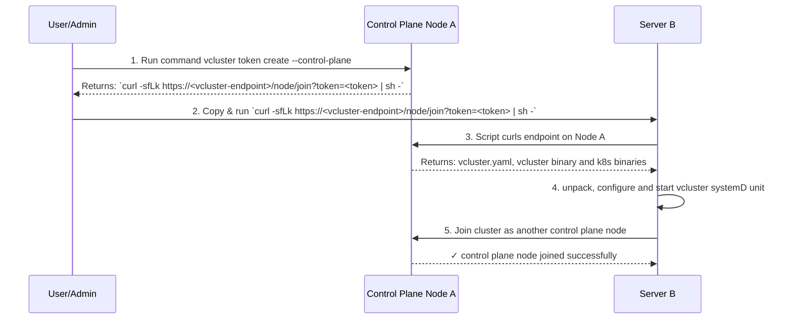

## vCluster Standalone

vCluster Standalone is a different architecture model for vCluster. By default, the control plane and worker nodes are deployed on shared nodes from a host cluster, but with vCluster Standalone, there is no longer a host cluster. vCluster is deployed directly onto nodes like any typical Kubernetes distribution. vCluster Standalone can run on any type of node, whether that is a bare-metal node or VM. It doesn't matter where the node is hosted.

It provides the strictest isolation for workloads as there is no shared host cluster for the control plane or worker nodes. When enabling vCluster Standalone, the control plane is now no longer on a shared host cluster, but on its own independent node. To add worker nodes, the private nodes feature is required.

<br />

<center>
  
</center>

You can connect and manage vCluster Standalone via vCluster Platform.

### Shared Nodes vs. Private Nodes vs. Standalone

Understanding the different deployment models helps you choose the right approach for your use case:

- **Shared Nodes**: vCluster runs on a host Kubernetes cluster, sharing resources with other workloads
- **Private Nodes**: vCluster has dedicated worker nodes but the control plane still runs on the host cluster
- **Standalone**: Complete independence with no host cluster - both control plane and worker nodes run on dedicated infrastructure

## Installation Scripts

The installation assets are located in the GitHub release assets of the vCluster version you want to install. You can find these at: `https://github.com/loft-sh/vcluster/releases/download/<version>/install-standalone.sh`

## Prerequisites

### OS Prerequisites

- Linux distribution with SystemD support (required for service management)
- `iptables` binaries installed (automatically available on Ubuntu, may need manual installation on other distributions)
- `curl` installed
- Root user access
- Increased fs.inotify resource limits (they are defined by `fs.inotify.max_user_watches` and `fs.inotify.max_user_instances` system variables. For example, in Ubuntu these default to 8192 and 128 respectively, which is not enough.)

:::warning
Security-Enhanced Linux (SELinux) is currently not supported.
:::

### Node Prerequisites

- VM or bare-metal server
- Network connectivity to download installation assets
- Network connectivity between control plane and worker nodes (if adding multiple nodes)

## Install Initial Control Plane Node

### vCluster Configuration

Create a `vcluster.yaml` configuration file on the control plane node:

```yaml title="vcluster.yaml"
controlPlane:
  standalone:
    enabled: true
    joinNode:
      enabled: true  # Makes control plane node also act as worker node
privateNodes:
  enabled: true  # Required for adding dedicated worker nodes
```

**Configuration options:**
- `controlPlane.standalone.enabled: true` - Enables standalone deployment
- `controlPlane.standalone.joinNode.enabled: true` - Control plane node also functions as a worker node (useful for single-node setups)
- `privateNodes.enabled: true` - Allows adding dedicated worker nodes to the cluster

### Installation

Save the configuration on your control plane node:

```bash title="Create vcluster.yaml on control plane node"
cat <<EOF > vcluster.yaml
controlPlane:
  standalone:
    enabled: true
    joinNode:
      enabled: true
privateNodes:
  enabled: true
EOF
```

Run the installation script on the control plane node:

```bash title="Install vCluster Standalone on control plane node"
sudo su -
export VCLUSTER_VERSION="v0.26.0-beta.2"
curl -sfL https://github.com/loft-sh/vcluster/releases/download/${VCLUSTER_VERSION}/install-standalone.sh | sh -s -- --vcluster-name standalone --config ${PWD}/vcluster.yaml
```

### Installation Flags

| Flag | Description |
|------|-------------|
| `--vcluster-name` | Name of the vCluster instance |
| `--vcluster-version` | Specific vCluster version to install |
| `--config` | Path to the vcluster.yaml configuration file |
| `--skip-download` | Skip downloading vCluster binary (use existing) |
| `--skip-wait` | Exit without waiting for vCluster to be ready |
| `--extra-env` | Additional environment variables for vCluster |
| `--platform-access-key` | Access key for vCluster Platform integration |
| `--platform-host` | vCluster Platform host URL |
| `--platform-insecure` | Skip TLS verification for Platform connection |
| `--platform-instance-name` | Instance name in vCluster Platform |
| `--platform-project` | Project name in vCluster Platform |

### HA Configuration

For high availability setups, enable embedded etcd:

```yaml title="vcluster.yaml for HA"
controlPlane:
  standalone:
    enabled: true
    joinNode:
      enabled: true  # Optional: makes control plane nodes visible as worker nodes
  backingStore:
    etcd:
      embedded:
        enabled: true  # Required for HA
privateNodes:
  enabled: true
```

:::warning
vCluster Standalone high-availability uses embedded ETCD as a backing store. Other backing-store options are currently not supported.
:::

### Verify Installation

Check that the control plane node is ready (run these commands on the control plane node):

```bash title="Check node status"
kubectl get nodes
```

Expected output:
```bash
NAME               STATUS   ROLES                  AGE   VERSION
ip-192-168-3-131   Ready    control-plane,master   11m   v1.32.1
```

Verify cluster components are running:

```bash title="Check system pods"
kubectl get pods -A
```

You should see:
- **Flannel**: CNI for container networking
- **CoreDNS**: DNS service for the cluster
- **KubeProxy**: Network traffic routing and load balancing
- **Konnectivity**: Secure control plane to worker node communication
- **Local Path Provisioner**: Dynamic storage provisioning

## Kubeconfig

After installation, the kubeconfig is automatically configured on the control plane node. The kubectl context is set to interact with your new vCluster Standalone instance.

To access the cluster from other machines, copy the kubeconfig from `/var/lib/vcluster/kubeconfig.yaml` on the control plane node or use the vCluster CLI to generate access credentials.

## Add Additional Control Plane Nodes

### Create Join Token

From the initial control plane node, generate a join token:

```bash title="Generate control plane join token"
vcluster token create --control-plane
```

Optional flags:
- `--expires=24h` - Set token expiration time. By default, it is set to 1 hour.

This outputs a join command like:
```bash
curl -sfLk https://<vcluster-endpoint>/node/join?token=<token> | sh -
```

### Join Control Plane Node

On the new control plane node, run the join command:

```bash title="Join as control plane node"
curl -sfLk https://<vcluster-endpoint>/node/join?token=<token> | sh -
```

The new node will automatically download the necessary binaries and configuration, then join the cluster as an additional control plane node.



## Add Worker Nodes

To add dedicated worker nodes to your vCluster Standalone cluster, follow the [Private Nodes documentation](../../worker-nodes/private-nodes/join.mdx) for detailed instructions on joining worker nodes.

**Important**: The API Server endpoint must be reachable from worker nodes. Configure `controlPlane.endpoint` and `controlPlane.proxy.extraSANs` in your vCluster configuration to expose the API Server appropriately for your network setup.

## Update vCluster Standalone configuration

Changing configuration can be done on one of the control plane nodes.
By default, `vcluster.yaml` is located at: `/var/lib/vcluster/config.yaml`. You can modify this file and then restart vCluster systemD service: `systemctl restart vcluster.service`.

If config syncing is enabled (`controlPlane.standalone.syncConfig.enabled = true`, enabled by default), change will be automatically propagated to other control plane nodes.

## Remove Control Plane Nodes

### If Control Plane Node is Joined as Worker

If your control plane node is also acting as a worker node (`controlPlane.standalone.joinNode.enabled: true`), follow the [worker node removal steps](../../worker-nodes/private-nodes/manage.mdx#remove-worker-node).

### Remove Control Plane Only

For control plane nodes that are not joined as worker nodes:

1. Stop the vCluster service:
```bash title="Stop vCluster service"
systemctl stop vcluster.service
```

2. Remove vCluster files:
```bash title="Clean up vCluster files"
rm -rf /var/lib/vcluster && rm /etc/systemd/system/vcluster.service
```

## Limitations

vCluster Standalone has several limitations compared to regular vCluster deployments:

- **Syncing disabled**: Resource syncing between host and virtual cluster is not available since there's no host cluster
- **Host cluster features**: Any vCluster features that depend on host cluster integration are not supported
- **Backing store options**: Only embedded etcd is supported for HA configurations

For a complete list of feature limitations, refer to the [Private Nodes limitations](../../worker-nodes/private-nodes/README.mdx) as they share similar constraints.

## Troubleshooting

### Check vCluster Logs

View service logs using journalctl:

```bash title="View vCluster service logs"
journalctl -u vcluster.service --since="2 minutes ago" -f
```

### Common Issues

- **Network connectivity**: Ensure ports 6443 (API Server) and other required ports are accessible
- **SystemD service**: Verify the vCluster service is running: `systemctl status vcluster.service`
- **Node join failures**: Check that join tokens haven't expired and network connectivity exists between nodes
- **Resource constraints**: Ensure adequate CPU, memory, and disk space on nodes