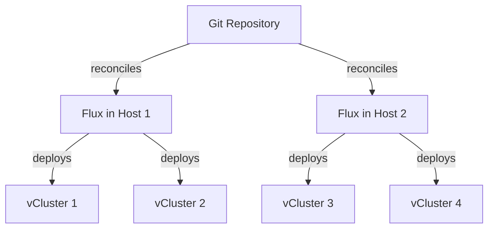
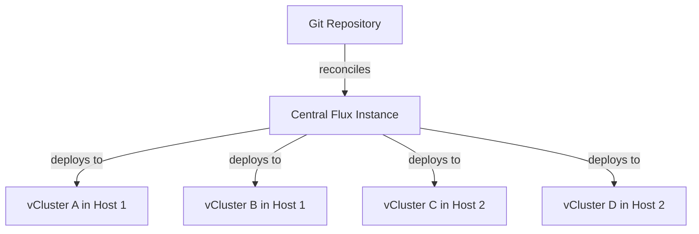
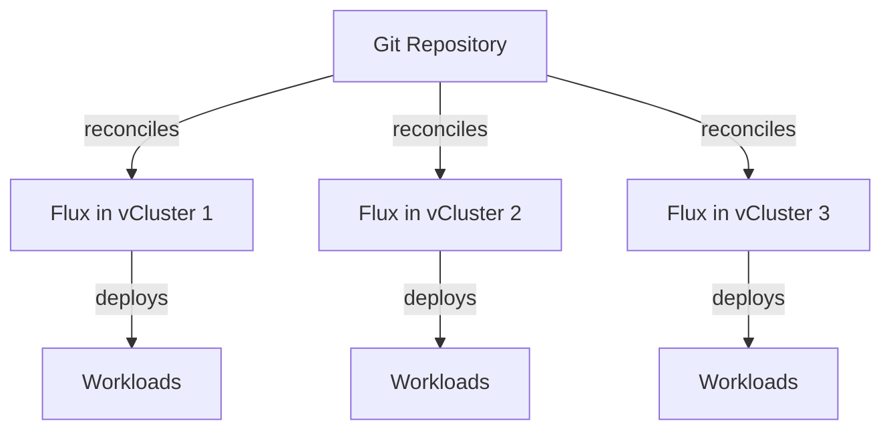

import Tabs from '@theme/Tabs'
import TabItem from '@theme/TabItem'
import Highlight from "@site/src/components/Highlight/Highlight"
import Flow, { Step } from "@site/src/components/Flow"
import BasePrerequisites from '@site/docs/_partials/base-prerequisites.mdx'

<!-- vale off -->
# Deploy with Flux
<!-- vale on -->

This guide shows how to deploy and manage virtual clusters using [Flux](https://fluxcd.io/), a GitOps tool for Kubernetes. Flux implements GitOps principles by continuously ensuring that your Kubernetes clusters match the desired state defined in a Git repository.

## Prerequisites

<BasePrerequisites />

Additionally, you'll need:

- A Kubernetes cluster with Flux controllers installed
- The `flux` CLI tool installed on your machine (See [Flux Installation Guide](https://fluxcd.io/flux/installation/))
- The `vcluster` CLI tool installed on your machine
- Basic understanding of GitOps principles

## Architecture options {#architecture-options}

When integrating Flux with virtual clusters, it's important to consider the architectural pattern that best fits your GitOps strategy. The relationship between Flux and virtual clusters can be configured in multiple ways, each with its own trade-offs.

:::info Flux and multi-cluster management
Unlike ArgoCD, which treats other clusters as first-class objects, Flux manages workloads on other clusters through KubeConfig references in HelmRelease and Kustomize resources. This difference in design influences how you'll structure your GitOps workflows when working with virtual clusters.
:::

:::tip Scaling considerations for ephemeral environments
The standalone approach of deploying Flux in each virtual cluster may not scale well for large numbers of virtual clusters, especially for ephemeral environments like PR preview environments. A hub and spoke model or a Flux instance per host cluster approach is generally more resource-efficient for these scenarios, as it reduces the overhead of running multiple Flux controllers.
:::

### 1. Flux instance per host cluster {#flux-per-host}

When running Flux on each host cluster, it can manage the virtual clusters within that environment. This approach is recommended if you already use Flux for each traditional cluster and want to maintain a similar management pattern.



:::info Architecture characteristics
- One Flux instance per host cluster
- Each Flux instance manages multiple virtual clusters on that host
- Virtual cluster KubeConfig Secret management is simplified since Secrets are local to the cluster
- Clear separation of responsibilities by host cluster
- Recommended if you already use a Flux instance per traditional cluster
- Provides better resource utilization since the Flux controllers are shared
:::

### 2. Hub and spoke model {#hub-and-spoke}

With this approach, a central Flux instance manages multiple virtual clusters across different host clusters. This is a good option if you already use a single Flux instance with multiple Kubernetes clusters or if you want centralized control of all virtual environments.



:::info Architecture characteristics
- One central Flux instance manages multiple virtual clusters across different hosts
- Works well with existing hub and spoke Flux setups
- Requires secure KubeConfig Secret management between clusters
- More efficient for large numbers of virtual clusters
- Provides a single control point for all virtual cluster management
- Can simplify GitOps workflows by having a single source of truth
:::

### 3. Flux inside virtual clusters {#flux-inside-vclusters}

While possible, running Flux inside every virtual cluster adds resource overhead and management complexity. This approach might be suitable when virtual clusters need complete isolation and independent GitOps workflows.



:::info Architecture characteristics
- Each virtual cluster runs its own Flux instance
- Provides complete isolation between environments
- Teams can manage their own GitOps workflows independently
- Increased resource overhead (each vCluster needs its own Flux controllers)
- More complex to manage at scale
- Suitable for environments where strict isolation is required
:::

<!-- vale off -->
## Enable KubeConfig export {#enable-kubeconfig-export}
<!-- vale on -->

To enable Flux to deploy to virtual clusters, you need to create a KubeConfig Secret that Flux can reference.

```yaml title="Configure KubeConfig export in vcluster.yaml"
exportKubeConfig:
  # Set a meaningful context name
  context: default
  # Use a server URL that is accessible from the Flux controllers
  server: https://vcluster-name.vcluster-namespace.svc.cluster.local:443
  # Skip TLS verification when Flux connects to the vCluster
  insecure: true
  # Specify the secret where the KubeConfig will be stored
  secret:
    name: vcluster-flux-kubeconfig
syncer:
  extraArgs:
    # Add TLS SAN for the server URL to ensure certificate validity
    - --tls-san=vcluster-name.vcluster-namespace.svc.cluster.local
```

This configuration:
- Exports the virtual cluster KubeConfig as a Secret in the host namespace
- Makes the Secret available for Flux to use with the `spec.kubeConfig` field
- Uses a server URL that is accessible from the Flux controllers (replace `vcluster-name` and `vcluster-namespace` with your actual values)
- Sets `insecure: true` to automatically skip TLS certificate verification
- Adds a TLS SAN (Subject Alternative Name) that matches the server URL, which helps prevent certificate verification errors

:::info KubeConfig Secret key
The vCluster `exportKubeConfig` configuration creates a Secret with the KubeConfig data stored under the key `config`. When referring to this Secret in Flux resources, you must specify this key in the `secretRef.key` field, as shown in the examples below.

```yaml
# In Flux HelmRelease
spec:
  kubeConfig:
    secretRef:
      name: vcluster-flux-kubeconfig
      key: config  # Must match the key used in the vCluster-generated Secret
```
:::

:::warning Certificate verification considerations
When using vCluster with Flux, proper TLS certificate configuration is essential:

1. Set `exportKubeConfig.insecure: true` in your vCluster configuration
2. Configure proper TLS SANs with the `--tls-san` flag in vCluster configuration
3. Ensure the server URL matches the certificate's SAN

```yaml
# In your vCluster configuration
syncer:
  extraArgs:
    - --tls-san=vcluster-name.vcluster-namespace.svc.cluster.local

exportKubeConfig:
  server: https://vcluster-name.vcluster-namespace.svc.cluster.local:443
  insecure: true
```

See the [Troubleshooting](#tls-certificate-verification-errors) section for solutions to certificate issues.
:::

## Deploy virtual clusters with Flux

<Flow id="flux-deploy-vcluster">
<Step>

<Highlight>Git Repository</Highlight> Create the vCluster Helm repository definition

First, create a source for the vCluster Helm charts in your Git repository:

```yaml title="clusters/sources/vcluster-repository.yaml"
---
apiVersion: source.toolkit.fluxcd.io/v1beta2
kind: HelmRepository
metadata:
  name: vcluster
  namespace: flux-system
spec:
  interval: 1h
  url: https://charts.loft.sh
```

</Step>

<Step>

<Highlight>Git Repository</Highlight> Define your vCluster configuration

Create a vCluster configuration file in your Git repository:

```yaml title="clusters/production/vcluster-demo.yaml"
---
apiVersion: helm.toolkit.fluxcd.io/v2
kind: HelmRelease
metadata:
  name: vcluster-demo
  namespace: vcluster-demo
spec:
  interval: 10m
  chart:
    spec:
      chart: vcluster
      version: "0.24.x"
      sourceRef:
        kind: HelmRepository
        name: vcluster
        namespace: flux-system
  values:
    # Configure TLS SAN for the certificate
    syncer:
      extraArgs:
        - --tls-san=vcluster-demo.vcluster-demo.svc.cluster.local

    exportKubeConfig:
      # Set a meaningful context name
      context: default
      # Use a server URL that matches the TLS SAN
      server: https://vcluster-demo.vcluster-demo.svc.cluster.local:443
      # Skip TLS verification when Flux connects to the vCluster
      insecure: true
      # Specify the secret where the KubeConfig will be stored
      secret:
        name: vcluster-flux-kubeconfig
    sync:
      toHost:
        ingresses:
          enabled: true
    controlPlane:
      coredns:
        enabled: true
        embedded: true
      backingStore:
        etcd:
          embedded:
            enabled: true
```

You can include any standard vCluster configuration in the `values` section.

</Step>

<Step>

<Highlight>Kubernetes Cluster</Highlight> Apply the vCluster namespace

Before applying the HelmRelease, ensure the namespace exists:

```bash title="Create the namespace"
kubectl create namespace vcluster-demo
```

</Step>

<Step>

<Highlight>Git Repository</Highlight> Commit and push your changes

```bash title="Commit and push to the repository"
git add clusters/
git commit -m "Add vCluster demo configuration"
git push
```

Flux detects the changes and deploy the vCluster according to your configuration.

</Step>
</Flow>

## Deploy applications to virtual clusters

Once your vCluster is running, you can use Flux to deploy applications directly to the vCluster.

<Flow id="flux-deploy-apps">
<Step>

<Highlight>Git Repository</Highlight> Create a Helm repository source

```yaml title="vcluster-apps/sources/podinfo-repository.yaml"
---
apiVersion: source.toolkit.fluxcd.io/v1beta2
kind: HelmRepository
metadata:
  name: podinfo
  namespace: vcluster-demo
spec:
  interval: 1h
  url: https://stefanprodan.github.io/podinfo
```

</Step>

<Step>

<Highlight>Git Repository</Highlight> Create a HelmRelease targeting the vCluster

```yaml title="vcluster-apps/apps/podinfo-app.yaml"
---
apiVersion: helm.toolkit.fluxcd.io/v2
kind: HelmRelease
metadata:
  name: podinfo
  namespace: vcluster-demo
spec:
  chart:
    spec:
      chart: podinfo
      reconcileStrategy: ChartVersion
      sourceRef:
        kind: HelmRepository
        name: podinfo
      version: '*'
  interval: 30m
  kubeConfig:
    secretRef:
      name: vcluster-flux-kubeconfig
      key: config
    # Skip TLS verification for the target cluster
    # Available in Flux v0.40.0 and later
    skipTLSVerify: true
  releaseName: podinfo
  targetNamespace: podinfo
  install:
    createNamespace: true
  values:
    ui:
      message: "Deployed by Flux to virtual cluster"
    ingress:
      enabled: true
      hosts:
        - host: podinfo.example.com
          paths:
            - path: /
              pathType: Prefix
```

:::tip Handling TLS certificate verification
The `kubeConfig` section references the Secret created by the vCluster using the `exportKubeConfig` setting. There are several approaches to handle TLS certificate verification:

- **Recommended approach (Flux v0.40.0+)**: Use `skipTLSVerify: true` in the `kubeConfig` section as shown above, which tells Flux to skip certificate verification when connecting to the virtual cluster.

- **Alternative approach**: Configure both the TLS SAN and `insecure: true` in your vCluster configuration as we did in the example.

- **If you still encounter certificate errors**: Use a modified Secret created with the solution in the [troubleshooting section](#tls-certificate-verification-errors):

```yaml title="Use a modified KubeConfig Secret"
kubeConfig:
  secretRef:
    name: vcluster-flux-kubeconfig-modified  # Use the modified Secret
    key: config
```
:::

</Step>

<Step>

<Highlight>Git Repository</Highlight> Commit and push your changes

```bash title="Commit and push application definitions"
git add vcluster-apps/
git commit -m "Add podinfo application for vCluster demo"
git push
```

</Step>

<Step>

<Highlight color="green">Virtual Cluster</Highlight> Verify deployment

Once Flux reconciles the changes, you can connect to your vCluster and verify the application is deployed:

```bash title="Connect to vCluster and check deployment"
vcluster connect vcluster-demo -n vcluster-demo

# Check the deployment in the virtual cluster
kubectl get namespace podinfo
kubectl get pods -n podinfo
kubectl get ingress -n podinfo
```

</Step>
</Flow>

## Manage multiple virtual clusters {#manage-multiple-vclusters}

When managing multiple virtual clusters with Flux, you can use Kustomize to organize your configurations.

```yaml title="clusters/kustomization.yaml"
---
apiVersion: kustomize.config.k8s.io/v1beta1
kind: Kustomization
resources:
  - sources/vcluster-repository.yaml
  - development/vcluster-dev.yaml
  - staging/vcluster-staging.yaml
  - production/vcluster-prod.yaml
```

## Bootstrap review environments with pre-installed Flux {#bootstrapping-review-environments}

A common scenario is having Flux already installed on the host cluster and wanting to leverage it for ephemeral review environments with virtual clusters. This approach follows GitOps principles while avoiding the need to install Flux separately for each environment.

### Use ResourceSet feature for review environments {#flux-resource-sets}

For newer versions of Flux, you can use the native Flux Operator `ResourceSet` capability to manage ephemeral environments efficiently. This is a powerful feature for creating review environments that include virtual clusters.

```yaml title="pr-resource-set.yaml"
apiVersion: resourcesets.toolkit.fluxcd.io/v1alpha2
kind: ResourceSet
metadata:
  name: pr-123
  namespace: reviews
spec:
  interval: 5m
  serviceAccountName: flux-reconciler
  resources:
    # First create the vCluster
    - apiVersion: v1
      kind: Namespace
      metadata:
        name: review-123
      
    - apiVersion: helm.toolkit.fluxcd.io/v2
      kind: HelmRelease
      metadata:
        name: vcluster-pr-123
        namespace: review-123
      spec:
        interval: 10m
        chart:
          spec:
            chart: vcluster
            version: "0.24.x"
            sourceRef:
              kind: HelmRepository
              name: vcluster
              namespace: flux-system
        values:
          exportKubeConfig:
            context: default
            server: https://vcluster-pr-123.review-123.svc.cluster.local:443
            insecure: true
            secret:
              name: vcluster-pr-123-kubeconfig
    
    # Then deploy the PR app code into the vCluster
    - apiVersion: helm.toolkit.fluxcd.io/v2
      kind: HelmRelease
      metadata:
        name: pr-app
        namespace: review-123
      spec:
        interval: 5m
        chart:
          spec:
            chart: ./charts/app
            sourceRef:
              kind: GitRepository
              name: pull-request-123
              namespace: flux-system
        kubeConfig:
          secretRef:
            name: vcluster-pr-123-kubeconfig
            key: config
          skipTLSVerify: true
        values:
          image:
            tag: pr-123
```

This approach allows you to:
- Create the vCluster and deploy applications in a single resource
- Use the Flux Operator directly without having to create custom CI scripts
- Simplify the cleanup when a PR is closed or merged
- Manage the entire lifecycle of review environments through GitOps practices

For more details, see the [Flux Operator ResourceSet documentation](https://fluxcd.control-plane.io/operator/resourcesets/github-pull-requests/) and an [example implementation](https://github.com/loft-demos/vcluster-platform-demo-app-template/blob/main/vcluster-use-cases/flux/pull-request-environments/pr-resource-set.yaml).

### Use existing Flux for review environments

When Flux is already installed on your host cluster, you can create a GitOps workflow for review environments that:

1. Uses the existing Flux installation on the host cluster
2. Deploys virtual clusters for each review environment
3. Leverages Flux to deploy applications to these virtual clusters
4. Reduces overhead and speeds up environment bootstrapping

<Flow id="gitops-review-environments">
<Step>

<Highlight>Git Repository</Highlight> Create a structure for review environments

```
├── clusters/
│   ├── sources/
│   │   └── vcluster-repository.yaml  # HelmRepository for vCluster
│   └── reviews/
│       ├── review-env-template.yaml  # Template for new review environments
│       └── pr-123/                   # Directory for a specific PR review
│           └── vcluster.yaml         # vCluster definition for PR-123
└── apps/
    ├── sources/
    │   └── app-repository.yaml       # Application source repositories
    └── reviews/
        └── pr-123/                   # Apps for PR-123 environment
            └── deployment.yaml       # Application deployment targeting PR-123 vCluster
```

</Step>
<Step>

<Highlight>Git Repository</Highlight> Create a template for review environments

```yaml title="clusters/reviews/review-env-template.yaml"
---
apiVersion: helm.toolkit.fluxcd.io/v2
kind: HelmRelease
metadata:
  name: vcluster-${PR_NUMBER}
  namespace: review-${PR_NUMBER}
spec:
  interval: 10m
  chart:
    spec:
      chart: vcluster
      version: "0.24.x"
      sourceRef:
        kind: HelmRepository
        name: vcluster
        namespace: flux-system
  values:
    sync:
      toHost:
        ingresses:
          enabled: true
    exportKubeConfig:
      context: default
      server: https://kubernetes.default.svc.cluster.local:443
      secret:
        name: vcluster-${PR_NUMBER}-kubeconfig
```

</Step>
<Step>

<Highlight>CI Pipeline</Highlight> Create a CI workflow that generates environments

```yaml title="CI workflow (conceptual)"
steps:
  - name: Checkout code
    uses: actions/checkout@v2

  - name: Create PR-specific vCluster config
    run: |
      export PR_NUMBER=${GITHUB_REF#refs/pull/}
      export PR_NUMBER=${PR_NUMBER%/merge}
      mkdir -p clusters/reviews/pr-${PR_NUMBER}

      # Generate the vCluster config from template
      cat clusters/reviews/review-env-template.yaml | \
        sed "s/\${PR_NUMBER}/$PR_NUMBER/g" > \
        clusters/reviews/pr-${PR_NUMBER}/vcluster.yaml

  - name: Commit and push to GitOps repo
    run: |
      git add clusters/reviews/pr-${PR_NUMBER}
      git commit -m "Add review environment for PR #${PR_NUMBER}"
      git push
```

With this approach, your CI/CD pipeline creates the necessary configuration in your GitOps repository, and Flux (already running on the host cluster) automatically provisions the vCluster and deploys applications to it.

</Step>
<Step>

<Highlight>Host Cluster</Highlight> Existing Flux detects and applies changes

The Flux controllers already running on your host cluster is going to:

- Detect the new vCluster configuration
- Create the required namespace
- Deploy the vCluster using the Helm chart
- Create the KubeConfig Secret
- Use the exported KubeConfig to deploy apps to the vCluster

This entire process follows GitOps principles, with your Git repository as the source of truth, and Flux handling the reconciliation—all without requiring manual intervention or imperative commands.

</Step>
</Flow>

:::tip
For production environments, consider implementing automatic cleanup of review environments when PRs are closed or merged. This can be done by adding another CI workflow step that removes the corresponding directory from your GitOps repository.
:::

This pattern allows you to leverage an existing Flux installation rather than deploying Flux separately for each review environment, which significantly reduces overhead and bootstrap time.

:::tip Advanced management with vCluster Platform
For organizations managing a large number of virtual clusters, especially for dynamic ephemeral environments, vCluster Platform provides additional capabilities for virtual cluster lifecycle management and integrates well with GitOps workflows. It includes features for automatic creation of KubeConfig Secrets, management of access control, and simplified bootstrapping of virtual clusters with Flux.
:::

## Troubleshoot

<Highlight>Host Cluster</Highlight>
- Verify the virtual cluster KubeConfig Secret exists with the correct format
- Check Flux controller logs for errors
- Ensure Flux has the necessary permissions to access the Secret

```bash title="Check Flux source controller logs"
kubectl logs -n flux-system deployment/source-controller
```

```bash title="Check Flux helm controller logs"
kubectl logs -n flux-system deployment/helm-controller
```

<Highlight color="green">Virtual Cluster</Highlight>
- Verify that resources are being created in the virtual cluster
- Check that the exportKubeConfig setting is properly configured
- Ensure the server URL is reachable from the Flux controllers

```bash title="Check virtual cluster configuration"
kubectl get configmap -n vcluster-namespace vcluster-flux-demo -o yaml
```

### Common Issues

<!-- vale off -->
#### TLS certificate verification errors {#tls-certificate-verification-errors}
<!-- vale on -->

If you see TLS certificate verification errors in Flux controller logs like:

```
tls: failed to verify certificate: x509: certificate signed by unknown authority
```

This is a common issue when Flux attempts to connect to a vCluster, because the vCluster generates a self-signed certificate. Follow these solutions in order:

<!-- vale off -->
##### Solution 1: properly configure vcluster certificate SANs
<!-- vale on -->

The most reliable approach is to configure proper TLS SANs when deploying vCluster:

```yaml title="vCluster configuration with proper TLS SANs"
syncer:
  extraArgs:
    - --tls-san=vcluster-name.vcluster-namespace.svc.cluster.local

exportKubeConfig:
  server: https://vcluster-name.vcluster-namespace.svc.cluster.local:443
  insecure: true
  secret:
    name: vcluster-flux-kubeconfig
```

This ensures the certificate includes the correct SAN for the service DNS name.

<!-- vale off -->
##### Solution 2: use a modified kubeconfig secret
<!-- vale on -->

If you're still encountering issues, create a modified KubeConfig Secret with TLS verification disabled:

```bash title="Create a modified KubeConfig Secret"
# Set your environment variables
NAMESPACE="vcluster-namespace"
VCLUSTER_NAME="vcluster-name"
KUBECONFIG_SECRET="vcluster-flux-kubeconfig"

# Create a temporary directory
TMPDIR=$(mktemp -d)
cd $TMPDIR

# Extract original kubeconfig
kubectl get secret -n $NAMESPACE $KUBECONFIG_SECRET -o jsonpath='{.data.config}' | base64 -d > original-kubeconfig.yaml

# Extract client certificates
CLIENT_CERT=$(grep -A1 "client-certificate-data:" original-kubeconfig.yaml | tail -n1 | awk '{print $1}')
CLIENT_KEY=$(grep -A1 "client-key-data:" original-kubeconfig.yaml | tail -n1 | awk '{print $1}')

# Create KubeConfig without certificate-authority-data and with insecure-skip-tls-verify enabled
cat > modified-kubeconfig.yaml << EOF
apiVersion: v1
clusters:
- cluster:
    insecure-skip-tls-verify: true
    server: https://${VCLUSTER_NAME}.${NAMESPACE}.svc.cluster.local:443
  name: default
contexts:
- context:
    cluster: default
    user: default
  name: default
current-context: default
kind: Config
preferences: {}
users:
- name: default
  user:
    client-certificate-data: ${CLIENT_CERT}
    client-key-data: ${CLIENT_KEY}
EOF

# Create Secret
kubectl create secret generic ${KUBECONFIG_SECRET}-modified -n $NAMESPACE --from-file=config=modified-kubeconfig.yaml

# Clean up
rm -rf $TMPDIR
```

Then update your Flux resource to use this Secret:

```yaml title="Update HelmRelease or Kustomization"
spec:
  kubeConfig:
    secretRef:
      name: vcluster-flux-kubeconfig-modified
      key: config
```

<!-- vale off -->
##### Solution 3: use flux's built-in tls verification options
<!-- vale on -->

For newer versions of Flux (v0.40.0+), you can use Flux's native TLS verification options in your HelmRelease or Kustomization resources:

```yaml title="Configure HelmRelease with skipTLSVerify"
apiVersion: helm.toolkit.fluxcd.io/v2
kind: HelmRelease
metadata:
  name: podinfo
  namespace: vcluster-demo
spec:
  # Other fields...
  kubeConfig:
    secretRef:
      name: vcluster-flux-kubeconfig
      key: config
    # Skip TLS verification for target cluster
    skipTLSVerify: true
```

```yaml title="Configure Kustomization with skipTLSVerify"
apiVersion: kustomize.toolkit.fluxcd.io/v1
kind: Kustomization
metadata:
  name: app-deployment
  namespace: vcluster-demo
spec:
  # Other fields...
  kubeConfig:
    secretRef:
      name: vcluster-flux-kubeconfig
      key: config
    # Skip TLS verification for target cluster
    skipTLSVerify: true
```

This approach has the advantage of not requiring you to modify the KubeConfig Secret manually while still resolving TLS certificate verification issues.

#### Connection refused errors

If you see "connection refused" errors in the Flux controller logs, it may indicate:
1. The virtual cluster's API server is not accessible from Flux
2. Network policies are blocking the communication
3. The virtual cluster is not running or healthy
4. The server URL in the KubeConfig is not correctly configured

You might see errors in the Flux controller logs like:

```
connect: connection refused
```

To troubleshoot:

1. Check if the virtual cluster is running and ready:
```bash title="Verify vCluster status"
kubectl get pods -n <vcluster-namespace>
```

2. Verify the server URL in your `exportKubeConfig` setting:
```bash title="Check server URL in KubeConfig"
kubectl get secret -n <vcluster-namespace> <kubeconfig-secret-name> -o jsonpath='{.data.config}' | base64 -d | grep server
```

3. Ensure the server URL is accessible from the Flux controllers. Using the service DNS name is generally more reliable:
```yaml title="Recommended server URL format"
server: https://vcluster-name.vcluster-namespace.svc.cluster.local:443
```
