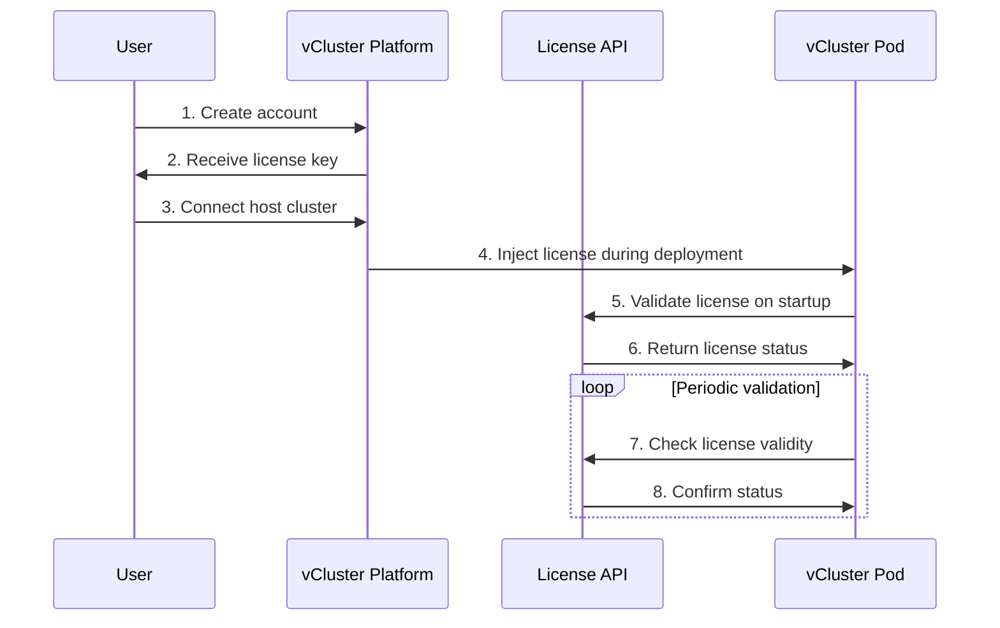

import FeatureTable from '@site/src/components/FeatureTable';

# Compare open source and free tiers

vCluster is available in multiple tiers to serve different use cases, from open source community projects to enterprise production deployments. This guide explains the differences between the Open Source (OSS) and Free tiers, and how to get started with the Free tier.

## Overview

**vCluster Open Source** is the foundation of the vCluster project - fully open source under the Apache 2.0 license. It provides core virtual cluster features for development, testing, and production workloads.

**vCluster Free tier** builds on top of the open source version with enhanced features specifically designed for teams and organizations. The Free tier includes all OSS features plus additional capabilities at no cost.

For detailed pricing information across all tiers, see the [vCluster Pricing](https://www.vcluster.com/pricing) page.

:::info
The Free tier requires connecting your virtual cluster to the vCluster Platform for license validation, but remains free to use with no credit card required.
:::

<!--
  FeatureTable: To modify features or product tiers, edit:
  - src/data/features.yaml (feature definitions)
  - src/data/products.yaml (product tiers and feature assignments)

  This table shows key differences between OSS and Free tiers.
  For comprehensive feature availability across all tiers and tenancy models,
  see: /docs/vcluster/introduction/what-are-virtual-clusters
-->
<FeatureTable names="virtual-clusters,resource-syncing,multi-namespace-mode,network-policies,pod-security-standards,platform-integration,auto-delete,sleep-mode" />

### What's included in open source

vCluster OSS provides the essential building blocks for virtual Kubernetes clusters:

- **Virtual Kubernetes clusters**: Run fully isolated Kubernetes environments within a host cluster
- **Resource syncing**: Automatic synchronization of pods, services, configmaps, secrets, and other core resources
- **Multi-namespace mode**: Support for workloads spanning multiple namespaces
- **Backing store options**: Choose between deployed etcd or SQLite for storing cluster state
- **Multiple Kubernetes distributions**: Run k3s, k0s, vanilla Kubernetes, or EKS distros

### What's added in Free tier

The Free tier includes all OSS features plus:

- **[vCluster Platform integration](../configure/vcluster-yaml/external/platform/README.mdx)**: Connect to the vCluster Platform for centralized management and monitoring
- **[Sleep mode](../configure/vcluster-yaml/sleep-mode.mdx)**: Automatically pause virtual clusters during inactivity to reduce resource consumption and costs

## How licensing works

vCluster uses a license key system that works seamlessly with the vCluster Platform. Understanding this flow helps you troubleshoot licensing issues and plan your deployment architecture.

### Architecture overview



### License flow details

The license flow consists of several stages:

#### 1. Account creation and license issuance

When you create an account on vCluster Platform (free or paid tier):
- The Platform generates a license key associated with your subscription tier
- This license key contains information about your tier, limits, and entitlements
- The key is stored securely in the Platform's database

#### 2. Platform connection

To use Free tier or paid features, connect your host cluster to the Platform:
- Install the Platform agent in your Kubernetes cluster
- The agent establishes a secure connection to the Platform API
- This connection enables the Platform to manage virtual clusters and inject licenses

#### 3. License injection during deployment

When you deploy a virtual cluster through the Platform:
- The Platform automatically injects the license key as a Kubernetes secret
- This secret is mounted into the vCluster pod's filesystem
- The vCluster control plane reads the license on startup

**Example secret structure:**
```yaml
apiVersion: v1
kind: Secret
metadata:
  name: vcluster-license
  namespace: vcluster-my-vcluster
type: Opaque
data:
  license: <base64-encoded-license-key>
```

#### 4. Startup validation

On startup, the vCluster pod:
1. Reads the license secret from the filesystem
2. Contacts the License API (license.loft.sh) over HTTPS
3. Sends the license key for validation
4. Receives confirmation of tier, features, and validity period
5. Enables features based on the validated tier

If validation fails (network issues, invalid license), the vCluster:
- Logs a warning but continues operating in grace period mode
- Retries validation on a backoff schedule
- Disables paid features if grace period expires

#### 5. Periodic license checks

After startup, vCluster performs periodic validation:
- **Check interval**: Every 24 hours by default
- **Grace period**: 7 days if License API is unreachable
- **Feature enforcement**: Paid features disabled after grace period expires

:::info
The License API endpoint is `https://license.loft.sh`. Ensure your cluster can reach this endpoint for license validation. For air-gapped environments, contact sales for offline licensing options.
:::

### License validation behavior

| Scenario | Behavior |
|----------|----------|
| Valid license, API reachable | All entitled features enabled |
| Valid license, API unreachable | Grace period active, features remain enabled |
| Grace period expired | Paid features disabled, core features continue |
| Invalid license | Falls back to OSS feature set |
| No license (OSS deployment) | Full OSS features, no platform connection |

:::note
Virtual clusters never stop functioning due to license issues. In the worst case, they fall back to the OSS feature set, ensuring your workloads continue running.
:::

## Activate the free tier

Activate the vCluster Free tier using these steps:

### Prerequisites

- A Kubernetes cluster (host cluster) where you'll deploy virtual clusters
- kubectl installed and configured
- The vCluster CLI installed

### Step 1: Create a vCluster Platform account

Visit [vCluster Platform](https://www.vcluster.com/platform) and create a free account. No credit card is required. Learn more about the Platform in the [Platform documentation](https://www.vcluster.com/docs/platform/).

### Step 2: Connect your virtual cluster

After creating your account, you'll receive instructions for connecting your virtual clusters to the Platform. This typically involves:

1. Creating a Platform project for your organization
2. Installing the Platform agent in your host cluster
3. Deploying virtual clusters through the Platform UI or CLI

### Step 3: Deploy with Free tier features

Once connected, you can deploy virtual clusters with Free tier features enabled:

```yaml title="vcluster.yaml"
# Enable sleep mode (Free tier feature)
sleepMode:
  enabled: true
  after: 3600  # Sleep after 1 hour of inactivity

# Connect to Platform (required for Free tier)
external:
  platform:
    enabled: true
```

Deploy your virtual cluster:

```bash
vcluster create my-vcluster --values vcluster.yaml
```

### Step 4: Verify Free tier activation

Check that your virtual cluster is connected and licensed:

```bash
# Connect to your virtual cluster
vcluster connect my-vcluster

# Check the vCluster pod logs for license validation
kubectl logs -n vcluster-my-vcluster deployment/my-vcluster | grep license
```

You should see log entries confirming successful license validation with the Free tier.

## Comparison with paid tiers

Beyond the Free tier, vCluster offers additional paid tiers for production and enterprise use cases:

| Feature category | OSS | Free | Dev | Prod | Scale |
|-----------------|-----|------|-----|------|-------|
| Core features | ✓ | ✓ | ✓ | ✓ | ✓ |
| Platform integration | ✗ | ✓ | ✓ | ✓ | ✓ |
| Sleep mode | ✗ | ✓ | ✓ | ✓ | ✓ |
| High availability | ✗ | ✗ | ✗ | ✓ | ✓ |
| Advanced security | ✗ | ✗ | ✗ | ✓ | ✓ |
| FIPS compliance | ✗ | ✗ | ✗ | ✗ | ✓ |
| Enterprise support | ✗ | ✗ | ✗ | ✗ | ✓ |

For detailed pricing and feature breakdowns, visit [vCluster Pricing](https://www.vcluster.com/pricing).

## Frequently asked questions

### Is the Free tier really free?

Yes, the Free tier is completely free. Creating a vCluster Platform account is required, but no credit card or payment is necessary.

### Can OSS be used in production?

Yes, vCluster OSS is production-ready and many organizations run it successfully. However, paid tiers offer additional features like high availability, advanced security, and enterprise support that are often required for production deployments.

### What happens if a Free tier license expires?

Free tier licenses don't expire as long as the Platform account remains active. If connectivity issues prevent license validation, virtual clusters continue operating with a grace period.

### Can you upgrade from Free to a paid tier?

Yes, upgrades are possible at any time from the vCluster Platform account settings. Existing virtual clusters automatically receive the new license without requiring redeployment.

### Does OSS require platform connectivity?

No, vCluster OSS operates completely independently without requiring any connection to the vCluster Platform. Only Free and paid tiers require Platform connectivity for license validation.

## Next steps

- [Deploy your first virtual cluster](../quick-start-guide.mdx)
- [Understand vCluster architecture](./architecture.mdx)
- [Configure sleep mode](../configure/vcluster-yaml/sleep-mode.mdx)
- [Explore the vCluster Platform](https://www.vcluster.com/platform)
