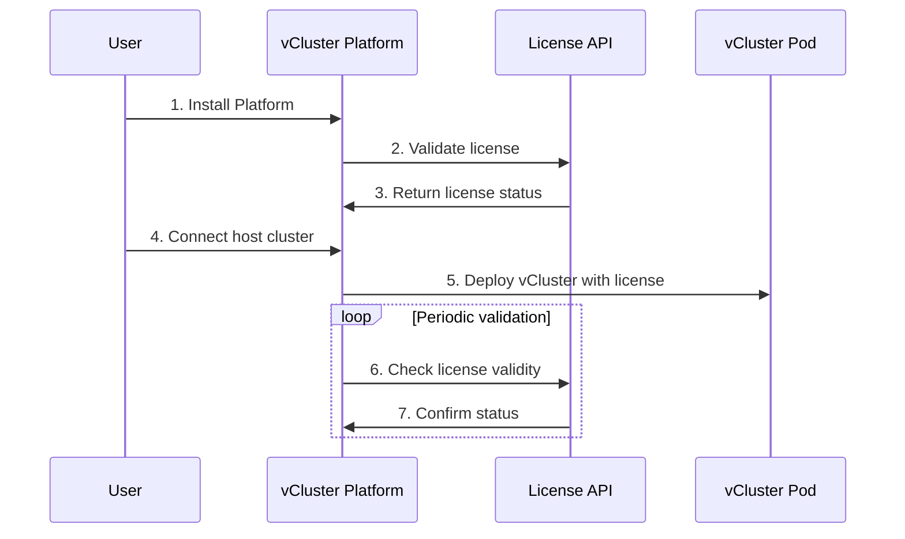

import FreeTierLimits from '@site/docs/_partials/free-tier-limits.mdx';

# Compare open source and free tiers

vCluster is available in multiple tiers to serve different use cases, from open source community projects to enterprise production deployments. This guide explains the differences between the Open Source (OSS) and Free tiers, and how to get started with the Free tier.

## Overview

**vCluster Open Source** is the foundation of the vCluster project - fully open source under the Apache 2.0 license. It provides core virtual cluster features for development, testing, and production workloads.

**vCluster Free tier** builds on top of the open source version with enhanced features specifically designed for teams and organizations. The Free tier includes all OSS features plus additional capabilities at no cost.

For detailed pricing information across all tiers, see the [vCluster Pricing](https://www.vcluster.com/pricing) page.

:::info
The Free tier requires connecting your virtual cluster to the vCluster Platform for license validation, but remains free to use with no credit card required.
:::

:::note Sidebar badges
Documentation pages show tier badges in the sidebar: **FREE** (blue) requires Platform activation, **ENTERPRISE** (orange) requires a paid license. Pages without badges are OSS features available to everyone.
:::

<!--
  - src/data/features.yaml (feature definitions)
  - src/data/products.yaml (product tiers and feature assignments)

  This table shows OSS and Free tier features.
  Features are automatically sorted alphabetically.
-->

### What's included in open source

vCluster OSS provides the essential building blocks for virtual Kubernetes clusters:

- **Virtual Kubernetes clusters**: Run fully isolated Kubernetes environments within a host cluster
- **Resource syncing**: Automatic synchronization of pods, services, configmaps, secrets, and other core resources
- **Multi-namespace mode**: Support for workloads spanning multiple namespaces
- **Backing store options**: Choose between deployed etcd or SQLite for storing cluster state
- **Multiple Kubernetes distributions**: Run k3s, k0s, vanilla Kubernetes, or EKS distros

### What's added in Free tier

The Free tier includes all OSS features plus:

- **[vCluster Platform integration](../configure/vcluster-yaml/external/platform/README.mdx)**: Connect to the vCluster Platform for centralized management and monitoring
- **[Embedded etcd](../configure/vcluster-yaml/control-plane/components/backing-store/etcd/embedded.mdx)**: Lightweight backing store optimized for HA and scalability
- **[Private Nodes](../deploy/worker-nodes/private-nodes/README.mdx)**: Dedicated worker nodes for complete workload isolation
- **[Auto Nodes](../configure/vcluster-yaml/private-nodes/auto-nodes.mdx)**: Automatic node provisioning and lifecycle management
- **[Custom Resource syncing](../configure/vcluster-yaml/sync/to-host/advanced/custom-resources.mdx)**: Sync CRDs between host and virtual cluster
- **[Namespace syncing](../configure/vcluster-yaml/sync/to-host/advanced/namespaces.mdx)**: Sync entire namespaces between clusters
- **[Sync patches](../configure/vcluster-yaml/sync/README.mdx)**: Apply custom patches during sync
- **[HostPath Mapper](../configure/vcluster-yaml/control-plane/components/host-path-mapper.mdx)**: Map virtual pod names for log collection
- **[VPN mode](../configure/vcluster-yaml/networking/resolve-dns.mdx)**: Secure connectivity between virtual and host clusters
- **[High availability](../deploy/control-plane/kubernetes-pod/high-availability.mdx)**: Run vCluster with multiple replicas (1 HA vCluster in Free tier)
- **Custom DNS entries**: Define custom DNS configurations

### Free tier limits

<FreeTierLimits />

## How licensing works

vCluster uses a license key system that works seamlessly with the vCluster Platform. Understanding this flow helps you troubleshoot licensing issues and plan your deployment architecture.

### Architecture overview



### License flow details

The license flow consists of several stages:

#### 1. Account creation and license issuance

When you create an account on vCluster Platform (free or paid tier):
- The Platform generates a license key associated with your subscription tier
- This license key contains information about your tier, limits, and entitlements
- The key is stored securely in the Platform's database

#### 2. Platform connection

To use Free tier or paid features, connect your host cluster to the Platform:
- Install the Platform agent in your Kubernetes cluster
- The agent establishes a secure connection to the Platform API
- This connection enables the Platform to manage virtual clusters and inject licenses

#### 3. License injection during deployment

When you deploy a virtual cluster through the Platform:
- The Platform automatically injects the license key as a Kubernetes secret
- This secret is mounted into the vCluster pod's filesystem
- The vCluster control plane reads the license on startup

**Example secret structure:**
```yaml
apiVersion: v1
kind: Secret
metadata:
  name: vcluster-license
  namespace: vcluster-my-vcluster
type: Opaque
data:
  license: <base64-encoded-license-key>
```

#### 4. License validation

The vCluster Platform (not the vCluster pod itself) handles license validation:
1. Platform contacts the License API (license.loft.sh) over HTTPS
2. Sends the license key for validation
3. Receives confirmation of tier, features, and validity period
4. Configures vCluster pods with the appropriate feature set

If validation fails (network issues, invalid license), the Platform:
- Logs a warning but allows existing virtual clusters to continue operating
- Retries validation on a backoff schedule
- Restricts new feature usage after grace period expires

#### 5. Periodic license checks

The Platform performs periodic validation:
- **Check interval**: Every 24 hours by default
- **Grace period**: 7 days if License API is unreachable
- **Feature enforcement**: Paid features disabled after grace period expires

:::info
The License API endpoint is `https://license.loft.sh`. Ensure your Platform can reach this endpoint for license validation. For air-gapped environments, contact sales for offline licensing options.
:::

### License validation behavior

| Scenario | Behavior |
|----------|----------|
| Valid license, API reachable | All entitled features enabled |
| Valid license, API unreachable | Grace period active, features remain enabled |
| Grace period expired | Paid features disabled, core features continue |
| Invalid license | Falls back to OSS feature set |
| No license (OSS deployment) | Full OSS features, no platform connection |

:::note
Virtual clusters never stop functioning due to license issues. In the worst case, they fall back to the OSS feature set, ensuring your workloads continue running.
:::

## Activate the free tier

Activate the vCluster Free tier using these steps:

### Prerequisites

- A Kubernetes cluster (host cluster) where you'll deploy virtual clusters
- kubectl installed and configured
- The vCluster CLI installed

### Step 1: Install the vCluster Platform

Install the vCluster Platform in your Kubernetes cluster. See the [Platform installation guide](/docs/platform/install/quick-start-guide) for detailed instructions. No credit card is required for the Free tier.

### Step 2: Connect your virtual cluster

After installing the Platform, connect existing virtual clusters or create new ones.

**For existing virtual clusters:**

```bash
# Log in to the Platform
vcluster platform login

# Add an existing vCluster to the Platform
vcluster platform add vcluster my-vcluster
```

**For new virtual clusters**, create them through the Platform UI or CLI - Free tier features are automatically enabled.

### Step 3: Deploy with Free tier features

When creating virtual clusters through the Platform, Free tier features like embedded etcd are automatically available:

```yaml title="vcluster.yaml"
# Use embedded etcd (Free tier feature)
controlPlane:
  backingStore:
    etcd:
      embedded:
        enabled: true
```

Deploy your virtual cluster:

```bash
vcluster create my-vcluster --values vcluster.yaml
```

### Step 4: Verify Free tier activation

Check that your virtual cluster is connected and licensed in the Platform UI, or use the CLI:

```bash
# List virtual clusters managed by Platform
vcluster platform list vclusters
```

You should see your virtual cluster listed with the Free tier license status.

## Comparison with Enterprise tier

Beyond the Free tier, vCluster offers Enterprise tiers (Dev, Prod, Scale) for production and compliance use cases. Enterprise adds features like sleep mode, external databases, SSO/audit logging, FIPS compliance, and air-gapped deployments.

For a complete feature comparison across all tiers, see the [Platform tier comparison](/docs/platform/free-vs-enterprise) page.

## Frequently asked questions

### Is the Free tier really free?

Yes, the Free tier is completely free. Creating a vCluster Platform account is required, but no credit card or payment is necessary.

### Can OSS be used in production?

Yes, vCluster OSS is production-ready and many organizations run it successfully. However, paid tiers offer additional features like high availability, advanced security, and enterprise support that are often required for production deployments.

### What happens if a Free tier license expires?

Free tier licenses don't expire as long as the Platform account remains active. If connectivity issues prevent license validation, virtual clusters continue operating with a grace period.

### Can you upgrade from Free to a paid tier?

Yes, upgrades are possible at any time from the vCluster Platform account settings. Existing virtual clusters automatically receive the new license without requiring redeployment.

### Does OSS require platform connectivity?

No, vCluster OSS operates completely independently without requiring any connection to the vCluster Platform. Only Free and paid tiers require Platform connectivity for license validation.

## Next steps

- [Deploy your first virtual cluster](../quick-start-guide.mdx)
- [Understand vCluster architecture](./architecture.mdx)
- [Configure sleep mode](../configure/vcluster-yaml/sleep-mode.mdx)
- [Explore the vCluster Platform](https://www.vcluster.com/platform)
