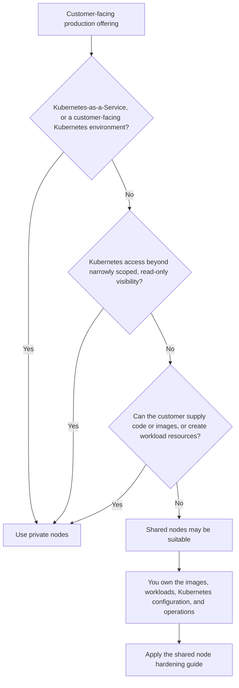

import GlossaryTerm from '@site/src/components/GlossaryTerm';

Shared and private nodes aren't interchangeable settings you tune for cost or performance. They're a security boundary decision, and vCluster locks it at deployment time. Make this decision before you pick a [production path](./overview.mdx) or deploy a worker node model, not after.

This page covers customer-facing and other production offerings where tenants aren't your own trusted staff. If your tenants are internal, trusted teams, skip to [trusted internal tenants](#trusted-internal-tenants-are-a-separate-model).

## Decide with three questions

For a customer-facing offering, use private nodes if the answer to **any** of these is yes.

1. Are you building Kubernetes-as-a-Service, or otherwise delivering a Kubernetes environment to the customer?
2. Does the customer get Kubernetes access beyond narrowly scoped, read-only visibility, such as viewing logs for their own pods?
3. Can the customer run custom workloads, whether by supplying images or code directly, or by defining Kubernetes workload resources through a higher-level API?

Shared nodes may be suitable only when all three answers are no. You own the images, workload definitions, Kubernetes configuration, and operations, and the customer only consumes your application or API. "May be suitable" isn't "secure by default." Apply the [shared node hardening guide](../security/shared-nodes-hardening.mdx) before you onboard tenants.

Any "yes" routes to private nodes regardless of the other answers. Hardening reduces risk on an accepted shared-node deployment. It never turns a "private nodes" result from this decision into "shared nodes."

## What counts as narrowly scoped read-only visibility

This means an explicitly limited visibility surface, for example status and logs for the customer's own pods. It doesn't include:

- Creating, updating, patching, or deleting Kubernetes resources
- `exec`, `attach`, or `port-forward`
- Reading Secrets, service account tokens, or broad cluster or node metadata
- Writing custom resources
- Permissions that can indirectly cause workloads or host-side resources to be created

If a customer-facing offering needs any of these types of access, choose private nodes.

## Service models

You might describe your product in these terms rather than the three questions above. Match it to the row that fits for the same guidance.

| Service model | Typical customer capability | Worker-node guidance |
| --- | --- | --- |
| Kubernetes-as-a-Service / Cluster-as-a-Service | Customer receives a Kubernetes API and commonly administers workloads | Private nodes |
| Namespace-as-a-Service | Customer can usually create Pods, controllers, Services, and other resources within a namespace | Private nodes for customer-facing or untrusted tenants. Namespace RBAC is access control, not node isolation. |
| Container-as-a-Service | Customer supplies an image or code, even if you hide Kubernetes from them | Private nodes, because the customer controls workload execution |
| SaaS / provider-operated application | Customer uses your application or API. You own the images and Kubernetes objects | Shared nodes may be suitable when access is tightly limited and the platform is hardened |
| Trusted internal platform | Employees or teams may have Kubernetes write access and run arbitrary workloads under an accepted trust model | Shared nodes are supported with hardening. Use private nodes for stronger isolation, or where compliance or infrastructure isolation requires it. |

### Hybrids and edge cases

- A "SaaS" product that lets customers supply plugins, notebooks, images, models that execute code, or arbitrary jobs isn't provider-controlled for this decision. Treat it like Container-as-a-Service.
- A portal that creates Deployments on a customer's behalf still gives the customer workload authority, even if the customer never sees `kubectl`. Use private nodes.
- Read-only diagnostic access doesn't make a product Kubernetes-as-a-Service by itself, as long as it's genuinely narrow and can't mutate or execute anything.
- What the product is named matters less than the effective permissions and workload authority it grants. Judge by the three questions, not by the marketing category.

## Shared and private nodes as security boundaries

- **Private nodes** give each tenant cluster dedicated nodes, with its own CNI, CSI, and compute. No tenant workload shares a kernel or physical node with another tenant. From the tenant's perspective, the environment is indistinguishable from a single-tenant Kubernetes cluster. See [Private Nodes](../deploy/worker-nodes/private-nodes/overview.mdx).
- **Shared nodes** give each <GlossaryTerm term="tenant-cluster">tenant cluster</GlossaryTerm> its own control plane, API, and namespaces, but tenant workloads share the same kernel and physical nodes on the <GlossaryTerm term="control-plane-cluster">Control Plane Cluster</GlossaryTerm>. That's a supported model for trusted tenants. It isn't a security boundary for untrusted tenants with Kubernetes access or arbitrary workload execution. See [Architecture](../introduction/architecture.mdx#shared-nodes).

A dedicated, labeled node pool selected from the Control Plane Cluster is still the shared-node architecture. It scopes placement, not isolation, and it doesn't become private nodes.

| | Private nodes | Shared nodes |
| --- | --- | --- |
| Kernel and node isolation | Dedicated per tenant | Shared across tenants |
| CNI / CSI | Dedicated per tenant | Shared, tenant traffic isolated by policy |
| Suitable for untrusted or customer-facing tenants | Yes | No |
| Suitable for trusted internal tenants | Yes | Yes, with [hardening](../security/shared-nodes-hardening.mdx) |
| Additional runtime isolation | Not required | [vNode](https://www.vnode.com/docs/) recommended for stronger per-tenant boundaries |

## Examples

- **A managed Kubernetes service reselling clusters to external customers** is delivering a Kubernetes environment to the customer. Use private nodes, regardless of how the accounts are billed or resold.
- **An internal CI/CD platform that creates ephemeral clusters for your own engineering teams** is a trusted internal tenant. Shared nodes are appropriate, hardened according to the [shared node hardening guide](../security/shared-nodes-hardening.mdx).
- **A SaaS inference API where customers call your endpoint and never see Kubernetes** answers no to all three questions. Shared nodes may be suitable when hardened and using tightly scoped access.
- **A self-service portal that lets external customers deploy their own container images through a form**, even without `kubectl`, gives the customer workload authority. Use private nodes.

## Trusted internal tenants are a separate model

The three-question tree above is for customer-facing and other untrusted-tenant production offerings. Trusted internal teams, such as development, testing, CI/CD, and internal platform tenants, are a separate threat model.

Shared nodes remain supported for trusted internal tenants, with hardening and an explicit, documented risk acceptance. Private nodes remain the right choice for internal tenants too, when compliance or infrastructure isolation requires it.

Enable NetworkPolicy as an added isolation layer even for trusted tenants. vCluster can create the policies for you through `policies.networkPolicy`, and your control plane cluster's CNI enforces them. Confirm your CNI supports enforcement, since some accept NetworkPolicy resources without acting on them. See the [security baseline](/docs/vcluster/security).

## Next steps

- Answered "private nodes"? Continue to [Private Nodes](../deploy/worker-nodes/private-nodes/overview.mdx) and [Deploy vCluster](../deploy/overview.mdx).
- Answered "shared nodes may be suitable"? Apply the [shared node hardening guide](../security/shared-nodes-hardening.mdx) before onboarding tenants.
- Match your answer to a concrete path in [Build for Production](./overview.mdx).
