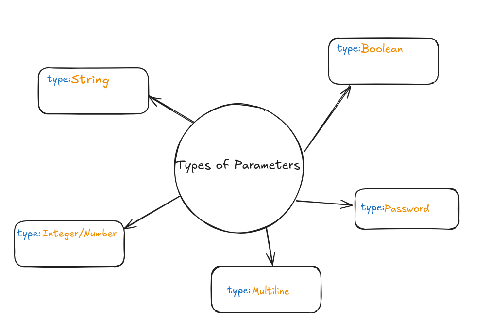
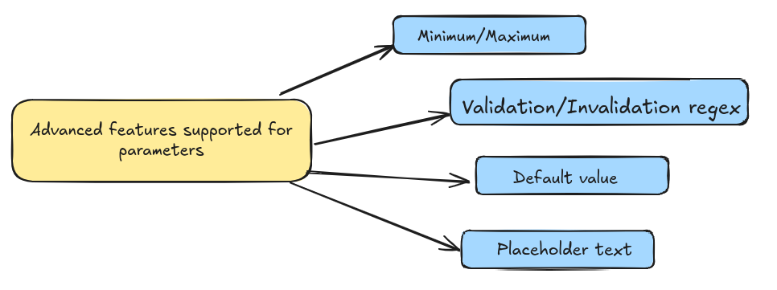

import Flow, { Step } from '@site/src/components/Flow';

# What are numeric input ranges in vCluster app templates?

## What are template parameters?

vCluster app templates use parameters to make them customizable. When users deploy resources based on these templates, they provide values for these parameters:

- Parameters are defined as YAML data structures
- Each parameter controls a specific aspect of the deployed resource
- Parameters can have constraints like minimum/maximum values
- These constraints ensure users provide appropriate values


## Available parameter constraints

vCluster templates support various parameter types and constraints:



For numeric parameters (integers and floating-point numbers), you can set additional constraints:



The minimum/maximum feature is particularly useful for controlling resource allocation.

## Setting numeric ranges in the UI

To define a parameter with a valid numeric range:

<Flow id="set-numeric-ranges">
<Step>
**Navigate to the template creation page**.

Access the template creation interface in the vCluster platform.
</Step>

<Step>
**Add a parameter with number type**.

Add a new parameter to your template and select "number" as the parameter type.
</Step>

<Step>
**Define minimum and maximum values**.

Enter the lower and upper bounds for your numeric parameter. These values create the acceptable range for user input.
</Step>

<Step>
**Add a descriptive explanation**.

Write a clear description that explains the purpose of these limits and what the parameter controls.
</Step>
</Flow>

When users deploy with your template, a numeric input field that enforces these limits is displayed.

The platform actively validates user input against your defined range. If a value is outside this range, the user cannot proceed with creating the vCluster.

## Defining ranges in YAML

You can also define numeric ranges directly in the template YAML under `spec.parameters`:

```yaml
parameters:
  - variable: valuecheckparameter
    label: testlabel
    description: checks value range
    type: number
    min: 3  # minimum allowed value
    max: 9  # maximum allowed value
```

This configuration:
- Creates a parameter named `valuecheckparameter`.
- Displays **testlabel** in the UI.
- Allows only values between 3 and 9 (inclusive).
- Prevents deployment if the value is outside this range.

## Use cases for numeric ranges

Setting numeric ranges is valuable for:

- **Resource allocation**: Ensuring virtual clusters receive sufficient but not excessive resources.
- **Configuration safety**: Preventing users from entering values that could cause performance issues.
- **Standardization**: Maintaining consistent deployments across your organization.
- **User guidance**: Helping users understand appropriate values for different parameters.

## Next steps

After implementing numeric ranges in your templates, consider:

- Adding validation for other parameter types.
- Creating templates with sensible defaults.
- Documenting the meaning of each parameter for your users.

For more information on other parameter types, including selection from predefined options, see the [platform documentation](https://www.vcluster.com/docs).