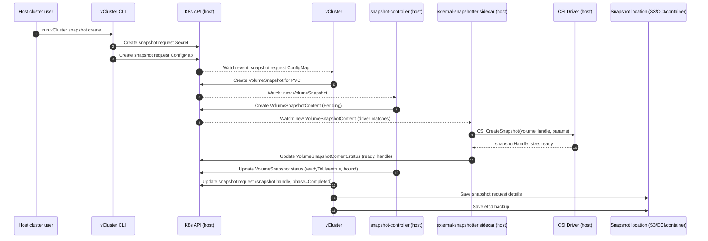
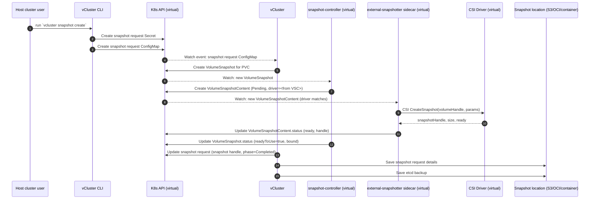
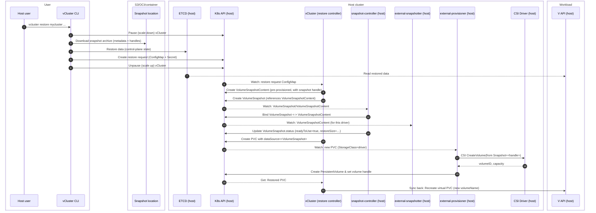
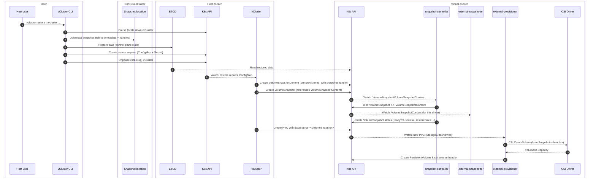

import Flow, { Step } from '@site/src/components/Flow';
import TenancySupport from '../_fragments/tenancy-support.mdx';

<TenancySupport hostNodes="true" privateNodes="true" />

When working with stateful applications, it is important to understand how is your data handled. This is particularly important when it comes to disaster recovery scenarios, where understanding how your data is backed up and restored can go a long way when it comes to protecting your data and properly reacting in case of an incident.

vCluster uses [Kubernetes Volume Snapshots](https://kubernetes.io/docs/concepts/storage/volume-snapshots/) feature to create snapshots of your Kubernetes volumes and to restore them when needed. This document describes how the snapshot and restore process is working.

## How are volume snapshots created?

This section start with describing who or what is responsible for which part of the volume snapshot creation process.

**Host cluster user**:
- Runs the vCluster CLI commands;
- Installs snapshot-controller and CSI driver in the host or in the virtual cluster, depending on the multi-tenancy model.

**vCluster CLI**:
- Creates snapshot requests in the host cluster.

**vCluster**:
- Processes and updates snapshot request that are created in the host cluster;
- Creates dynamic VolumeSnapshots in the host or in the virtual cluster, depending on the multi-tenancy model.

**Kubernetes snapshot-controller**:
- Runs in the host or in the virtual cluster, depending on the multi-tenancy model;
- Processes and updates dynamic VolumeSnapshots;
- Creates VolumeSnapshotContent resources.

**External snapshotter CSI driver sidecar**:
- Runs as a sidecar container in the CSI driver pod in the host or in the virtual cluster, depending on the multi-tenancy model;
- Processes VolumeSnapshotContent resources;
- Makes calls to the CSI driver via RPCs (CreateSnapshot, DeleteSnapshot, and, optionally, the ListSnapshots).

**CSI Driver**:
- Runs in the host or in the virtual cluster, depending on the multi-tenancy model;
- Makes provider-specific API calls to create, delete, or list provider-specific disk snapshots.

### Create volume snapshots with shared host nodes

vCluster with shared nodes creates volume snapshots in the host cluster.

Host cluster admin needs to complete the following setup before being able to create volume snapshots with vCluster:
- Install common Kubernetes snapshot-controller and volume snapshot CRDs in the host cluster.
- Installs CSI driver in the host cluster.
- Install VolumeSnapshotClass and annotate it as default for the CSI driver.

Here is a sequence diagram that shows how vCluster creates snapshots:

### Create volume snapshots with private nodes

vCluster with private nodes creates volume snapshots in the virtual cluster.

Virtual cluster has to be created with `deploy.volumeSnapshotController.enabled` config set to `true`. With this config, vCluster installs the common snapshot-controller, and VolumeSnapshot, VolumeSnapshotContent and VolumeSnapshotClass CRDs in your virtual cluster.

Then, the following setup needs to be completed to be able to create volume snapshots with vCluster:
- Installs CSI driver in the virtual cluster.
- Install VolumeSnapshotClass and annotate it as default for the CSI driver.

Here is a sequence diagram that shows how vCluster creates snapshots:

## How are volumes restored from snapshots?

This section describes who or what is responsible for which part of the volume restore process.

**Host cluster user**:
- Runs the vCluster CLI commands;
- Installs snapshot-controller and CSI driver in the host or in the virtual cluster, depending on the multi-tenancy model.

**vCluster CLI**:
- Downloads previously created snapshot archive from the snapshot location;
- Restores etcd data from the snapshot;
- Creates volume restore requests in the host cluster.

**vCluster**:
- Processes and updates restore request that are created in the host cluster;
- Creates pre-provisioned VolumeSnapshotContent and VolumeSnapshot in the host or in the virtual cluster, depending on the multi-tenancy model. The pre-provisioned VolumeSnapshotContent references a volume snapshot that has been already created when vCluster snapshot was taken.
- Creates PersistentVolumeClaims that reference the pre-provisioned VolumeSnapshot, so created volumes have data restored from the snapshot.
- Syncs virtual PersistentVolumeClaims with restored PersistentVolumeClaims in the host cluster, if using shared nodes.

**Kubernetes snapshot-controller**:
- Runs in the host or in the virtual cluster, depending on the multi-tenancy model;
- Processes and updates dynamic VolumeSnapshots;

**External snapshotter CSI driver sidecar**:
- Runs as a sidecar container in the CSI driver pod in the host or in the virtual cluster, depending on the multi-tenancy model;
- Processes and updates VolumeSnapshotContent resources;
- Makes calls to the CSI driver via RPCs (ListSnapshots, if implemented).

**CSI Driver**:
- Runs in the host or in the virtual cluster, depending on the multi-tenancy model;
- Makes provider-specific API calls to list provider-specific disk snapshots.

### Restore volumes with shared host nodes

vCluster with shared nodes restores volumes in the host cluster.

Host cluster admin needs to complete the following setup before being able to restore volumes with vCluster:
- Install common Kubernetes snapshot-controller and volume snapshot CRDs in the host cluster.
- Installs CSI driver in the host cluster.
- Install VolumeSnapshotClass and annotate it as default for the CSI driver.

Here is a sequence diagram that shows how vCluster restores volumes from snapshots:

### Restore volumes with private nodes

vCluster with private nodes restores volumes in the virtual cluster.

Virtual cluster has to be created with `deploy.volumeSnapshotController.enabled` config set to `true`. With this config, vCluster installs the common snapshot-controller, and VolumeSnapshot, VolumeSnapshotContent and VolumeSnapshotClass CRDs in your virtual cluster.

Then, the following setup needs to be completed to be able to restore volumes from snapshots with vCluster:
- Installs CSI driver in the virtual cluster.
- Install VolumeSnapshotClass and annotate it as default for the CSI driver.

Here is a sequence diagram that shows how vCluster restores volumes from snapshots:

