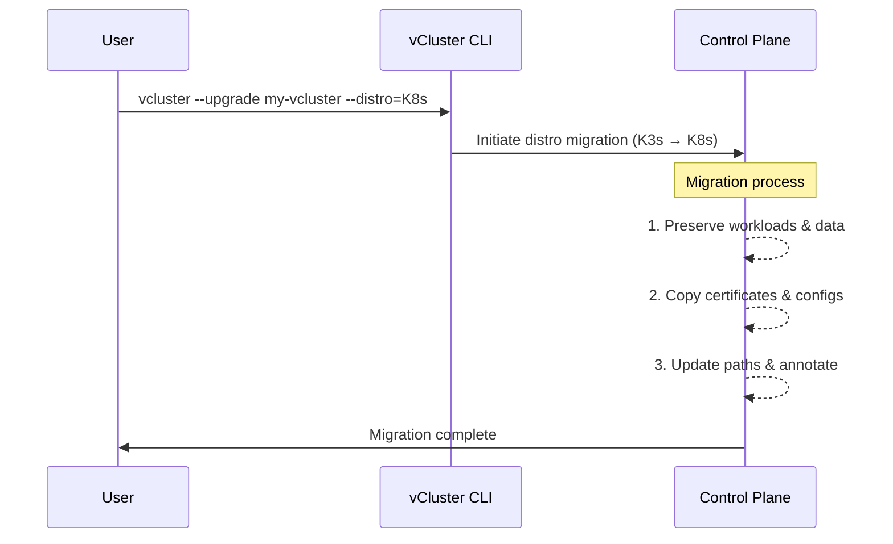

import BasePrerequisites from '../../../../docs/_partials/base-prerequisites.mdx';

import TenancySupport from '../../_fragments/tenancy-support.mdx';

<TenancySupport hostNodes="true" />

Starting in vCluster 0.25.0, you can migrate virtual clusters from the K3s distribution to the standard Kubernetes (K8s) distribution. This migration gives you access to the full Kubernetes feature set while preserving your existing workloads and configuration.

## Prerequisites {#prerequisites}

<BasePrerequisites />

Additionally, you need:
- `vCluster` CLI version 0.25.0 or higher
- An existing virtual cluster using K3s distro

## Migration process {#migration-process}

The migration is triggered automatically when changing the distribution from K3s to Kubernetes (K8s) during an upgrade.

During migration process `vCluster` performs these actions:

- Detects that you are switching from K3s to K8s
- Copies all relevant certificates and configuration from K3s paths to K8s paths
- Preserves database content (for both SQLite and embedded etcd backing stores)
- Adds an annotation to prevent accidental re-migration
- Launches the new control plane with K8s distro



All your existing workloads, services, and resources remain available after migration without interruption. Both migration methods are covered in detail in the [Migrate a virtual cluster](#migrate-a-virtual-cluster) section.

:::warning Migration limitations
The automated migration process only supports moving from the K3s distro to the K8s distro. Migration between other distro types is not supported. This is a one-way process—migrating back from the K8s distro to K3s is not possible.
:::

## Migrate a virtual cluster {#migrate-a-virtual-cluster}

<!-- vale off -->
### Use the vCluster CLI {#use-vcluster-cli}
<!-- vale on -->

You can migrate using the CLI by specifying the K8s distro during upgrade:

```bash title="Migrate using vcluster CLI"
vcluster --upgrade my-vcluster --distro=K8s
```

<!-- vale off -->
### Use a vcluster.yaml file {#use-vcluster-yaml}
<!-- vale on -->

<!-- vale off -->
If you're managing your virtual cluster with a vcluster.yaml file, modify it to use K8s distro:
<!-- vale on -->

Original configuration:

```yaml title="Original vcluster.yaml with K3s"
controlPlane:
  distro:
    k3s:
      enabled: true
```

New configuration:

```yaml title="Updated vcluster.yaml with K8s"
controlPlane:
  distro:
    k8s:
      enabled: true
```

Then apply the changes:

```bash title="Apply the updated configuration"
vcluster my-vcluster --values vcluster.yaml
```

:::important Migration considerations
- Migration is one-way: you cannot migrate back from K8s to K3s
- The K3s-specific resources and directories are preserved after migration for safety
- Migration supports both SQLite and embedded etcd backing stores
- High-availability configurations are fully supported
:::

## After migration {#after-migration}

After a successful migration, the control plane pod uses the Kubernetes distro instead of K3s. You can verify this by checking the container image of the control plane pod, which now shows a Kubernetes image.

<!-- vale off -->
### Clean up K3s resources {#clean-up-k3s-resources}
<!-- vale on -->

The migration process preserves the K3s configuration and certificates on the control plane pod. These resources are located in specific directories on the control plane pod and are safe to delete once you've confirmed the migration was successful:

```bash title="K3s resource directories on the control plane pod"
/data/k3s-config    # Contains the K3s kubeconfig and other configuration files
/data/agent         # Contains K3s agent credentials, certificates and keys
```

You can remove these directories using a kubectl exec command:

```bash title="Removing K3s resources after successful migration"
kubectl exec -n <vcluster-namespace> <vcluster-control-plane-pod> -- rm -rf /data/K3s-config /data/agent
```

:::tip
Consider keeping these resources for some time after migration before deleting them. They can be useful for:
- Troubleshooting any issues that might arise after migration
- Providing a reference for certificate paths and configurations
- Enabling potential recovery options if needed
:::

The storage impact of these directories is typically minimal, so there's usually no urgency to remove them immediately.

## Troubleshoot migration issues {#troubleshoot-migration-issues}

If you encounter issues during migration, check the control plane pod logs for error messages:

```bash title="Check control plane logs"
kubectl logs -n <namespace> <vcluster-control-plane-pod> -c syncer
```

Look for log entries that include "Migrating K3s distro certificates to K8s" to trace the migration process.
