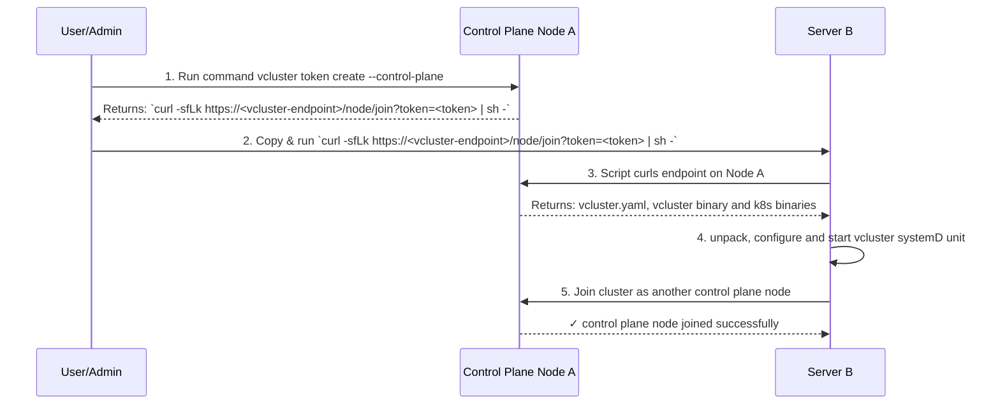

import Flow, { Step } from "@site/src/components/Flow"

import StandaloneFlags from '../../../_fragments/deploy/standalone-flags.mdx'

import TenancySupport from '../../../_fragments/tenancy-support.mdx';

<TenancySupport standalone="true" />

## Overview

By default, vCluster Standalone is installed on one initial control plane node. This deployment method is recommended for any uses cases that are very ephemeral (e.g. dev environments, CI/CD, etc.), but for production
use cases, it's recommended to run vCluster with more redundancy. We recommend deploying vCluster Standalone with multiple nodes for the control plane (i.e. in high availability (HA)) in order
have the virtual cluster be more resilient to failures.

Each control plane node needs to be added one by one to the cluster starting with an initial control plane node.

When deploying vCluster Standalone, the assets required to install the control plane are located in
the [GitHub releases](https://github.com/loft-sh/vcluster/releases) of vCluster.

## Predeployment configuration options

### Backing store must be embedded etcd

When running vCluster Standalone in HA, the only option for the backing store is
embedded etcd, which needs to be specifically enabled from the initial node.

### Control Plane Node Roles

Decide if the control plane node will also be a worker node or not.

### Worker Nodes

 With vCluster Standalone, worker nodes can only be [private nodes](../../worker-nodes/private-nodes/join). Since there is no host cluster,
 there is no concept of host nodes.

## Prerequisites

- Access to nodes that satisfies the [node requirements](./node-requirements)

## Install Initial Control Plane Node

:::tip Control Plane Node
All steps are perfomed on the initial control plane node.
:::

<Flow>
    <Step>
        Create directory for storing vCluster Standalone configuration.
        ```bash title="Create /etc/vcluster directory"
        mkdir -p /etc/vcluster
        ```
        Save a `vcluster.yaml` configuration file for vCluster Standalone on the control plane node.

        ```bash title="Create a vcluster.yaml to enable HA for vCluster Standalone"
        cat <<EOF > /etc/vcluster/vcluster.yaml
        controlPlane:
          standalone:
            enabled: true
              # Optional: Control Plane node will also be considered a worker node
              # joinNode:
                # enabled: true
          backingStore:
            etcd:
              embedded:
                enabled: true  # Required for HA
        privateNodes:
          enabled: true
        EOF
        ```

        :::warning
        Adding additional control plane nodes will not be supported unless you follow the [high availability](./high-availability) steps for configuration.
        :::
    </Step>
    <Step>
        Run the installation script on the control plane node:

        ```bash title="Install vCluster Standalone on control plane node"
        export VCLUSTER_VERSION="v0.29.0"

        sudo su -
        curl -sfL https://github.com/loft-sh/vcluster/releases/download/${VCLUSTER_VERSION}/install-standalone.sh | sh -s -- --vcluster-name standalone
        ```

    </Step>
    <Step>
        Check that the control plane node is ready.

        After installation, the kubeconfig is automatically configured on the control plane node.
        The kubectl context is set to interact with your new vCluster Standalone instance.

        Run these commands on the control plane node:

        ```bash title="Check node status"
        kubectl get nodes
        ```

        Expected output:
        ```bash
        NAME               STATUS   ROLES                  AGE   VERSION
        ip-192-168-3-131   Ready    control-plane,master   11m   v1.32.1
        ```

        ```bash title="Verify cluster components are running"
        kubectl get pods -A
        ```

        Pods should include:
        - **Flannel**: CNI for container networking
        - **CoreDNS**: DNS service for the cluster
        - **KubeProxy**: Network traffic routing and load balancing
        - **Konnectivity**: Secure control plane to worker node communication
        - **Local Path Provisioner**: Dynamic storage provisioning
    </Step>

</Flow>

<StandaloneFlags />

## Add Additional control plane nodes

After installing the initial control plane node, vCluster Standalone is already running and
new nodes only need to join the cluster.

### Create token for control plane nodes

To join control plane nodes, a token from the vCluster must be created to provide access and permissions. A single token can be used for any node(s) to join, or if you wanted to, you could create a token for each node.

By default, the token expires within 1 hour. The token is stored as a secret prefixed with bootstrap-token- in the kube-system namespace. The expiry timestamp is stored under the expiration key in the secret.

```bash title="Create a token for control plane nodes"
# Create a token
/var/lib/vcluster/bin/vcluster-cli token create --control-plane --expires=1h
```

The output provides a command to run on your control plane node:

```bash title="Example output from creating a token"
curl -sfLk https://<vcluster-endpoint>/node/join?token=<token> | sh -
```

### Join each control plane node

For each control plane node that you want to join vCluster, run the command on the node.

The new node will automatically download the necessary binaries and configuration, and join the cluster as an additional control plane node.



## Kubeconfig

After installation, the kubeconfig is automatically configured on the control plane node. The kubectl context is set to interact with your new vCluster Standalone instance.

To access the cluster from other machines, copy the kubeconfig from `/var/lib/vcluster/kubeconfig.yaml` on the control plane node or use the vCluster CLI to [generate access credentials](../../../manage/accessing-vcluster).

## Add Worker Nodes

After the vCluster control plane is up and running, you can add [dedicated worker nodes](../../worker-nodes/private-nodes/join).

The API Server endpoint must be reachable from the worker nodes. You can additional
configure the `controlPlane.endpoint` and `controlPlane.proxy.extraSANs` in your vCluster configuration to expose the API Server.
